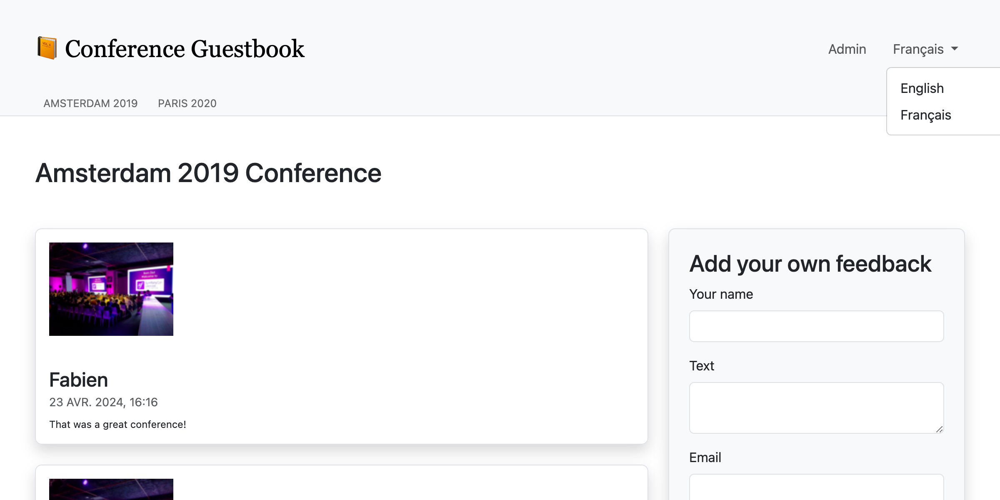

Localiser une application
=========================

Avec son public international, Symfony gère nativement l'internationalisation (i18n) et la localisation (l10n) depuis toujours. Localiser une application ne consiste pas seulement à traduire l'interface, mais aussi à traduire les pluriels, le formatage des dates et des devises, les URLs, et plus encore.

Internationaliser des URLs
--------------------------

.. index::
    single: Components;Routing
    single: Routing;Locale
    single: Routing;Requirements
    single: Attributes;Route

La première étape pour localiser le site web est d'internationaliser les URLs. Quand on traduit un site web, l'URL devrait être différente pour chaque locale afin de tirer pleinement parti des caches HTTP (n'utilisez jamais la même URL en stockant la locale dans la session).

Utilisez le paramètre de routage spécial ``_locale`` pour référencer la locale dans les routes :

.. code-block:: diff
    :caption: patch_file
    :emphasize-lines: 8

    --- i/src/Controller/ConferenceController.php
    +++ w/src/Controller/ConferenceController.php
    @@ -27,7 +27,7 @@ final class ConferenceController extends AbstractController
         ) {
         }

    -    #[Route('/', name: 'homepage')]
    +    #[Route('/{_locale}/', name: 'homepage')]
         public function index(ConferenceRepository $conferenceRepository): Response
         {
             return $this->render('conference/index.html.twig', [

Sur la page d'accueil, la locale est maintenant définie en interne en fonction de l'URL ; par exemple, si vous naviguez sur ``/fr/``, ``$request->getLocale()`` retourne ``fr``.

Comme vous ne serez probablement pas en mesure de traduire le contenu dans toutes les locales disponibles, limitez-vous à celles que vous souhaitez prendre en charge :

.. code-block:: diff
    :caption: patch_file
    :emphasize-lines: 8

    --- i/src/Controller/ConferenceController.php
    +++ w/src/Controller/ConferenceController.php
    @@ -27,7 +27,7 @@ final class ConferenceController extends AbstractController
         ) {
         }

    -    #[Route('/{_locale}/', name: 'homepage')]
    +    #[Route('/{_locale<en|fr>}/', name: 'homepage')]
         public function index(ConferenceRepository $conferenceRepository): Response
         {
             return $this->render('conference/index.html.twig', [

Chaque paramètre de route peut être limité par une expression régulière à l'intérieur de ``<`` ``>``. La route ``homepage`` n'est maintenant disponible que si le paramètre ``_locale`` vaut ``en`` ou ``fr``. Essayez d'atteindre l'URL ``/es/`` avec votre navigateur : vous devriez avoir une erreur 404, car aucune route ne correspond.

Comme nous utiliserons la même condition dans presque toutes les routes, déplaçons-la dans un paramètre du conteneur :

.. code-block:: diff
    :caption: patch_file

    --- i/config/services.yaml
    +++ w/config/services.yaml
    @@ -9,6 +9,7 @@ parameters:
         admin_email: "%env(string:default:default_admin_email:ADMIN_EMAIL)%"
         default_base_url: 'http://127.0.0.1'
         router.request_context.base_url: '%env(default:default_base_url:SYMFONY_DEFAULT_ROUTE_URL)%'
    +    app.supported_locales: 'en|fr'

     services:
         # default configuration for services in *this* file
    --- i/src/Controller/ConferenceController.php
    +++ w/src/Controller/ConferenceController.php
    @@ -27,7 +27,7 @@ final class ConferenceController extends AbstractController
         ) {
         }

    -    #[Route('/{_locale<en|fr>}/', name: 'homepage')]
    +    #[Route('/{_locale<%app.supported_locales%>}/', name: 'homepage')]
         public function index(ConferenceRepository $conferenceRepository): Response
         {
             return $this->render('conference/index.html.twig', [

L'ajout d'une langue peut se faire en mettant à jour le paramètre ``app.supported_languages``.

Ajoutez le même préfixe de route locale aux autres URLs :

.. code-block:: diff
    :caption: patch_file

    --- i/src/Controller/ConferenceController.php
    +++ w/src/Controller/ConferenceController.php
    @@ -35,7 +35,7 @@ final class ConferenceController extends AbstractController
             ])->setSharedMaxAge(3600);
         }

    -    #[Route('/conference_header', name: 'conference_header')]
    +    #[Route('/{_locale<%app.supported_locales%>}/conference_header', name: 'conference_header')]
         public function conferenceHeader(ConferenceRepository $conferenceRepository): Response
         {
             return $this->render('conference/header.html.twig', [
    @@ -43,7 +43,7 @@ final class ConferenceController extends AbstractController
             ])->setSharedMaxAge(3600);
         }

    -    #[Route('/conference/{slug}', name: 'conference')]
    +    #[Route('/{_locale<%app.supported_locales%>}/conference/{slug}', name: 'conference')]
         public function show(
             Request $request,
             Conference $conference,

Nous avons presque fini. Cependant, nous n'avons plus de route correspondant à ``/``. Recréons-la et faisons en sorte qu'elle redirige vers ``/en/`` :

.. code-block:: diff
    :caption: patch_file

    --- i/src/Controller/ConferenceController.php
    +++ w/src/Controller/ConferenceController.php
    @@ -27,6 +27,12 @@ final class ConferenceController extends AbstractController
         ) {
         }

    +    #[Route('/')]
    +    public function indexNoLocale(): Response
    +    {
    +        return $this->redirectToRoute('homepage', ['_locale' => 'en']);
    +    }
    +
         #[Route('/{_locale<%app.supported_locales%>}/', name: 'homepage')]
         public function index(ConferenceRepository $conferenceRepository): Response
         {

Maintenant que toutes les routes principales bénéficient de la locale, remarquez que les URLs générées sur les pages prennent automatiquement en compte la locale courante.

Ajouter un sélecteur de locale
-------------------------------

.. index::
    single: Twig;path
    single: Twig;Locale

Pour permettre aux internautes de passer de la locale par défaut ``en`` à une autre, ajoutons un sélecteur dans l'en-tête :

.. code-block:: diff
    :caption: patch_file

    --- i/templates/base.html.twig
    +++ w/templates/base.html.twig
    @@ -34,6 +34,16 @@
                                         Admin
                                     </a>
                                 </li>
    +<li class="nav-item dropdown">
    +    <a class="nav-link dropdown-toggle" href="#" id="dropdown-language" role="button"
    +        data-bs-toggle="dropdown" aria-haspopup="true" aria-expanded="false">
    +        English
    +    </a>
    +    <ul class="dropdown-menu dropdown-menu-right" aria-labelledby="dropdown-language">
    +        <li><a class="dropdown-item" href="{{ path('homepage', {_locale: 'en'}) }}">English</a></li>
    +        <li><a class="dropdown-item" href="{{ path('homepage', {_locale: 'fr'}) }}">Français</a></li>
    +    </ul>
    +</li>
                             </ul>
                         

                     

Pour changer de locale, nous passons explicitement le paramètre de routage ``_locale`` à la fonction ``path()``.

.. index::
    single: Twig;app.request
    single: Twig;locale_name

Modifiez le template pour afficher le nom de la locale actuelle au lieu du nom "English" codé en dur :

.. code-block:: diff
    :caption: patch_file

    --- i/templates/base.html.twig
    +++ w/templates/base.html.twig
    @@ -37,7 +37,7 @@
     <li class="nav-item dropdown">
         <a class="nav-link dropdown-toggle" href="#" id="dropdown-language" role="button"
             data-bs-toggle="dropdown" aria-haspopup="true" aria-expanded="false">
    -        English
    +        {{ app.request.locale|locale_name(app.request.locale) }}
         </a>
         <ul class="dropdown-menu dropdown-menu-right" aria-labelledby="dropdown-language">
             <li><a class="dropdown-item" href="{{ path('homepage', {_locale: 'en'}) }}">English</a></li>

``app`` est une variable Twig globale qui donne accès à la requête courante. Pour convertir la locale en une chaîne humainement compréhensible, nous utilisons le filtre Twig ``locale_name``.

.. index::
    single: Components;String

Selon la locale, le nom de la locale n'est pas toujours en majuscule. Pour gérer correctement les majuscules dans les phrases, nous avons besoin d'un filtre compatible Unicode, comme celui fourni par le composant Symfony String et son implémentation Twig :

.. code-block:: terminal

    $ symfony composer req twig/string-extra

.. index::
    single: Twig;u.title

.. code-block:: diff
    :caption: patch_file

    --- i/templates/base.html.twig
    +++ w/templates/base.html.twig
    @@ -37,7 +37,7 @@
     <li class="nav-item dropdown">
         <a class="nav-link dropdown-toggle" href="#" id="dropdown-language" role="button"
             data-bs-toggle="dropdown" aria-haspopup="true" aria-expanded="false">
    -        {{ app.request.locale|locale_name(app.request.locale) }}
    +        {{ app.request.locale|locale_name(app.request.locale)|u.title }}
         </a>
         <ul class="dropdown-menu dropdown-menu-right" aria-labelledby="dropdown-language">
             <li><a class="dropdown-item" href="{{ path('homepage', {_locale: 'en'}) }}">English</a></li>

Vous pouvez dorénavant passer du français à l'anglais grâce au sélecteur, et toute l'interface s'adapte à merveille :

Traduire l'interface
--------------------

.. index::
    single: Components;Translation
    single: Translation
    single: Twig;trans

Traduire chaque phrase d'un gros site web peut être fastidieux, mais heureusement, nous n'avons que quelques messages sur notre site web. Commençons par toutes les phrases de la page d'accueil :

.. code-block:: diff
    :caption: patch_file

    --- i/templates/base.html.twig
    +++ w/templates/base.html.twig
    @@ -20,7 +20,7 @@
                 <nav class="navbar navbar-expand-xl navbar-light bg-light">
                     

                         <a class="navbar-brand me-4 pr-2" href="{{ path('homepage') }}">
    -                        &#128217; Conference Guestbook
    +                        &#128217; {{ 'Conference Guestbook'|trans }}
                         </a>

                         <button class="navbar-toggler border-0" type="button" data-bs-toggle="collapse" data-bs-target="#header-menu" aria-controls="navbarSupportedContent" aria-expanded="false" aria-label="Show/Hide navigation">
    --- i/templates/conference/index.html.twig
    +++ w/templates/conference/index.html.twig
    @@ -4,7 +4,7 @@

     
         <h2 class="mb-5">
    -        Give your feedback!
    +        {{ 'Give your feedback!'|trans }}
         </h2>

         
    @@ -21,7 +21,7 @@

                                 <a href="{{ path('conference', { slug: conference.slug }) }}"
                                    class="btn btn-sm btn-primary stretched-link">
    -                                View
    +                                {{ 'View'|trans }}
                                 </a>
                             

                         

Le filtre Twig ``trans`` recherche une traduction pour la valeur donnée dans la locale courante. Si celle-ci n'est pas trouvée, il utilise la *locale par défaut*, telle que configurée dans ``config/packages/translation.yaml`` :

.. code-block:: yaml
    :class: ignore
    :emphasize-lines: 2

    framework:
        default_locale: en
        translator:
            default_path: '%kernel.project_dir%/translations'
            fallbacks:
                - en

Notez que l'"onglet" de traduction de la web debug toolbar est devenu rouge :

.. figure:: screenshots/intl-wdt.png
    :alt: /fr/
    :align: center
    :figclass: with-browser

Il nous dit que 3 messages ne sont pas encore traduits.

Cliquez sur l'"onglet" pour lister tous les messages pour lesquels Symfony n'a pas trouvé de traduction :

.. figure:: screenshots/intl-profiler.png
    :alt: /_profiler/64282d?panel=translation
    :align: center
    :figclass: with-browser

Fournir des traductions
-----------------------

Comme vous avez pu le constater dans le fichier ``config/packages/translation.yaml``, les traductions sont stockées dans le répertoire racine ``translations/``, qui a été créé automatiquement pour nous.

Au lieu de créer les fichiers de traduction à la main, utilisez la commande ``translation:extract`` :

.. code-block:: terminal

    $ symfony console translation:extract fr --force --domain=messages

Cette commande génère un fichier de traduction (option ``--force``) pour la locale ``fr`` et le domaine ``messages``. Le domaine ``messages`` contient tous les messages de notre **application**, en excluant ceux de Symfony tels que les erreurs de validation ou de sécurité.

Éditez le fichier ``translations/messages+intl-icu.fr.xlf`` et traduisez les messages en français :

.. code-block:: diff
    :caption: patch_file
    :class: ignore

    --- i/translations/messages+intl-icu.fr.xlf
    +++ w/translations/messages+intl-icu.fr.xlf
    @@ -7,15 +7,15 @@
         <body>
           <trans-unit id="eOy4.6V" resname="Conference Guestbook">
             <source>Conference Guestbook</source>
    -        <target>__Conference Guestbook</target>
    +        <target>Livre d'Or pour Conferences</target>
           </trans-unit>
           <trans-unit id="LNAVleg" resname="Give your feedback!">
             <source>Give your feedback!</source>
    -        <target>__Give your feedback!</target>
    +        <target>Donnez votre avis !</target>
           </trans-unit>
           <trans-unit id="3Mg5pAF" resname="View">
             <source>View</source>
    -        <target>__View</target>
    +        <target>Sélectionner</target>
           </trans-unit>
         </body>
       </file>

.. code-block:: xml
    :caption: translations/messages+intl-icu.fr.xlf
    :class: hide

    <?xml version="1.0" encoding="utf-8"?>
    <xliff xmlns="urn:oasis:names:tc:xliff:document:1.2" version="1.2">
    <file source-language="en" target-language="fr" datatype="plaintext" original="file.ext">
        <header>
        <tool tool-id="symfony" tool-name="Symfony" />
        </header>
        <body>
        <trans-unit id="LNAVleg" resname="Give your feedback!">
            <source>Give your feedback!</source>
            <target>Donnez votre avis !</target>
        </trans-unit>
        <trans-unit id="3Mg5pAF" resname="View">
            <source>View</source>
            <target>Sélectionner</target>
        </trans-unit>
        <trans-unit id="eOy4.6V" resname="Conference Guestbook">
            <source>Conference Guestbook</source>
            <target>Livre d'Or pour Conferences</target>
        </trans-unit>
        </body>
    </file>
    </xliff>

Nous ne traduirons pas tous les templates, mais n'hésitez pas à le faire :

.. figure:: screenshots/intl-translated.png
    :alt: /fr/
    :align: center
    :figclass: with-browser

Traduire des formulaires
------------------------

.. index::
    single: Translation;Form
    single: Form;Translation

Les labels des formulaires sont automatiquement affichés par Symfony via le système de traduction. Allez sur une page de conférence et cliquez sur l'onglet "Translation" de la web debug toolbar ; vous devriez voir tous les libellés prêts à être traduits :

.. figure:: screenshots/intl-form-profiler.png
    :alt: /_profiler/64282d?panel=translation
    :align: center
    :figclass: with-browser

Localiser des dates
-------------------

.. index::
    single: Localization
    single: Twig;format_datetime
    single: Twig;format_time
    single: Twig;format_date
    single: Twig;format_currency
    single: Twig;format_number

Si vous changez de langue pour le français et que vous vous rendez sur la page d'une conférence ayant des commentaires, vous remarquerez que les dates des commentaires ont été automatiquement localisées. Cela fonctionne parce que nous avons utilisé le filtre Twig ``format_datetime``, qui tient compte de la locale (``{{ comment.createdAt|format_datetime('medium', 'short') }}``).

La localisation fonctionne pour les dates, les heures (``format_time``), les devises (``format_currency``) et les nombres (``format_number``) en général (pourcentages, durées, écriture, etc.).

Traduire des pluriels
---------------------

.. index::
    single: Translation;Plurals
    single: Translation;Conditions

La gestion des pluriels dans les traductions est l'une des principales sources de problèmes lorsqu'on sélectionne une traduction en se basant sur une condition.

Sur la page d'une conférence, nous affichons le nombre de commentaires : ``There are 2 comments``. Pour 1 commentaire, nous affichons ``There are 1 comments``, ce qui est faux. Modifiez le template pour convertir la phrase en un message traduisible :

.. code-block:: diff
    :caption: patch_file

    --- i/templates/conference/show.html.twig
    +++ w/templates/conference/show.html.twig
    @@ -44,7 +44,7 @@
                             

                         

                     
    -                
There are {{ comments|length }} comments.

    +                
{{ 'nb_of_comments'|trans({count: comments|length}) }}

                     
                         <a href="{{ path('conference', { slug: conference.slug, offset: previous }) }}">Previous</a>
                     

Pour ce message, nous avons utilisé une autre stratégie de traduction. Au lieu de conserver la version anglaise dans le modèle, nous l'avons remplacée par un identifiant unique. Cette stratégie fonctionne mieux pour les textes complexes et volumineux.

Mettez à jour le fichier de traduction en ajoutant le nouveau message :

.. code-block:: diff
    :caption: patch_file

    --- i/translations/messages+intl-icu.fr.xlf
    +++ w/translations/messages+intl-icu.fr.xlf
    @@ -17,6 +17,10 @@
             <source>Conference Guestbook</source>
             <target>Livre d'Or pour Conferences</target>
         </trans-unit>
    +    <trans-unit id="Dg2dPd6" resname="nb_of_comments">
    +        <source>nb_of_comments</source>
    +        <target>{count, plural, =0 {Aucun commentaire.} =1 {1 commentaire.} other {# commentaires.}}</target>
    +    </trans-unit>
         </body>
     </file>
     </xliff>

Nous n'avons pas encore terminé car nous devons maintenant fournir la traduction anglaise. Créez le fichier ``translations/messages+intl-icu.en.xlf`` :

.. code-block:: xml
    :caption: translations/messages+intl-icu.en.xlf
    :emphasize-lines: 10

    <?xml version="1.0" encoding="utf-8"?>
    <xliff xmlns="urn:oasis:names:tc:xliff:document:1.2" version="1.2">
      <file source-language="en" target-language="en" datatype="plaintext" original="file.ext">
        <header>
          <tool tool-id="symfony" tool-name="Symfony" />
        </header>
        <body>
          <trans-unit id="maMQz7W" resname="nb_of_comments">
            <source>nb_of_comments</source>
            <target>{count, plural, =0 {There are no comments.} one {There is one comment.} other {There are # comments.}}</target>
          </trans-unit>
        </body>
      </file>
    </xliff>

Mettre à jour les tests fonctionnels
-------------------------------------

N'oubliez pas de mettre à jour les tests fonctionnels pour prendre en compte les URLs et les changements de contenu :

.. code-block:: diff
    :caption: patch_file

    --- i/tests/Controller/ConferenceControllerTest.php
    +++ w/tests/Controller/ConferenceControllerTest.php
    @@ -11,7 +11,7 @@ class ConferenceControllerTest extends WebTestCase
         public function testIndex()
         {
             $client = static::createClient();
    -        $client->request('GET', '/');
    +        $client->request('GET', '/en/');

             $this->assertResponseIsSuccessful();
             $this->assertSelectorTextContains('h2', 'Give your feedback');
    @@ -20,7 +20,7 @@ class ConferenceControllerTest extends WebTestCase
         public function testCommentSubmission()
         {
             $client = static::createClient();
    -        $client->request('GET', '/conference/amsterdam-2019');
    +        $client->request('GET', '/en/conference/amsterdam-2019');
             $client->submitForm('Submit', [
                 'comment[author]' => 'Fabien',
                 'comment[text]' => 'Some feedback from an automated functional test',
    @@ -41,7 +41,7 @@ class ConferenceControllerTest extends WebTestCase
         public function testConferencePage()
         {
             $client = static::createClient();
    -        $crawler = $client->request('GET', '/');
    +        $crawler = $client->request('GET', '/en/');

             $this->assertCount(2, $crawler->filter('h4'));

    @@ -50,6 +50,6 @@ class ConferenceControllerTest extends WebTestCase
             $this->assertPageTitleContains('Amsterdam');
             $this->assertResponseIsSuccessful();
             $this->assertSelectorTextContains('h2', 'Amsterdam 2019');
    -        $this->assertSelectorExists('div:contains("There are 1 comments")');
    +        $this->assertSelectorExists('div:contains("There is one comment")');
         }
     }

.. sidebar:: Aller plus loin

    * `Traduire des messages à l'aide du formateur ICU`_ ;

    * `Utiliser les filtres de traduction Twig`_.

.. _`Traduire des messages à l'aide du formateur ICU`: https://symfony.com/doc/current/translation/message_format.html
.. _`Utiliser les filtres de traduction Twig`: https://symfony.com/doc/current/translation/templates.html#translation-filters
