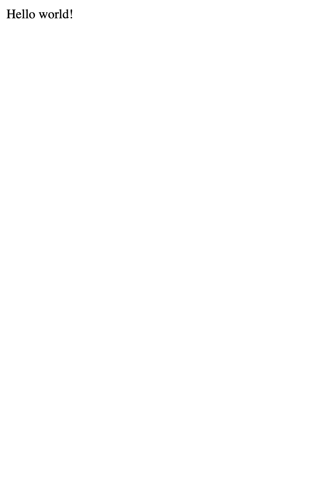
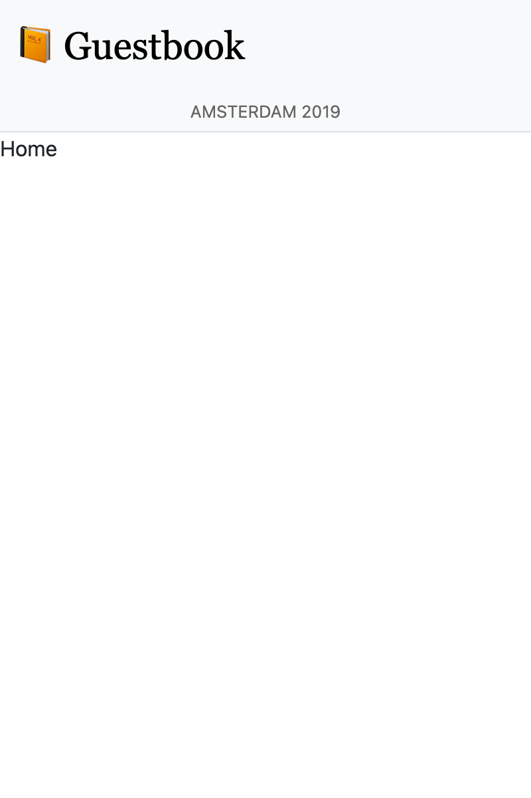
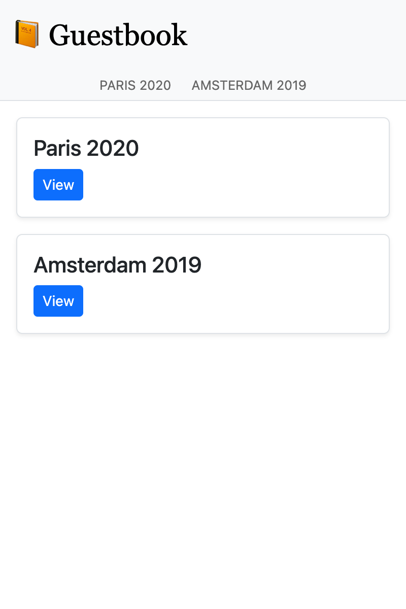
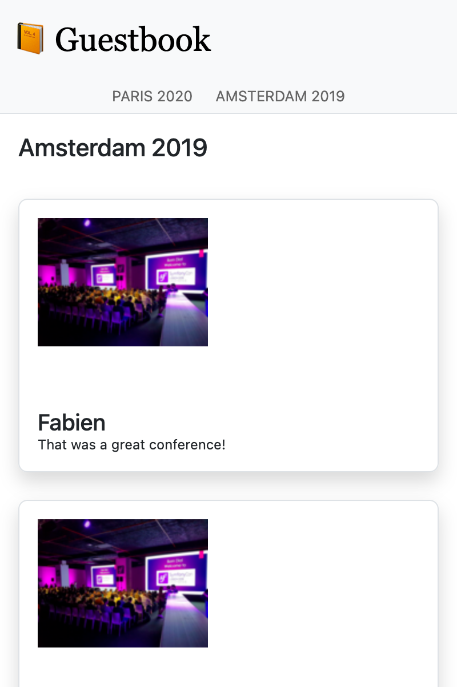

Costruire una SPA
=================

.. index::
    single: SPA
    single: Mobile

La maggior parte dei commenti saranno inviati durante la conferenza, i cui partecipanti, probabilmente, avranno un telefono e non un computer. Perché non creare un'applicazione mobile per controllare rapidamente i commenti della conferenza?

Un modo per creare un'applicazione mobile di questo tipo è quello di creare un'applicazione Javascript a pagina singola (SPA). Una SPA viene eseguita localmente, può utilizzare archiviazione locale, può chiamare una API HTTP remota e può sfruttare service workers per creare un'esperienza quasi nativa.

Creare l'applicazione
---------------------

Per creare l'applicazione mobile useremo `Preact`_ e **Symfony Encore**. **Preact** è una piccola ed efficiente libreria che semplificherà la creazione della SPA del Guestbook.

Per rendere il sito e la SPA coerenti, utilizzeremo i fogli di stile sass del sito anche per l'applicazione mobile.

Creare l'applicazione SPA nella cartella ``spa`` e copiare i fogli di stile del sito:

.. code-block:: terminal

    $ mkdir -p spa/src spa/public spa/assets/styles
    $ cp assets/styles/*.scss spa/assets/styles/
    $ cd spa

.. note::

    Abbiamo creato una cartella ``public`` in quanto interagiremo principalmente con la SPA tramite un browser. Avremmo potuto chiamarla ``build`` se avessimo voluto solo costruire un'applicazione mobile.

Per sicurezza, aggiungere un file ``.gitignore``:

.. code-block:: text
    :caption: .gitignore

    /node_modules/
    /public/
    /npm-debug.log
    # used later by Cordova
    /app/

Inizializzare il file ``package.json`` (equivalente JavaScript del file ``composer.json``):

.. code-block:: terminal

    $ npm init -y
    $ npm pkg delete type

Ora, aggiungere alcune delle dipendenze richieste:

.. code-block:: terminal

    $ npm install @symfony/webpack-encore @babel/core @babel/preset-env babel-preset-preact preact html-webpack-plugin bootstrap

L'ultimo passo è quello di creare la configurazione per Webpack Encore:

.. code-block:: javascript
    :caption: webpack.config.js
    :emphasize-lines: 8,11

    const Encore = require('@symfony/webpack-encore');
    const HtmlWebpackPlugin = require('html-webpack-plugin');

    Encore
        .setOutputPath('public/')
        .setPublicPath('/')
        .cleanupOutputBeforeBuild()
        .addEntry('app', './src/app.js')
        .enablePreactPreset()
        .enableSingleRuntimeChunk()
        .addPlugin(new HtmlWebpackPlugin({ template: 'src/index.ejs', alwaysWriteToDisk: true }))
    ;

    module.exports = Encore.getWebpackConfig();

Creare il template principale della SPA
---------------------------------------

È ora di creare il template iniziale che Preact utilizzerà per eseguire il render dell'applicazione:

.. code-block:: html
    :caption: src/index.ejs
    :emphasize-lines: 12

    <!DOCTYPE html>
    <html>
    <head>
        <meta http-equiv="Content-Type" content="text/html; charset=utf-8" />
        <meta http-equiv="X-UA-Compatible" content="IE=edge" />
        <meta name="msapplication-tap-highlight" content="no" />
        <meta name="viewport" content="user-scalable=no, initial-scale=1, maximum-scale=1, minimum-scale=1, width=device-width" />

        <title>Conference Guestbook application</title>
    </head>
    <body>
        

    </body>
    </html>

Il tag ``
`` è il punto in cui JavaScript eseguirà il render dell'applicazione. Ecco la prima versione del codice che esegue il render della view "Hello World":

.. code-block:: text
    :caption: src/app.js
    :emphasize-lines: 3,11

    import {h, render} from 'preact';

    function App() {
        return (
            

                Hello world!
            

        )
    }

    render(<App />, document.getElementById('app'));

L'ultima riga registra la funzione ``App()`` con l'elemento ``#app`` della pagina HTML.

Ora è tutto pronto!

Eseguire una SPA nel browser
----------------------------

.. index::
    single: Symfony CLI;server:start
    single: Symfony CLI;server:stop

Poiché questa applicazione è indipendente dal sito principale, abbiamo bisogno di eseguire un altro server web:

.. code-block:: terminal
    :class: hide

    $ symfony server:stop

.. code-block:: terminal

    $ symfony server:start -d --passthru=index.html

Il parametro ``--passthru`` comunica al server web di passare tutte le richieste HTTP al file ``public/index.html`` (``public/`` è la cartella web principale predefinita per il server web). Questa pagina è gestita dall'applicazione Preact e recupera la pagina di cui eseguire il render tramite la cronologia del "browser".

Per compilare i CSS **e i file JavaScript**, eseguire il comando ``npm``:

.. code-block:: terminal

    $ ./node_modules/.bin/encore dev

Aprire la SPA in un browser:

.. code-block:: terminal
    :class: ignore

    $ symfony open:local

Diamo uno sguardo alla nostra SPA "Hello world":

Aggiungere un router per gestire gli stati
------------------------------------------

Attualmente la SPA non è in grado di gestire pagine diverse. Per implementare diverse pagine, abbiamo bisogno di un router, così come per Symfony. Useremo **preact-router**. Prende un URL come input e trova la corrispondenza con un componente Preact da visualizzare.

Installare preact-router:

.. code-block:: terminal

    $ npm install preact-router

Creare una pagina per la homepage (un *componente Preact*):

.. code-block:: text
    :caption: src/pages/home.js

    import {h} from 'preact';

    export default function Home() {
        return (
            
Home

        );
    };

E un altro per la pagina della conferenza:

.. code-block:: text
    :caption: src/pages/conference.js

    import {h} from 'preact';

    export default function Conference() {
        return (
            
Conference

        );
    };

Sostituire il ``div`` "Hello World" con il componente ``Router``:

.. code-block:: diff
    :caption: patch_file
    :emphasize-lines: 15,17,20-23

    --- i/src/app.js
    +++ w/src/app.js
    @@ -1,9 +1,22 @@
     import {h, render} from 'preact';
    +import {Router, Link} from 'preact-router';
    +
    +import Home from './pages/home';
    +import Conference from './pages/conference';

     function App() {
         return (
             

    -            Hello world!
    +            <header>
    +                <Link href="/">Home</Link>
    +                 
    +                <Link href="/conference/amsterdam2019">Amsterdam 2019</Link>
    +            </header>
    +
    +            <Router>
    +                <Home path="/" />
    +                <Conference path="/conference/:slug" />
    +            </Router>
             

         )
     }

Eseguire nuovamente il build dell'applicazione:

.. code-block:: terminal

    $ ./node_modules/.bin/encore dev

Aggiornando l'applicazione nel browser, sarà ora possibile fare click sul link "Home" e sui link della conferenza. Si noti che l'URL e i pulsanti avanti/indietro del browser funzionano come ci si aspetterebbe.

Aggiungere lo stile alla SPA
----------------------------

Per quanto riguarda il sito, aggiungiamo il sass loader:

.. code-block:: terminal

    $ npm install sass sass-loader

Attivare il sass loader in Webpack e aggiungere un riferimento al foglio di stile:

.. code-block:: diff
    :caption: patch_file

    --- i/src/app.js
    +++ w/src/app.js
    @@ -1,3 +1,5 @@
    +import '../assets/styles/app.scss';
    +
     import {h, render} from 'preact';
     import {Router, Link} from 'preact-router';

    --- i/webpack.config.js
    +++ w/webpack.config.js
    @@ -7,6 +7,7 @@ Encore
         .cleanupOutputBeforeBuild()
         .addEntry('app', './src/app.js')
         .enablePreactPreset()
    +    .enableSassLoader()
         .enableSingleRuntimeChunk()
         .addPlugin(new HtmlWebpackPlugin({ template: 'src/index.ejs', alwaysWriteToDisk: true }))
     ;

Ora possiamo aggiornare l'applicazione affinché utilizzi i fogli di stile:

.. code-block:: diff
    :caption: patch_file

    --- i/src/app.js
    +++ w/src/app.js
    @@ -9,10 +9,20 @@ import Conference from './pages/conference';
     function App() {
         return (
             

    -            <header>
    -                <Link href="/">Home</Link>
    -                 
    -                <Link href="/conference/amsterdam2019">Amsterdam 2019</Link>
    +            <header className="header">
    +                <nav className="navbar navbar-light bg-light">
    +                    

    +                        <Link className="navbar-brand mr-4 pr-2" href="/">
    +                            &#128217; Guestbook
    +                        </Link>
    +                    

    +                </nav>
    +
    +                <nav className="bg-light border-bottom text-center">
    +                    <Link className="nav-conference" href="/conference/amsterdam2019">
    +                        Amsterdam 2019
    +                    </Link>
    +                </nav>
                 </header>

                 <Router>

Eseguire nuovamente il build dell'applicazione:

.. code-block:: terminal

    $ ./node_modules/.bin/encore dev

Ora abbiamo a disposizione una SPA con uno stile completo:

Recupero dei dati dall'API
--------------------------

La struttura dell'applicazione Preact è ora completa: Preact Router gestisce gli stati della pagina, incluso il segnaposto slug per le conferenze, e il foglio di stile dell'applicazione principale viene utilizzato per il design della SPA.

Per rendere dinamica la SPA, abbiamo bisogno di recuperare i dati dall'API tramite chiamate HTTP.

Configurare Webpack per esporre la variabile di ambiente per l'endpoint dell'API:

.. code-block:: diff
    :caption: patch_file

    --- i/webpack.config.js
    +++ w/webpack.config.js
    @@ -1,3 +1,4 @@
    +const webpack = require('webpack');
     const Encore = require('@symfony/webpack-encore');
     const HtmlWebpackPlugin = require('html-webpack-plugin');

    @@ -10,6 +11,9 @@ Encore
         .enableSassLoader()
         .enableSingleRuntimeChunk()
         .addPlugin(new HtmlWebpackPlugin({ template: 'src/index.ejs', alwaysWriteToDisk: true }))
    +    .addPlugin(new webpack.DefinePlugin({
    +        'ENV_API_ENDPOINT': JSON.stringify(process.env.API_ENDPOINT),
    +    }))
     ;

     module.exports = Encore.getWebpackConfig();

La variabile d'ambiente ``API_ENDPOINT`` dovrebbe puntare al server del sito dove abbiamo l'API endpoint all'indirizzo relativo ``/api``. La configureremo correttamente quando eseguiremo ``npm``.

Creare un file ``api.js`` che astragga il recupero dei dati dall'API:

.. code-block:: text
    :caption: src/api/api.js

    function fetchCollection(path) {
        return fetch(ENV_API_ENDPOINT + path).then(resp => resp.json()).then(json => json['hydra:member']);
    }

    export function findConferences() {
        return fetchCollection('api/conferences');
    }

    export function findComments(conference) {
        return fetchCollection('api/comments?conference='+conference.id);
    }

Ora è possibile adattare i componenti "header" e "home":

.. code-block:: diff
    :caption: patch_file

    --- i/src/app.js
    +++ w/src/app.js
    @@ -2,11 +2,23 @@ import '../assets/styles/app.scss';

     import {h, render} from 'preact';
     import {Router, Link} from 'preact-router';
    +import {useState, useEffect} from 'preact/hooks';

    +import {findConferences} from './api/api';
     import Home from './pages/home';
     import Conference from './pages/conference';

     function App() {
    +    const [conferences, setConferences] = useState(null);
    +
    +    useEffect(() => {
    +        findConferences().then((conferences) => setConferences(conferences));
    +    }, []);
    +
    +    if (conferences === null) {
    +        return 
Loading...
;
    +    }
    +
         return (
             

                 <header className="header">
    @@ -19,15 +31,17 @@ function App() {
                     </nav>

                     <nav className="bg-light border-bottom text-center">
    -                    <Link className="nav-conference" href="/conference/amsterdam2019">
    -                        Amsterdam 2019
    -                    </Link>
    +                    {conferences.map((conference) => (
    +                        <Link className="nav-conference" href={'/conference/'+conference.slug}>
    +                            {conference.city} {conference.year}
    +                        </Link>
    +                    ))}
                     </nav>
                 </header>

                 <Router>
    -                <Home path="/" />
    -                <Conference path="/conference/:slug" />
    +                <Home path="/" conferences={conferences} />
    +                <Conference path="/conference/:slug" conferences={conferences} />
                 </Router>
             

         )
    --- i/src/pages/home.js
    +++ w/src/pages/home.js
    @@ -1,7 +1,28 @@
     import {h} from 'preact';
    +import {Link} from 'preact-router';
    +
    +export default function Home({conferences}) {
    +    if (!conferences) {
    +        return 
No conferences yet
;
    +    }

    -export default function Home() {
         return (
    -        
Home

    +        

    +            {conferences.map((conference)=> (
    +                

    +                    

    +                        

    +                            <h4 className="font-weight-light">
    +                                {conference.city} {conference.year}
    +                            </h4>
    +                        

    +
    +                        <Link className="btn btn-sm btn-primary stretched-link" href={'/conference/'+conference.slug}>
    +                            View
    +                        </Link>
    +                    

    +                

    +            ))}
    +        

         );
    -};
    +}

Infine, Preact Router passa la variabile "slug" al componente Conference come proprietà. Usiamola per visualizzare la conferenza corretta e i suoi commenti, sfruttando nuovamente l'API. Inoltre adattiamo il rendering affinché utilizzi i dati dell'API:

.. code-block:: diff
    :caption: patch_file

    --- i/src/pages/conference.js
    +++ w/src/pages/conference.js
    @@ -1,7 +1,48 @@
     import {h} from 'preact';
    +import {findComments} from '../api/api';
    +import {useState, useEffect} from 'preact/hooks';
    +
    +function Comment({comments}) {
    +    if (comments !== null && comments.length === 0) {
    +        return 
No comments yet
;
    +    }
    +
    +    if (!comments) {
    +        return 
Loading...
;
    +    }

    -export default function Conference() {
         return (
    -        
Conference

    +        

    +            {comments.map(comment => (
    +                

    +                    

    +                        {!comment.photoFilename ? '' : (
    +                            <a href={ENV_API_ENDPOINT+'uploads/photos/'+comment.photoFilename} target="_blank">
    +                                
    +                            </a>
    +                        )}
    +                    

    +
    +                    <h5 className="font-weight-light mt-3 mb-0">{comment.author}</h5>
    +                    
{comment.text}

    +                

    +            ))}
    +        

         );
    -};
    +}
    +
    +export default function Conference({conferences, slug}) {
    +    const conference = conferences.find(conference => conference.slug === slug);
    +    const [comments, setComments] = useState(null);
    +
    +    useEffect(() => {
    +        findComments(conference).then(comments => setComments(comments));
    +    }, [slug]);
    +
    +    return (
    +        

    +            <h4>{conference.city} {conference.year}</h4>
    +            <Comment comments={comments} />
    +        

    +    );
    +}

La SPA ora deve conoscere l'URL della nostra API: Questo avviene tramite la variabile d'ambiente ``API_ENDPOINT``: impostiamola con l'URL del server web API (in esecuzione nella cartella ``..``):

.. code-block:: terminal

    $ API_ENDPOINT=`symfony var:export SYMFONY_PROJECT_DEFAULT_ROUTE_URL --dir=..` ./node_modules/.bin/encore dev

Ora si potrebbe eseguire anche in background:

.. code-block:: terminal

    $ API_ENDPOINT=`symfony var:export SYMFONY_PROJECT_DEFAULT_ROUTE_URL --dir=..` symfony run -d --watch=webpack.config.js ./node_modules/.bin/encore dev --watch

E l'applicazione nel browser ora dovrebbe funzionare correttamente:

Fantastico! Ora abbiamo una SPA completamente funzionale, con router e dati reali. Potremmo organizzare ulteriormente l'app Preact se vogliamo, ma sta già funzionando alla grande.

Deploy della SPA in produzione
------------------------------

.. index::
    single: Platform.sh;Multi-Applications

Platform.sh permette il deploy di più applicazioni per progetto. L'aggiunta di un'altra applicazione può essere fatta creando un file ``.platform.app.yaml`` in qualsiasi sottocartella. Crearne uno nella cartella ``spa/`` con il nome ``spa``:

.. code-block:: yaml
    :caption: .platform.app.yaml
    :emphasize-lines: 1

    name: spa

    type: nodejs:18

    size: S

    build:
        flavor: none

    web:
        commands:
            start: sleep
        locations:
            "/":
                root: "public"
                index:
                    - "index.html"
                scripts: false
                expires: 10m

    hooks:
        build: |
            set -x -e

            curl -fs https://get.symfony.com/cloud/configurator | bash

            NODE_VERSION=18 node-build

.. index::
    single: Platform.sh;Routes

Modificare il file ``.platform/routes.yaml`` affinché al sottodominio ``spa.`` risponda l'applicazione ``spa`` contenuta nella cartella principale del progetto:

.. code-block:: terminal

    $ cd ../

.. code-block:: diff
    :caption: patch_file
    :emphasize-lines: 4,5

    --- i/.platform/routes.yaml
    +++ w/.platform/routes.yaml
    @@ -1,2 +1,5 @@
     "https://{all}/": { type: upstream, upstream: "varnish:http", cache: { enabled: false } }
     "http://{all}/": { type: redirect, to: "https://{all}/" }
    +
    +"https://spa.{all}/": { type: upstream, upstream: "spa:http" }
    +"http://spa.{all}/": { type: redirect, to: "https://spa.{all}/" }

Configurare CORS per la SPA
---------------------------

.. index::
    single: CORS
    single: Cross-Origin Resource Sharing

Se si facesse il deploy del codice ora, questo non funzionerebbe poiché un browser bloccherebbe la richiesta API. Dobbiamo permettere esplicitamente alla SPA di accedere all'API. Prendere il nome a dominio corrente legato all'applicazione:

.. code-block:: terminal

    $ symfony cloud:env:url --pipe --primary

Definire, di conseguenza, la variabile d'ambiente ``CORS_ALLOW_ORIGIN``:

.. code-block:: terminal

    $ symfony cloud:variable:create --sensitive=1 --level=project -y --name=env:CORS_ALLOW_ORIGIN --value="^`symfony cloud:env:url --pipe --primary | sed 's#/$##' | sed 's#https://#https://spa.#'`$"

Se il dominio è ``https://master-5szvwec-hzhac461b3a6o.eu-5.platformsh.site/``, il comando ``sed`` lo convertirà in ``https://spa.master-5szvwec-hzhac461b3a6o.eu-5.platformsh.site``.

Dobbiamo anche impostare la variabile d'ambiente ``API_ENDPOINT``:

.. code-block:: terminal

    $ symfony cloud:variable:create --sensitive=1 --level=project -y --name=env:API_ENDPOINT --value=`symfony cloud:env:url --pipe --primary`

Commit e deploy:

.. code-block:: terminal
    :class: ignore

    $ git add .
    $ git commit -a -m'Add the SPA application'
    $ symfony cloud:deploy

Accedere la SPA in un browser specificando l'applicazione come parametro:

.. code-block:: terminal
    :class: ignore

    $ symfony cloud:url -1 --app=spa

Usare Cordova per costruire un'applicazione per smartphone
----------------------------------------------------------

.. index::
    single: SPA;Cordova
    single: Apache Cordova
    single: Cordova

**Apache Cordova** è uno strumento per costruire applicazioni multipiattaforma per smartphone. La buona notizia è che può utilizzare la SPA che abbiamo appena creato.

Installiamolo:

.. code-block:: terminal

    $ cd spa
    $ npm install cordova

.. note::

    È inoltre necessario installare l'SDK Android. Questa sezione cita solo Android, ma Cordova funziona con tutte le piattaforme mobili, incluso iOS.

Creare la struttura di cartelle dell'applicazione:

.. code-block:: terminal
    :class: answers(n)

    $ ./node_modules/.bin/cordova create app

E generare l'applicazione Android:

.. code-block:: terminal
    :class: ignore

    $ cd app
    $ ~/.npm/bin/cordova platform add android
    $ cd ..

Questo è tutto ciò di cui abbiamo bisogno. Ora è possibile eseguire la "build" dei file di produzione e spostarli in Cordova:

.. code-block:: terminal

    $ API_ENDPOINT=`symfony var:export SYMFONY_PROJECT_DEFAULT_ROUTE_URL --dir=..` ./node_modules/.bin/encore production
    $ rm -rf app/www
    $ mkdir -p app/www
    $ cp -R public/ app/www

Eseguire l'applicazione su uno smartphone o un emulatore:

.. code-block:: terminal
    :class: ignore

    $ ./node_modules/.bin/cordova run android

.. sidebar:: Andare oltre

    * `Il sito ufficiale di Preact`_;

    * `Il sito ufficiale di Cordova`_.

.. _`Preact`: https://preactjs.com/
.. _`Il sito ufficiale di Preact`: https://preactjs.com/
.. _`Il sito ufficiale di Cordova`: https://cordova.apache.org/
