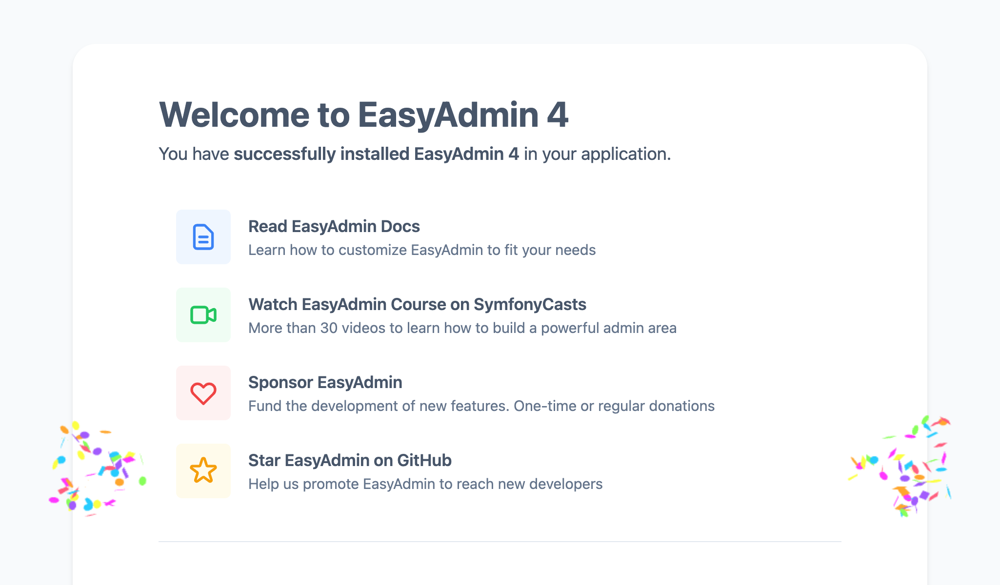
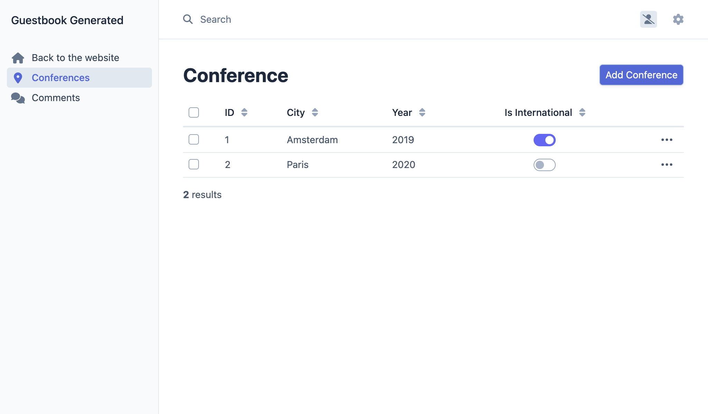
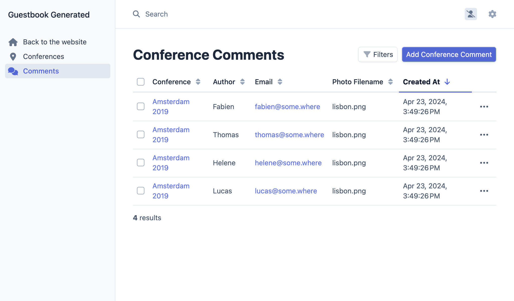

Impostare un pannello amministrativo
====================================

.. index::
    single: EasyAdmin
    single: Admin
    single: Backend

Aggiungere le prossime conferenze al database è compito degli amministratori del progetto. Il pannello amministrativo è una sezione protetta del sito web dove gli *amministratori di progetto* possono gestire i dati del sito, moderare i feedback e altro ancora.

Come possiamo crearlo in fretta? Usando un bundle che è in grado di generare un pannello amministrativo basato sul modello del progetto. EasyAdmin si adatta perfettamente al contesto.

Installare più dipendenze
--------------------------

Anche se il pacchetto ``webapp`` ha aggiunto automaticamente tanti pacchetti, per la stessa specifica funzionalità, abbiamo bisogno di aggiugnere più dipendenze. Come possiamo farlo? Attraverso Composer. Al di là dei "normali" pacchetti Composer, lavoreremo con due tipologie "speciali" di pacchetti:

* *Componenti Symfony*: Pacchetti che implementano le funzionalità essenziali e le astrazioni di basso livello di cui molte applicazione hanno bisogno (routing, console, HTTP client, mailer, cache, ...);

* *Bundle Symfony*: pacchetti che aggiungono funzionalità di alto livello o che forniscono integrazioni con librerie di terze parti (ai bundle contribuisce principalmente la community).

Aggiungiamo EasyAdmin come dipendenza del progetto:

.. code-block:: terminal

    $ symfony composer req "easycorp/easyadmin-bundle:^4"

Gli *alias* non sono una funzionalità di Composer, ma un concetto fornito da Symfony per rendere la vita più facile. Gli alias sono una scorciatoia per i pacchetti Composer più popolari. Vuoi un ORM per la tua applicazione? Richiedi ``orm``. Vuoi sviluppare delle API? Richiedi ``api``. Questi alias sono risolti automaticamente con uno o più pacchetti Composer. Sono scelte basate sull'opinione del core team di Symfony.

Un'altra caratteristica è quella di poter omettere il vendor ``symfony``. Richiedere ``cache`` invece che ``symfony/cache``.

.. tip::

    Ti ricordi che in precedenza abbiamo menzionato un plugin di Composer dal nome ``symfony/flex``? Gli alias sono una delle sue funzionalità.

Configurare EasyAdmin
---------------------

EasyAdmin genera automaticamente un'area di amministrazione per l'applicazione, in base a specifici controller.

Per iniziare con EasyAdmin, generiamo una "web admin dashboard", che sarà il punto di ingresso principale per la gestione dei dati del sito:

.. code-block:: terminal
    :class: answers(DashboardController||src/Controller/Admin/)

    $ symfony console make:admin:dashboard

Accettare le risposte predefinite per creare il seguente controller:

.. code-block:: php
    :caption: src/Controller/Admin/DashboardController.php
    :class: ignore

    namespace App\Controller\Admin;

    use EasyCorp\Bundle\EasyAdminBundle\Config\Dashboard;
    use EasyCorp\Bundle\EasyAdminBundle\Config\MenuItem;
    use EasyCorp\Bundle\EasyAdminBundle\Controller\AbstractDashboardController;
    use Symfony\Component\HttpFoundation\Response;
    use Symfony\Component\Routing\Attribute\Route;

    class DashboardController extends AbstractDashboardController
    {
        /**
         * @Route("/admin", name="admin")
         */
        public function index(): Response
        {
            return parent::index();
        }

        public function configureDashboard(): Dashboard
        {
            return Dashboard::new()
                ->setTitle('Guestbook');
        }

        public function configureMenuItems(): iterable
        {
            yield MenuItem::linkToDashboard('Dashboard', 'fa fa-home');
            // yield MenuItem::linkToCrud('The Label', 'icon class', EntityClass::class);
        }
    }

Per convenzione, tutti i controller di amministrazione sono sotto il namespace ``App\Controller\Admin``.

Accedere al pannello amministrativo generato in ``/admin``, come configurato nel metodo ``index()``. Si può modificare l'URL a piacimento:

Fatto! Abbiamo un'interfaccia di amministrazione bella e ricca di funzionalità, pronta per essere personalizzata.

.. index::
    single: CRUD

Il passo successivo è quello di creare i controller per gestire le conferenze e i commenti.

Potreste aver notato il metodo ``configureMenuItems()`` nel controller principale, con un commento che parla di aggiungere collegamenti ai "CRUD": **CRUD** è un acronimo per "Create, Read, Update, Delete" (Creare, Leggere, Aggiornare, Eliminare), le quattro operazioni di base che si possono eseguire su un'entità. Questo è esattamente ciò che vogliamo da un'interfaccia di amministrazione. EasyAdmin si occupa anche di ricerca e filtri.

Generiamo un CRUD per le conferenze:

.. code-block:: terminal
    :class: answers(1||src/Controller/Admin/||App\\Controller\\Admin)

    $ symfony console make:admin:crud

Scegliamo ``1`` per creare un'interfaccia di amministrazione per le conferenze e lasciamo le altre risposte ai valori predefiniti. Dovrebbe generarsi il seguente file:

.. code-block:: php
    :caption: src/Controller/Admin/ConferenceCrudController.php
    :class: ignore

    namespace App\Controller\Admin;

    use App\Entity\Conference;
    use EasyCorp\Bundle\EasyAdminBundle\Controller\AbstractCrudController;

    class ConferenceCrudController extends AbstractCrudController
    {
        public static function getEntityFqcn(): string
        {
            return Conference::class;
        }

        /*
        public function configureFields(string $pageName): iterable
        {
            return [
                IdField::new('id'),
                TextField::new('title'),
                TextEditorField::new('description'),
            ];
        }
        */
    }

Facciamo la stessa cosa per i commenti:

.. code-block:: terminal
    :class: answers(0||src/Controller/Admin/||App\\Controller\\Admin)

    $ symfony console make:admin:crud

L'ultimo passo è quello di collegare alla dashboard i CRUD di amministrazione per conferenze e commenti

.. code-block:: diff
    :caption: patch_file

    --- i/src/Controller/Admin/DashboardController.php
    +++ w/src/Controller/Admin/DashboardController.php
    @@ -2,6 +2,8 @@

     namespace App\Controller\Admin;

    +use App\Entity\Comment;
    +use App\Entity\Conference;
     use EasyCorp\Bundle\EasyAdminBundle\Attribute\AdminDashboard;
     use EasyCorp\Bundle\EasyAdminBundle\Config\Dashboard;
     use EasyCorp\Bundle\EasyAdminBundle\Config\MenuItem;
    @@ -44,7 +46,8 @@ class DashboardController extends AbstractDashboardController

         public function configureMenuItems(): iterable
         {
    -        yield MenuItem::linkToDashboard('Dashboard', 'fa fa-home');
    -        // yield MenuItem::linkToCrud('The Label', 'fas fa-list', EntityClass::class);
    +        yield MenuItem::linkToRoute('Back to the website', 'fas fa-home', 'homepage');
    +        yield MenuItem::linkToCrud('Conferences', 'fas fa-map-marker-alt', Conference::class);
    +        yield MenuItem::linkToCrud('Comments', 'fas fa-comments', Comment::class);
         }
     }

Abbiamo sovrascritto il metodo ``configureMenuItems`` per aggiungere elementi di menù con le icone pertinenti a conferenze e commenti, e per aggiungere un link di ritorno alla home page.

EasyAdmin espone una API per facilitare il collegamento dei CRUD delle entità tramite il metodo ``MenuItem::linkToRoute()``

Per il momento la dashboard della pagina principale è vuota. In questa pagina si potranno mostrare statistiche o altre informazioni d'interesse. Siccome non abbiamo niente di importante da mostrare, facciamo un redirect alla lista delle conferenze:

.. code-block:: diff
    :caption: patch_file

    --- i/src/Controller/Admin/DashboardController.php
    +++ w/src/Controller/Admin/DashboardController.php
    @@ -8,6 +8,7 @@ use EasyCorp\Bundle\EasyAdminBundle\Attribute\AdminDashboard;
     use EasyCorp\Bundle\EasyAdminBundle\Config\Dashboard;
     use EasyCorp\Bundle\EasyAdminBundle\Config\MenuItem;
     use EasyCorp\Bundle\EasyAdminBundle\Controller\AbstractDashboardController;
    +use EasyCorp\Bundle\EasyAdminBundle\Router\AdminUrlGenerator;
     use Symfony\Component\HttpFoundation\Response;

     #[AdminDashboard(routePath: '/admin', routeName: 'admin')]
    @@ -15,7 +16,10 @@ class DashboardController extends AbstractDashboardController
     {
         public function index(): Response
         {
    -        return parent::index();
    +        $routeBuilder = $this->container->get(AdminUrlGenerator::class);
    +        $url = $routeBuilder->setController(ConferenceCrudController::class)->generateUrl();
    +
    +        return $this->redirect($url);

             // Option 1. You can make your dashboard redirect to some common page of your backend
             //

Quando si mostrano le relazioni tra entità (la conferenza relativa a un commento), EasyAdmin cerca di rappresentare una conferenza come stringa. Come strategia predefinita, utilizza una convenzione composta dalla concatenazione del nome dell'entità e la sua chiave primaria (come ad esempio ``Conference #1``) se l'entità non ha definito il metodo "magico" ``__toString()``. Per rendere questo valore più significativo, aggiungiamo il suddetto metodo alla classe ``Conference``:

.. code-block:: diff
    :caption: patch_file

    --- i/src/Entity/Conference.php
    +++ w/src/Entity/Conference.php
    @@ -35,6 +35,11 @@ class Conference
             $this->comments = new ArrayCollection();
         }

    +    public function __toString(): string
    +    {
    +        return $this->city.' '.$this->year;
    +    }
    +
         public function getId(): ?int
         {
             return $this->id;

Ora è possibile aggiungere/modificare/cancellare le conferenze direttamente dal pannello amministrativo. Si può fare qualche prova e aggiungere almeno una conferenza.

Personalizzazione di EasyAdmin
------------------------------

Il pannello amministrativo predefinito funziona bene, ma può essere personalizzato in molti modi per migliorare l'esperienza utente. Facciamo alcune semplici modifiche per dimostrarne le possibilità. Modificare la configurazione corrente con quanto segue:

.. code-block:: diff
    :caption: patch_file

    --- i/src/Controller/Admin/CommentCrudController.php
    +++ w/src/Controller/Admin/CommentCrudController.php
    @@ -3,10 +3,17 @@
     namespace App\Controller\Admin;

     use App\Entity\Comment;
    +use EasyCorp\Bundle\EasyAdminBundle\Config\Crud;
    +use EasyCorp\Bundle\EasyAdminBundle\Config\Filters;
     use EasyCorp\Bundle\EasyAdminBundle\Controller\AbstractCrudController;
    +use EasyCorp\Bundle\EasyAdminBundle\Field\AssociationField;
    +use EasyCorp\Bundle\EasyAdminBundle\Field\DateTimeField;
    +use EasyCorp\Bundle\EasyAdminBundle\Field\EmailField;
     use EasyCorp\Bundle\EasyAdminBundle\Field\IdField;
    +use EasyCorp\Bundle\EasyAdminBundle\Field\TextareaField;
     use EasyCorp\Bundle\EasyAdminBundle\Field\TextEditorField;
     use EasyCorp\Bundle\EasyAdminBundle\Field\TextField;
    +use EasyCorp\Bundle\EasyAdminBundle\Filter\EntityFilter;

     class CommentCrudController extends AbstractCrudController
     {
    @@ -15,14 +22,43 @@ class CommentCrudController extends AbstractCrudController
             return Comment::class;
         }

    -    /*
    +    public function configureCrud(Crud $crud): Crud
    +    {
    +        return $crud
    +            ->setEntityLabelInSingular('Conference Comment')
    +            ->setEntityLabelInPlural('Conference Comments')
    +            ->setSearchFields(['author', 'text', 'email'])
    +            ->setDefaultSort(['createdAt' => 'DESC'])
    +        ;
    +    }
    +
    +    public function configureFilters(Filters $filters): Filters
    +    {
    +        return $filters
    +            ->add(EntityFilter::new('conference'))
    +        ;
    +    }
    +
         public function configureFields(string $pageName): iterable
         {
    -        return [
    -            IdField::new('id'),
    -            TextField::new('title'),
    -            TextEditorField::new('description'),
    -        ];
    +        yield AssociationField::new('conference');
    +        yield TextField::new('author');
    +        yield EmailField::new('email');
    +        yield TextareaField::new('text')
    +            ->hideOnIndex()
    +        ;
    +        yield TextField::new('photoFilename')
    +            ->onlyOnIndex()
    +        ;
    +
    +        $createdAt = DateTimeField::new('createdAt')->setFormTypeOptions([
    +            'years' => range(date('Y'), date('Y') + 5),
    +            'widget' => 'single_text',
    +        ]);
    +        if (Crud::PAGE_EDIT === $pageName) {
    +            yield $createdAt->setFormTypeOption('disabled', true);
    +        } else {
    +            yield $createdAt;
    +        }
         }
    -    */
     }

Per personalizzare la sezione ``Comment``, elencare i campi esplicitamente nel metodo ``configureFields()`` ci consentirà di ordinarli nella maniera che desideriamo. Alcuni campi sono configurati ulteriormente, come il nascondere il campo testuale nella pagina di partenza.

Aggiungiamo qualche commento senza foto e impostiamo la data manualmente: la colonna ``createdAt`` sarà automatizzata in un secondo momento.

I metodi ``configureFilters()`` definiscono quali filtri esporre al di sopra del campo di ricerca.

.. figure:: screenshots/easy-admin-filter.png
    :alt: /admin?crudAction=index&crudId=2bfa220&menuIndex=2&submenuIndex=-1
    :align: center
    :figclass: with-browser

Queste personalizzazioni sono solo una piccola introduzione alle possibilità offerte da EasyAdmin.

Giocate con il pannello amministrativo, filtrando i commenti per conferenza o cercando i commenti per e-mail, ad esempio. L'unico problema è che chiunque può accedere al backend. Niente paura, l'accesso sarà regolato in un secondo momento.

.. code-block:: terminal
    :class: hide

    $ symfony run psql -c "TRUNCATE conference RESTART IDENTITY CASCADE"

.. sidebar:: Andare oltre

    * `Documentazione di EasyAdmin`_;

    * `Riferimento alla configurazione del framework Symfony`_;

    * `Metodi magici di PHP`_.

.. _`Documentazione di EasyAdmin`: https://symfony.com/bundles/EasyAdminBundle/4.x/index.html
.. _`Riferimento alla configurazione del framework Symfony`: https://symfony.com/doc/current/reference/configuration/framework.html
.. _`Metodi magici di PHP`: https://www.php.net/manual/en/language.oop5.magic.php
