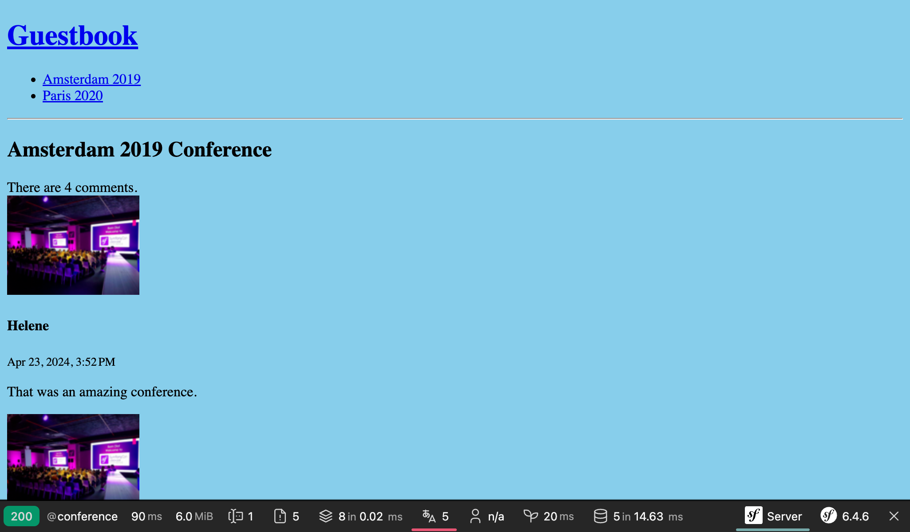

テストをする
==================

.. index::
    single: PHPUnit

アプリケーションにどんどん機能を追加し始めているので、テストについて話す適切なタイミングでしょう。

面白いことに、このチャプターでテストを書いている時に私はバグを見つけました。

Symfony は、PHPUnit を使ってユニットテストをしています。インストールしておきましょう:

.. code-block:: terminal

    $ symfony composer req phpunit --dev

ユニットテストを書く
------------------------------

.. index::
    single: Test;Unit Tests
    single: Unit Tests
    single: Command;make:test

``SpamChecker`` が、最初にテストを書くクラスです。ユニットテストを生成します:

.. code-block:: terminal

    $ symfony console make:test TestCase SpamCheckerTest

SpamChecker のテストで Akismet API を叩かないようにするのは少々困難です。ここでは、Akismet API を *モック* します。

.. index::
    single: Mock

API がエラーを返した際のテストを書いてみましょう:

.. code-block:: diff
    :caption: patch_file

    --- i/tests/SpamCheckerTest.php
    +++ w/tests/SpamCheckerTest.php
    @@ -2,12 +2,26 @@

     namespace App\Tests;

    +use App\Entity\Comment;
    +use App\SpamChecker;
     use PHPUnit\Framework\TestCase;
    +use Symfony\Component\HttpClient\MockHttpClient;
    +use Symfony\Component\HttpClient\Response\MockResponse;
    +use Symfony\Contracts\HttpClient\ResponseInterface;

     class SpamCheckerTest extends TestCase
     {
    -    public function testSomething(): void
    +    public function testSpamScoreWithInvalidRequest(): void
         {
    -        $this->assertTrue(true);
    +        $comment = new Comment();
    +        $comment->setCreatedAtValue();
    +        $context = [];
    +
    +        $client = new MockHttpClient([new MockResponse('invalid', ['response_headers' => ['x-akismet-debug-help: Invalid key']])]);
    +        $checker = new SpamChecker($client, 'abcde');
    +
    +        $this->expectException(\RuntimeException::class);
    +        $this->expectExceptionMessage('Unable to check for spam: invalid (Invalid key).');
    +        $checker->getSpamScore($comment, $context);
         }
     }

``MockHttpClient`` クラスを使えば、 HTTP server をモックすることができます。 ``MockHttpClient`` は、期待するボディとレスポンスヘッダーを含んでいる ``MockResponse`` インスタンスの配列を取ります。

``getSpamScore()`` メソッドを呼び出し、PHPUnit の ``exepectException()`` メソッドから例外が投げられたかチェックします。

テストを実行し、成功することを確認してください:

.. code-block:: terminal

    $ symfony php bin/phpunit

.. index::
    single: PHPUnit;Data Provider
    single: Data Provider
    single: Attributes;DataProvider

正常系のテストを追加してください:

.. code-block:: diff
    :caption: patch_file

    --- i/tests/SpamCheckerTest.php
    +++ w/tests/SpamCheckerTest.php
    @@ -4,6 +4,7 @@ namespace App\Tests;

     use App\Entity\Comment;
     use App\SpamChecker;
    +use PHPUnit\Framework\Attributes\DataProvider;
     use PHPUnit\Framework\TestCase;
     use Symfony\Component\HttpClient\MockHttpClient;
     use Symfony\Component\HttpClient\Response\MockResponse;
    @@ -24,4 +25,30 @@ class SpamCheckerTest extends TestCase
             $this->expectExceptionMessage('Unable to check for spam: invalid (Invalid key).');
             $checker->getSpamScore($comment, $context);
         }
    +
    +    #[DataProvider('provideComments')]
    +    public function testSpamScore(int $expectedScore, ResponseInterface $response, Comment $comment, array $context)
    +    {
    +        $client = new MockHttpClient([$response]);
    +        $checker = new SpamChecker($client, 'abcde');
    +
    +        $score = $checker->getSpamScore($comment, $context);
    +        $this->assertSame($expectedScore, $score);
    +    }
    +
    +    public static function provideComments(): iterable
    +    {
    +        $comment = new Comment();
    +        $comment->setCreatedAtValue();
    +        $context = [];
    +
    +        $response = new MockResponse('', ['response_headers' => ['x-akismet-pro-tip: discard']]);
    +        yield 'blatant_spam' => [2, $response, $comment, $context];
    +
    +        $response = new MockResponse('true');
    +        yield 'spam' => [1, $response, $comment, $context];
    +
    +        $response = new MockResponse('false');
    +        yield 'ham' => [0, $response, $comment, $context];
    +    }
     }

PHPUnit のデータプロバイダーを使うと、複数のテストケースで同じテストのロジックを再利用することができます:

コントローラーのファンクショナルテストを書く
------------------------------------------------------------------

.. index::
    single: Test;Functional Tests
    single: Functional Tests
    single: Components;Browser Kit
    single: Browser Kit

コントローラーのテストは *一般的な* PHP のクラスのテストとは少し異なります。コントローラーのテストでは、 HTTP リクエストのコンテキスト内で実行する必要があるからです。

Conference コントローラーのファンクショナルテストを作成してください:

.. code-block:: php
    :caption: tests/Controller/ConferenceControllerTest.php

    namespace App\Tests\Controller;

    use Symfony\Bundle\FrameworkBundle\Test\WebTestCase;

    class ConferenceControllerTest extends WebTestCase
    {
        public function testIndex()
        {
            $client = static::createClient();
            $client->request('GET', '/');

            $this->assertResponseIsSuccessful();
            $this->assertSelectorTextContains('h2', 'Give your feedback');
        }
    }

``PHPUnit\Framework\TestCase`` の代わりに ``Symfony\Bundle\FrameworkBundle\Test\WebTestCase`` を使うことにより、機能テストの便利な機能を利用することができます。

``$client`` 変数は、ブラウザをシミュレートします。 サーバーへのHTTP 呼び出しをするのではなく、 Symfony アプリケーションを直接呼び出します。この方法を使うことの利点は次の通りです。クライアントとサーバーの間の往復をしないので処理が速くなることです。そして、各HTTPリクエストの後のサービスの状態を調べるテストが可能になることです。

最初のテストは、ホームページが HTTP Response が 200 を返すか調べることです。

PHPUnit のみならず、さらに ``assertResponseIsSuccessful`` のようなアサーションを使うことで確認作業が楽になります。Symofny によって定義されたこういったアサーションはたくさんあります。

.. tip::

    ルーターから生成するのではなく、 ``/`` を URL として使ってきました。エンドユーザーの URL をテストとするため、故意にそうしていました。ルートパスを変更すると、テストは失敗するようになります。そして、失敗することが、サーチエンジンや Web サイトにリンクがあった際に、古い URL を新しい URL にリダイレクトさせるようにするべきということに気づくリマンドになります。

テスト環境を設定する
------------------------------

.. index::
    single: Symfony Environments

デフォルトでは、PHPUnit テストはPHPUnitの設定ファイルに設定されている通り、 ``test`` というSymfony環境で実行されます:

.. code-block:: xml
    :caption: phpunit.xml.dist
    :emphasize-lines: 4
    :class: ignore

    <phpunit>
        <php>
            <ini name="error_reporting" value="-1" />
            <server name="APP_ENV" value="test" force="true" />
            <server name="SHELL_VERBOSITY" value="-1" />
            <server name="SYMFONY_PHPUNIT_REMOVE" value="" />
            <server name="SYMFONY_PHPUNIT_VERSION" value="8.5" />
            ...

.. index:: Command;secrets:set

テストを動かすために、この ``test`` 環境のための ``AKISMET_KEY`` を設定する必要があります:

.. code-block:: terminal
    :class: answers(AKISMET_KEY_VALUE)

    $ symfony console secrets:set AKISMET_KEY --env=test

テストデータベースを使う
------------------------------------

.. index::
    single: Test;Database
    single: Functional Tests,Database

既に見たように、Symfony CLIは自動的に ``DATABASE_URL`` 環境変数を読み取ります。 ``APP_ENV`` が ``test`` のとき（PHPUnit実行時に指定したときのように）、Symfony CLIはデータベース名を ``app`` から ``app_test`` に変更して、テストが専用のデータベースを使えるようにします。

.. code-block:: yaml
    :class: ignore
    :emphasize-lines: 5
    :caption: config/packages/doctrine.yaml

    when@test:
        doctrine:
            dbal:
                # "TEST_TOKEN" is typically set by ParaTest
                dbname_suffix: '_test%env(default::TEST_TOKEN)%'

テストを実行するために安定したデータが必要であり、また、当然開発用データベースに保存したデータを上書きしないようにするため、環境によるデータベース名の変更は重要なのです。

テストを実行する前に、 ``test`` データベースを「初期化」する（つまり、データベースを作成して、マイグレーションする）必要があります:

.. code-block:: terminal

    $ symfony console doctrine:database:create --env=test
    $ symfony console doctrine:migrations:migrate -n --env=test

.. note::

    On Linux and similiar OSes, you can use ``APP_ENV=test`` instead of
    ``--env=test``:

    .. code-block:: terminal
        :class: ignore

        $ APP_ENV=test symfony console doctrine:database:create

これ以降テストを実行すると、PHPUnit はもう開発用データベースを使わなくなりました。新しいテストだけを実行するには、コマンド引数としてクラスパスを渡します:

.. code-block:: terminal

    $ symfony php bin/phpunit tests/Controller/ConferenceControllerTest.php

.. tip::

    テストが失敗した際は、レスポンスオブジェクトを調べると良いです。 ``$client->getResponse()`` でレスポンスオブジェクトを取得し ``echo`` してどうなっているか確認してください。

フィクスチャを定義する
---------------------------------

.. index::
    single: Doctrine;Fixtures
    single: Fixtures

コメントの一覧、ページネーション、フォーム投稿のテストをするには、データをデータベースへ投入する必要があります。そして、テスト実行の間同じデータにしておきたいです。このニーズを満たしてくれるフィクスチャの出番です。

Doctrine Fixture bundle をインストールしてください:

.. code-block:: terminal

    $ symfony composer req orm-fixtures --dev

インストールすると、 ``src/DataFixtures/`` ディレクトリとサンプルクラスが作成されますので、カスタマイズしてください。ここでは、カンファレンスを2つ、コメントを1つ追加します:

.. code-block:: diff
    :caption: patch_file

    --- i/src/DataFixtures/AppFixtures.php
    +++ w/src/DataFixtures/AppFixtures.php
    @@ -2,6 +2,8 @@

     namespace App\DataFixtures;

    +use App\Entity\Comment;
    +use App\Entity\Conference;
     use Doctrine\Bundle\FixturesBundle\Fixture;
     use Doctrine\Persistence\ObjectManager;

    @@ -9,8 +11,24 @@ class AppFixtures extends Fixture
     {
         public function load(ObjectManager $manager): void
         {
    -        // $product = new Product();
    -        // $manager->persist($product);
    +        $amsterdam = new Conference();
    +        $amsterdam->setCity('Amsterdam');
    +        $amsterdam->setYear('2019');
    +        $amsterdam->setIsInternational(true);
    +        $manager->persist($amsterdam);
    +
    +        $paris = new Conference();
    +        $paris->setCity('Paris');
    +        $paris->setYear('2020');
    +        $paris->setIsInternational(false);
    +        $manager->persist($paris);
    +
    +        $comment1 = new Comment();
    +        $comment1->setConference($amsterdam);
    +        $comment1->setAuthor('Fabien');
    +        $comment1->setEmail('fabien@example.com');
    +        $comment1->setText('This was a great conference.');
    +        $manager->persist($comment1);

             $manager->flush();
         }

フィクスチャをロードすると、管理者ユーザーも含め、全てのデータは削除されます。フィクスチャに管理者ユーザーも追加しておきましょう:

.. code-block:: diff

    --- i/src/DataFixtures/AppFixtures.php
    +++ w/src/DataFixtures/AppFixtures.php
    @@ -2,13 +2,20 @@

     namespace App\DataFixtures;

    +use App\Entity\Admin;
     use App\Entity\Comment;
     use App\Entity\Conference;
     use Doctrine\Bundle\FixturesBundle\Fixture;
     use Doctrine\Persistence\ObjectManager;
    +use Symfony\Component\PasswordHasher\Hasher\PasswordHasherFactoryInterface;

     class AppFixtures extends Fixture
     {
    +    public function __construct(
    +        private PasswordHasherFactoryInterface $passwordHasherFactory,
    +    ) {
    +    }
    +
         public function load(ObjectManager $manager): void
         {
             $amsterdam = new Conference();
    @@ -30,6 +37,12 @@ class AppFixtures extends Fixture
             $comment1->setText('This was a great conference.');
             $manager->persist($comment1);

    +        $admin = new Admin();
    +        $admin->setRoles(['ROLE_ADMIN']);
    +        $admin->setUsername('admin');
    +        $admin->setPassword($this->passwordHasherFactory->getPasswordHasher(Admin::class)->hash('admin'));
    +        $manager->persist($admin);
    +
             $manager->flush();
         }
     }

.. index::
    single: Command;debug:autowiring
    single: Debug;Container
    single: Container;Debug

.. tip::

    実行しようとするタスクで、どのサービスが必要か覚えていないときは、キーワードと ``debug:autowiring`` で確認してください:

    .. code-block:: terminal

        $ symfony console debug:autowiring hasher

フィクスチャをロードする
------------------------------------

.. index:: ! Command;doctrine:fixtures:load

``test`` 環境のデータベースにフィクスチャをロードしてください:

.. code-block:: terminal
    :class: answers(y)

    $ symfony console doctrine:fixtures:load --env=test

ファンクショナルテスト内で Web サイトをクロールする
--------------------------------------------------------------------------

.. index::
    single: Components;CssSelector
    single: Components;DomCrawler
    single: Test;Crawling
    single: Crawling

これまで見てきたように、テストで使用する HTTP クライアントは、ブラウザをシミュレートしますので、ヘッドレスブラウザを使っているかのように Webサイトをナビゲートすることができます。

ホームページから特定のカンファレンスページをクリックするテストを新しく追加してください:

.. code-block:: diff
    :caption: patch_file

    --- i/tests/Controller/ConferenceControllerTest.php
    +++ w/tests/Controller/ConferenceControllerTest.php
    @@ -14,4 +14,19 @@ class ConferenceControllerTest extends WebTestCase
             $this->assertResponseIsSuccessful();
             $this->assertSelectorTextContains('h2', 'Give your feedback');
         }
    +
    +    public function testConferencePage()
    +    {
    +        $client = static::createClient();
    +        $crawler = $client->request('GET', '/');
    +
    +        $this->assertCount(2, $crawler->filter('h4'));
    +
    +        $client->clickLink('View');
    +
    +        $this->assertPageTitleContains('Amsterdam');
    +        $this->assertResponseIsSuccessful();
    +        $this->assertSelectorTextContains('h2', 'Amsterdam 2019');
    +        $this->assertSelectorExists('div:contains("There are 1 comments")');
    +    }
     }

このテストで何が行われたかを説明しましょう:

* 最初のテストのようにホームページを開きます;

* ``request()`` メソッドは、ページ内の要素（リンクやフォームなど CSS セレクターや XPath で探せるもの全て）を探すのに便利な ``Crawler`` インスタンスを返します;

* CSS セレクターを使って、ホームページにカンファレンスが2つ表示されているのを確認することができます;

* そして、 "View" リンクをクリックします（同時に複数のリンクをクリックできないので、 Symfony は最初に見つけたリンクを選択します）;

* ページタイトル、レスポンス、ページの ``<h2>`` が正しいページのものであるかアサートします（ルートがマッチするかも確認することができます）;

* 最後に、ページにコメントが1つあることをアサートします。 ``div:contains()`` は、CSSセレクターとしては無効ですが、 Symfony には jQuery の機能から一部持ってきた便利な追加機能があります。

テキスト（すなわち ``View``）をクリックしなくても、 CSSセレクターを使ってリンクを選択することもできます:

.. code-block:: php
    :class: ignore

    $client->click($crawler->filter('h4 + p a')->link());

新しいテストが通ることを確認してください:

.. code-block:: terminal

    $ symfony php bin/phpunit tests/Controller/ConferenceControllerTest.php

ファンクショナルテストでフォームを投稿する
---------------------------------------------------------------

フォームの投稿をシミュレートしてカンファレンスに写真付きのコメントを追加してみましょう。以下の必要なコードを見てください。今までに書いたものと同じように複雑ではありません:

.. code-block:: diff
    :caption: patch_file

    --- i/tests/Controller/ConferenceControllerTest.php
    +++ w/tests/Controller/ConferenceControllerTest.php
    @@ -29,4 +29,19 @@ class ConferenceControllerTest extends WebTestCase
             $this->assertSelectorTextContains('h2', 'Amsterdam 2019');
             $this->assertSelectorExists('div:contains("There are 1 comments")');
         }
    +
    +    public function testCommentSubmission()
    +    {
    +        $client = static::createClient();
    +        $client->request('GET', '/conference/amsterdam-2019');
    +        $client->submitForm('Submit', [
    +            'comment[author]' => 'Fabien',
    +            'comment[text]' => 'Some feedback from an automated functional test',
    +            'comment[email]' => 'me@automat.ed',
    +            'comment[photo]' => dirname(__DIR__, 2).'/public/images/under-construction.gif',
    +        ]);
    +        $this->assertResponseRedirects();
    +        $client->followRedirect();
    +        $this->assertSelectorExists('div:contains("There are 2 comments")');
    +    }
     }

``submitForm()`` でフォームをサブミットするのに、ブラウザの 開発ツールもしくは、Symfonyのプロファイラパネルから input の名前を見つけてください。工事中のイメージが再利用されているのに気づきましたか？

テストをもう一度実行し、全てパスすることを確認してください:

.. code-block:: terminal

    $ symfony php bin/phpunit tests/Controller/ConferenceControllerTest.php

もし結果をブラウザで見たければ、一度Webサーバーを停止して、 ``test`` 環境で実行し直してください:

.. code-block:: terminal
    :class: ignore

    $ symfony server:stop
    $ APP_ENV=test symfony server:start -d



フィクスチャをリロードする
---------------------------------------

.. index::
    single: Command;doctrine:fixtures:load

テストをもう一度走らせると、テストは失敗します。それは、データベースにコメントが追加されたからで、コメントの数を調べるアサーションが壊れてしまっているからです。テスト実行の前にフィクスチャをリロードして、テスト実行毎にデータベースの状態をリセットする必要があります:

.. code-block:: terminal
    :class: answers(y)

    $ symfony console doctrine:fixtures:load --env=test
    $ symfony php bin/phpunit tests/Controller/ConferenceControllerTest.php

Makefile を使ってワークフローを自動化する
---------------------------------------------------------

.. index::
    single: Makefile

テスト実行のコマンドの順番を覚えておく必要があるのは、面倒ですね。少なくともドキュメント化しておいて欲しいですが、ドキュメントは最後の手段ですので別の方法を考えましょう。毎日のアクティビティを自動化することでドキュメントとしても役立ちます。こうすることで、他の開発者が見つけやすくなったり、助けになります。

.. index::
    single: Command;doctrine:fixtures:load

コマンドを自動化する方法の1つとして、``Makefile`` を使用します:

.. code-block:: makefile
    :caption: Makefile

    SHELL := /bin/bash

    tests:
    	symfony console doctrine:database:drop --force --env=test || true
    	symfony console doctrine:database:create --env=test
    	symfony console doctrine:migrations:migrate -n --env=test
    	symfony console doctrine:fixtures:load -n --env=test
    	symfony php bin/phpunit $(MAKECMDGOALS)
    .PHONY: tests

.. warning::

    Makefileの規則により、インデントはスペースではなくタブ1つで行う   **必要があります**。

Doctrine コマンドには、 ``-n`` フラグが付いています。これは、Symfony コマンドのグローバルなフラグで、インタラクティブにならないようにします。

テストを実行したいときは、 ``make tests`` を使用してください:

.. code-block:: terminal

    $ make tests

各テストの後にデータベースをリセットする
------------------------------------------------------------

.. index::
    single: PHPUnit;Performance

各テストを実行した後にデータベースをリセットするのは便利ですが、テストの依存を無くす方がベターです。前のテストの結果に次のテストを依存させるといったことはしたくはありません。テストの順番を変更しても結果は同じであるべきです。今のところは問題となっていませんが、ここで見てみましょう。

``testConferencePage``` テストを ``testCommentSubmission`` テストの後に移動してください:

.. code-block:: diff
    :caption: patch_file

    --- i/tests/Controller/ConferenceControllerTest.php
    +++ w/tests/Controller/ConferenceControllerTest.php
    @@ -15,21 +15,6 @@ class ConferenceControllerTest extends WebTestCase
             $this->assertSelectorTextContains('h2', 'Give your feedback');
         }

    -    public function testConferencePage()
    -    {
    -        $client = static::createClient();
    -        $crawler = $client->request('GET', '/');
    -
    -        $this->assertCount(2, $crawler->filter('h4'));
    -
    -        $client->clickLink('View');
    -
    -        $this->assertPageTitleContains('Amsterdam');
    -        $this->assertResponseIsSuccessful();
    -        $this->assertSelectorTextContains('h2', 'Amsterdam 2019');
    -        $this->assertSelectorExists('div:contains("There are 1 comments")');
    -    }
    -
         public function testCommentSubmission()
         {
             $client = static::createClient();
    @@ -44,4 +29,19 @@ class ConferenceControllerTest extends WebTestCase
             $client->followRedirect();
             $this->assertSelectorExists('div:contains("There are 2 comments")');
         }
    +
    +    public function testConferencePage()
    +    {
    +        $client = static::createClient();
    +        $crawler = $client->request('GET', '/');
    +
    +        $this->assertCount(2, $crawler->filter('h4'));
    +
    +        $client->clickLink('View');
    +
    +        $this->assertPageTitleContains('Amsterdam');
    +        $this->assertResponseIsSuccessful();
    +        $this->assertSelectorTextContains('h2', 'Amsterdam 2019');
    +        $this->assertSelectorExists('div:contains("There are 1 comments")');
    +    }
     }

テストは失敗するようになりました。

.. index::
    single: Doctrine;TestBundle

テスト間でデータベースをリセットするには、 DoctrineTestBundle をインストールしてください:

.. code-block:: terminal
    :class: hide

    $ symfony composer config extra.symfony.allow-contrib true

.. code-block:: terminal

    $ symfony composer req "dama/doctrine-test-bundle:^8" --dev

DoctrineTestBundle は、"公式に" サポートされたバンドルではないので、レシピの実行を確認する必要があります:

.. code-block:: text
    :class: ignore

    Symfony operations: 1 recipe (a5c79a9ff21bc3ae26d9bb25f1262ed7)
      -  WARNING  dama/doctrine-test-bundle (>=4.0): From github.com/symfony/recipes-contrib:master
        The recipe for this package comes from the "contrib" repository, which is open to community contributions.
        Review the recipe at https://github.com/symfony/recipes-contrib/tree/master/dama/doctrine-test-bundle/4.0

        Do you want to execute this recipe?
        [y] Yes
        [n] No
        [a] Yes for all packages, only for the current installation session
        [p] Yes permanently, never ask again for this project
        (defaults to n): p

これで準備ができました。テストに変更があると、自動的に各テストの最後にロールバックするようになりました。

テストは再びグリーンになったはずです:

.. code-block:: terminal

    $ make tests

実際のブラウザを使用して、ファンクショナルテストをする
---------------------------------------------------------------------------------

.. index::
    single: Test;Panther
    single: Panther

ファンクショナルテストは、Symfony を直接呼び出す特別なブラウザを使用しています。しかし、Symfony Panther を使えば、実際のブラウザと HTTP を使うことが可能です:

.. code-block:: terminal

    $ symfony composer req panther --dev

次の変更を、Google Chrome のブラウザを使用してテストを書くことができます:

.. code-block:: diff
    :class: ignore

    --- i/tests/Controller/ConferenceControllerTest.php
    +++ w/tests/Controller/ConferenceControllerTest.php
    @@ -2,13 +2,13 @@

     namespace App\Tests\Controller;

    -use Symfony\Bundle\FrameworkBundle\Test\WebTestCase;
    +use Symfony\Component\Panther\PantherTestCase;

    -class ConferenceControllerTest extends WebTestCase
    +class ConferenceControllerTest extends PantherTestCase
     {
         public function testIndex()
         {
    -        $client = static::createClient();
    +        $client = static::createPantherClient(['external_base_uri' => rtrim($_SERVER['SYMFONY_PROJECT_DEFAULT_ROUTE_URL'], '/')]);
             $client->request('GET', '/');

             $this->assertResponseIsSuccessful();

環境変数 `SYMFONY_PROJECT_DEFAULT_ROUTE_URL` には、ローカルの Webサーバーの URL が入っています。

適切なテストタイプを選ぶ
------------------------------------

.. index::
    single: Command;make:test

ここまで、3つの異なるタイプのテストを作りました。ユニットテスト用のクラスを作るときだけMakerBundleを使っていましたが、他のテストクラスを作るときにも利用できます:

.. code-block:: terminal
    :class: ignore

    $ symfony console make:test WebTestCase Controller\\ConferenceController

    $ symfony console make:test PantherTestCase Controller\\ConferenceController

アプリケーションをどのようにテストしたいのかによって、MakerBundleは次のタイプのテストクラス作成に対応しています:

* ``TestCase`` : 基本的なPHPUnitのテストクラス

* ``KernelTestCase``: Symfonyサービスにアクセスする基本的なテストクラス

* ``WebTestCase``: JavaScriptのコードを実行しないときのブラウザのようなシナリオ用テストクラス。

* ``ApiTestCase``: API向けのシナリオ用テストクラス

* ``PantherTestCase``: e2eシナリオ用テストクラス。本物のブラウザまたはHTTPクライアントと本物のウェブサーバーを使います。

Blackfire でブラックボックスなファンクショナルテストを実行する
----------------------------------------------------------------------------------------

`Blackfire player`_ を使ってファンクショナルテストを実行することもできます。そうすれば、ファンクショナルテストに加えて、パフォーマンステストもすることができます。

詳細を知るには、 :doc:`Performance <29-performance>`  を参照してください。

.. sidebar:: より深く学ぶために

    * `Symfony に定義されているアサーションのリスト`_ ファンクショナルテスト用;

    * `PHPUnit ドキュメント`_;

    * リアルなフィクスチャデータを生成する `Faker ライブラリ`_ ;

    * `CssSelector コンポーネントのドキュメント`_;

    * Symfony アプリケーションでブラウザでテストや Webクロールを行う ライブラリ `Symfony Panther`_;

    * `Make/Makefile ドキュメント`_

.. _`Blackfire player`: https://blackfire.io/player
.. _`Symfony に定義されているアサーションのリスト`: https://symfony.com/doc/current/testing/functional_tests_assertions.html
.. _`PHPUnit ドキュメント`: https://phpunit.de/documentation.html
.. _`Faker ライブラリ`: https://github.com/FakerPHP/Faker
.. _`CssSelector コンポーネントのドキュメント`: https://symfony.com/doc/current/components/css_selector.html
.. _`Symfony Panther`: https://github.com/symfony/panther
.. _`Make/Makefile ドキュメント`: https://www.gnu.org/software/make/manual/make.html
