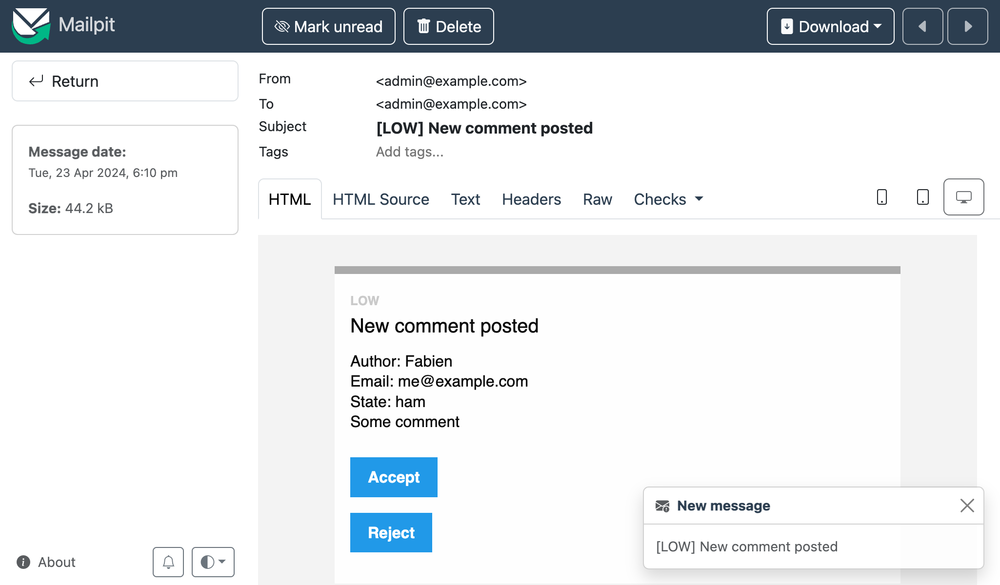

管理者へメールを送信する
====================================

.. index::
    single: Components;Mailer
    single: Mailer
    single: Emails

良いフィードバックをするために、管理者はすべてのコメントをモデレートする必要があります。コメントが ``ham`` か ``potential_spam`` の状態であったなら、 *メール* が管理者へ送られるようにします。そして、そのメールには、コメントを受理するか拒否するかの2つリンクを入れるようにします。

管理者のメールアドレスを設定する
------------------------------------------------

管理者のメールアドレスを格納するには、コンテナのパラメーターを使用します。デモとして（実際に使うべきではありません）、環境変数からセットすることも可能です:

.. code-block:: diff
    :caption: patch_file

    --- i/config/services.yaml
    +++ w/config/services.yaml
    @@ -5,6 +5,8 @@
     # https://symfony.com/doc/current/best_practices.html#use-parameters-for-application-configuration
     parameters:
         photo_dir: "%kernel.project_dir%/public/uploads/photos"
    +    default_admin_email: admin@example.com
    +    admin_email: "%env(string:default:default_admin_email:ADMIN_EMAIL)%"

     services:
         # default configuration for services in *this* file

環境変数が使用される前に "処理された"状態になるかもしれません。ここでは、``ADMIN_EMAIL`` の環境変数が存在しなければ、 ``デフォルト`` のプロセッサーを使用して ``default_admin_email`` パラメーターの値にフォールバックするようにします。

通知メールを送信する
------------------------------

メールを送信する際に、低レベルの ``Message`` や高レベルの ``NotificationEmail`` といった、いくつかの ``Email`` クラスのアブストラクションから選ぶことができます。ほとんどの場合、``Email`` クラスを使うことになりますが、 内部的なメールにおいては、 ``NotificationEmail`` が最適な選択肢になります。

メッセージハンドラー内の自動バリデーションのロジックを入れ替えましょう:

.. code-block:: diff
    :caption: patch_file

    --- i/src/MessageHandler/CommentMessageHandler.php
    +++ w/src/MessageHandler/CommentMessageHandler.php
    @@ -7,6 +7,9 @@ use App\Repository\CommentRepository;
     use App\SpamChecker;
     use Doctrine\ORM\EntityManagerInterface;
     use Psr\Log\LoggerInterface;
    +use Symfony\Bridge\Twig\Mime\NotificationEmail;
    +use Symfony\Component\DependencyInjection\Attribute\Autowire;
    +use Symfony\Component\Mailer\MailerInterface;
     use Symfony\Component\Messenger\Attribute\AsMessageHandler;
     use Symfony\Component\Messenger\MessageBusInterface;
     use Symfony\Component\Workflow\WorkflowInterface;
    @@ -20,6 +23,8 @@ class CommentMessageHandler
             private CommentRepository $commentRepository,
             private MessageBusInterface $bus,
             private WorkflowInterface $commentStateMachine,
    +        private MailerInterface $mailer,
    +        #[Autowire('%admin_email%')] private string $adminEmail,
             private ?LoggerInterface $logger = null,
         ) {
         }
    @@ -42,8 +47,13 @@ class CommentMessageHandler
                 $this->entityManager->flush();
                 $this->bus->dispatch($message);
             } elseif ($this->commentStateMachine->can($comment, 'publish') || $this->commentStateMachine->can($comment, 'publish_ham')) {
    -            $this->commentStateMachine->apply($comment, $this->commentStateMachine->can($comment, 'publish') ? 'publish' : 'publish_ham');
    -            $this->entityManager->flush();
    +            $this->mailer->send((new NotificationEmail())
    +                ->subject('New comment posted')
    +                ->htmlTemplate('emails/comment_notification.html.twig')
    +                ->from($this->adminEmail)
    +                ->to($this->adminEmail)
    +                ->context(['comment' => $comment])
    +            );
             } elseif ($this->logger) {
                 $this->logger->debug('Dropping comment message', ['comment' => $comment->getId(), 'state' => $comment->getState()]);
             }

``MainInterface()`` は、メール送信のエントリーポイントで、 ``send()`` メソッドを使用してメールを送ることができるようになっています。

メールを送信するには、 センダー（``From``/``Sender`` ヘッダー）が必要です。Email のインスタンスに明示的に設定するのではなく、グローバルに定義してください:

.. code-block:: diff
    :caption: patch_file

    --- i/config/packages/mailer.yaml
    +++ w/config/packages/mailer.yaml
    @@ -1,3 +1,5 @@
     framework:
         mailer:
             dsn: '%env(MAILER_DSN)%'
    +        envelope:
    +            sender: "%admin_email%"

通知メールのテンプレートを拡張する
---------------------------------------------------

.. index::
    single: Twig;extends
    single: Twig;block
    single: Twig;url

通知メールのテンプレートは、 Symfony をインストールした際のデフォルトの通知メールテンプレートを継承しています:

.. code-block:: html+twig
    :caption: templates/emails/comment_notification.html.twig

    

    
        Author: {{ comment.author }} 
        Email: {{ comment.email }} 
        State: {{ comment.state }} 

        

            {{ comment.text }}
        

    

    
        <spacer size="16"></spacer>
        <button href="{{ url('review_comment', { id: comment.id }) }}">Accept</button>
        <button href="{{ url('review_comment', { id: comment.id, reject: true }) }}">Reject</button>
    

テンプレートには、メールのメッセージをカスタマイズできるブロックがありますので、そこで管理者がコメントを受理するか拒否するかのリンクを追加しましょう。有効にしていないルートパラメーターは、クエリー文字列としてとして追加されます（例えば、拒否する URL は ``/admin/comment/review/42?reject=true`` のようになります）。

``NotificationEmail`` のデフォルトのテンプレートは、メールを装飾するのに HTML ではなく、 `Inky`_ を使用します。Inky は、ほとんどのメールクライアントに互換性のあるレスポンシブなメールを作ってくれます。

メールリーダーへの互換性のため、通知メールのベースのレイアウトは、デフォルトで全てのスタイルシートをインラインにします（CSSインライナーパッケージが使われます）。

これらの2つの機能は、Twig拡張のオプショナルな機能で、別にインストールする必要があります:

.. code-block:: terminal

    $ symfony composer req "twig/cssinliner-extra:^3" "twig/inky-extra:^3"

コマンド内で絶対 URL を生成する
--------------------------------------------

.. index::
    single: Twig;Link
    single: Link

メールにおいては、 ``path()`` の代わりに ``url()`` を使用して、スキームやホストなどの情報も入っている絶対 URL を生成してください。

コンソールのコンテキストで、メッセージハンドラーからメールが送られます。Web のコンテキストでは、現在のページのスキームやドメインがわかるので絶対 URL を生成するのは簡単ですが、コンソールのコンテストはそうはいきません。

ドメイン名とスキームを明示的に定義する

.. code-block:: diff
    :caption: patch_file

    --- i/config/services.yaml
    +++ w/config/services.yaml
    @@ -7,6 +7,8 @@ parameters:
         photo_dir: "%kernel.project_dir%/public/uploads/photos"
         default_admin_email: admin@example.com
         admin_email: "%env(string:default:default_admin_email:ADMIN_EMAIL)%"
    +    default_base_url: 'http://127.0.0.1'
    +    router.request_context.base_url: '%env(default:default_base_url:SYMFONY_DEFAULT_ROUTE_URL)%'

     services:
         # default configuration for services in *this* file

``SYMFONY_DEFAULT_ROUTE_URL`` の環境変数は、``symfony`` CLI では自動的にローカルに設定されます。また、Platform.sh の際は設定をベースに指定されます。

コントローラーへのルートをワイヤーする
---------------------------------------------------------

``review_comment`` ルートはまだ作成していないので、Admin Controller でハンドルするように作成しましょう:

.. code-block:: php
    :caption: src/Controller/AdminController.php

    namespace App\Controller;

    use App\Entity\Comment;
    use App\Message\CommentMessage;
    use Doctrine\ORM\EntityManagerInterface;
    use Symfony\Bundle\FrameworkBundle\Controller\AbstractController;
    use Symfony\Component\HttpFoundation\Request;
    use Symfony\Component\HttpFoundation\Response;
    use Symfony\Component\Messenger\MessageBusInterface;
    use Symfony\Component\Routing\Attribute\Route;
    use Symfony\Component\Workflow\WorkflowInterface;
    use Twig\Environment;

    class AdminController extends AbstractController
    {
        public function __construct(
            private Environment $twig,
            private EntityManagerInterface $entityManager,
            private MessageBusInterface $bus,
        ) {
        }

        #[Route('/admin/comment/review/{id}', name: 'review_comment')]
        public function reviewComment(Request $request, Comment $comment, WorkflowInterface $commentStateMachine): Response
        {
            $accepted = !$request->query->get('reject');

            if ($commentStateMachine->can($comment, 'publish')) {
                $transition = $accepted ? 'publish' : 'reject';
            } elseif ($commentStateMachine->can($comment, 'publish_ham')) {
                $transition = $accepted ? 'publish_ham' : 'reject_ham';
            } else {
                return new Response('Comment already reviewed or not in the right state.');
            }

            $commentStateMachine->apply($comment, $transition);
            $this->entityManager->flush();

            if ($accepted) {
                $this->bus->dispatch(new CommentMessage($comment->getId()));
            }

            return new Response($this->twig->render('admin/review.html.twig', [
                'transition' => $transition,
                'comment' => $comment,
            ]));
        }
    }

前のステップで定義したように、コメントをレビューする URL は ``/admin/`` から始まり、前のステップで定義したファイアーウォールで保護されます。管理者は、このリソースへアクセスするのに認証が必要です。

``Response`` インスタンスを作成するのではなく、ベースクラスの ``AbstractController`` にある ``render()`` メソッドを使用しました。

.. index::
    single: Twig;extends
    single: Twig;block

レビューが終わったら、簡単なテンプレートで管理者へ感謝しましょう:

.. code-block:: html+twig
    :caption: templates/admin/review.html.twig

    

    
        <h2>Comment reviewed, thank you!</h2>

        
Applied transition: <strong>{{ transition }}</strong>

        
New state: <strong>{{ comment.state }}</strong>

    

メールキャッチャーを使用する
------------------------------------------

.. index::
    single: Docker;Mail Catcher

"本当の" SMTP やメール送信のサードパーティプロバイダーを使用するのではなく、メールキャッチャーを使ってみましょう。メールキャッチャーは、メールを実際に送信しない SMTP サーバーです。そして、Web インターフェースでそのメールの内容を確認することができます。幸運にも、Symfonyには既にメールキャッチャーが自動的に設定されています:

.. code-block:: yaml
    :caption: compose.override.yaml
    :class: ignore

    ###> symfony/mailer ###
    mailer:
        image: axllent/mailpit
        ports:
        - "1025"
        - "8025"
        environment:
        MP_SMTP_AUTH_ACCEPT_ANY: 1
        MP_SMTP_AUTH_ALLOW_INSECURE: 1
    ###< symfony/mailer ###

Webメールへアクセスする
---------------------------------

.. index::
    single: Symfony CLI;open:local:webmail

ターミナルから Web メールを開くことが可能です:

.. code-block:: terminal
    :class: ignore

    $ symfony open:local:webmail

Webデバッグツールバーからも可能です:

.. figure:: screenshots/webmail-wdt.png
    :alt: /
    :align: center
    :figclass: with-browser

コメントを投稿すると、Webメールのインターフェースで、メールを受け取るはずです:

Webメールのインターフェースからメールのタイトルをクリックして、コメントを受理もしくは拒否してみましょう:

.. figure:: screenshots/webmail-rejected.png
    :alt: /
    :align: center
    :figclass: with-browser

期待どおりに動作しない場合は、``server:log`` でログをチェックしてください。

長時間実行するスクリプトを管理する
---------------------------------------------------

長時間実行されるスクリプトには気をつけるべきです。HTTP で使われる PHP のモデルではリクエストはクリーンな状態から開始されますが、メッセージの取得実行は、バックグラウンドで継続的に実行されます。メッセージを処理する度に、メモリキャッシュを含む現在の状態の影響を受けます。Doctrine の問題を避けるために、エンティティマネージャーは、メッセージのハンドリングの後に自動的にクリアされます。あなたの実装するサービスが同じようにクリアすべきか否かを確認してください。

非同期にメールを送信する
------------------------------------

メッセージハンドラーに送られたメールの送信は時間がかかることもあります。また、例外が投げられるかもしれません。メッセージを処理しているときに例外が投げられたときには、リトライを行います。 しかし、コメントメッセージの取得実行をリトライするのではなく、メールの送信のみをリトライした方がより良いです。

すでにこのやり方は知っているはずです。メッセージバスにメール・メッセージを送信してください。

``MailerInterface`` のインスタンスは、次の処理を行います。メッセージバスが定義されていたら、メールを送るのではなく、メール・メッセージをディスパッチします。コードを修正する必要はありません。

デフォルトのメッセンジャー設定により、バスは既にメールを非同期で送っています:

.. code-block:: yaml
    :caption: config/packages/messenger.yaml
    :emphasize-lines: 4
    :class: ignore

    framework:
        messenger:
            routing:
                Symfony\Component\Mailer\Messenger\SendEmailMessage: async
                Symfony\Component\Notifier\Message\ChatMessage: async
                Symfony\Component\Notifier\Message\SmsMessage: async

                # Route your messages to the transports
                App\Message\CommentMessage: async

コメント・メッセージとメール・メッセージの両方で同じトランスポートを使用していますが、異なるようにすることも可能です。たとえば、メッセージの優先度を管理するために別のトランスポートを使うことも可能です。別のトランスポートを使用すると、異なるワーカーマシンでメッセージを処理することも可能になり、とても柔軟です。

メールをテストする
---------------------------

メールをテストするには複数の方法があります。

各メール毎のクラスを作成するのであれば、ユニットテストを書くことが可能です(``Email``, ``TemplateEmail`` を拡張することで)。

ここで書くテストのほとんどは、アクションがメールをトリガーするかをチェックしたり、メールの内容の確認の機能テストになります。

Symfony はこういったテストを簡単にするアサーションがビルトインされています。下記はアサーション機能の使い方を示すサンプルのテストです:

.. code-block:: php
    :class: ignore

    public function testMailerAssertions()
    {
        $client = static::createClient();
        $client->request('GET', '/');

        $this->assertEmailCount(1);
        $event = $this->getMailerEvent(0);
        $this->assertEmailIsQueued($event);

        $email = $this->getMailerMessage(0);
        $this->assertEmailHeaderSame($email, 'To', 'fabien@example.com');
        $this->assertEmailTextBodyContains($email, 'Bar');
        $this->assertEmailAttachmentCount($email, 1);
    }

同期、非同期関係なく、メール送信時のアサーションは動作します。

Platform.sh でメールを送信する
---------------------------------------

.. index::
    single: Platform.sh;Emails
    single: Platform.sh;Mailer
    single: Platform.sh;SMTP
    single: Emails

Platform.sh では、特別な設定は必要ありません。全てのアカウントは、SendGrid のアカウントが付いてくるので、メール送信の際には、自動的にそのアカウントが使用されます。

.. index::
    single: Symfony CLI;cloud:env:info

.. note::

    安全のために、デフォルトでは、メールは ``master`` ブランチのみで送られます。 ``master`` ブランチ以外で送るには SMTP を明示的に有効化してください:

    .. code-block:: terminal

        $ symfony cloud:env:info enable_smtp on

.. sidebar:: より深く学ぶために

    * `SymfonyCasts メーラーのチュートリアル`_;

    * `Inky テンプレート言語のドキュメント`_;

    * `環境変数プロセッサー`_;

    * `Symfony のメーラーのドキュメント`_;

    * `Platform.sh でのメールに関するドキュメント`_.

.. _`Inky`: https://get.foundation/emails/docs/inky.html
.. _`SymfonyCasts メーラーのチュートリアル`: https://symfonycasts.com/screencast/mailer
.. _`Inky テンプレート言語のドキュメント`: https://get.foundation/emails/docs/inky.html
.. _`環境変数プロセッサー`: https://symfony.com/doc/current/configuration/env_var_processors.html
.. _`Symfony のメーラーのドキュメント`: https://symfony.com/doc/current/mailer.html
.. _`Platform.sh でのメールに関するドキュメント`: https://symfony.com/doc/current/cloud/services/emails.html
