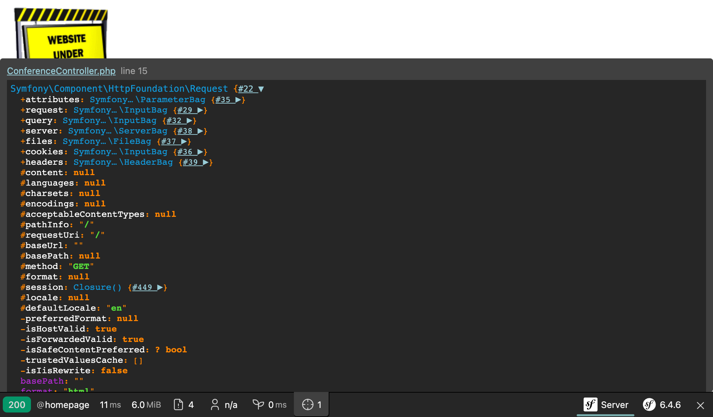

コントローラーを作成する
====================================

.. index::
    single: Controller
    single: Routing;Route

ちょっとごまかしがありますが、私たちのゲストブックのプロジェクトは、本番サーバーで実際に動くようになりました。まだプロジェクトはページが一つもありません。ホームページは 404 エラーページとなっていますので、直してみましょう。

ホームページへ(``http://localhost:8000/``)のような、HTTP リクエストが来ると、 Symfony は *リクエストされたパス* (ここでは ``/``) にマッチする *ルート* を探そうとします。 *ルート* は、リクエストのパスと対応する HTTP *レスポンス* を作成する関数の *PHP の実行可能コード* をリンクします。

これらの実行可能なコードを "コントローラー" と呼びます。 Symfony では、ほとんどのコントローラーは PHP のクラスで実装します。クラスは手動で作成することが可能ですが、もっと早くするため Symfony がやってくれることを見てみましょう。

Maker Bundle で楽をする
----------------------------

.. index::
    single: Components;Maker Bundle
    single: Maker Bundle

少ない努力でコントローラーを生成するのに ``symfony/maker-bundle`` パッケージを使用することができます。このパッケージは既に ``webapp`` パッケージの一部としてインストール済です。

Maker Bundle はたくさんのクラスを生成してくれます。この書籍では、常に使うことになります。各 "ジェネレーター" は、コマンドに定義されており、全てのコマンドは、 ``make`` コマンドのネームスペースにあります。

.. index::
    single: Command;list

Symfony Console の ``list`` コマンドは、指定のネームスペース以下の全てのコマンドを一覧で表示します; Maker Bundle で使用可能なすべてのジェネレーターを調べてみてください:

.. code-block:: terminal
    :class: ignore

    $ symfony console list make

設定のフォーマットを選ぶ
------------------------------------

プロジェクトの最初のコントローラーを作成する前に、使用したい設定のフォーマットを決める必要があります。Symfony は YAML, XML, PHP,  PHPアトリビュート を最初からサポートしています。

*関連するパッケージの設定* では、 *YAML* がベストな選択です。*YAML* フォーマットは、 ``config/`` ディレクトリ内で使用されています。多くの場合、新しいパッケージをインストールすると、パッケージのレシピは ``.yaml`` という拡張子の新規ファイルをこのディレクトリに追加します。

*PHP コードに関連する設定* では、コードに隣接して定義することができる *アトリビュート* がベターな選択です。例で説明しましょう。リクエストが来ると、設定は Symfony にどのリクエストパスがどのコントローラー（PHPクラス）によって処理するか伝える必要があります。YAML や XML や PHP フォーマットでは、2つのファイルを必要とします（設定ファイルと PHP のコントローラーファイル）。アトリビュートを使用すれば、設定はコントローラークラスで直接設定可能です。

インストールする必要のあるパッケージ名をどうやって判断するか疑問に思ったかもしれません。ほとんどの場合、知る必要はありません。Symfony はエラーメッセージ中にインストールが必要なパッケージを表示しています。 ``messenger`` パッケージのない状態で ``symfony console make:message`` コマンドを実行すると、正しいパッケージをインストールするヒントを含んだ例外を見ることができます。

コントローラーを生成する
------------------------------------

.. index::
    single: Command;make:controller

``make:controller`` コマンドで最初の *コントローラー* を作成しましょう:

.. code-block:: terminal

    $ symfony console make:controller ConferenceController

.. index::
    single: Components;Routing
    single: Attributes;Route

このコマンドは ``src/Controller`` ディレクトリ以下に ``ConferenceController`` クラスを作成します。生成されたクラスはちゃんと動くようなボイラープレートが既に入っています:

.. code-block:: php
    :caption: src/Controller/ConferenceController.php
    :class: ignore
    :emphasize-lines: 9

    namespace App\Controller;

    use Symfony\Bundle\FrameworkBundle\Controller\AbstractController;
    use Symfony\Component\HttpFoundation\Response;
    use Symfony\Component\Routing\Attribute\Route;

    class ConferenceController extends AbstractController
    {
        #[Route('/conference', name: 'app_conference')]
        public function index(): Response
        {
            return $this->render('conference/index.html.twig', [
                'controller_name' => 'ConferenceController',
            ]);
        }
    }

``#[Route('/conference', name: 'app_conference')]`` アトリビュートが、 ``ConferenceController`` の ``index()`` メソッドをコントローラにしています（設定は、コードに隣接しています）。

``/conference`` をブラウザで開くと、このコントローラが実行され、レスポンスが返されます。

ホームページにマッチするようにルートを微調整します:

.. code-block:: diff
    :caption: patch_file
    :emphasize-lines: 7

    --- a/src/Controller/ConferenceController.php
    +++ b/src/Controller/ConferenceController.php
    @@ -8,7 +8,7 @@ use Symfony\Component\Routing\Attribute\Route;

     class ConferenceController extends AbstractController
     {
    -    #[Route('/conference', name: 'app_conference')]
    +    #[Route('/', name: 'homepage')]
         public function index(): Response
         {
             return $this->render('conference/index.html.twig', [

コード内でホームページを参照したいときは、ルートの ``名前`` が便利です。 ``/`` パスをハードコードせずに、 ルート名を使いましょう。

デフォルトで表示されるページの代わりに、シンプルな HTML のページを返すようにしましょう:

.. code-block:: diff
    :caption: patch_file
    :emphasize-lines: 18

    --- a/src/Controller/ConferenceController.php
    +++ b/src/Controller/ConferenceController.php
    @@ -11,8 +11,13 @@ class ConferenceController extends AbstractController
         #[Route('/', name: 'homepage')]
         public function index(): Response
         {
    -        return $this->render('conference/index.html.twig', [
    -            'controller_name' => 'ConferenceController',
    -        ]);
    +        return new Response(<<<EOF
    +            <html>
    +                <body>
    +                    
    +                </body>
    +            </html>
    +            EOF
    +        );
         }
     }

ブラウザを更新します:

コントローラーの主な責務は、リクエストに対応する HTTP ``レスポンス`` を返すことです。

この章の残りの部分は保存しないコードについて書いていますので、変更はこの時点でコミットしてしまいましょう:

.. code-block:: terminal
    :class: ignore

    $ git add .
    $ git commit -m'Add the index controller'

.. _easter-egg:

イースターエッグを追加します
------------------------------------------

どうやってリクエストの情報からレスポンスが作られるかを見るために、 小さな `Easter egg`_ を追加してみましょう。ホームページに ``?hello=Fabien`` のようなクエリー文字列が含まれていたら、挨拶ができるようにしてみましょう:

.. code-block:: diff
    :emphasize-lines: 18

    --- a/src/Controller/ConferenceController.php
    +++ b/src/Controller/ConferenceController.php
    @@ -3,17 +3,24 @@
     namespace App\Controller;

     use Symfony\Bundle\FrameworkBundle\Controller\AbstractController;
    +use Symfony\Component\HttpFoundation\Request;
     use Symfony\Component\HttpFoundation\Response;
     use Symfony\Component\Routing\Attribute\Route;

     class ConferenceController extends AbstractController
     {
         #[Route('/', name: 'homepage')]
    -    public function index(): Response
    +    public function index(Request $request): Response
         {
    +        $greet = '';
    +        if ($name = $request->query->get('hello')) {
    +            $greet = sprintf('<h1>Hello %s!</h1>', htmlspecialchars($name));
    +        }
    +
             return new Response(<<<EOF
                 <html>
                     <body>
    +                    $greet
                         
                     </body>
                 </html>

Symfony は ``Request`` オブジェクトを通してリクエストされたデータを取得することができます。Symfony は、コントローラーの引数にこの型宣言があると、自動的に渡すことができます。 クエリー文字列にある ``name`` の値を取得して ``<h1>`` のタイトルに追加することができます。

ブラウザで、``/`` へアクセスして、それから ``/?hello=Fabien`` へ変えて、違いを見てみてください。

.. note::

    XSS の問題を避けるために ``htmlspecialchars()`` が呼ばれているのに気づきましたか。適切なテンプレートエンジンへスイッチすると、自動的にサニタイズされます。

また、URL の一部の name を指定することができます:

.. code-block:: diff

    --- a/src/Controller/ConferenceController.php
    +++ b/src/Controller/ConferenceController.php
    @@ -9,11 +9,11 @@ use Symfony\Component\Routing\Attribute\Route;

     class ConferenceController extends AbstractController
     {
    -    #[Route('/', name: 'homepage')]
    -    public function index(Request $request): Response
    +    #[Route('/hello/{name}', name: 'homepage')]
    +    public function index(string $name = ''): Response
         {
             $greet = '';
    -        if ($name = $request->query->get('hello')) {
    +        if ($name) {
                 $greet = sprintf('<h1>Hello %s!</h1>', htmlspecialchars($name));
             }

ルーティングの　``{name}`` の部分は、 ダイナミックな *ルートパラメーター* です。ワイルドーカードのようなものです。これでブラウザで ``/hello`` と開いてから ``hello/Fabien`` と変えても同じ結果が出すことができます。コントローラーに *name* と同じ引数（``$name``）を指定することで、 ``{name}`` パラメーターの *値* を取得することができます。

たったいま変更した部分をもとに戻します:

.. code-block:: terminal

    $ git checkout src/Controller/ConferenceController.php

.. code-block:: terminal
    :class: hide

    $ git reset HEAD src/Controller/ConferenceController.php
    $ git checkout src/Controller/ConferenceController.php

デバッグ中の変数
------------------------

.. index::
    single: Components;VarDumper
    single: VarDumper
    single: dump

偉大なデバッグツールとしてSymfonyの ``dump()`` 関数があります。この関数はいつでも利用可能で、複雑な変数を見やすくてインタラクティブな形式で確認することができます。

リクエストオブジェクトをダンプするために ``src/Controller/ConferenceController.php`` を一時的に変更します:

.. code-block:: diff
    :emphasize-lines: 17

    --- a/src/Controller/ConferenceController.php
    +++ b/src/Controller/ConferenceController.php
    @@ -3,14 +3,17 @@
     namespace App\Controller;

     use Symfony\Bundle\FrameworkBundle\Controller\AbstractController;
    +use Symfony\Component\HttpFoundation\Request;
     use Symfony\Component\HttpFoundation\Response;
     use Symfony\Component\Routing\Attribute\Route;

     class ConferenceController extends AbstractController
     {
         #[Route('/', name: 'homepage')]
    -    public function index(): Response
    +    public function index(Request $request): Response
         {
    +        dump($request);
    +
             return new Response(<<<EOF
                 <html>
                     <body>

ページを再読み込みしたら、"target" アイコンがツールバーに表示されていて、ダンプを確認することができます。クリックしてアクセスすると、シンプルになったナビゲーションを確認できます:

.. index::
    single: Git;checkout

たったいま変更した部分をもとに戻します:

.. code-block:: terminal

    $ git checkout src/Controller/ConferenceController.php

.. code-block:: terminal
    :class: hide

    $ git reset HEAD src/Controller/ConferenceController.php
    $ git checkout src/Controller/ConferenceController.php

.. sidebar:: より深く学ぶために

    * Symfony の `ルーティング`_ システム;

    * `SymfonyCasts: ルート、コントローラーとページのチュートリアル`_;

    * `PHP アトリビュート`_;

    * `HttpFoundation`_ コンポーネント;

    * `XSS (クロスサイトスクリプティング)`_ セキュリティ攻撃;

    * The `Symfony Routing Cheat Sheet`_.

.. _`Easter egg`: https://en.wikipedia.org/wiki/Easter_egg_(media)#In_computing
.. _`ルーティング`: https://symfony.com/doc/current/routing.html
.. _`SymfonyCasts: ルート、コントローラーとページのチュートリアル`: https://symfonycasts.com/screencast/symfony/route-controller
.. _`PHP アトリビュート`: https://www.php.net/attributes
.. _`HttpFoundation`: https://symfony.com/doc/current/components/http_foundation.html
.. _`XSS (クロスサイトスクリプティング)`: https://owasp.org/www-community/attacks/xss/
.. _`Symfony Routing Cheat Sheet`: https://github.com/andreia/symfony-cheat-sheets/blob/master/Symfony4/routing_en_part1.pdf
