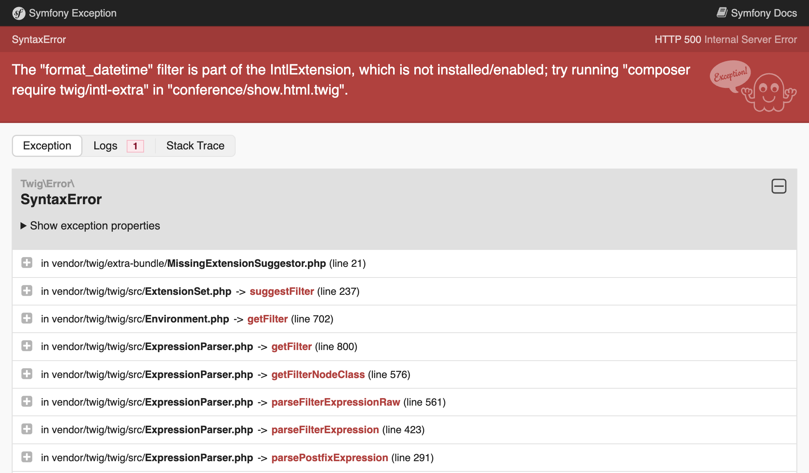
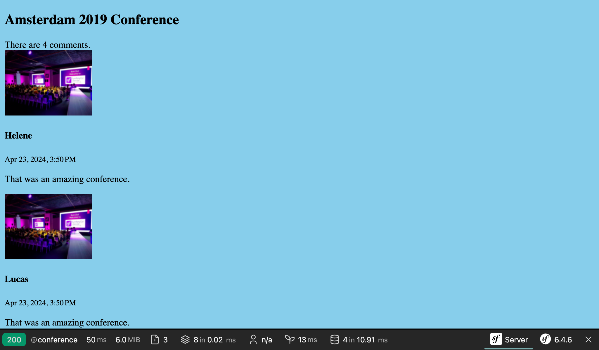

Создание пользовательского интерфейса
========================================================================

.. index::
    single: Twig
    single: Templates

Теперь всё готово для создания первой версии пользовательского интерфейса сайта. Пока мы не будем акцентировать внимание на красивом внешнем виде, а лишь сделаем его просто функциональным.

Помните экранирование, которое нам пришлось добавить в контроллере для пасхального яйца, чтобы избежать проблем с безопасностью? По этой причине мы не будем использовать PHP в наших шаблонах. Вместо него мы воспользуемся Twig. Помимо экранирования вывода, `Twig`_ предоставляет много полезных возможностей, которые мы будем использовать (например, наследование шаблонов).

Использование Twig для шаблонов
-------------------------------------------------------

.. index::
    single: Twig;Layout
    single: Twig;block

Все страницы сайта будут использовать один и тот же *макет*. При установке Twig автоматически была создана директория ``templates/``, вместе с примером макета в файле ``base.html.twig``.

.. code-block:: html+twig
    :caption: templates/base.html.twig
    :class: ignore

    <!DOCTYPE html>
    <html>
        <head>
            <meta charset="UTF-8">
            <title>Welcome!</title>
            <link rel="icon" href="data:image/svg+xml,<svg xmlns=%22http://www.w3.org/2000/svg%22 viewBox=%220 0 128 128%22><text y=%221.2em%22 font-size=%2296%22>⚫️</text></svg>">
            {# Run `composer require symfony/webpack-encore-bundle` to start using Symfony UX #}
            
                {{ encore_entry_link_tags('app') }}
            

            
                {{ encore_entry_script_tags('app') }}
            
        </head>
        <body>
            
        </body>
    </html>

Макет может определять элементы ``block`` — специальные области, в которые *дочерние шаблоны*, *расширяющие* макет, будут подставлять своё содержимое.

.. index::
    single: Twig;extends
    single: Twig;for

Создадим шаблон для домашней страницы проекта в файле ``templates/conference/index.html.twig``:

.. code-block:: html+twig
    :caption: templates/conference/index.html.twig

    

    Conference Guestbook

    
        <h2>Give your feedback!</h2>

        
            <h4>{{ conference }}</h4>
        
    

Шаблон *наследует* ``base.html.twig`` и переопределяет блоки  ``title`` и ``body``.

.. index::
    single: Twig;Syntax

Разделитель ```` в шаблоне указывает на *действия* и *структуру* .

Разделитель ``{{ }}`` используется для *отображения* чего-либо. Например, ``{{ conference }}`` выведет строковое представление конференции (результат вызова метода ``__toString`` в объекте ``Conference``).

Использование Twig в контроллере
---------------------------------------------------------

Обновите контроллер, чтобы отрисовать шаблон Twig:

.. code-block:: diff
    :caption: patch_file

    --- a/src/Controller/ConferenceController.php
    +++ b/src/Controller/ConferenceController.php
    @@ -2,22 +2,19 @@

     namespace App\Controller;

    +use App\Repository\ConferenceRepository;
     use Symfony\Bundle\FrameworkBundle\Controller\AbstractController;
     use Symfony\Component\HttpFoundation\Response;
     use Symfony\Component\Routing\Attribute\Route;
    +use Twig\Environment;

     class ConferenceController extends AbstractController
     {
         #[Route('/', name: 'homepage')]
    -    public function index(): Response
    +    public function index(Environment $twig, ConferenceRepository $conferenceRepository): Response
         {
    -        return new Response(<<<EOF
    -            <html>
    -                <body>
    -                    
    -                </body>
    -            </html>
    -            EOF
    -        );
    +        return new Response($twig->render('conference/index.html.twig', [
    +            'conferences' => $conferenceRepository->findAll(),
    +        ]));
         }
     }

Здесь много всего интересного.

Для отрисовки шаблона, нам необходим объект Twig — ``Environment`` (главная точка входа Twig). Обратите внимание, для того чтобы получить экземпляр Twig, достаточно всего лишь указать его тип (так называемый type-hint) в аргументах метода контроллера. Гибкость Symfony позволяет автоматически внедрить зависимость нужного типа.

Нам также нужен репозиторий для конференций, чтобы получить все конференции из базы данных.

Метод ``render()`` в коде контроллера передаёт массив переменных в шаблон и отрисовывает его. В нашем примере мы передаём список объектов ``Conference`` в переменной ``conferences``.

Контроллер — это обычный PHP-класс. Чтобы использовать зависимости совершенно необязательно наследовать класс ``AbstractController``. Вы можете удалить его (но всё же не делайте этого, так как в следующих шагах мы будем использовать некоторые его методы для упрощения).

Создание страницы для конференции
---------------------------------------------------------------

У каждой конференции должна быть собственная страница с комментариями. Добавление новой страницы включает в себя создание контроллера, определение маршрута (route) и создание соответствующего шаблона.

Добавьте метод ``show()`` в контроллер ``src/Controller/ConferenceController.php``:

.. code-block:: diff
    :caption: patch_file

    --- a/src/Controller/ConferenceController.php
    +++ b/src/Controller/ConferenceController.php
    @@ -2,6 +2,8 @@

     namespace App\Controller;

    +use App\Entity\Conference;
    +use App\Repository\CommentRepository;
     use App\Repository\ConferenceRepository;
     use Symfony\Bundle\FrameworkBundle\Controller\AbstractController;
     use Symfony\Component\HttpFoundation\Response;
    @@ -17,4 +19,13 @@ class ConferenceController extends AbstractController
                 'conferences' => $conferenceRepository->findAll(),
             ]));
         }
    +
    +    #[Route('/conference/{id}', name: 'conference')]
    +    public function show(Environment $twig, Conference $conference, CommentRepository $commentRepository): Response
    +    {
    +        return new Response($twig->render('conference/show.html.twig', [
    +            'conference' => $conference,
    +            'comments' => $commentRepository->findBy(['conference' => $conference], ['createdAt' => 'DESC']),
    +        ]));
    +    }
     }

Данный метод работает несколько иначе, чем остальные, которые мы встречали ранее. Мы указываем, что экземпляр ``Conference`` должен быть внедрён в метод. Однако в базе данных могут быть несколько конференций и Symfony может определить, какую из них вы хотите получить по идентификатору ``{id}``, переданному в строке запроса (``id`` — это первичный ключ в таблице ``conference`` базы данных).

Получить комментарии конкретной конференции можно с помощью метода ``findBy()``, который в качестве первого аргумента принимает критерий (criteria), то есть условие, по которому нужно получить интересующие нас данные.

.. index::
    single: Twig;extends
    single: Twig;block
    single: Twig;for
    single: Twig;if
    single: Twig;else
    single: Twig;asset
    single: Twig;format_datetime
    single: Twig;length

Последним шагом будет создание файла ``templates/conference/show.html.twig``:

.. code-block:: html+twig
    :caption: templates/conference/show.html.twig

    

    Conference Guestbook - {{ conference }}

    
        <h2>{{ conference }} Conference</h2>

        
            
                
                    
                

                <h4>{{ comment.author }}</h4>
                <small>
                    {{ comment.createdAt|format_datetime('medium', 'short') }}
                </small>

                
{{ comment.text }}

            
        
            
No comments have been posted yet for this conference.

        
    

Для вызова *фильтров* Twig в шаблоне используется разделитель ``|``, который изменяет значение исходной переменной. Например, ``comments|length`` отображает количество комментариев, а ``comment.createdAt|format_datetime('medium', 'short')`` форматирует дату в понятное для чтения представление.

Попробуйте посетить страницу "первой" конференции по пути ``/conference/1`` и обратите внимание на следующую ошибку:

Эта ошибка из-за использования фильтра ``format_datetime``, которого нет в ядре Twig. Подобное сообщение об ошибке подскажет вам, какой пакет должен быть установлен для исправления проблемы:

.. code-block:: terminal

    $ symfony composer req "twig/intl-extra:^3"

Теперь страница работает правильно.

Перелинковка страниц
---------------------------------------

.. index::
    single: Twig;Link
    single: Link

Остался последний шаг, чтобы закончить первую версию интерфейса — создать ссылки на страницы конференций с главной страницы:

.. code-block:: diff
    :caption: patch_file

    --- a/templates/conference/index.html.twig
    +++ b/templates/conference/index.html.twig
    @@ -7,5 +7,8 @@

         
             <h4>{{ conference }}</h4>
    +        

    +            <a href="/conference/{{ conference.id }}">View</a>
    +        

         
     

Но жёстко заданный путь — плохая идея по ряду причин. Самая главная из них состоит в том, что если вы измените путь (например, с ``/conference/{id}`` на ``/conferences/{id}``), потребуется также изменить и все ссылки вручную.

.. index::
    single: Twig;path

Вместо этого используйте *Twig-функцию* ``path()`` и укажите *название маршрута*:

.. code-block:: diff
    :caption: patch_file

    --- a/templates/conference/index.html.twig
    +++ b/templates/conference/index.html.twig
    @@ -8,7 +8,7 @@
         
             <h4>{{ conference }}</h4>
             

    -            <a href="/conference/{{ conference.id }}">View</a>
    +            <a href="{{ path('conference', { id: conference.id }) }}">View</a>
             

         
     

Функция ``path()`` генерирует путь к странице, исходя из названия переданного маршрута. Значения параметров маршрута передаются в виде массива.

Постраничный вывод комментариев
------------------------------------------------------------

.. index::
    single: Doctrine;Paginator
    single: Paginator

При тысячах посетителей мы получим довольно много комментариев. Если мы будем отображать все комментарии на одной странице, она станет слишком большой.

В репозитории комментариев создайте метод ``getCommentPaginator()``, который будет возвращать объект *Paginator*, в зависимости от конференции и смещении (начальной позиции):

.. code-block:: diff
    :caption: patch_file

    --- a/src/Repository/CommentRepository.php
    +++ b/src/Repository/CommentRepository.php
    @@ -3,8 +3,10 @@
     namespace App\Repository;

     use App\Entity\Comment;
    +use App\Entity\Conference;
     use Doctrine\Bundle\DoctrineBundle\Repository\ServiceEntityRepository;
     use Doctrine\Persistence\ManagerRegistry;
    +use Doctrine\ORM\Tools\Pagination\Paginator;

     /**
      * @extends ServiceEntityRepository<Comment>
    @@ -16,11 +18,27 @@ use Doctrine\Persistence\ManagerRegistry;
      */
     class CommentRepository extends ServiceEntityRepository
     {
    +    public const COMMENTS_PER_PAGE = 2;
    +
         public function __construct(ManagerRegistry $registry)
         {
             parent::__construct($registry, Comment::class);
         }

    +    public function getCommentPaginator(Conference $conference, int $offset): Paginator
    +    {
    +        $query = $this->createQueryBuilder('c')
    +            ->andWhere('c.conference = :conference')
    +            ->setParameter('conference', $conference)
    +            ->orderBy('c.createdAt', 'DESC')
    +            ->setMaxResults(self::COMMENTS_PER_PAGE)
    +            ->setFirstResult($offset)
    +            ->getQuery()
    +        ;
    +
    +        return new Paginator($query);
    +    }
    +
         //    /**
         //     * @return Comment[] Returns an array of Comment objects
         //     */

Для облегчения тестирования показываем не более 2 комментариев на каждой странице.

Чтобы управлять постраничной навигацией в шаблоне Twig, передайте объект Doctrine Paginator вместо Doctrine Collection:

.. code-block:: diff
    :caption: patch_file

    --- a/src/Controller/ConferenceController.php
    +++ b/src/Controller/ConferenceController.php
    @@ -6,6 +6,7 @@ use App\Entity\Conference;
     use App\Repository\CommentRepository;
     use App\Repository\ConferenceRepository;
     use Symfony\Bundle\FrameworkBundle\Controller\AbstractController;
    +use Symfony\Component\HttpFoundation\Request;
     use Symfony\Component\HttpFoundation\Response;
     use Symfony\Component\Routing\Attribute\Route;
     use Twig\Environment;
    @@ -21,11 +22,16 @@ class ConferenceController extends AbstractController
         }

         #[Route('/conference/{id}', name: 'conference')]
    -    public function show(Environment $twig, Conference $conference, CommentRepository $commentRepository): Response
    +    public function show(Request $request, Environment $twig, Conference $conference, CommentRepository $commentRepository): Response
         {
    +        $offset = max(0, $request->query->getInt('offset', 0));
    +        $paginator = $commentRepository->getCommentPaginator($conference, $offset);
    +
             return new Response($twig->render('conference/show.html.twig', [
                 'conference' => $conference,
    -            'comments' => $commentRepository->findBy(['conference' => $conference], ['createdAt' => 'DESC']),
    +            'comments' => $paginator,
    +            'previous' => $offset - CommentRepository::COMMENTS_PER_PAGE,
    +            'next' => min(count($paginator), $offset + CommentRepository::COMMENTS_PER_PAGE),
             ]));
         }
     }

Контроллер получает параметр ``offset`` из строки запроса (``$request->query``) в виде целого числа (``getInt()``), который по умолчанию равен 0, если он отсутствует.

Вычисления смещения ``previous`` и ``next`` производятся на основе информации из объекта Paginator.

.. index::
    single: Twig;if

Наконец, обновите шаблон, чтобы добавить ссылки на следующую и предыдущую страницы:

.. code-block:: diff
    :caption: patch_file

    --- a/templates/conference/show.html.twig
    +++ b/templates/conference/show.html.twig
    @@ -6,6 +6,8 @@
         <h2>{{ conference }} Conference</h2>

         
    +        
There are {{ comments|length }} comments.

    +
             
                 
                     
    @@ -18,6 +20,13 @@

                 
{{ comment.text }}

             
    +
    +        
    +            <a href="{{ path('conference', { id: conference.id, offset: previous }) }}">Previous</a>
    +        
    +        
    +            <a href="{{ path('conference', { id: conference.id, offset: next }) }}">Next</a>
    +        
         
             
No comments have been posted yet for this conference.

         

Теперь вы сможете перемещаться по комментариям с помощью ссылок "Previous" и "Next":

Рефакторинг контроллера
---------------------------------------------

Вероятно, вы заметили, что оба метода в контроллере ``ConferenceController`` используют окружение Twig в качестве аргумента. Однако вместо того чтобы внедрять эту зависимость в каждый метод, мы будем использовать вспомогательный метод ``render()`` из родительского класса:

.. code-block:: diff
    :caption: patch_file

    --- a/src/Controller/ConferenceController.php
    +++ b/src/Controller/ConferenceController.php
    @@ -9,29 +9,28 @@ use Symfony\Bundle\FrameworkBundle\Controller\AbstractController;
     use Symfony\Component\HttpFoundation\Request;
     use Symfony\Component\HttpFoundation\Response;
     use Symfony\Component\Routing\Attribute\Route;
    -use Twig\Environment;

     class ConferenceController extends AbstractController
     {
         #[Route('/', name: 'homepage')]
    -    public function index(Environment $twig, ConferenceRepository $conferenceRepository): Response
    +    public function index(ConferenceRepository $conferenceRepository): Response
         {
    -        return new Response($twig->render('conference/index.html.twig', [
    +        return $this->render('conference/index.html.twig', [
                 'conferences' => $conferenceRepository->findAll(),
    -        ]));
    +        ]);
         }

         #[Route('/conference/{id}', name: 'conference')]
    -    public function show(Request $request, Environment $twig, Conference $conference, CommentRepository $commentRepository): Response
    +    public function show(Request $request, Conference $conference, CommentRepository $commentRepository): Response
         {
             $offset = max(0, $request->query->getInt('offset', 0));
             $paginator = $commentRepository->getCommentPaginator($conference, $offset);

    -        return new Response($twig->render('conference/show.html.twig', [
    +        return $this->render('conference/show.html.twig', [
                 'conference' => $conference,
                 'comments' => $paginator,
                 'previous' => $offset - CommentRepository::COMMENTS_PER_PAGE,
                 'next' => min(count($paginator), $offset + CommentRepository::COMMENTS_PER_PAGE),
    -        ]));
    +        ]);
         }
     }

.. sidebar:: Двигаемся дальше

    * `Документация по Twig`_;

    * `Создание и использование шаблонов`_ в Symfony-приложениях;

    * `Учебный видеоролик по Twig на SymfonyCasts`_;

    * `Функции и фильтры Twig доступные только в Symfony`_;

    * `Базовый контроллер AbstractController`_.

.. _`Twig`: https://twig.symfony.com/
.. _`Документация по Twig`: https://twig.symfony.com/doc/3.x/
.. _`Создание и использование шаблонов`: https://symfony.com/doc/current/templates.html
.. _`Учебный видеоролик по Twig на SymfonyCasts`: https://symfonycasts.com/screencast/symfony/twig-recipe
.. _`Функции и фильтры Twig доступные только в Symfony`: https://symfony.com/doc/current/reference/twig_reference.html
.. _`Базовый контроллер AbstractController`: https://symfony.com/doc/current/controller.html#the-base-controller-classes-services
