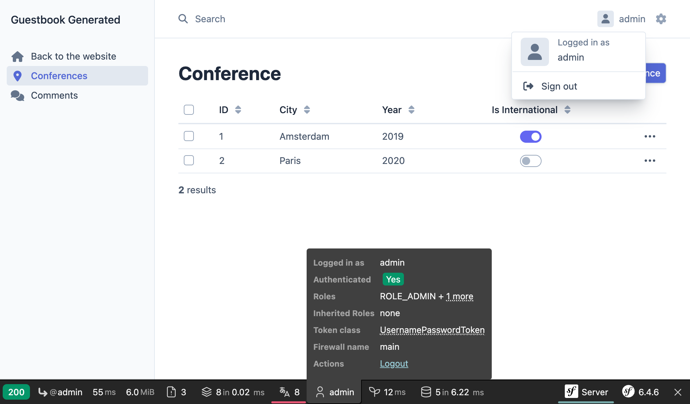

Защита административной панели
==========================================================

.. index::
    single: Components;Security
    single: Security

Административная панель должна быть доступна только доверенным лицам. Защитить её можно с помощью компонента Symfony Security.

Определение сущности пользователя
----------------------------------------------------------------

Несмотря на то, что посетители не смогут создавать учётные записи на сайте самостоятельно, мы создадим полнофункциональную систему аутентификации для администратора. Поэтому у нас будет только один пользователь — администратор сайта.

На первом шаге давайте определим сущность ``User``. Чтобы избежать возможной путаницы, назовём её ``Admin``.

Для интеграции сущности ``Admin`` с системой аутентификации Symfony Security, она должна соответствовать определённым требованиям. Например, наличие свойства ``password`` является обязательным.

.. index::
    single: Command;make:user

Для создания сущности ``Admin`` выполните специальную команду ``make:user`` вместо обычной ``make:entity``.

.. code-block:: terminal
    :class: answers(yes||username||yes)

    $ symfony console make:user Admin

Ответьте на вопросы в терминале: использовать ли Doctrine для хранения администраторов (``yes``), какое из свойств использовать для отображения имени администратора (``username``), должен ли каждый пользователь иметь пароль (``yes``).

Созданный класс содержит методы вроде ``getRoles()``, ``eraseCredentials()`` и многие другие, необходимые Symfony для системы аутентификации.

Используйте команду ``make:entity``, если вам нужно добавить дополнительные свойства в сущность ``Admin``.

Помимо создания самой сущности ``Admin``, команда также обновит конфигурацию безопасности и свяжет сущность с системой аутентификации:

.. code-block:: diff
    :class: ignore
    :emphasize-lines: 11,12,20

    --- i/config/packages/security.yaml
    +++ w/config/packages/security.yaml
    @@ -5,14 +5,18 @@ security:
             Symfony\Component\Security\Core\User\PasswordAuthenticatedUserInterface: 'auto'
         # https://symfony.com/doc/current/security.html#loading-the-user-the-user-provider
         providers:
    -        users_in_memory: { memory: null }
    +        # used to reload user from session & other features (e.g. switch_user)
    +        app_user_provider:
    +            entity:
    +                class: App\Entity\Admin
    +                property: username
         firewalls:
             dev:
                 pattern: ^/(_(profiler|wdt)|css|images|js)/
                 security: false
             main:
                 lazy: true
    -            provider: users_in_memory
    +            provider: app_user_provider

                 # activate different ways to authenticate
                 # https://symfony.com/doc/current/security.html#the-firewall

Выбор наилучшего алгоритма для хеширования паролей (который со временем будет меняться) мы оставим на усмотрение Symfony.

Пришло время создать миграцию и применить её к базе данных:

.. code-block:: terminal

    $ symfony console make:migration
    $ symfony console doctrine:migrations:migrate -n

Создание пароля для администратора
-----------------------------------------------------------------

.. index::
    single: Security;Password Hashes

Так как у нас будет всего лишь один администратор, мы не будем разрабатывать отдельную систему для создания администраторских учётных записей. В качестве логина используем ``admin`` и захешируем пароль.

.. index::
    single: Command;security:hash-password

Придумайте любой пароль и при помощи следующей команды захешируйте его:

.. code-block:: terminal
    :class: answers(admin)

    $ symfony console security:hash-password

.. code-block:: text
    :class: ignore
    :emphasize-lines: 11

    Symfony Password Hash Utility
    =============================

     Type in your password to be hashed:
     >

     ------------------ ---------------------------------------------------------------------------------------------------
      Key                Value
     ------------------ ---------------------------------------------------------------------------------------------------
      Hasher used        Symfony\Component\PasswordHasher\Hasher\MigratingPasswordHasher
      Password hash      $argon2id$v=19$m=65536,t=4,p=1$BQG+jovPcunctc30xG5PxQ$TiGbx451NKdo+g9vLtfkMy4KjASKSOcnNxjij4gTX1s
     ------------------ ---------------------------------------------------------------------------------------------------

     ! [NOTE] Self-salting hasher used: the hasher generated its own built-in salt.

     [OK] Password hashing succeeded

Создание администратора
---------------------------------------------

.. index::
    single: Symfony CLI;run psql

Добавьте администратора, используя следующий SQL-запрос:

.. code-block:: terminal

    $ symfony run psql -c "INSERT INTO admin (id, username, roles, password) \
      VALUES (nextval('admin_id_seq'), 'admin', '[\"ROLE_ADMIN\"]', \
      '\$argon2id\$v=19\$m=65536,t=4,p=1\$BQG+jovPcunctc30xG5PxQ\$TiGbx451NKdo+g9vLtfkMy4KjASKSOcnNxjij4gTX1s')"

Обратите внимание на экранирование знака ``$`` в столбце пароля; экранируйте их все!

Настройка аутентификации
-----------------------------------------------

.. index::
    single: Command;make:security:form-login
    single: Security;Authenticator
    single: Security;Form Login
    single: Login
    single: Logout

Теперь, когда у нас есть пользователь с правами администратора, мы можем защитить административную панель. Symfony поддерживает несколько стратегий аутентификации. Давайте воспользуемся классической и достаточно популярной *системой аутентификации с помощью формы*.

Команда ``make:security:form-login`` обновит конфигурацию безопасности, сгенерирует шаблон с формой входа, а также создаст *аутентификатор* (класс для управления аутентификацией):

.. code-block:: terminal
    :class: answers(SecurityController||yes)

    $ symfony console make:security:form-login

Назовите контроллер ``SecurityController `` и ответьте ``yes``, чтобы добавить маршрут для выхода из системы по пути ``/logout``.

Для связывания вновь созданных классов, команда обновит настройки безопасности:

.. code-block:: diff
    :class: ignore
    :emphasize-lines: 9

    --- i/config/packages/security.yaml
    +++ w/config/packages/security.yaml
    @@ -15,7 +15,15 @@ security:
                 security: false
             main:
                 lazy: true
    -            provider: users_in_memory
    +            provider: app_user_provider
    +            form_login:
    +                login_path: app_login
    +                check_path: app_login
    +                enable_csrf: true
    +            logout:
    +                path: app_logout
    +                # where to redirect after logout
    +                # target: app_any_route

                 # activate different ways to authenticate
                 # https://symfony.com/doc/current/security.html#the-firewall

.. index::
    single: Command;debug:router
    single: Routing;Debug
    single: Debug;Routing

.. tip::

    Помню ли я, что маршрутом к EasyAdmin является ``admin`` (который задан в ``App\Controller\Admin\DashboardController``)? Вряд ли. Эту информацию можно получить из файла класса или по следующей команде, отображающей все имеющиеся маршруты и соответсвующие пути:

    .. code-block:: terminal

        $ symfony console debug:router

Добавление правил контроля доступа для авторизации
-----------------------------------------------------------------------------------------------

.. index::
    single: Security;Authorization
    single: Security;Access Control

Система безопасности состоит из двух частей: *аутентификация* и *авторизация* . При создании администратора мы добавили ему роль ``ROLE_ADMIN``. Чтобы ограничить доступ к разделу ``/admin`` только для пользователей имеющих эту роль, необходимо добавить правило в ``access_control``:

.. code-block:: diff
    :emphasize-lines: 8

    --- i/config/packages/security.yaml
    +++ w/config/packages/security.yaml
    @@ -34,7 +34,7 @@ security:
         # Easy way to control access for large sections of your site
         # Note: Only the *first* access control that matches will be used
         access_control:
    -        # - { path: ^/admin, roles: ROLE_ADMIN }
    +        - { path: ^/admin, roles: ROLE_ADMIN }
             # - { path: ^/profile, roles: ROLE_USER }

     when@test:

Правила ``access_control`` ограничивают доступ с помощью регулярных выражений. При переходе по URL-адресу, который начинается с ``/admin``, система безопасности проверит наличие роли ``ROLE_ADMIN`` у авторизованного пользователя.

Аутентификация через форму входа
-------------------------------------------------------------

Теперь при открытии административной панели вы автоматически окажетесь на странице входа, где вам будет предложено ввести логин и пароль:

.. figure:: screenshots/easy-admin-login.png
    :alt: /login/
    :align: center
    :figclass: with-browser

Войдите в систему, используя логин ``admin`` и незашифрованный пароль, который был захеширован вами ранее. Если вы корректно скопировали мою SQL-команду, то пароль будет ``admin``.

Обратите внимание, что EasyAdmin автоматически распознает систему аутентификации Symfony:

Попробуйте нажать на ссылку "Sign out". Всё готово! Теперь у вас есть полностью защищённая административная панель.

.. index::
    single: Command;make:registration-form

.. note::

    Если вы хотите создать полноценную систему аутентификации с использованием формы, используйте команду ``make:registration-form``.

.. sidebar:: Двигаемся дальше

    * `Документация по Symfony Security`_;

    * `Обучающие видеоролики по безопасности на SymfonyCasts`_;

    * `Руководство по созданию формы входа`_ в Symfony-приложениях;

    * `Шпаргалка по безопасности в Symfony`_.

.. _`Документация по Symfony Security`: https://symfony.com/doc/current/security.html
.. _`Обучающие видеоролики по безопасности на SymfonyCasts`: https://symfonycasts.com/screencast/symfony-security
.. _`Руководство по созданию формы входа`: https://symfony.com/doc/current/security/form_login_setup.html
.. _`Шпаргалка по безопасности в Symfony`: https://github.com/andreia/symfony-cheat-sheets/blob/master/Symfony4/security_en_44.pdf
