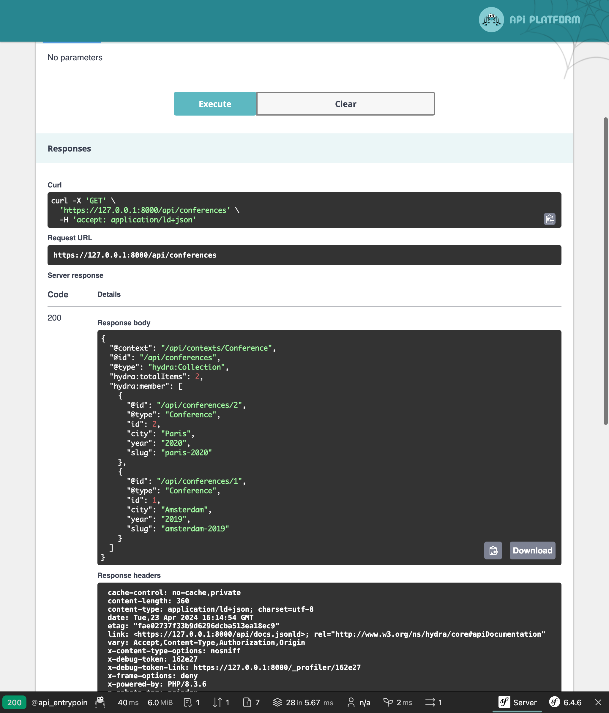

Создание API с помощью API Platform
===================================================

.. index::
    single: API
    single: HTTP API
    single: API Platform

Мы завершили разработку гостевой книги. Теперь, чтобы использовать данные в полной мере, может быть создадим API? В дальнейшем этот API может использоваться мобильным приложением, в котором будут показываться все конференции и комментарии к ним с возможностью для участников оставить свой отзыв к одной из них.

Сейчас мы разработаем API только для чтения данных.

Установка API Platform
-------------------------------

Конечно, вы можете создать API самостоятельно. Но если вы хотите следовать стандартам, которые применяются при разработке API, лучше всего воспользоваться готовым решением, которое сделает за вас всю грязную работу. API Platform — как раз одно из таких решений:

.. code-block:: terminal

    $ symfony composer req api

Создание API для работы с конференциями
----------------------------------------------------------------------

.. index::
    single: Attributes;ApiResource
    single: Attributes;Groups

Несколько атрибутов в классе Conference — это всё, что нужно для настройки API:

.. code-block:: diff
    :caption: patch_file

    --- i/src/Entity/Conference.php
    +++ w/src/Entity/Conference.php
    @@ -2,29 +2,45 @@

     namespace App\Entity;

    +use ApiPlatform\Metadata\ApiResource;
    +use ApiPlatform\Metadata\Get;
    +use ApiPlatform\Metadata\GetCollection;
     use App\Repository\ConferenceRepository;
     use Doctrine\Common\Collections\ArrayCollection;
     use Doctrine\Common\Collections\Collection;
     use Doctrine\ORM\Mapping as ORM;
     use Symfony\Bridge\Doctrine\Validator\Constraints\UniqueEntity;
    +use Symfony\Component\Serializer\Attribute\Groups;
     use Symfony\Component\String\Slugger\SluggerInterface;

     #[ORM\Entity(repositoryClass: ConferenceRepository::class)]
     #[UniqueEntity('slug')]
    +#[ApiResource(
    +    operations: [
    +        new Get(normalizationContext: ['groups' => 'conference:item']),
    +        new GetCollection(normalizationContext: ['groups' => 'conference:list'])
    +    ],
    +    order: ['year' => 'DESC', 'city' => 'ASC'],
    +    paginationEnabled: false,
    +)]
     class Conference
     {
         #[ORM\Id]
         #[ORM\GeneratedValue]
         #[ORM\Column]
    +    #[Groups(['conference:list', 'conference:item'])]
         private ?int $id = null;

         #[ORM\Column(length: 255)]
    +    #[Groups(['conference:list', 'conference:item'])]
         private ?string $city = null;

         #[ORM\Column(length: 4)]
    +    #[Groups(['conference:list', 'conference:item'])]
         private ?string $year = null;

         #[ORM\Column]
    +    #[Groups(['conference:list', 'conference:item'])]
         private ?bool $isInternational = null;

         /**
    @@ -34,6 +50,7 @@ class Conference
         private Collection $comments;

         #[ORM\Column(length: 255, unique: true)]
    +    #[Groups(['conference:list', 'conference:item'])]
         private ?string $slug = null;

         public function __construct()

API для конференций настраиваем через основной атрибут ``ApiResource``. С помощью неё можно ограничить допустимые CRUD-операции только до получения (``get``) и определить другие конфигурационные параметры для конференций: отображаемые поля и их порядок.

По умолчанию API доступен по пути ``/api``, который задан в файле ``config/routes/api_platform.yaml``. Данный файл с конфигурацией был добавлен рецептом пакета.

Для взаимодействия с API вы можете использовать следующий веб-интерфейс:

.. figure:: screenshots/api.png
    :alt: /api
    :align: center
    :figclass: with-browser

Используйте его, чтобы проверить различные возможности API:

Только представьте, сколько времени понадобится для реализации всего этого с нуля!

Создание API для комментариев
----------------------------------------------------

.. index::
    single: Attributes;ApiResource
    single: Attributes;ApiFilter
    single: Attributes;Groups

API для получения комментариев сделаем по аналогии с предыдущим:

.. code-block:: diff
    :caption: patch_file

    --- i/src/Entity/Comment.php
    +++ w/src/Entity/Comment.php
    @@ -2,41 +2,63 @@

     namespace App\Entity;

    +use ApiPlatform\Doctrine\Orm\Filter\SearchFilter;
    +use ApiPlatform\Metadata\ApiFilter;
    +use ApiPlatform\Metadata\ApiResource;
    +use ApiPlatform\Metadata\Get;
    +use ApiPlatform\Metadata\GetCollection;
     use App\Repository\CommentRepository;
     use Doctrine\DBAL\Types\Types;
     use Doctrine\ORM\Mapping as ORM;
    +use Symfony\Component\Serializer\Attribute\Groups;
     use Symfony\Component\Validator\Constraints as Assert;

     #[ORM\Entity(repositoryClass: CommentRepository::class)]
     #[ORM\HasLifecycleCallbacks]
    +#[ApiResource(
    +    operations: [
    +        new Get(normalizationContext: ['groups' => 'comment:item']),
    +        new GetCollection(normalizationContext: ['groups' => 'comment:list'])
    +    ],
    +    order: ['createdAt' => 'DESC'],
    +    paginationEnabled: false,
    +)]
    +#[ApiFilter(SearchFilter::class, properties: ['conference' => 'exact'])]
     class Comment
     {
         #[ORM\Id]
         #[ORM\GeneratedValue]
         #[ORM\Column]
    +    #[Groups(['comment:list', 'comment:item'])]
         private ?int $id = null;

         #[ORM\Column(length: 255)]
         #[Assert\NotBlank]
    +    #[Groups(['comment:list', 'comment:item'])]
         private ?string $author = null;

         #[ORM\Column(type: Types::TEXT)]
         #[Assert\NotBlank]
    +    #[Groups(['comment:list', 'comment:item'])]
         private ?string $text = null;

         #[ORM\Column(length: 255)]
         #[Assert\NotBlank]
         #[Assert\Email]
    +    #[Groups(['comment:list', 'comment:item'])]
         private ?string $email = null;

         #[ORM\Column]
    +    #[Groups(['comment:list', 'comment:item'])]
         private ?\DateTimeImmutable $createdAt = null;

         #[ORM\ManyToOne(inversedBy: 'comments')]
         #[ORM\JoinColumn(nullable: false)]
    +    #[Groups(['comment:list', 'comment:item'])]
         private ?Conference $conference = null;

         #[ORM\Column(length: 255, nullable: true)]
    +    #[Groups(['comment:list', 'comment:item'])]
         private ?string $photoFilename = null;

         #[ORM\Column(length: 255, options: ['default' => 'submitted'])]

Такие же атрибуты вы можете использовать для настройки класса.

Ограничение отображения комментариев из API
-------------------------------------------------------------------------------

По умолчанию API Platform возвращает все записи из базы данных. Однако в случае с API для комментариев, нам нужно показывать только опубликованные среди них.

Для получения через API только определённых элементов, создайте сервис, реализующий интерфейс ``QueryCollectionExtensionInterface`` для изменения Doctrine-запроса коллекций, и/или интерфейс ``QueryItemExtensionInterface`` для фильтрации элементов:

.. code-block:: php
    :caption: src/Api/FilterPublishedCommentQueryExtension.php
    :emphasize-lines: 14-16,21-23

    namespace App\Api;

    use ApiPlatform\Doctrine\Orm\Extension\QueryCollectionExtensionInterface;
    use ApiPlatform\Doctrine\Orm\Extension\QueryItemExtensionInterface;
    use ApiPlatform\Doctrine\Orm\Util\QueryNameGeneratorInterface;
    use ApiPlatform\Metadata\Operation;
    use App\Entity\Comment;
    use Doctrine\ORM\QueryBuilder;

    class FilterPublishedCommentQueryExtension implements QueryCollectionExtensionInterface, QueryItemExtensionInterface
    {
        public function applyToCollection(QueryBuilder $queryBuilder, QueryNameGeneratorInterface $queryNameGenerator, string $resourceClass, Operation $operation = null, array $context = []): void
        {
            if (Comment::class === $resourceClass) {
                $queryBuilder->andWhere(sprintf("%s.state = 'published'", $queryBuilder->getRootAliases()[0]));
            }
        }

        public function applyToItem(QueryBuilder $queryBuilder, QueryNameGeneratorInterface $queryNameGenerator, string $resourceClass, array $identifiers, Operation $operation = null, array $context = []): void
        {
            if (Comment::class === $resourceClass) {
                $queryBuilder->andWhere(sprintf("%s.state = 'published'", $queryBuilder->getRootAliases()[0]));
            }
        }
    }

Класс расширения запроса применяется исключительно к ресурсу ``Comment``, изменяя построитель запросов Doctrine, чтобы тот вернул только комментарии с состоянием ``published``.

Настройка CORS
-----------------------

.. index::
    single: CORS
    single: Cross-Origin Resource Sharing

Сейчас все современные HTTP-клиенты следуют правилам ограничения домена (same-origin policy), которые запрещают обращаться к API из других доменов. Бандл CORS, устанавливаемый в качестве одной из зависимостей при выполнении команды ``composer req api``, отправляет HTTP-заголовки механизма совместного использования ресурсов между разными источниками (Cross-Origin Resource Sharing), в соответствии со значением в переменной окружения ``CORS_ALLOW_ORIGIN``.

По умолчанию это значение определено в файле ``.env`` и разрешает выполнять HTTP-запросы с ``localhost`` и ``127.0.0.1`` через любой порт. Этой настройки как раз достаточно для следующего шага, где мы создадим SPA с собственным веб-сервером, который будет взаимодействовать с нашим API.

.. sidebar:: Двигаемся дальше

    * `Обучающий видеокурс по API Platform на SymfonyCasts`_;

    * Чтобы включить поддержку GraphQL, выполните команду ``composer require webonyx/graphql-php``. Затем перейдите по пути ``/api/graphql`` в браузере.

.. _`Обучающий видеокурс по API Platform на SymfonyCasts`: https://symfonycasts.com/screencast/api-platform
