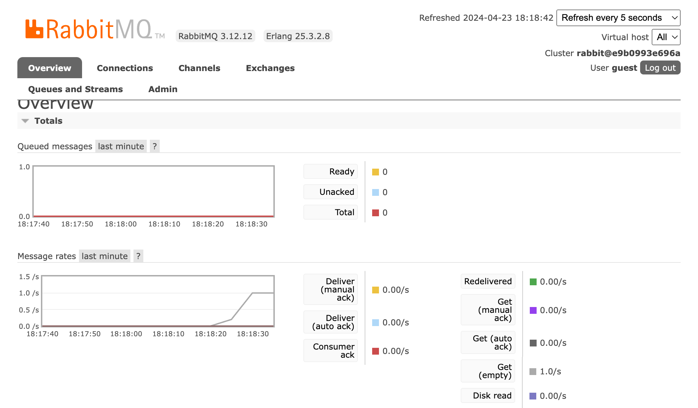

Использование RabbitMQ в качестве брокера сообщений
=========================================================================================

.. index::
    single: RabbitMQ

RabbitMQ — очень популярный брокер сообщений, который можно использовать в качестве альтернативы PostgreSQL.

Переход с PostgreSQL на RabbitMQ
------------------------------------------

Сделайте следующие изменение, чтобы использовать RabbitMQ вместо PostgreSQL в качестве брокера сообщений:

.. code-block:: diff
    :caption: patch_file

    --- i/config/packages/messenger.yaml
    +++ w/config/packages/messenger.yaml
    @@ -5,7 +5,7 @@ framework:
             transports:
                 # https://symfony.com/doc/current/messenger.html#transport-configuration
                 async:
    -                dsn: '%env(MESSENGER_TRANSPORT_DSN)%'
    +                dsn: '%env(RABBITMQ_URL)%'
                     retry_strategy:
                         max_retries: 3
                         multiplier: 2

Нам также нужно добавить поддержку RabbitMQ для Messenger:

.. code-block:: terminal

    $ symfony composer req amqp-messenger

Добавление RabbitMQ в Docker
---------------------------------------

.. index::
    single: Docker;RabbitMQ

Как вы уже догадались, нам также нужно добавить RabbitMQ в файл Docker Compose:

.. code-block:: diff
    :caption: patch_file

    --- i/compose.yaml
    +++ w/compose.yaml
    @@ -18,6 +18,10 @@ services:
         image: redis:5-alpine
         ports: [6379]

    +  rabbitmq:
    +    image: rabbitmq:3-management
    +    ports: [5672, 15672]
    +
     volumes:
     ###> doctrine/doctrine-bundle ###
       database_data:

Перезапуск сервисов Docker
--------------------------------------------

Остановите и перезапустите контейнеры, чтобы Docker Compose смог добавить новый контейнер RabbitMQ:

.. code-block:: terminal

    $ docker-compose stop
    $ docker-compose up -d --remove-orphans

.. code-block:: terminal
    :class: hide

    $ sleep 10

Знакомство с панелью управления RabbitMQ
--------------------------------------------------------------------

.. index::
    single: Symfony CLI;open:local:rabbitmq

Если вы хотите посмотреть очереди и сообщения, проходящие через RabbitMQ, воспользуйтесь специальной панелью управления:

.. code-block:: terminal
    :class: ignore

    $ symfony open:local:rabbitmq

Это также можно сделать через панель отладки:

.. figure:: screenshots/rabbitmq-wdt.png
    :alt: /
    :align: center
    :figclass: with-browser

Для входа в интерфейс управления RabbitMQ в качестве логина/пароля используйте ``guest``/``guest``:

Развёртывание новой версии с RabbitMQ
--------------------------------------------------------------

.. index::
    single: Platform.sh;RabbitMQ
    single: RabbitMQ

Чтобы активировать RabbitMQ на продакшен-серверах добавьте его в список сервисов:

.. code-block:: diff
    :caption: patch_file

    --- i/.platform/services.yaml
    +++ w/.platform/services.yaml
    @@ -19,3 +19,8 @@ files:

     rediscache:
         type: redis:5.0
    +
    +queue:
    +    type: rabbitmq:3.7
    +    disk: 1024
    +    size: S

Также укажите его в конфигурации веб-контейнера и включите PHP-модуль ``amqp``:

.. code-block:: diff
    :caption: patch_file

    --- i/.platform.app.yaml
    +++ w/.platform.app.yaml
    @@ -4,6 +4,7 @@ type: php:8.3

     runtime:
         extensions:
    +        - amqp
             - apcu
             - blackfire
             - ctype
    @@ -38,6 +39,7 @@ mounts:
     relationships:
         database: "database:postgresql"
         redis: "rediscache:redis"
    +    rabbitmq: "queue:rabbitmq"

     hooks:
         build: |

.. index::
    single: Platform.sh;Tunnel
    single: Symfony CLI;cloud:tunnel:open
    single: Symfony CLI;cloud:tunnel:close
    single: Symfony CLI;open:remote:rabbitmq

Чтобы перейти в панель управления RabbitMQ на продакшен-сервер прежде всего откройте туннель:

.. code-block:: terminal
    :class: ignore

    $ symfony cloud:tunnel:open
    $ symfony open:remote:rabbitmq

    # when done
    $ symfony cloud:tunnel:close

.. sidebar:: Двигаемся дальше

    * `Документация RabbitMQ`_.

.. _`Документация RabbitMQ`: https://www.rabbitmq.com/documentation.html
