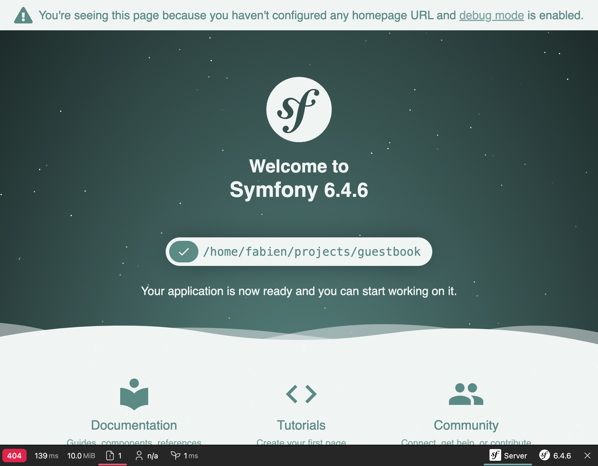
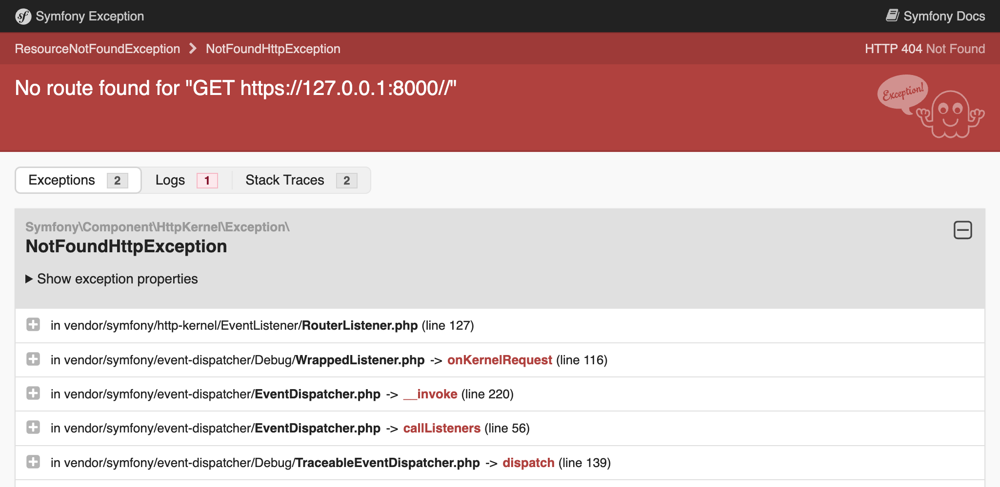

Поиск и устранение неисправностей
===============================================================

Настройка проекта также подразумевает наличие правильных инструментов для отладки. К счастью, многие полезные утилиты уже включены в пакет ``webapp``.

Изучение средств отладки Symfony
------------------------------------------------------

.. index::
    single: Components;Profiler
    single: Profiler
    single: Web Profiler
    single: Web Debug Toolbar

Начнём с того, что Symfony Profiler поможет сэкономить много времени в поиске источника проблемы.

Если вы посмотрите на главную страницу, то увидите панель отладки в нижней части экрана:

Первое, на что вы, скорее всего, обратите внимание — надпись **404** на красном фоне. Помните, это просто страница-заглушка, поскольку мы ещё не определили домашнюю страницу. И даже если эта страница достаточно хорошо выглядит, она всё ещё остаётся страницей ошибки. Так что правильный код статуса HTTP для этой страницы — 404, а не 200. Благодаря панели отладки, вы сразу же получите всю необходимую информацию.

Нажмите на маленький восклицательный знак и вы увидите сообщение "настоящего" исключения в логах профилировщика Symfony. Если вы хотите увидеть трассировку стека, нажмите на ссылку "Exception" в левом меню.

Когда возникает проблема с кодом, вы увидите похожую страницу об ошибке со всей необходимой информацией для отладки:

Уделите немного времени и поизучайте данные в профилировщике Symfony, нажимая по разным ссылкам.

.. index::
    single: Symfony CLI;server:log

Логи весьма полезны при отладке. В Symfony есть удобная команда для отображения последних строк всех логов (веб-сервера, PHP и вашего приложения):

.. code-block:: terminal
    :class: ignore

    $ symfony server:log

Проведем небольшой эксперимент. Откройте ``public/index.php`` и сделайте ошибку в PHP-коде (например, добавьте foobar посередине кода). Обновите страницу в браузере и понаблюдайте за логом:

.. code-block:: text
    :class: ignore

    Dec 21 10:04:59 |DEBUG| PHP    PHP Parse error:  syntax error, unexpected 'use' (T_USE) in public/index.php on line 5 path="/usr/bin/php7.42" php="7.42.0"
    Dec 21 10:04:59 |ERROR| SERVER GET  (500) / ip="127.0.0.1"

Логи отображаются разными цветами, чтобы привлечь ваше внимание к ошибкам.

Понимание окружений Symfony
---------------------------------------------

.. index::
    single: Symfony Environments

Поскольку Symfony Profiler требуется только в процессе разработки, не нужно устанавливать его в продакшен-окружении. Поэтому по умолчанию Symfony автоматически устанавливает его только для окружений ``dev`` и ``test``.

Symfony поддерживает создание *окружений*. По умолчанию есть три окружения с возможностью добавить дополнительные: ``dev``, ``prod`` и ``test``. Все окружения используют один и тот же код, но имеют разные *конфигурации*.

Например, в окружении ``dev`` все инструменты отладки включены. Тогда как в окружении ``prod`` такого нет, потому что приложение должно быть оптимизировано для повышения производительности.

Изменяя значение переменной окружения ``APP_ENV`` можно переключаться с одного окружения на другое.

Во время развёртывания на Platform.sh, окружение (сохранённое в ``APP_ENV``) автоматически переключится на ``prod``.

Управление конфигурациями окружений
--------------------------------------------------------------------

.. index::
    single: Environment Variables
    single: .env
    single: .env.local

Переменная ``APP_ENV`` может быть задана с помощью "настоящих" переменных окружения в терминале:

.. code-block:: terminal
    :class: ignore

    $ export APP_ENV=dev

Переменные окружения, такие как ``APP_ENV``, рекомендуется явно определять на продакшен-серверах. Однако в процессе разработки установка таким образом множество переменных окружения может стать утомительной.  Поэтому вместо этого определите их в файле ``.env``.

При создании проекта был автоматически сгенерирован файл ``.env``:

.. code-block:: text
    :caption: .env
    :class: ignore

    ###> symfony/framework-bundle ###
    APP_ENV=dev
    APP_SECRET=c2927f273163f7225a358e3a1bbbed8a
    #TRUSTED_PROXIES=127.0.0.1,127.0.0.2
    #TRUSTED_HOSTS='^localhost|example\.com$'
    ###< symfony/framework-bundle ###

.. tip::

    Благодаря использованию рецептов Symfony Flex, любой пакет может добавить свои переменные окружения в этот файл.

Файл ``.env`` хранится в репозитории и содержит значения *по умолчанию* для продакшена. Вы можете задать свои значения, создав файл ``.env.local``. Этот файл не хранится в репозитории, поэтому изначально игнорируется в ``.gitignore``.

Никогда не храните конфиденциальную информацию в этих файлах. Позже мы рассмотрим, как управлять такими видами данных.

Настройка среды разработки
--------------------------------------------------

В локальном окружении разработки при генерации исключения Symfony отображает страницу с сообщением исключения и его трассировкой. К отображаемому пути файла в трассировке добавляется ссылка, кликнув на которую можно открыть файл на нужной строке прямо в вашей IDE. Но чтобы воспользоваться этой возможностью, сначала вам нужно настроить IDE. Symfony поддерживает множество разных IDE; я использую Visual Studio Code для данного проекта:

.. code-block:: diff
    :caption: patch_file

    --- i/php.ini
    +++ w/php.ini
    @@ -6,3 +6,4 @@ session.gc_probability=0
     session.use_strict_mode=On
     realpath_cache_ttl=3600
     zend.detect_unicode=Off
    +xdebug.file_link_format=vscode://file/%f:%l

Ссылка в имени файла появляется не только при генерации исключения. Так, например, контроллер на панели отладки может стать кликабельным, если настроить IDE.

Отладка в продакшене
--------------------------------------

.. index::
    single: Platform.sh;Remote Logs
    single: Platform.sh;SSH
    single: Symfony CLI;cloud:logs
    single: Symfony CLI;cloud:ssh

Отладка на продакшен-серверах всегда сложнее. К примеру, в таком случае у вас нет доступа к профилировщику Symfony. А в логах не так много подробной информации. Но всё же можно посмотреть последние записи логов:

.. code-block:: terminal
    :class: ignore

    $ symfony cloud:logs --tail

Вы даже можете подключиться через SSH из веб-контейнера:

.. code-block:: terminal
    :class: ignore

    $ symfony cloud:ssh

Не бойтесь — вы не сможете так просто всё сломать. Большая часть файловой системы доступна только для чтения. Поэтому сделать срочное исправление прямо на продакшене не получится. Однако вы узнаете про гораздо более подходящий способ сделать это позже в книге.

.. sidebar:: Двигаемся дальше

    * `Обучающий видеоролик по файлам окружений и конфигураций на SymfonyCast`_;

    * `Обучающий видеоролик по переменным окружения на SymfonyCast`_;

    * `Обучающий видеоролик по панели отладки и профилировщику на SymfonyCasts`_;

    * `Управление несколькими файлами .env`_ в приложениях Symfony.

.. _`Обучающий видеоролик по файлам окружений и конфигураций на SymfonyCast`: https://symfonycasts.com/screencast/symfony-fundamentals/environment-config-files
.. _`Обучающий видеоролик по переменным окружения на SymfonyCast`: https://symfonycasts.com/screencast/symfony-fundamentals/environment-variables
.. _`Обучающий видеоролик по панели отладки и профилировщику на SymfonyCasts`: https://symfonycasts.com/screencast/symfony/debug-toolbar-profiler
.. _`Управление несколькими файлами .env`: https://symfony.com/doc/current/configuration.html#managing-multiple-env-files
