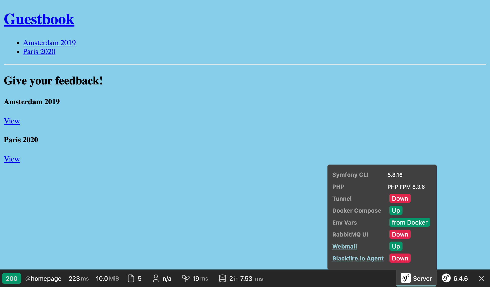
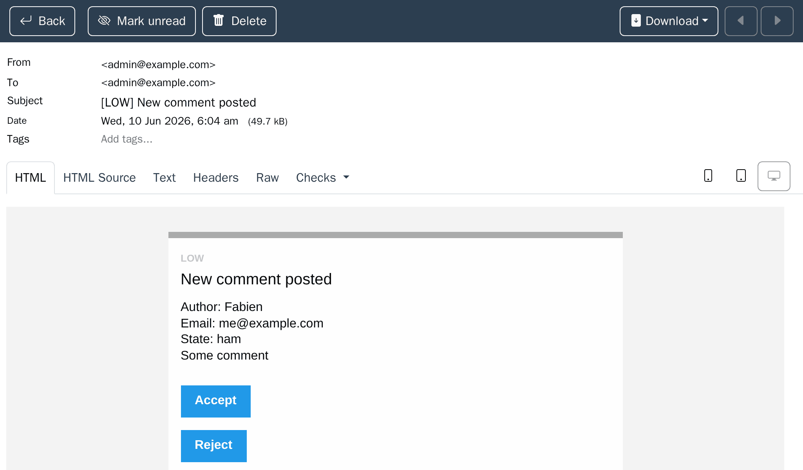
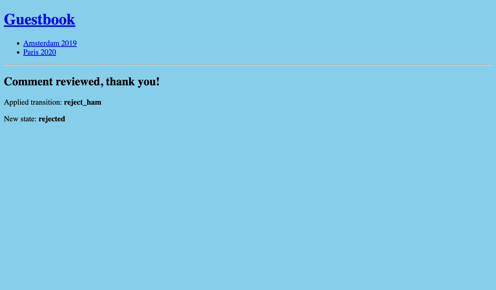

E-Mails an Administrator*innen senden
=====================================

.. index::
    single: Components;Mailer
    single: Mailer
    single: Emails

Um eine hohe Feedbackqualität zu gewährleisten, müssen Administrator*innen alle Kommentare moderieren. Wenn ein Kommentar den Zustand ``ham`` oder ``potential_spam`` hat, soll eine *E-Mail* mit zwei Links an die Administrator*innen gesendet werden: Ein Link, um den Kommentar zu akzeptieren; und einer, um ihn abzulehnen.

Eine E-Mail-Adresse für die Administrator*innen einrichten
-----------------------------------------------------------

Verwende einen Container-Parameter, um die Admin-E-Mail-Adresse zu speichern. Zu Demonstrationszwecken ermöglichen wir den Parameter über eine Environment-Variable zu setzen (dies sollte im "echten Leben" nicht nötig sein):

.. code-block:: diff
    :caption: patch_file

    --- i/config/services.yaml
    +++ w/config/services.yaml
    @@ -5,6 +5,8 @@
     # https://symfony.com/doc/current/best_practices.html#use-parameters-for-application-configuration
     parameters:
         photo_dir: "%kernel.project_dir%/public/uploads/photos"
    +    default_admin_email: admin@example.com
    +    admin_email: "%env(string:default:default_admin_email:ADMIN_EMAIL)%"

     services:
         # default configuration for services in *this* file

Eine Environment-Variable kann vor der Verwendung "verarbeitet" werden. Hier verwenden wir den ``default``-Processor, um den Wert des ``default_admin_email``-Parameters zu nutzen, falls die Environment-Variable ``ADMIN_EMAIL`` nicht existiert.

Eine Benachrichtigungs-E-Mail senden
------------------------------------

Um eine E-Mail zu versenden, kannst Du zwischen mehreren ``Email``- Klassenabstraktionen wählen, von ``Message``, der allgemeinsten Variante, bis zur ``NotificationEmail`` mit der höchsten Konkretisierung. Du wirst wahrscheinlich am häufigsten die ``Email``-Klasse verwenden. Die ``NotificationEmail``-Klasse ist jedoch die perfekte Wahl für interne E-Mails.

Lass uns im Message-Handler die automatische Validierungslogik ersetzen.

.. code-block:: diff
    :caption: patch_file

    --- i/src/MessageHandler/CommentMessageHandler.php
    +++ w/src/MessageHandler/CommentMessageHandler.php
    @@ -7,6 +7,9 @@ use App\Repository\CommentRepository;
     use App\SpamChecker;
     use Doctrine\ORM\EntityManagerInterface;
     use Psr\Log\LoggerInterface;
    +use Symfony\Bridge\Twig\Mime\NotificationEmail;
    +use Symfony\Component\DependencyInjection\Attribute\Autowire;
    +use Symfony\Component\Mailer\MailerInterface;
     use Symfony\Component\Messenger\Attribute\AsMessageHandler;
     use Symfony\Component\Messenger\MessageBusInterface;
     use Symfony\Component\Workflow\WorkflowInterface;
    @@ -20,6 +23,8 @@ class CommentMessageHandler
             private CommentRepository $commentRepository,
             private MessageBusInterface $bus,
             private WorkflowInterface $commentStateMachine,
    +        private MailerInterface $mailer,
    +        #[Autowire('%admin_email%')] private string $adminEmail,
             private ?LoggerInterface $logger = null,
         ) {
         }
    @@ -42,8 +47,13 @@ class CommentMessageHandler
                 $this->entityManager->flush();
                 $this->bus->dispatch($message);
             } elseif ($this->commentStateMachine->can($comment, 'publish') || $this->commentStateMachine->can($comment, 'publish_ham')) {
    -            $this->commentStateMachine->apply($comment, $this->commentStateMachine->can($comment, 'publish') ? 'publish' : 'publish_ham');
    -            $this->entityManager->flush();
    +            $this->mailer->send((new NotificationEmail())
    +                ->subject('New comment posted')
    +                ->htmlTemplate('emails/comment_notification.html.twig')
    +                ->from($this->adminEmail)
    +                ->to($this->adminEmail)
    +                ->context(['comment' => $comment])
    +            );
             } elseif ($this->logger) {
                 $this->logger->debug('Dropping comment message', ['comment' => $comment->getId(), 'state' => $comment->getState()]);
             }

Das ``MailerInterface`` ist der Haupteinstiegspunkt und ermöglicht das Senden von E-Mails mittels ``send()``.

Um eine E-Mail zu senden, benötigen wir einen Absender (den ``From``/``Sender``-Header). Anstatt ihn explizit für diese E-Mail-Instanz zu setzen, definiere ihn global:

.. code-block:: diff
    :caption: patch_file

    --- i/config/packages/mailer.yaml
    +++ w/config/packages/mailer.yaml
    @@ -1,3 +1,5 @@
     framework:
         mailer:
             dsn: '%env(MAILER_DSN)%'
    +        envelope:
    +            sender: "%admin_email%"

Das E-Mail-Template für Benachrichtigungen erweitern
-----------------------------------------------------

.. index::
    single: Twig;extends
    single: Twig;block
    single: Twig;url

Das Template für die Benachrichtigungs-E-Mail wird vom Standard-E-Mail-Template für Benachrichtigungen, das mit Symfony ausgeliefert wird, abgeleitet:

.. code-block:: html+twig
    :caption: templates/emails/comment_notification.html.twig

    

    
        Author: {{ comment.author }} 
        Email: {{ comment.email }} 
        State: {{ comment.state }} 

        

            {{ comment.text }}
        

    

    
        <spacer size="16"></spacer>
        <button href="{{ url('review_comment', { id: comment.id }) }}">Accept</button>
        <button href="{{ url('review_comment', { id: comment.id, reject: true }) }}">Reject</button>
    

Das Template überschreibt ein paar Blöcke, um die Nachricht der E-Mail anzupassen und Links hinzuzufügen, die es den Administrator*innen ermöglicht einen Kommentar anzunehmen oder abzulehnen. Jedes Routen-Argument, das kein gültiger Routen-Parameter ist, wird als Query-String-Element hinzugefügt (Die "abgelehnt"-URL sieht folgendermaßen aus: ``/admin/comment/review/42?reject=true``).

Das Standard-Template ``NotificationEmail`` verwendet `Inky`_ anstelle von HTML, um E-Mails zu gestalten. Inky hilft bei der Erstellung responsiver E-Mails, die mit allen gängigen E-Mail-Clients kompatibel sind.

Um maximale Kompatibilität mit E-Mail-Programmen zu ermöglichen, verwandelt das Benachrichtigungs-Basislayout standardmäßig alle Stylesheets in Inline-Style-Attribute (mit Hilfe des CSS-Inliner-Pakets).

Diese beiden Funktionen sind Teil optionaler Twig-Erweiterungen, die dafür installiert werden müssen:

.. code-block:: terminal

    $ symfony composer req "twig/cssinliner-extra:^3" "twig/inky-extra:^3"

Absolute URLs in einem CLI-Befehl generieren
--------------------------------------------

.. index::
    single: Twig;Link
    single: Link

In E-Mails musst Du URLs mit ``url()`` anstatt ``path()`` erzeugen, da du absolute URLs, mit Schema und Host, benötigst.

Die E-Mail wird vom Message-Handler im Konsolen-Kontext verschickt. In einem Web-Kontext ist das Erzeugen von absoluten URLs einfacher, da wir das Schema und die Domäne der aktuellen Seite kennen. Im Konsolen-Kontext ist dies nicht der Fall.

Definiere explizit die zu verwendende Domain und das zu verwendende Schema:

.. code-block:: diff
    :caption: patch_file

    --- i/config/services.yaml
    +++ w/config/services.yaml
    @@ -7,6 +7,7 @@ parameters:
         photo_dir: "%kernel.project_dir%/public/uploads/photos"
         default_admin_email: admin@example.com
         admin_email: "%env(string:default:default_admin_email:ADMIN_EMAIL)%"
    +    default_base_url: 'http://127.0.0.1'

     services:
         # default configuration for services in *this* file

Weise dann den Router an, sie als Standard-URI zu verwenden, wenn URLs außerhalb einer HTTP-Anfrage generiert werden:

.. code-block:: diff
    :caption: patch_file

    --- i/config/packages/routing.yaml
    +++ w/config/packages/routing.yaml
    @@ -3,3 +3,3 @@ framework:
             # Configure how to generate URLs in non-HTTP contexts, such as CLI commands.
             # See https://symfony.com/doc/current/routing.html#generating-urls-in-commands
    -        default_uri: '%env(DEFAULT_URI)%'
    +        default_uri: '%env(default:default_base_url:SYMFONY_DEFAULT_ROUTE_URL)%'

Die Environment-Variable ``SYMFONY_DEFAULT_ROUTE_URL`` wird bei Verwendung der ``symfony``-CLI automatisch lokal gesetzt. Bei Upsun wird sie anhand der Konfiguration bestimmt.

Eine Route mit einem Controller verknüpfen
-------------------------------------------

Die ``review_comment``-Route existiert noch nicht, lass uns dafür einen Admin-Controller erstellen:

.. code-block:: php
    :caption: src/Controller/AdminController.php

    namespace App\Controller;

    use App\Entity\Comment;
    use App\Message\CommentMessage;
    use Doctrine\ORM\EntityManagerInterface;
    use Symfony\Bundle\FrameworkBundle\Controller\AbstractController;
    use Symfony\Component\HttpFoundation\Request;
    use Symfony\Component\HttpFoundation\Response;
    use Symfony\Component\Messenger\MessageBusInterface;
    use Symfony\Component\Routing\Attribute\Route;
    use Symfony\Component\Workflow\WorkflowInterface;
    use Twig\Environment;

    class AdminController extends AbstractController
    {
        public function __construct(
            private Environment $twig,
            private EntityManagerInterface $entityManager,
            private MessageBusInterface $bus,
        ) {
        }

        #[Route('/admin/comment/review/{id}', name: 'review_comment')]
        public function reviewComment(Request $request, Comment $comment, WorkflowInterface $commentStateMachine): Response
        {
            $accepted = !$request->query->get('reject');

            if ($commentStateMachine->can($comment, 'publish')) {
                $transition = $accepted ? 'publish' : 'reject';
            } elseif ($commentStateMachine->can($comment, 'publish_ham')) {
                $transition = $accepted ? 'publish_ham' : 'reject_ham';
            } else {
                return new Response('Comment already reviewed or not in the right state.');
            }

            $commentStateMachine->apply($comment, $transition);
            $this->entityManager->flush();

            if ($accepted) {
                $this->bus->dispatch(new CommentMessage($comment->getId()));
            }

            return new Response($this->twig->render('admin/review.html.twig', [
                'transition' => $transition,
                'comment' => $comment,
            ]));
        }
    }

Die URL zum prüfen von Kommentaren beginnt mit ``/admin/`` und ist damit durch die im vorherigen Schritt definierte Firewall geschützt. Die Administrator*innen müssen authentifiziert sein, um auf diese Ressource zugreifen zu können.

Anstatt eine ``Response``-Instanz zu erstellen, haben wir die Shortcut-Methode ``render()`` verwendet, die von der Controller-Basisklasse ``AbstractController`` bereitgestellt wird.

.. index::
    single: Twig;extends
    single: Twig;block

Sobald die Überprüfung abgeschlossen ist, wird den Administrator*innen in einem kurzen Template für deren harte Arbeit gedankt:

.. code-block:: html+twig
    :caption: templates/admin/review.html.twig

    

    
        <h2>Comment reviewed, thank you!</h2>

        
Applied transition: <strong>{{ transition }}</strong>

        
New state: <strong>{{ comment.state }}</strong>

    

Einen Mail-Catcher verwenden
----------------------------

.. index::
    single: Docker;Mail Catcher

Anstatt einen "echten" SMTP-Server oder einen Drittanbieter zum Senden von E-Mails zu verwenden, nutzen wir einen *Mail-Catcher*. Ein *Mail-Catcher* stellt einen SMTP-Server zur Verfügung, der die E-Mails nicht zustellt, sondern über ein Web-Interface zur Verfügung stellt. Glücklicherweise hat Symfony bereits automatisch einen Mail-Catcher für uns konfiguriert:

.. code-block:: yaml
    :caption: compose.override.yaml
    :class: ignore

    ###> symfony/mailer ###
    mailer:
        image: axllent/mailpit
        ports:
        - "1025"
        - "8025"
        environment:
        MP_SMTP_AUTH_ACCEPT_ANY: 1
        MP_SMTP_AUTH_ALLOW_INSECURE: 1
    ###< symfony/mailer ###

Auf E-Mails zugreifen
---------------------

.. index::
    single: Symfony CLI;open:local:webmail

Du kannst das E-Mail-Interface von einem Terminal aus öffnen:

.. code-block:: terminal
    :class: ignore

    $ symfony open:local:webmail

Oder über die Web-Debug-Toolbar:

Gib ein Kommentar ab. Du solltest anschließend eine E-Mail im E-Mail-Interface zugestellt bekommen:

Klicke auf den E-Mail-Titel im E-Mail-Interface und akzeptiere den Kommentar oder lehne ihn ab, wie Du es für richtig hältst:

Überprüfe die Logs mittels ``server:log``, falls der Versand nicht wie erwartet funktioniert.

Lang laufende Skripte verwalten
-------------------------------

Du solltest dir der Verhaltensweisen lang laufender Skripte bewusst sein. Im Gegensatz zum PHP-Modell für HTTP, bei dem jede Anfrage mit einem sauberen Zustand beginnt, läuft der *Message-Consumer* kontinuierlich im Hintergrund. Jede Behandlung einer Nachricht erbt den aktuellen Zustand, einschließlich des Speicher-Caches. Um Probleme mit Doctrine zu vermeiden, werden die Entity-Manager nach der Abarbeitung einer Nachricht automatisch gelöscht. Du solltest überprüfen, ob deine eigenen Dienste das Gleiche tun müssen oder nicht.

E-Mails asynchron versenden
---------------------------

Das Übertragen der im Message-Handler verschickten E-Mail kann einige Zeit in Anspruch nehmen. Es könnte sogar eine Exception ausgelöst werden. Falls während der Abarbeitung einer Message eine Exception ausgelöst wird, wird diese später erneut in der Queue erscheinen. Aber anstatt zu versuchen, die Message zu erneut konsumieren, wäre es besser, nur den E-Mail-Versand zu wiederholen.

Wir wissen bereits, wie man das macht: Sende die E-Mail-Nachricht über den Bus.

Eine ``MailerInterface``-Instanz nimmt uns diese Arbeit ab: Falls ein Bus definiert ist, verschickt sie die E-Mail-Nachrichten über den Bus, anstatt sie direkt zu versenden. Es sind keine Änderungen an deinem Code erforderlich.

Der Bus verschickt die Emails bereits asynchron, wie in der Standard-Messenger-Konfiguration angegeben:

.. code-block:: yaml
    :caption: config/packages/messenger.yaml
    :emphasize-lines: 4
    :class: ignore

    framework:
        messenger:
            routing:
                Symfony\Component\Mailer\Messenger\SendEmailMessage: async
                Symfony\Component\Notifier\Message\ChatMessage: async
                Symfony\Component\Notifier\Message\SmsMessage: async

                # Route your messages to the transports
                App\Message\CommentMessage: async

Wir verwenden den gleichen Transport-Layer für Kommentar- und E-Mail-Messages, aber das ist nicht zwingend. Du kannst Dich beispielsweise dafür entscheiden, einen anderen Transport-Layer zu verwenden, um mit verschieden priorisierten Messages unterschiedlich umzugehen. Die Verwendung verschiedener Transport-Layer gibt Dir auch die Möglichkeit, dass verschiedene Maschinen unterschiedliche Message-Arten abarbeiten. Die Messenger-Komponente ist flexibel, Du hast die Wahl.

E-Mails testen
--------------

Es gibt viele Möglichkeiten, E-Mails zu testen.

Du kannst Unit-Tests schreiben, wenn Du eine Klasse pro E-Mail schreibst (durch Erweiterung der Klasse ``Email`` oder ``TemplatedEmail`` zum Beispiel).

Allerdings sind die häufigsten Tests, die Du schreiben wirst, Funktionale Tests, die prüfen ob bestimmte Aktionen einen E-Mail-Versand auslösen. Falls der Inhalt der E-Mails dynamisch ist, wird er wahrscheinlich auch geprüft.

Symfony enthält Assertations, die solche Tests erleichtern, hier ist ein Testbeispiel das solche Möglichkeiten demonstriert:

.. code-block:: php
    :class: ignore

    public function testMailerAssertions()
    {
        $client = static::createClient();
        $client->request('GET', '/');

        $this->assertEmailCount(1);
        $event = $this->getMailerEvent(0);
        $this->assertEmailIsQueued($event);

        $email = $this->getMailerMessage(0);
        $this->assertEmailHeaderSame($email, 'To', 'fabien@example.com');
        $this->assertEmailTextBodyContains($email, 'Bar');
        $this->assertEmailAttachmentCount($email, 1);
    }

Diese Assertions funktionieren sowohl wenn E-Mails synchron als auch wenn sie asynchron gesendet werden.

E-Mails auf Upsun versenden
---------------------------------

.. index::
    single: Upsun;Emails
    single: Upsun;Mailer
    single: Upsun;SMTP
    single: Emails

Es gibt keine spezielle Konfiguration für Upsun. Alle Upsun-Konten verfügen über einen Sendgrid-Zugang, welcher automatisch zum Versenden von E-Mails verwendet wird.

.. index::
    single: Symfony CLI;cloud:env:info

.. note::

    Zur Sicherheit werden E-Mails standardmäßig nur im ``master``-Branch verschickt, nicht in anderen Branches. Aktiviere SMTP explizit, wenn Du weißt, was Du tust:

    .. code-block:: terminal

        $ symfony cloud:env:info enable_smtp on

.. sidebar:: Weiterführendes

    * `SymfonyCasts Mailer Tutorial`_;

    * Die `Inky templating language Dokumentation`_;

    * Die `Dokumentation zur Verarbeitung von Environment-Variablen`_;

    * Die `Symfony Framework Mailer Dokumentation`_;

    * Die `Upsun-Dokumentation über E-Mails`_.

.. _`Inky`: https://get.foundation/emails/docs/inky.html
.. _`SymfonyCasts Mailer Tutorial`: https://symfonycasts.com/screencast/mailer
.. _`Inky templating language Dokumentation`: https://get.foundation/emails/docs/inky.html
.. _`Dokumentation zur Verarbeitung von Environment-Variablen`: https://symfony.com/doc/current/configuration/env_var_processors.html
.. _`Symfony Framework Mailer Dokumentation`: https://symfony.com/doc/current/mailer.html
.. _`Upsun-Dokumentation über E-Mails`: https://symfony.com/doc/current/cloud/services/emails.html
