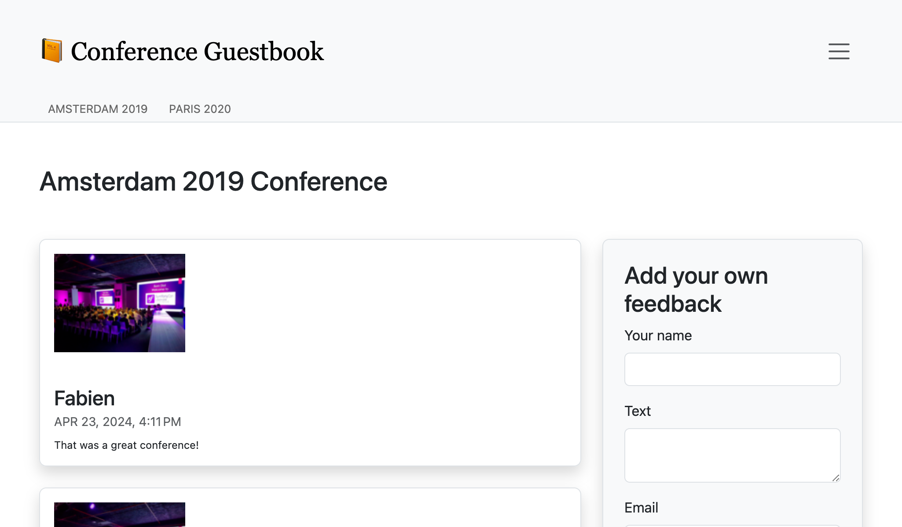

Das User-Interface mit Webpack gestalten
========================================

.. index::
    single: Encore
    single: Webpack
    single: Components;Encore
    single: Stylesheet

Wir haben keine Zeit mit dem Design des User-Interfaces verbracht. Um wie ein Profi zu arbeiten, werden wir einen modernen Stack verwenden, der auf `Webpack`_ basiert. Und um einen Symfony-Touch hinzuzufügen und die Integration mit der Anwendung zu erleichtern, installieren wir *Webpack Encore*:

.. code-block:: terminal

    $ symfony composer rem asset-mapper
    $ symfony composer req encore

Eine vollständige Webpack-Umgebung wurde für Dich erstellt: ``package.json`` und ``webpack.config.js`` wurden generiert und enthalten eine gute Standardkonfiguration. Öffne ``webpack.config.js``, es verwendet die Encore-Abstraktion, um Webpack zu konfigurieren.

Die ``package.json``-Datei definiert einige schöne Befehle, die wir die ganze Zeit verwenden werden.

Das ``assets``-Verzeichnis enthält die wichtigsten Einstiegspunkte für die Projektassets: ``styles/app.css`` und ``app.js``.

Sass verwenden
--------------

.. index::
    single: Sass

Anstatt einfaches CSS zu verwenden, wechseln wir zu `Sass`_:

.. code-block:: terminal

    $ mv assets/styles/app.css assets/styles/app.scss

.. code-block:: diff
    :caption: patch_file

    --- i/assets/app.js
    +++ w/assets/app.js
    @@ -6,4 +6,4 @@
      */

     // any CSS you import will output into a single css file (app.css in this case)
    -import './styles/app.css';
    +import './styles/app.scss';

Installiere den Sass-Loader:

.. code-block:: terminal

    $ npm install sass sass-loader --save-dev

Und aktiviere den Sass-Loader in Webpack:

.. code-block:: diff
    :caption: patch_file

    --- i/webpack.config.js
    +++ w/webpack.config.js
    @@ -57,7 +57,7 @@ Encore
         })

         // enables Sass/SCSS support
    -    //.enableSassLoader()
    +    .enableSassLoader()

         // uncomment if you use TypeScript
         //.enableTypeScriptLoader()

Woher wusste ich, welche Pakete ich installieren soll? Falls wir versucht hätten, unsere Assets ohne sie zu erstellen, hätte Encore uns eine freundliche Fehlermeldung ausgegeben, die uns den ``npm install``-Befehl vorgeschlagen hätte, um die Dependencies zu installieren, die wir benötigen um ``.scss``-Dateien zu laden.

Bootstrap einsetzen
-------------------

.. index::
    single: Bootstrap

Um mit vernünftigen Voreinstellungen zu beginnen und eine "responsive" Website zu erstellen, kann uns ein CSS-Framework wie `Bootstrap`_ viel Arbeit abnehmen. Installiere es als Paket:

.. code-block:: terminal

    $ npm install bootstrap @popperjs/core bs-custom-file-input --save-dev

Binde Bootstrap in der CSS-Datei ein (wir haben die Datei auch bereinigt):

.. code-block:: diff
    :caption: patch_file

    --- i/assets/styles/app.scss
    +++ w/assets/styles/app.scss
    @@ -1,3 +1 @@
    -body {
    -    background-color: lightgray;
    -}
    +@import '~bootstrap/scss/bootstrap';

Das Gleiche gilt für die JS-Datei:

.. code-block:: diff
    :caption: patch_file

    --- i/assets/app.js
    +++ w/assets/app.js
    @@ -7,3 +7,7 @@

     // any CSS you import will output into a single css file (app.css in this case)
     import './styles/app.scss';
    +import 'bootstrap';
    +import bsCustomFileInput from 'bs-custom-file-input';
    +
    +bsCustomFileInput.init();

Das Symfony-Formularsystem unterstützt Bootstrap nativ mit einem speziellen Theme, aktiviere es:

.. code-block:: yaml
    :caption: config/packages/twig.yaml

    twig:
        form_themes: ['bootstrap_5_layout.html.twig']

Das HTML stylen
---------------

Wir sind nun bereit, die Anwendung zu gestalten. Lade das Archiv herunter und entpacke es im Projektverzeichnis:

.. code-block:: terminal

    $ php -r "copy('https://symfony.com/uploads/assets/guestbook-7.4.zip', 'guestbook-7.4.zip');"
    $ unzip -o guestbook-7.4.zip
    $ rm guestbook-7.4.zip

Wirf einen Blick auf die Templates, vielleicht lernst Du ein oder zwei Tricks über Twig.

Assets erstellen
----------------

.. index::
    single: Symfony CLI;run

Eine wesentliche Änderung bei der Verwendung von Webpack ist, dass CSS- und JS-Dateien nicht direkt von der Anwendung verwendet werden können. Sie müssen zuerst "kompiliert" werden.

Während der Entwicklung kann die Kompilierung der Assets über den ``encore dev``-Befehl erfolgen:

.. code-block:: terminal

    $ symfony run npm run dev

Anstatt den Befehl jedes Mal auszuführen, wenn es eine Änderung gibt, starte ihn im Hintergrund und lass ihn JS- und CSS-Änderungen beobachten:

.. code-block:: terminal
    :class: ignore

    $ symfony run -d npm run watch

Nimm Dir die Zeit, die visuellen Veränderungen zu erkunden. Wirf einen Blick auf das neue Design im Browser.

.. figure:: screenshots/design-homepage.png
    :alt: /
    :align: center
    :figclass: with-browser

Das generierte Anmeldeformular ist sieht jetzt gut aus, weil das Maker-Bundle standardmäßig Bootstrap-CSS-Klassen verwendet:

.. figure:: screenshots/login-styled.png
    :alt: /login
    :align: center
    :figclass: with-browser

Für den Produktivbetrieb erkennt Platform.sh automatisch, dass Du Encore verwendest, und erstellt die Assets für Dich während der Build-Phase.

.. sidebar:: Weiterführendes

    * `Webpack-Dokumentation`_;

    * `Symfony Webpack Encore Dokumentation`_;

    * `SymfonyCasts Webpack Encore Tutorial`_.

.. _`Webpack`: https://webpack.js.org/
.. _`Sass`: https://sass-lang.com/
.. _`Bootstrap`: https://getbootstrap.com/
.. _`Webpack-Dokumentation`: https://webpack.js.org/concepts/
.. _`Symfony Webpack Encore Dokumentation`: https://symfony.com/doc/current/frontend.html
.. _`SymfonyCasts Webpack Encore Tutorial`: https://symfonycasts.com/screencast/webpack-encore
