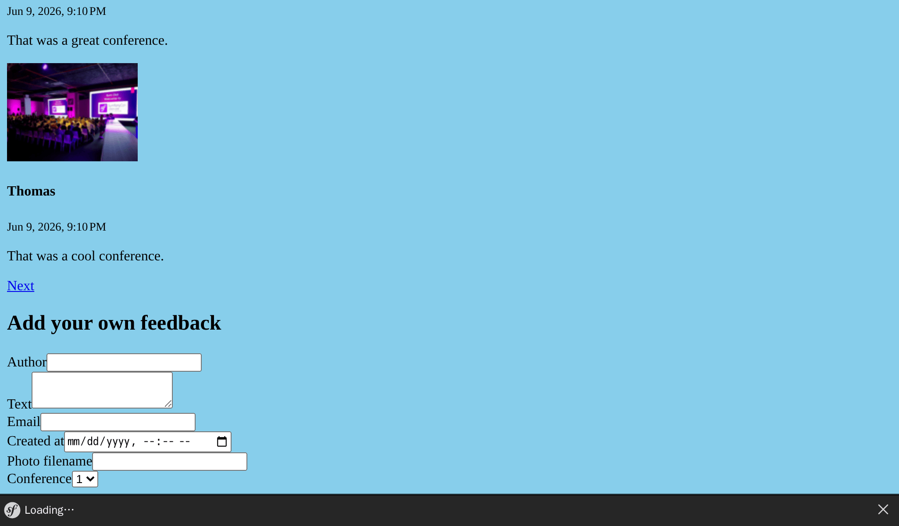
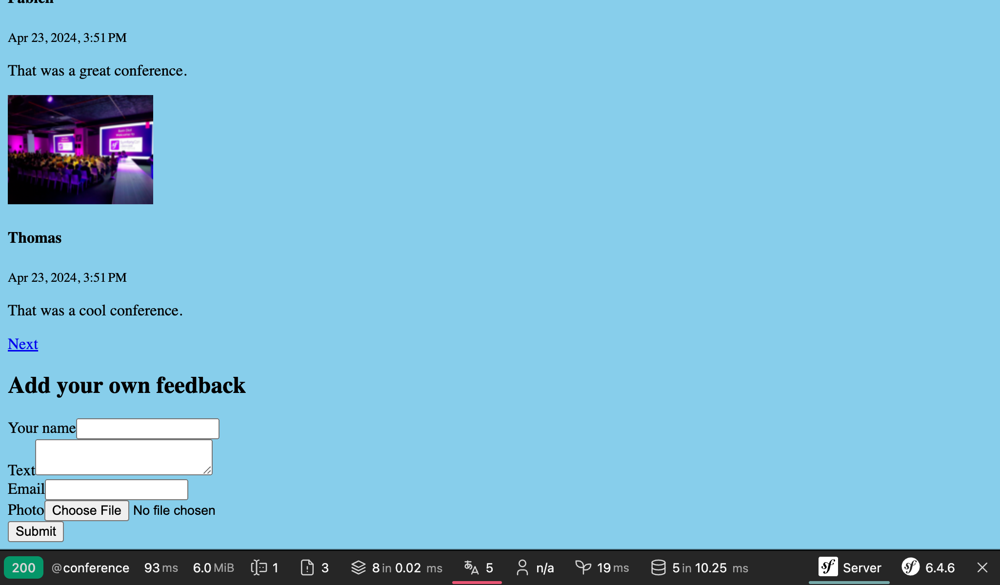

Accepting Feedback with Forms
=============================

.. index::
    single: Components;Form
    single: Form

Time to let our attendees give feedback on conferences. They will contribute their comments through an *HTML form*.

Generating a Form Type
----------------------

.. index::
    single: Command;make:form

Use the Maker bundle to generate a form class:

.. code-block:: terminal

    $ symfony console make:form CommentType Comment

.. code-block:: text
    :class: ignore
    :emphasize-lines: 1

     created: src/Form/CommentType.php

      Success!

     Next: Add fields to your form and start using it.
     Find the documentation at https://symfony.com/doc/current/forms.html

The ``App\Form\CommentType`` class defines a form for the ``App\Entity\Comment`` entity:

.. code-block:: php
    :caption: src/Form/CommentType.php
    :class: ignore

    namespace App\Form;

    use App\Entity\Comment;
    use Symfony\Component\Form\AbstractType;
    use Symfony\Component\Form\FormBuilderInterface;
    use Symfony\Component\OptionsResolver\OptionsResolver;

    class CommentType extends AbstractType
    {
        public function buildForm(FormBuilderInterface $builder, array $options)
        {
            $builder
                ->add('author')
                ->add('text')
                ->add('email')
                ->add('createdAt')
                ->add('photoFilename')
                ->add('conference')
            ;
        }

        public function configureOptions(OptionsResolver $resolver)
        {
            $resolver->setDefaults([
                'data_class' => Comment::class,
            ]);
        }
    }

A `form type`_ describes the *form fields* bound to a model. It does the data conversion between submitted data and the model class properties. By default, Symfony uses metadata from the ``Comment`` entity - such as the Doctrine metadata - to guess configuration about each field. For example, the ``text`` field renders as a ``textarea`` because it uses a larger column in the database.

Displaying a Form
-----------------

To display the form to the user, create the form in the controller and pass it to the template:

.. code-block:: diff
    :caption: patch_file
    :emphasize-lines: 20,30

    --- i/src/Controller/ConferenceController.php
    +++ w/src/Controller/ConferenceController.php
    @@ -2,8 +2,10 @@

     namespace App\Controller;

    +use App\Entity\Comment;
     use App\Entity\Conference;
    +use App\Form\CommentType;
     use App\Repository\CommentRepository;
     use App\Repository\ConferenceRepository;
     use Symfony\Bridge\Doctrine\Attribute\MapEntity;
     use Symfony\Bundle\FrameworkBundle\Controller\AbstractController;
    @@ -23,6 +25,9 @@ final class ConferenceController extends AbstractController
         #[Route('/conference/{slug}', name: 'conference')]
         public function show(Request $request, #[MapEntity(mapping: ['slug' => 'slug'])] Conference $conference, CommentRepository $commentRepository): Response
         {
    +        $comment = new Comment();
    +        $form = $this->createForm(CommentType::class, $comment);
    +
             $offset = max(0, $request->query->getInt('offset', 0));
             $paginator = $commentRepository->getCommentPaginator($conference, $offset);

    @@ -31,6 +36,7 @@ final class ConferenceController extends AbstractController
                 'comments' => $paginator,
                 'previous' => $offset - CommentRepository::COMMENTS_PER_PAGE,
                 'next' => min(count($paginator), $offset + CommentRepository::COMMENTS_PER_PAGE),
    +            'comment_form' => $form,
             ]);
         }
     }

You should never instantiate the form type directly. Instead, use the ``createForm()`` method. This method is part of ``AbstractController`` and eases the creation of forms.

.. index::
    single: Twig;form

Displaying the form in the template can be done via the ``form`` Twig function:

.. code-block:: diff
    :caption: patch_file
    :emphasize-lines: 10

    --- i/templates/conference/show.html.twig
    +++ w/templates/conference/show.html.twig
    @@ -30,4 +30,8 @@
         
             
No comments have been posted yet for this conference.

         
    +
    +    <h2>Add your own feedback</h2>
    +
    +    {{ form(comment_form) }}
     

When refreshing a conference page in the browser, note that each form field shows the right HTML widget (the data type is derived from the model):

The ``form()`` function generates the HTML form based on all the information defined in the Form type. It also adds ``enctype=multipart/form-data`` on the ``<form>`` tag as required by the file upload input field. Moreover, it takes care of displaying error messages when the submission has some errors. Everything can be customized by overriding the default templates, but we won't need it for this project.

Customizing a Form Type
-----------------------

Even if form fields are configured based on their model counterpart, you can customize the default configuration in the form type class directly:

.. code-block:: diff
    :caption: patch_file

    --- i/src/Form/CommentType.php
    +++ w/src/Form/CommentType.php
    @@ -6,26 +6,32 @@ use App\Entity\Comment;
     use App\Entity\Conference;
     use Symfony\Bridge\Doctrine\Form\Type\EntityType;
     use Symfony\Component\Form\AbstractType;
    +use Symfony\Component\Form\Extension\Core\Type\EmailType;
    +use Symfony\Component\Form\Extension\Core\Type\FileType;
    +use Symfony\Component\Form\Extension\Core\Type\SubmitType;
     use Symfony\Component\Form\FormBuilderInterface;
     use Symfony\Component\OptionsResolver\OptionsResolver;
    +use Symfony\Component\Validator\Constraints\Image;

     class CommentType extends AbstractType
     {
         public function buildForm(FormBuilderInterface $builder, array $options): void
         {
             $builder
    -            ->add('author')
    +            ->add('author', null, [
    +                'label' => 'Your name',
    +            ])
                 ->add('text')
    -            ->add('email')
    -            ->add('createdAt', null, [
    -                'widget' => 'single_text',
    +            ->add('email', EmailType::class)
    +            ->add('photo', FileType::class, [
    +                'required' => false,
    +                'mapped' => false,
    +                'constraints' => [
    +                    new Image(maxSize: '1024k')
    +                ],
                 ])
    -            ->add('photoFilename')
    -            ->add('conference', EntityType::class, [
    -                'class' => Conference::class,
    -                'choice_label' => 'id',
    -            ])
    -        ;
    +            ->add('submit', SubmitType::class)
    +       ;
         }

         public function configureOptions(OptionsResolver $resolver): void

Note that we have added a submit button (that allows us to keep using the simple ``{{ form(comment_form) }}`` expression in the template).

Some fields cannot be auto-configured, like the ``photoFilename`` one. The ``Comment`` entity only needs to save the photo filename, but the form has to deal with the file upload itself. To handle this case, we have added a field called ``photo`` as un-``mapped`` field: it won't be mapped to any property on ``Comment``. We will manage it manually to implement some specific logic (like storing the uploaded photo on disk).

As an example of customization, we have also modified the default label for some fields.

Validating Models
-----------------

The Form Type configures the frontend rendering of the form (via some HTML5 validation). Here is the generated HTML form:

.. code-block:: html
    :class: ignore

    <form name="comment_form" method="post" enctype="multipart/form-data">
        

            

                <label for="comment_form_author" class="required">Your name</label>
                <input type="text" id="comment_form_author" name="comment_form[author]" required="required" maxlength="255" />
            

            

                <label for="comment_form_text" class="required">Text</label>
                <textarea id="comment_form_text" name="comment_form[text]" required="required"></textarea>
            

            

                <label for="comment_form_email" class="required">Email</label>
                <input type="email" id="comment_form_email" name="comment_form[email]" required="required" />
            

            

                <label for="comment_form_photo">Photo</label>
                <input type="file" id="comment_form_photo" name="comment_form[photo]" />
            

            

                <button type="submit" id="comment_form_submit" name="comment_form[submit]">Submit</button>
            

            <input type="hidden" id="comment_form__token" name="comment_form[_token]" value="DwqsEanxc48jofxsqbGBVLQBqlVJ_Tg4u9-BL1Hjgac" />
        

    </form>

The form uses the ``email`` input for the comment email and makes most of the fields ``required``. Note that the form also contains a ``_token`` hidden field to protect the form from `CSRF attacks`_.

But if the form submission bypasses the HTML validation (by using an HTTP client that does not enforce these validation rules like cURL), invalid data can hit the server.

We also need to add some validation constraints on the ``Comment`` data model:

.. code-block:: diff
    :caption: patch_file

    --- i/src/Entity/Comment.php
    +++ w/src/Entity/Comment.php
    @@ -5,6 +5,7 @@ namespace App\Entity;
     use App\Repository\CommentRepository;
     use Doctrine\DBAL\Types\Types;
     use Doctrine\ORM\Mapping as ORM;
    +use Symfony\Component\Validator\Constraints as Assert;

     #[ORM\Entity(repositoryClass: CommentRepository::class)]
     #[ORM\HasLifecycleCallbacks]
    @@ -16,12 +17,16 @@ class Comment
         private ?int $id = null;

         #[ORM\Column(length: 255)]
    +    #[Assert\NotBlank]
         private ?string $author = null;

         #[ORM\Column(type: Types::TEXT)]
    +    #[Assert\NotBlank]
         private ?string $text = null;

         #[ORM\Column(length: 255)]
    +    #[Assert\NotBlank]
    +    #[Assert\Email]
         private ?string $email = null;

         #[ORM\Column]

Handling a Form
---------------

The code we have written so far is enough to display the form.

We should now handle the form submission and the persistence of its information to the database in the controller:

.. code-block:: diff
    :caption: patch_file

    --- i/src/Controller/ConferenceController.php
    +++ w/src/Controller/ConferenceController.php
    @@ -7,7 +7,8 @@ use App\Entity\Conference;
     use App\Form\CommentType;
     use App\Repository\CommentRepository;
     use App\Repository\ConferenceRepository;
    +use Doctrine\ORM\EntityManagerInterface;
     use Symfony\Bridge\Doctrine\Attribute\MapEntity;
     use Symfony\Bundle\FrameworkBundle\Controller\AbstractController;
     use Symfony\Component\HttpFoundation\Request;
     use Symfony\Component\HttpFoundation\Response;
    @@ -14,6 +15,11 @@ use Symfony\Component\Routing\Attribute\Route;

     final class ConferenceController extends AbstractController
     {
    +    public function __construct(
    +        private EntityManagerInterface $entityManager,
    +    ) {
    +    }
    +
         #[Route('/', name: 'homepage')]
         public function index(ConferenceRepository $conferenceRepository): Response
         {
    @@ -27,6 +33,15 @@ final class ConferenceController extends AbstractController
         {
             $comment = new Comment();
             $form = $this->createForm(CommentType::class, $comment);
    +        $form->handleRequest($request);
    +        if ($form->isSubmitted() && $form->isValid()) {
    +            $comment->setConference($conference);
    +
    +            $this->entityManager->persist($comment);
    +            $this->entityManager->flush();
    +
    +            return $this->redirectToRoute('conference', ['slug' => $conference->getSlug()]);
    +        }

             $offset = max(0, $request->query->getInt('offset', 0));
             $paginator = $commentRepository->getCommentPaginator($conference, $offset);

When the form is submitted, the ``Comment`` object is updated according to the submitted data.

The conference is forced to be the same as the one from the URL (we removed it from the form).

If the form is not valid, we display the page, but the form will now contain submitted values and error messages so that they can be displayed back to the user.

Try the form. It should work well and the data should be stored in the database (check it in the admin backend). There is one problem though: photos. They do not work as we have not handled them yet in the controller.

Uploading Files
---------------

Uploaded photos should be stored on the local disk, somewhere accessible by the frontend so that we can display them on the conference page. We will store them under the ``public/uploads/photos`` directory.

.. index::
    single: Attribute;Autowire
    single: Autowire

As we don't want to hardcode the directory path in the code, we need a way to store it globally in the configuration. The Symfony Container is able to store *parameters* in addition to services, which are scalars that help configure services:

.. code-block:: diff
    :caption: patch_file

    --- i/config/services.yaml
    +++ w/config/services.yaml
    @@ -4,6 +4,7 @@
     # Put parameters here that don't need to change on each machine where the app is deployed
     # https://symfony.com/doc/current/best_practices.html#use-parameters-for-application-configuration
     parameters:
    +    photo_dir: "%kernel.project_dir%/public/uploads/photos"

     services:
         # default configuration for services in *this* file

We have already seen how services are automatically injected into constructor arguments. For container parameters, we can explicitly inject them via the ``Autowire`` attribute.

Now, we have everything we need to know to implement the logic needed to store the uploaded file to its final destination:

.. code-block:: diff
    :caption: patch_file

    --- i/src/Controller/ConferenceController.php
    +++ w/src/Controller/ConferenceController.php
    @@ -9,7 +9,8 @@ use App\Repository\CommentRepository;
     use App\Repository\ConferenceRepository;
     use Doctrine\ORM\EntityManagerInterface;
     use Symfony\Bridge\Doctrine\Attribute\MapEntity;
     use Symfony\Bundle\FrameworkBundle\Controller\AbstractController;
    +use Symfony\Component\DependencyInjection\Attribute\Autowire;
     use Symfony\Component\HttpFoundation\Request;
     use Symfony\Component\HttpFoundation\Response;
     use Symfony\Component\Routing\Attribute\Route;
    @@ -29,13 +30,23 @@ final class ConferenceController extends AbstractController
         }

         #[Route('/conference/{slug}', name: 'conference')]
    -    public function show(Request $request, #[MapEntity(mapping: ['slug' => 'slug'])] Conference $conference, CommentRepository $commentRepository): Response
    -    {
    +    public function show(
    +        Request $request,
    +        #[MapEntity(mapping: ['slug' => 'slug'])]
    +        Conference $conference,
    +        CommentRepository $commentRepository,
    +        #[Autowire('%photo_dir%')] string $photoDir,
    +    ): Response {
             $comment = new Comment();
             $form = $this->createForm(CommentType::class, $comment);
             $form->handleRequest($request);
             if ($form->isSubmitted() && $form->isValid()) {
                 $comment->setConference($conference);
    +            if ($photo = $form['photo']->getData()) {
    +                $filename = bin2hex(random_bytes(6)).'.'.$photo->guessExtension();
    +                $photo->move($photoDir, $filename);
    +                $comment->setPhotoFilename($filename);
    +            }

                 $this->entityManager->persist($comment);
                 $this->entityManager->flush();

To manage photo uploads, we create a random name for the file. Then, we move the uploaded file to its final location (the photo directory). Finally, we store the filename in the Comment object.

Try to upload a PDF file instead of a photo. You should see the error messages in action. The design is quite ugly at the moment, but don't worry, everything will turn beautiful in a few steps when we will work on the design of the website. For the forms, we will change one line of configuration to style all form elements.

Debugging Forms
---------------

When a form is submitted and something does not work quite well, use the "Form" panel of the Symfony Profiler. It gives you information about the form, all its options, the submitted data and how they are converted internally. If the form contains any errors, they will be listed as well.

The typical form workflow goes like this:

* The form is displayed on a page;

* The user submits the form via a POST request;

* The server redirects the user to another page or the same page.

But how can you access the profiler for a successful submit request? Because the page is immediately redirected, we never see the web debug toolbar for the POST request. No problem: on the redirected page, hover over the left "200" green part. You should see the "302" redirection with a link to the profile (in parenthesis).

.. figure:: screenshots/form-wdt.png
    :alt: /conference/amsterdam-2019
    :align: center
    :figclass: with-browser

Click on it to access the POST request profile, and go to the "Form" panel:

.. code-block:: terminal
    :class: hide

    $ rm -rf var/cache

.. figure:: screenshots/form-profiler.png
    :alt: /_profiler/450aa5
    :align: center
    :figclass: with-browser

Displaying Uploaded Photos in the Admin Backend
-----------------------------------------------

The admin backend is currently displaying the photo filename, but we want to see the actual photo:

.. code-block:: diff
    :caption: patch_file

    --- i/src/Controller/Admin/CommentCrudController.php
    +++ w/src/Controller/Admin/CommentCrudController.php
    @@ -10,6 +10,7 @@ use EasyCorp\Bundle\EasyAdminBundle\Field\AssociationField;
     use EasyCorp\Bundle\EasyAdminBundle\Field\DateTimeField;
     use EasyCorp\Bundle\EasyAdminBundle\Field\EmailField;
     use EasyCorp\Bundle\EasyAdminBundle\Field\IdField;
    +use EasyCorp\Bundle\EasyAdminBundle\Field\ImageField;
     use EasyCorp\Bundle\EasyAdminBundle\Field\TextareaField;
     use EasyCorp\Bundle\EasyAdminBundle\Field\TextEditorField;
     use EasyCorp\Bundle\EasyAdminBundle\Field\TextField;
    @@ -47,7 +48,9 @@ class CommentCrudController extends AbstractCrudController
             yield TextareaField::new('text')
                 ->hideOnIndex()
             ;
    -        yield TextField::new('photoFilename')
    +        yield ImageField::new('photoFilename')
    +            ->setBasePath('/uploads/photos')
    +            ->setLabel('Photo')
                 ->onlyOnIndex()
             ;

Excluding Uploaded Photos from Git
----------------------------------

Don't commit yet! We don't want to store uploaded images in the Git repository. Add the ``/public/uploads`` directory to the ``.gitignore`` file:

.. code-block:: diff
    :caption: patch_file

    --- i/.gitignore
    +++ w/.gitignore
    @@ -1,3 +1,4 @@
    +/public/uploads

     ###> symfony/framework-bundle ###
     /.env.local

Storing Uploaded Files on Production Servers
--------------------------------------------

The last step is to store the uploaded files on production servers. Why would we have to do something special? Because most modern cloud platforms use read-only containers for various reasons. Platform.sh is no exception.

Not everything is read-only in a Symfony project. We try hard to generate as much cache as possible when building the container (during the cache warmup phase), but Symfony still needs to be able to write somewhere for the user cache, the logs, the sessions if they are stored on the filesystem, and more.

Have a look at ``.platform.app.yaml``, there is already a writeable *mount* for the ``var/`` directory. The ``var/`` directory is the only directory where Symfony writes (caches, logs, ...).

Let's create a new mount for uploaded photos:

.. code-block:: diff
    :caption: patch_file

    --- i/.platform.app.yaml
    +++ w/.platform.app.yaml
    @@ -31,6 +31,7 @@ web:

     mounts:
         "/var/cache": { source: local, source_path: var/cache }
    +    "/public/uploads": { source: local, source_path: uploads }

     relationships:

You can now deploy the code and photos will be stored in the ``public/uploads/`` directory like our local version.

.. sidebar:: Going Further

    * `SymfonyCasts Forms tutorial`_;

    * How to `customize Symfony Form rendering in HTML`_;

    * `Validating Symfony Forms`_;

    * The `Symfony Form Types reference`_;

    * The `FlysystemBundle docs`_, which provides integration with multiple cloud storage providers, such as AWS S3, Azure and Google Cloud Storage;

    * The `Symfony Configuration Parameters`_.

    * The `Symfony Validation Constraints`_;

    * The `Symfony Form Cheat Sheet`_.

.. _`CSRF attacks`: https://owasp.org/www-community/attacks/csrf
.. _`form type`: https://symfony.com/doc/current/forms.html#form-types
.. _`SymfonyCasts Forms tutorial`: https://symfonycasts.com/screencast/symfony-forms
.. _`customize Symfony Form rendering in HTML`: https://symfony.com/doc/current/form/form_customization.html
.. _`Validating Symfony Forms`: https://symfony.com/doc/current/forms.html#validating-forms
.. _`Symfony Form Types reference`: https://symfony.com/doc/current/reference/forms/types.html
.. _`FlysystemBundle docs`: https://github.com/thephpleague/flysystem-bundle/blob/master/docs/1-getting-started.md
.. _`Symfony Configuration Parameters`: https://symfony.com/doc/current/configuration.html#configuration-parameters
.. _`Symfony Validation Constraints`: https://symfony.com/doc/current/validation.html#basic-constraints
.. _`Symfony Form Cheat Sheet`: https://github.com/andreia/symfony-cheat-sheets/blob/master/Symfony2/how_symfony2_forms_works_en.pdf
