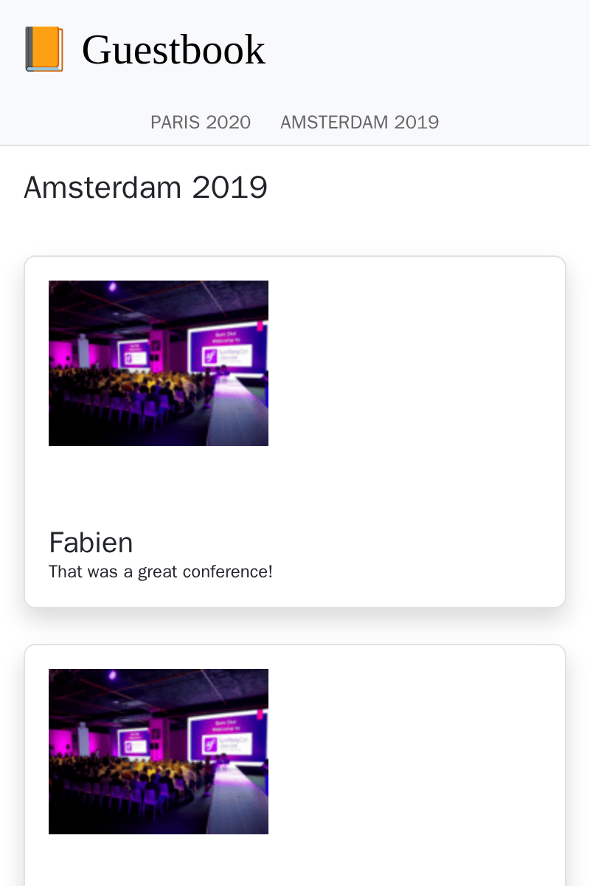

Building an SPA
===============

.. index::
    single: SPA
    single: Mobile

Most of the comments will be submitted during the conference where some people do not bring a laptop. But they probably have a smartphone. What about creating a mobile app to quickly check the conference comments?

One way to create such a mobile application is to build a Javascript Single Page Application (SPA). An SPA runs locally, can use local storage, can call a remote HTTP API, and can leverage service workers to create an almost native experience.

Creating the Application
------------------------

To create the mobile application, we are going to use `Preact`_ and **Symfony Encore**. **Preact** is a small and efficient foundation well-suited for the Guestbook SPA.

To make both the website and the SPA consistent, we are going to reuse the Sass stylesheets of the website for the mobile application.

Create the SPA application under the ``spa`` directory and copy the website stylesheets:

.. code-block:: terminal

    $ mkdir -p spa/src spa/public spa/assets/styles
    $ cp assets/styles/*.scss spa/assets/styles/
    $ cd spa

.. note::

    We have created a ``public`` directory as we will mainly interact with the SPA via a browser. We could have named it ``build`` if we only wanted to build a mobile application.

For good measure, add a ``.gitignore`` file:

.. code-block:: text
    :caption: .gitignore

    /node_modules/
    /public/
    /npm-debug.log
    # used later by Cordova
    /app/

Initialize the ``package.json`` file (equivalent of the ``composer.json`` file for JavaScript):

.. code-block:: terminal

    $ npm init -y
    $ npm pkg delete type

Now, add some required dependencies:

.. code-block:: terminal

    $ npm install @symfony/webpack-encore @babel/core @babel/preset-env babel-preset-preact preact html-webpack-plugin bootstrap

The last configuration step is to create the Webpack Encore configuration:

.. code-block:: javascript
    :caption: webpack.config.js
    :emphasize-lines: 8,11

    const Encore = require('@symfony/webpack-encore');
    const HtmlWebpackPlugin = require('html-webpack-plugin');

    Encore
        .setOutputPath('public/')
        .setPublicPath('/')
        .cleanupOutputBeforeBuild()
        .addEntry('app', './src/app.js')
        .enablePreactPreset()
        .enableSingleRuntimeChunk()
        .addPlugin(new HtmlWebpackPlugin({ template: 'src/index.ejs', alwaysWriteToDisk: true }))
    ;

    module.exports = Encore.getWebpackConfig();

Creating the SPA Main Template
------------------------------

Time to create the initial template in which Preact will render the application:

.. code-block:: html
    :caption: src/index.ejs
    :emphasize-lines: 12

    <!DOCTYPE html>
    <html>
    <head>
        <meta http-equiv="Content-Type" content="text/html; charset=utf-8" />
        <meta http-equiv="X-UA-Compatible" content="IE=edge" />
        <meta name="msapplication-tap-highlight" content="no" />
        <meta name="viewport" content="user-scalable=no, initial-scale=1, maximum-scale=1, minimum-scale=1, width=device-width" />

        <title>Conference Guestbook application</title>
    </head>
    <body>
        

    </body>
    </html>

The ``
`` tag is where the application will be rendered by JavaScript. Here is the first version of the code that renders the "Hello World" view:

.. code-block:: text
    :caption: src/app.js
    :emphasize-lines: 3,11

    import {h, render} from 'preact';

    function App() {
        return (
            

                Hello world!
            

        )
    }

    render(<App />, document.getElementById('app'));

The last line registers the ``App()`` function on the ``#app`` element of the HTML page.

Everything is now ready!

Running an SPA in the Browser
-----------------------------

.. index::
    single: Symfony CLI;server:start
    single: Symfony CLI;server:stop

As this application is independent of the main website, we need to run another web server:

.. code-block:: terminal
    :class: hide

    $ symfony server:stop

.. code-block:: terminal

    $ symfony server:start -d --passthru=index.html

The ``--passthru`` flag tells the web server to pass all HTTP requests to the ``public/index.html`` file (``public/`` is the web server default web root directory). This page is managed by the Preact application and it gets the page to render via the "browser" history.

To compile the CSS **and the JavaScript** files, run ``npm``:

.. code-block:: terminal

    $ ./node_modules/.bin/encore dev

Open the SPA in a browser:

.. code-block:: terminal
    :class: ignore

    $ symfony open:local

And look at our hello world SPA:

.. figure:: screenshots/spa.png
    :alt: /
    :align: center
    :figclass: with-browser spa

Adding a Router to handle States
--------------------------------

The SPA is currently not able to handle different pages. To implement several pages, we need a router, like for Symfony. We are going to use **preact-router**. It takes a URL as input and matches a Preact component to display.

Install preact-router:

.. code-block:: terminal

    $ npm install preact-router

Create a page for the homepage (a *Preact component*):

.. code-block:: text
    :caption: src/pages/home.js

    import {h} from 'preact';

    export default function Home() {
        return (
            
Home

        );
    };

And another for the conference page:

.. code-block:: text
    :caption: src/pages/conference.js

    import {h} from 'preact';

    export default function Conference() {
        return (
            
Conference

        );
    };

Replace the "Hello World" ``div`` with the ``Router`` component:

.. code-block:: diff
    :caption: patch_file
    :emphasize-lines: 15,17,20-23

    --- i/src/app.js
    +++ w/src/app.js
    @@ -1,9 +1,22 @@
     import {h, render} from 'preact';
    +import {Router, Link} from 'preact-router';
    +
    +import Home from './pages/home';
    +import Conference from './pages/conference';

     function App() {
         return (
             

    -            Hello world!
    +            <header>
    +                <Link href="/">Home</Link>
    +                 
    +                <Link href="/conference/amsterdam2019">Amsterdam 2019</Link>
    +            </header>
    +
    +            <Router>
    +                <Home path="/" />
    +                <Conference path="/conference/:slug" />
    +            </Router>
             

         )
     }

Rebuild the application:

.. code-block:: terminal

    $ ./node_modules/.bin/encore dev

If you refresh the application in the browser, you can now click on the "Home" and conference links. Note that the browser URL and the back/forward buttons of your browser work as you would expect it.

Styling the SPA
---------------

As for the website, let's add the Sass loader:

.. code-block:: terminal

    $ npm install sass sass-loader

Enable the Sass loader in Webpack and add a reference to the stylesheet:

.. code-block:: diff
    :caption: patch_file

    --- i/src/app.js
    +++ w/src/app.js
    @@ -1,3 +1,5 @@
    +import '../assets/styles/app.scss';
    +
     import {h, render} from 'preact';
     import {Router, Link} from 'preact-router';

    --- i/webpack.config.js
    +++ w/webpack.config.js
    @@ -7,6 +7,7 @@ Encore
         .cleanupOutputBeforeBuild()
         .addEntry('app', './src/app.js')
         .enablePreactPreset()
    +    .enableSassLoader()
         .enableSingleRuntimeChunk()
         .addPlugin(new HtmlWebpackPlugin({ template: 'src/index.ejs', alwaysWriteToDisk: true }))
     ;

We can now update the application to use the stylesheets:

.. code-block:: diff
    :caption: patch_file

    --- i/src/app.js
    +++ w/src/app.js
    @@ -9,10 +9,20 @@ import Conference from './pages/conference';
     function App() {
         return (
             

    -            <header>
    -                <Link href="/">Home</Link>
    -                 
    -                <Link href="/conference/amsterdam2019">Amsterdam 2019</Link>
    +            <header className="header">
    +                <nav className="navbar navbar-light bg-light">
    +                    

    +                        <Link className="navbar-brand mr-4 pr-2" href="/">
    +                            &#128217; Guestbook
    +                        </Link>
    +                    

    +                </nav>
    +
    +                <nav className="bg-light border-bottom text-center">
    +                    <Link className="nav-conference" href="/conference/amsterdam2019">
    +                        Amsterdam 2019
    +                    </Link>
    +                </nav>
                 </header>

                 <Router>

Rebuild the application once more:

.. code-block:: terminal

    $ ./node_modules/.bin/encore dev

You can now enjoy a fully styled SPA:

.. figure:: screenshots/spa-home.png
    :alt: /
    :align: center
    :figclass: with-browser spa

Fetching Data from the API
--------------------------

The Preact application structure is now finished: Preact Router handles the page states - including the conference slug placeholder - and the main application stylesheet is used to style the SPA.

To make the SPA dynamic, we need to fetch the data from the API via HTTP calls.

Configure Webpack to expose the API endpoint environment variable:

.. code-block:: diff
    :caption: patch_file

    --- i/webpack.config.js
    +++ w/webpack.config.js
    @@ -1,3 +1,4 @@
    +const webpack = require('webpack');
     const Encore = require('@symfony/webpack-encore');
     const HtmlWebpackPlugin = require('html-webpack-plugin');

    @@ -10,6 +11,9 @@ Encore
         .enableSassLoader()
         .enableSingleRuntimeChunk()
         .addPlugin(new HtmlWebpackPlugin({ template: 'src/index.ejs', alwaysWriteToDisk: true }))
    +    .addPlugin(new webpack.DefinePlugin({
    +        'ENV_API_ENDPOINT': JSON.stringify(process.env.API_ENDPOINT),
    +    }))
     ;

     module.exports = Encore.getWebpackConfig();

The ``API_ENDPOINT`` environment variable should point to the web server of the website where we have the API endpoint under ``/api``. We will configure it properly when we run ``npm`` soon.

Create an ``api.js`` file that abstracts data retrieval from the API:

.. code-block:: text
    :caption: src/api/api.js

    function fetchCollection(path) {
        return fetch(ENV_API_ENDPOINT + path).then(resp => resp.json()).then(json => json['member']);
    }

    export function findConferences() {
        return fetchCollection('api/conferences');
    }

    export function findComments(conference) {
        return fetchCollection('api/comments?conference='+conference.id);
    }

You can now adapt the header and home components:

.. code-block:: diff
    :caption: patch_file

    --- i/src/app.js
    +++ w/src/app.js
    @@ -2,11 +2,23 @@ import '../assets/styles/app.scss';

     import {h, render} from 'preact';
     import {Router, Link} from 'preact-router';
    +import {useState, useEffect} from 'preact/hooks';

    +import {findConferences} from './api/api';
     import Home from './pages/home';
     import Conference from './pages/conference';

     function App() {
    +    const [conferences, setConferences] = useState(null);
    +
    +    useEffect(() => {
    +        findConferences().then((conferences) => setConferences(conferences));
    +    }, []);
    +
    +    if (conferences === null) {
    +        return 
Loading...
;
    +    }
    +
         return (
             

                 <header className="header">
    @@ -19,15 +31,17 @@ function App() {
                     </nav>

                     <nav className="bg-light border-bottom text-center">
    -                    <Link className="nav-conference" href="/conference/amsterdam2019">
    -                        Amsterdam 2019
    -                    </Link>
    +                    {conferences.map((conference) => (
    +                        <Link className="nav-conference" href={'/conference/'+conference.slug}>
    +                            {conference.city} {conference.year}
    +                        </Link>
    +                    ))}
                     </nav>
                 </header>

                 <Router>
    -                <Home path="/" />
    -                <Conference path="/conference/:slug" />
    +                <Home path="/" conferences={conferences} />
    +                <Conference path="/conference/:slug" conferences={conferences} />
                 </Router>
             

         )
    --- i/src/pages/home.js
    +++ w/src/pages/home.js
    @@ -1,7 +1,28 @@
     import {h} from 'preact';
    +import {Link} from 'preact-router';
    +
    +export default function Home({conferences}) {
    +    if (!conferences) {
    +        return 
No conferences yet
;
    +    }

    -export default function Home() {
         return (
    -        
Home

    +        

    +            {conferences.map((conference)=> (
    +                

    +                    

    +                        

    +                            <h4 className="font-weight-light">
    +                                {conference.city} {conference.year}
    +                            </h4>
    +                        

    +
    +                        <Link className="btn btn-sm btn-primary stretched-link" href={'/conference/'+conference.slug}>
    +                            View
    +                        </Link>
    +                    

    +                

    +            ))}
    +        

         );
    -};
    +}

Finally, Preact Router is passing the "slug" placeholder to the Conference component as a property. Use it to display the proper conference and its comments, again using the API; and adapt the rendering to use the API data:

.. code-block:: diff
    :caption: patch_file

    --- i/src/pages/conference.js
    +++ w/src/pages/conference.js
    @@ -1,7 +1,48 @@
     import {h} from 'preact';
    +import {findComments} from '../api/api';
    +import {useState, useEffect} from 'preact/hooks';
    +
    +function Comment({comments}) {
    +    if (comments !== null && comments.length === 0) {
    +        return 
No comments yet
;
    +    }
    +
    +    if (!comments) {
    +        return 
Loading...
;
    +    }

    -export default function Conference() {
         return (
    -        
Conference

    +        

    +            {comments.map(comment => (
    +                

    +                    

    +                        {!comment.photoFilename ? '' : (
    +                            <a href={ENV_API_ENDPOINT+'uploads/photos/'+comment.photoFilename} target="_blank">
    +                                
    +                            </a>
    +                        )}
    +                    

    +
    +                    <h5 className="font-weight-light mt-3 mb-0">{comment.author}</h5>
    +                    
{comment.text}

    +                

    +            ))}
    +        

         );
    -};
    +}
    +
    +export default function Conference({conferences, slug}) {
    +    const conference = conferences.find(conference => conference.slug === slug);
    +    const [comments, setComments] = useState(null);
    +
    +    useEffect(() => {
    +        findComments(conference).then(comments => setComments(comments));
    +    }, [slug]);
    +
    +    return (
    +        

    +            <h4>{conference.city} {conference.year}</h4>
    +            <Comment comments={comments} />
    +        

    +    );
    +}

The SPA now needs to know the URL to our API, via the ``API_ENDPOINT`` environment variable. Set it to the API web server URL (running in the ``..`` directory):

.. code-block:: terminal

    $ API_ENDPOINT=`symfony var:export SYMFONY_PROJECT_DEFAULT_ROUTE_URL --dir=..` ./node_modules/.bin/encore dev

You could also run in the background now:

.. code-block:: terminal

    $ API_ENDPOINT=`symfony var:export SYMFONY_PROJECT_DEFAULT_ROUTE_URL --dir=..` symfony run -d --watch=webpack.config.js ./node_modules/.bin/encore dev --watch

And the application in the browser should now work properly:

.. figure:: screenshots/spa-home-final.png
    :alt: /
    :align: center
    :figclass: with-browser spa

Wow! We now have a fully-functional, SPA with router and real data. We could organize the Preact app further if we wanted, but it is already working great.

Deploying the SPA to Production
-------------------------------

.. index::
    single: Upsun;Multi-Applications

Upsun allows deploying multiple applications per project. Move back to the project root and add a second application named ``spa``, rooted in the ``spa/`` directory, to ``.upsun/config.yaml``:

.. code-block:: terminal

    $ cd ../

.. code-block:: diff
    :caption: patch_file

    --- i/.upsun/config.yaml
    +++ w/.upsun/config.yaml
    @@ -20,6 +20,36 @@ services:
             disk: 256

     applications:
    +    spa:
    +        source:
    +            root: "/spa"
    +
    +        type: nodejs:24
    +
    +        size: S
    +
    +        build:
    +            flavor: none
    +
    +        web:
    +            commands:
    +                start: sleep
    +            locations:
    +                "/":
    +                    root: "public"
    +                    index:
    +                        - "index.html"
    +                    scripts: false
    +                    expires: 10m
    +
    +        hooks:
    +            build: |
    +                set -x -e
    +
    +                curl -fs https://get.symfony.com/cloud/configurator | bash
    +
    +                NODE_VERSION=24 node-build
    +
         app:
             source:
                 root: "/"

.. index::
    single: Upsun;Routes

Edit the ``.upsun/config.yaml`` file to route the ``spa.`` subdomain to the ``spa`` application:

.. code-block:: diff
    :caption: patch_file
    :emphasize-lines: 5,6

    --- i/.upsun/config.yaml
    +++ w/.upsun/config.yaml
    @@ -2,6 +2,9 @@ routes:
         "https://{all}/": { type: upstream, upstream: "varnish:http", cache: { enabled: false } }
         "http://{all}/": { type: redirect, to: "https://{all}/" }

    +    "https://spa.{all}/": { type: upstream, upstream: "spa:http" }
    +    "http://spa.{all}/": { type: redirect, to: "https://spa.{all}/" }
    +
     services:

Configuring CORS for the SPA
----------------------------

.. index::
    single: CORS
    single: Cross-Origin Resource Sharing

If you deploy the code now, it won't work as a browser would block the API request. We need to explicitly allow the SPA to access the API. Get the current domain name attached to your application:

.. code-block:: terminal

    $ symfony cloud:env:url --pipe --primary

Define the ``CORS_ALLOW_ORIGIN`` environment variable accordingly:

.. code-block:: terminal

    $ symfony cloud:variable:create --sensitive=1 --level=project -y --name=env:CORS_ALLOW_ORIGIN --value="^`symfony cloud:env:url --pipe --primary | sed 's#/$##' | sed 's#https://#https://spa.#'`$"

If your domain is ``https://master-5szvwec-hzhac461b3a6o.eu-5.platformsh.site/``, the ``sed`` calls will convert it to ``https://spa.master-5szvwec-hzhac461b3a6o.eu-5.platformsh.site``.

We also need to set the ``API_ENDPOINT`` environment variable:

.. code-block:: terminal

    $ symfony cloud:variable:create --sensitive=1 --level=project -y --name=env:API_ENDPOINT --value=`symfony cloud:env:url --pipe --primary`

Commit and deploy:

.. code-block:: terminal
    :class: ignore

    $ git add .
    $ git commit -a -m'Add the SPA application'
    $ symfony cloud:push

Access the SPA in a browser by specifying the application as a flag:

.. code-block:: terminal
    :class: ignore

    $ symfony cloud:url -1 --app=spa

Using Cordova to build a Smartphone Application
-----------------------------------------------

.. index::
    single: SPA;Cordova
    single: Apache Cordova
    single: Cordova

**Apache Cordova** is a tool that builds cross-platform smartphone applications. And good news, it can use the SPA that we have just created.

Let's install it:

.. code-block:: terminal

    $ cd spa
    $ npm install cordova

.. note::

    You also need to install the Android SDK. This section only mentions Android, but Cordova works with all mobile platforms, including iOS.

Create the application directory structure:

.. code-block:: terminal
    :class: answers(n)

    $ ./node_modules/.bin/cordova create app

And generate the Android application:

.. code-block:: terminal
    :class: ignore

    $ cd app
    $ ~/.npm/bin/cordova platform add android
    $ cd ..

That's all you need. You can now build the production files and move them to Cordova:

.. code-block:: terminal

    $ API_ENDPOINT=`symfony var:export SYMFONY_PROJECT_DEFAULT_ROUTE_URL --dir=..` ./node_modules/.bin/encore production
    $ rm -rf app/www
    $ mkdir -p app/www
    $ cp -R public/ app/www

Run the application on a smartphone or an emulator:

.. code-block:: terminal
    :class: ignore

    $ ./node_modules/.bin/cordova run android

.. sidebar:: Going Further

    * `The official Preact website`_;

    * `The official Cordova website`_.

.. _`Preact`: https://preactjs.com/
.. _`The official Preact website`: https://preactjs.com/
.. _`The official Cordova website`: https://cordova.apache.org/
