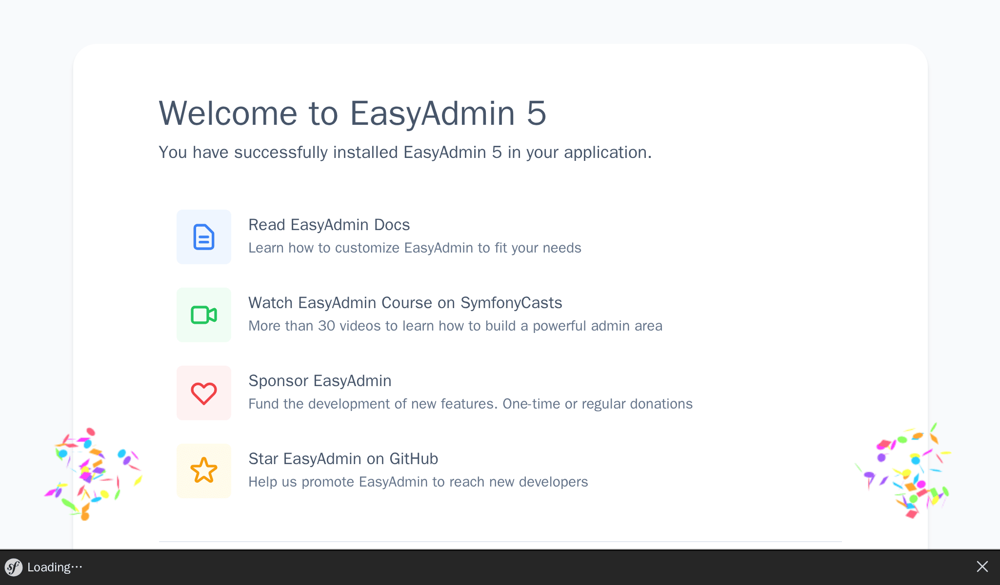

Setting up an Admin Backend
===========================

.. index::
    single: EasyAdmin
    single: Admin
    single: Backend

Adding upcoming conferences to the database is the job of project admins. An *admin backend* is a protected section of the website where *project admins* can manage the website data, moderate feedback submissions, and more.

How can we create this fast? By using a bundle that is able to generate an admin backend based on the project's model. EasyAdmin fits the bill perfectly.

Installing more Dependencies
----------------------------

Even if the ``webapp`` package automatically added many nice packages, for some more specific features, we need to add more dependencies. How can we add more dependencies? Via Composer. Besides "regular" Composer packages, we will work with two "special" kinds of packages:

* *Symfony Components*: Packages that implement core features and low level abstractions that most applications need (routing, console, HTTP client, mailer, cache, ...);

* *Symfony Bundles*: Packages that add high-level features or provide integrations with third-party libraries (bundles are mostly contributed by the community).

Let's add EasyAdmin as a project dependency:

.. code-block:: terminal

    $ symfony composer req "easycorp/easyadmin-bundle:^5"

*Aliases* are not a Composer feature, but a concept provided by Symfony to make your life easier. Aliases are shortcuts for popular Composer packages. Want an ORM for your application? Require ``orm``. Want to develop an API? Require ``api``. These aliases are automatically resolved to one or more regular Composer packages. They are opinionated choices made by the Symfony core team.

Another neat feature is that you can always omit the ``symfony`` vendor. Require ``cache`` instead of ``symfony/cache``.

.. tip::

    Do you remember that we mentioned a Composer plugin named ``symfony/flex`` before? Aliases are one of its features.

Configuring EasyAdmin
---------------------

EasyAdmin automatically generates an admin area for your application based on specific controllers.

To get started with EasyAdmin, let's generate a "web admin dashboard" which will be the main entry point to manage the website data:

.. code-block:: terminal
    :class: answers(DashboardController||src/Controller/Admin/)

    $ symfony console make:admin:dashboard

Accepting the default answers creates the following controller:

.. code-block:: php
    :caption: src/Controller/Admin/DashboardController.php
    :class: ignore

    namespace App\Controller\Admin;

    use EasyCorp\Bundle\EasyAdminBundle\Config\Dashboard;
    use EasyCorp\Bundle\EasyAdminBundle\Config\MenuItem;
    use EasyCorp\Bundle\EasyAdminBundle\Controller\AbstractDashboardController;
    use Symfony\Component\HttpFoundation\Response;
    use Symfony\Component\Routing\Attribute\Route;

    class DashboardController extends AbstractDashboardController
    {
        /**
         * @Route("/admin", name="admin")
         */
        public function index(): Response
        {
            return parent::index();
        }

        public function configureDashboard(): Dashboard
        {
            return Dashboard::new()
                ->setTitle('Guestbook');
        }

        public function configureMenuItems(): iterable
        {
            yield MenuItem::linkToDashboard('Dashboard', 'fa fa-home');
            // yield MenuItem::linkToCrud('The Label', 'icon class', EntityClass::class);
        }
    }

By convention, all admin controllers are stored under their own ``App\Controller\Admin`` namespace.

Access the generated admin backend at ``/admin`` as configured by the ``index()`` method; you can change the URL to anything you like:

Boom! We have a nice looking admin interface shell, ready to be customized to our needs.

.. index::
    single: CRUD

The next step is to create controllers to manage conferences and comments.

In the dashboard controller, you might have noticed the ``configureMenuItems()`` method which has a comment about adding links to "CRUDs". **CRUD** is an acronym for "Create, Read, Update, and Delete", the four basic operations you want to do on any entity. That's exactly what we want an admin to perform for us; EasyAdmin even takes it to the next level by also taking care of searching and filtering.

Let's generate a CRUD for conferences:

.. code-block:: terminal
    :class: answers(1||src/Controller/Admin/||App\\Controller\\Admin)

    $ symfony console make:admin:crud

Select ``1`` to create an admin interface for conferences and use the defaults for the other questions. The following file should be generated:

.. code-block:: php
    :caption: src/Controller/Admin/ConferenceCrudController.php
    :class: ignore

    namespace App\Controller\Admin;

    use App\Entity\Conference;
    use EasyCorp\Bundle\EasyAdminBundle\Controller\AbstractCrudController;

    class ConferenceCrudController extends AbstractCrudController
    {
        public static function getEntityFqcn(): string
        {
            return Conference::class;
        }

        /*
        public function configureFields(string $pageName): iterable
        {
            return [
                IdField::new('id'),
                TextField::new('title'),
                TextEditorField::new('description'),
            ];
        }
        */
    }

Do the same for comments:

.. code-block:: terminal
    :class: answers(0||src/Controller/Admin/||App\\Controller\\Admin)

    $ symfony console make:admin:crud

The last step is to link the conference and comment admin CRUDs to the dashboard:

.. code-block:: diff
    :caption: patch_file

    --- i/src/Controller/Admin/DashboardController.php
    +++ w/src/Controller/Admin/DashboardController.php
    @@ -2,6 +2,8 @@

     namespace App\Controller\Admin;

    +use App\Entity\Comment;
    +use App\Entity\Conference;
     use EasyCorp\Bundle\EasyAdminBundle\Attribute\AdminDashboard;
     use EasyCorp\Bundle\EasyAdminBundle\Config\Dashboard;
     use EasyCorp\Bundle\EasyAdminBundle\Config\MenuItem;
    @@ -44,7 +46,8 @@ class DashboardController extends AbstractDashboardController

         public function configureMenuItems(): iterable
         {
    -        yield MenuItem::linkToDashboard('Dashboard', 'fa fa-home');
    -        // yield MenuItem::linkToCrud('The Label', 'fas fa-list', EntityClass::class);
    +        yield MenuItem::linkToRoute('Back to the website', 'fas fa-home', 'homepage');
    +        yield MenuItem::linkToCrud('Conferences', 'fas fa-map-marker-alt', Conference::class);
    +        yield MenuItem::linkToCrud('Comments', 'fas fa-comments', Comment::class);
         }
     }

We have overridden the ``configureMenuItems()`` method to add menu items with relevant icons for conferences and comments and to add a link back to the website home page.

EasyAdmin exposes an API to ease linking to entity CRUDs via the ``MenuItem::linkToRoute()`` method.

The main dashboard page is empty for now. This is where you can display some statistics, or any relevant information. As we don't have any important to display, let's redirect to the conference list:

.. code-block:: diff
    :caption: patch_file

    --- i/src/Controller/Admin/DashboardController.php
    +++ w/src/Controller/Admin/DashboardController.php
    @@ -8,6 +8,7 @@ use EasyCorp\Bundle\EasyAdminBundle\Attribute\AdminDashboard;
     use EasyCorp\Bundle\EasyAdminBundle\Config\Dashboard;
     use EasyCorp\Bundle\EasyAdminBundle\Config\MenuItem;
     use EasyCorp\Bundle\EasyAdminBundle\Controller\AbstractDashboardController;
    +use EasyCorp\Bundle\EasyAdminBundle\Router\AdminUrlGenerator;
     use Symfony\Component\HttpFoundation\Response;

     #[AdminDashboard(routePath: '/admin', routeName: 'admin')]
    @@ -15,7 +16,10 @@ class DashboardController extends AbstractDashboardController
     {
         public function index(): Response
         {
    -        return parent::index();
    +        $routeBuilder = $this->container->get(AdminUrlGenerator::class);
    +        $url = $routeBuilder->setController(ConferenceCrudController::class)->generateUrl();
    +
    +        return $this->redirect($url);

             // Option 1. You can make your dashboard redirect to some common page of your backend
             //

When displaying entity relationships (the conference linked to a comment), EasyAdmin tries to use a string representation of the conference. By default, it uses a convention that uses the entity name and the primary key (like ``Conference #1``) if the entity does not define the "magic" ``__toString()`` method. To make the display more meaningful, add such a method on the ``Conference`` class:

.. code-block:: diff
    :caption: patch_file

    --- i/src/Entity/Conference.php
    +++ w/src/Entity/Conference.php
    @@ -35,6 +35,11 @@ class Conference
             $this->comments = new ArrayCollection();
         }

    +    public function __toString(): string
    +    {
    +        return $this->city.' '.$this->year;
    +    }
    +
         public function getId(): ?int
         {
             return $this->id;

You can now add/modify/delete conferences directly from the admin backend. Play with it and add at least one conference.

.. figure:: screenshots/easy-admin.png
    :alt: /admin
    :align: center
    :figclass: with-browser

Customizing EasyAdmin
---------------------

The default admin backend works well, but it can be customized in many ways to improve the experience. Let's do some simple changes to the Comment entity to demonstrate some possibilities:

.. code-block:: diff
    :caption: patch_file

    --- i/src/Controller/Admin/CommentCrudController.php
    +++ w/src/Controller/Admin/CommentCrudController.php
    @@ -3,10 +3,17 @@
     namespace App\Controller\Admin;

     use App\Entity\Comment;
    +use EasyCorp\Bundle\EasyAdminBundle\Config\Crud;
    +use EasyCorp\Bundle\EasyAdminBundle\Config\Filters;
     use EasyCorp\Bundle\EasyAdminBundle\Controller\AbstractCrudController;
    +use EasyCorp\Bundle\EasyAdminBundle\Field\AssociationField;
    +use EasyCorp\Bundle\EasyAdminBundle\Field\DateTimeField;
    +use EasyCorp\Bundle\EasyAdminBundle\Field\EmailField;
     use EasyCorp\Bundle\EasyAdminBundle\Field\IdField;
    +use EasyCorp\Bundle\EasyAdminBundle\Field\TextareaField;
     use EasyCorp\Bundle\EasyAdminBundle\Field\TextEditorField;
     use EasyCorp\Bundle\EasyAdminBundle\Field\TextField;
    +use EasyCorp\Bundle\EasyAdminBundle\Filter\EntityFilter;

     class CommentCrudController extends AbstractCrudController
     {
    @@ -15,14 +22,43 @@ class CommentCrudController extends AbstractCrudController
             return Comment::class;
         }

    -    /*
    +    public function configureCrud(Crud $crud): Crud
    +    {
    +        return $crud
    +            ->setEntityLabelInSingular('Conference Comment')
    +            ->setEntityLabelInPlural('Conference Comments')
    +            ->setSearchFields(['author', 'text', 'email'])
    +            ->setDefaultSort(['createdAt' => 'DESC'])
    +        ;
    +    }
    +
    +    public function configureFilters(Filters $filters): Filters
    +    {
    +        return $filters
    +            ->add(EntityFilter::new('conference'))
    +        ;
    +    }
    +
         public function configureFields(string $pageName): iterable
         {
    -        return [
    -            IdField::new('id'),
    -            TextField::new('title'),
    -            TextEditorField::new('description'),
    -        ];
    +        yield AssociationField::new('conference');
    +        yield TextField::new('author');
    +        yield EmailField::new('email');
    +        yield TextareaField::new('text')
    +            ->hideOnIndex()
    +        ;
    +        yield TextField::new('photoFilename')
    +            ->onlyOnIndex()
    +        ;
    +
    +        $createdAt = DateTimeField::new('createdAt')->setFormTypeOptions([
    +            'years' => range(date('Y'), date('Y') + 5),
    +            'widget' => 'single_text',
    +        ]);
    +        if (Crud::PAGE_EDIT === $pageName) {
    +            yield $createdAt->setFormTypeOption('disabled', true);
    +        } else {
    +            yield $createdAt;
    +        }
         }
    -    */
     }

To customize the ``Comment`` section, listing the fields explicitly in the ``configureFields()`` method lets us order them the way we want. Some fields are further configured, like hiding the text field on the index page.

Add some comments without photos. Set the date manually for now; we will fill-in the ``createdAt`` column automatically in a later step.

.. figure:: screenshots/easy-admin-comments.png
    :alt: /admin?crudAction=index&crudId=2bfa220&menuIndex=2&submenuIndex=-1
    :align: center
    :figclass: with-browser

The ``configureFilters()`` method defines which filters to expose on top of the search field.

.. figure:: screenshots/easy-admin-filter.png
    :alt: /admin?crudAction=index&crudId=2bfa220&menuIndex=2&submenuIndex=-1
    :align: center
    :figclass: with-browser

These customizations are just a small introduction to the possibilities given by EasyAdmin.

Play with the admin, filter the comments by conference, or search comments by email for instance. The only issue is that anybody can access the backend. Don't worry, we will secure it in a future step.

.. code-block:: terminal
    :class: hide

    $ symfony run psql -c "TRUNCATE conference RESTART IDENTITY CASCADE"

.. sidebar:: Going Further

    * `EasyAdmin docs`_;

    * `Symfony framework configuration reference`_;

    * `PHP magic methods`_.

.. _`EasyAdmin docs`: https://symfony.com/bundles/EasyAdminBundle/4.x/index.html
.. _`Symfony framework configuration reference`: https://symfony.com/doc/current/reference/configuration/framework.html
.. _`PHP magic methods`: https://www.php.net/manual/en/language.oop5.magic.php
