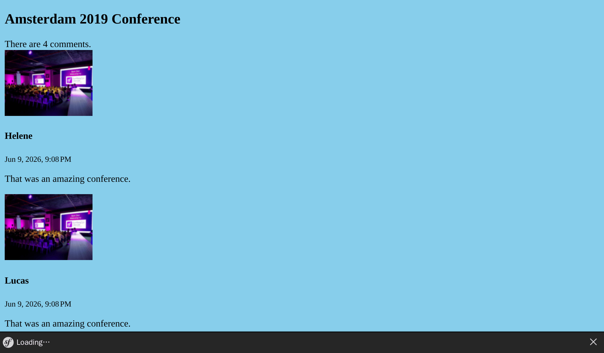

Construire l'interface
======================

.. index::
    single: Twig
    single: Templates

Tout est maintenant en place pour créer la première version de l'interface du site. On ne la fera pas jolie pour le moment, seulement fonctionnelle.

Vous vous souvenez de l'échappement de caractères que nous avons dû faire dans le contrôleur, pour l'*easter egg*, afin d'éviter les problèmes de sécurité ? Nous n'utiliserons pas PHP pour nos templates pour cette raison. À la place, nous utiliserons Twig. En plus de gérer l'échappement de caractères, `Twig`_ apporte de nombreuses fonctionnalités intéressantes, comme l'héritage des modèles.

Utiliser Twig pour les templates
--------------------------------

.. index::
    single: Twig;Layout
    single: Twig;block

Toutes les pages du site Web suivront le même *modèle* de mise en page, la même structure HTML de base. Lors de l'installation de Twig, un répertoire ``templates/`` a été créé automatiquement, ainsi qu'un exemple de structure de base dans ``base.html.twig``.

.. code-block:: html+twig
    :caption: templates/base.html.twig
    :class: ignore

    <!DOCTYPE html>
    <html>
        <head>
            <meta charset="UTF-8">
            <title>Welcome!</title>
            <link rel="icon" href="data:image/svg+xml,<svg xmlns=%22http://www.w3.org/2000/svg%22 viewBox=%220 0 128 128%22><text y=%221.2em%22 font-size=%2296%22>⚫️</text></svg>">
            {# Run `composer require symfony/webpack-encore-bundle` to start using Symfony UX #}
            
                {{ encore_entry_link_tags('app') }}
            

            
                {{ encore_entry_script_tags('app') }}
            
        </head>
        <body>
            
        </body>
    </html>

Un modèle peut définir des ``blocks``. Un ``block`` est un emplacement où les *templates enfants*, qui *étendent* le modèle, ajoutent leur contenu.

.. index::
    single: Twig;extends
    single: Twig;for

Créons un template pour la page d'accueil du projet dans ``templates/conference/index.html.twig`` :

.. code-block:: html+twig
    :caption: templates/conference/index.html.twig

    

    Conference Guestbook

    
        <h2>Give your feedback!</h2>

        
            <h4>{{ conference }}</h4>
        
    

Le template *étend* (ou *extends*) ``base.html.twig`` et redéfinit les blocs ``title`` et ``body``.

.. index::
    single: Twig;Syntax

La notation ```` dans un template indique des *actions* et des éléments de *structure*.

La notation ``{{ }}`` est utilisée pour *afficher* quelque chose. ``{{ conference }}`` affiche la représentation de la conférence (le résultat de l'appel à la méthode``__toString`` de l'objet ``Conference``).

Utiliser Twig dans un contrôleur
---------------------------------

Mettez à jour le contrôleur pour générer le contenu du template Twig :

.. code-block:: diff
    :caption: patch_file

    --- i/src/Controller/ConferenceController.php
    +++ w/src/Controller/ConferenceController.php
    @@ -2,22 +2,19 @@

     namespace App\Controller;

    +use App\Repository\ConferenceRepository;
     use Symfony\Bundle\FrameworkBundle\Controller\AbstractController;
     use Symfony\Component\HttpFoundation\Response;
     use Symfony\Component\Routing\Attribute\Route;
    +use Twig\Environment;

     final class ConferenceController extends AbstractController
     {
         #[Route('/', name: 'homepage')]
    -    public function index(): Response
    +    public function index(Environment $twig, ConferenceRepository $conferenceRepository): Response
         {
    -        return new Response(<<<EOF
    -            <html>
    -                <body>
    -                    
    -                </body>
    -            </html>
    -            EOF
    -        );
    +        return new Response($twig->render('conference/index.html.twig', [
    +            'conferences' => $conferenceRepository->findAll(),
    +        ]));
         }
     }

Il se passe beaucoup de choses ici.

Pour pouvoir générer le contenu du template, nous avons besoin de l'objet ``Environment`` de Twig (le point d'entrée principal de Twig). Notez que nous demandons l'instance Twig en spécifiant son type dans la méthode du contrôleur. Symfony est assez intelligent pour savoir comment injecter le bon objet.

Nous avons également besoin du *repository* des conférences pour récupérer toutes les conférences depuis la base de données.

Dans le code du contrôleur, la méthode ``render()`` génère le rendu du template et lui passe un tableau de variables. Nous passons la liste des objets ``Conference`` dans une variable ``conferences``.

Un contrôleur est une classe PHP standard. Nous n'avons même pas besoin d'étendre la classe ``AbstractController`` si nous voulons être explicites sur nos dépendances. Vous pouvez donc supprimer l'héritage (mais ne le faites pas, car nous utiliserons les raccourcis qu'il fournit dans les prochaines étapes).

Créer la page d'une conférence
--------------------------------

Chaque conférence devrait avoir une page dédiée à l'affichage de ses commentaires. L'ajout d'une nouvelle page consiste à ajouter un contrôleur, à définir une route et à créer le template correspondant.

Ajoutez une méthode ``show()`` dans le fichier ``src/Controller/ConferenceController.php`` :

.. code-block:: diff
    :caption: patch_file

    --- i/src/Controller/ConferenceController.php
    +++ w/src/Controller/ConferenceController.php
    @@ -2,6 +2,9 @@

     namespace App\Controller;

    +use App\Entity\Conference;
    +use App\Repository\CommentRepository;
     use App\Repository\ConferenceRepository;
    +use Symfony\Bridge\Doctrine\Attribute\MapEntity;
     use Symfony\Bundle\FrameworkBundle\Controller\AbstractController;
     use Symfony\Component\HttpFoundation\Response;
    @@ -17,4 +20,13 @@ final class ConferenceController extends AbstractController
                 'conferences' => $conferenceRepository->findAll(),
             ]));
         }
    +
    +    #[Route('/conference/{id}', name: 'conference')]
    +    public function show(Environment $twig, #[MapEntity] Conference $conference, CommentRepository $commentRepository): Response
    +    {
    +        return new Response($twig->render('conference/show.html.twig', [
    +            'conference' => $conference,
    +            'comments' => $commentRepository->findBy(['conference' => $conference], ['createdAt' => 'DESC']),
    +        ]));
    +    }
     }

Cette méthode a un comportement particulier que nous n'avons pas encore vu. Nous demandons qu'une instance de ``Conference`` soit injectée dans la méthode. Mais il y en a peut-être beaucoup dans la base de données. Symfony est capable de déterminer celle que vous voulez en se basant sur l'``{id}`` passé dans le chemin de la requête (``id`` étant la clé primaire de la table ``conference`` dans la base de données).

La récupération des commentaires associés à la conférence peut se faire via la méthode ``findBy()``, qui prend un critère comme premier argument.

.. index::
    single: Twig;extends
    single: Twig;block
    single: Twig;for
    single: Twig;if
    single: Twig;else
    single: Twig;asset
    single: Twig;format_datetime
    single: Twig;length

La dernière étape consiste à créer le fichier ``templates/conference/show.html.twig`` :

.. code-block:: html+twig
    :caption: templates/conference/show.html.twig

    

    Conference Guestbook - {{ conference }}

    
        <h2>{{ conference }} Conference</h2>

        
            
                
                    
                

                <h4>{{ comment.author }}</h4>
                <small>
                    {{ comment.createdAt|format_datetime('medium', 'short') }}
                </small>

                
{{ comment.text }}

            
        
            
No comments have been posted yet for this conference.

        
    

Dans ce template, nous utilisons le symbole ``|`` pour appeler les *filtres* Twig. Un filtre transforme une valeur. ``comments|length`` retourne le nombre de commentaires et ``comment.createdAt|format_datetime('medium', 'short')`` affiche la date dans un format lisible par l'internaute.

Essayez d'afficher la "première" conférence en naviguant vers ``/conference/1``, et constatez l'erreur suivante :

.. figure:: screenshots/intl-twig-error.png
    :alt: /conference/1
    :align: center
    :figclass: with-browser

L'erreur vient du filtre ``format_datetime``, qui ne fait pas partie du noyau de Twig. Le message d'erreur vous donne un indice sur le paquet à installer pour résoudre le problème :

.. code-block:: terminal

    $ symfony composer req "twig/intl-extra:^3"

Maintenant la page fonctionne correctement.

Lier des pages entre elles
--------------------------

.. index::
    single: Twig;Link
    single: Link

La toute dernière étape pour terminer notre première version de l'interface est de rendre les pages de la conférence accessibles depuis la page d'accueil :

.. code-block:: diff
    :caption: patch_file

    --- i/templates/conference/index.html.twig
    +++ w/templates/conference/index.html.twig
    @@ -7,5 +7,8 @@

         
             <h4>{{ conference }}</h4>
    +        

    +            <a href="/conference/{{ conference.id }}">View</a>
    +        

         
     

Mais coder un chemin en dur est une mauvaise idée pour plusieurs raisons. La raison principale est que si vous transformez le chemin (de ``/conference/{id}`` en ``/conferences/{id}`` par exemple), tous les liens doivent être mis à jour manuellement.

.. index::
    single: Twig;path

Utilisez plutôt la *fonction* Twig ``path()`` avec le *nom de la route* :

.. code-block:: diff
    :caption: patch_file

    --- i/templates/conference/index.html.twig
    +++ w/templates/conference/index.html.twig
    @@ -8,7 +8,7 @@
         
             <h4>{{ conference }}</h4>
             

    -            <a href="/conference/{{ conference.id }}">View</a>
    +            <a href="{{ path('conference', { id: conference.id }) }}">View</a>
             

         
     

La fonction ``path()`` génère le chemin d'accès vers une page à l'aide du nom de la route. Les valeurs des paramètres dynamiques de la route sont transmises sous la forme d'un objet Twig.

Paginer les commentaires
------------------------

.. index::
    single: Doctrine;Paginator
    single: Paginator

Avec des milliers de personnes présentes, on peut s'attendre à un nombre important de commentaires. Si nous les affichons tous sur une seule page, elle deviendra rapidement énorme.

Créez une méthode ``getCommentPaginator()`` dans ``CommentRepository``. Cette méthode renvoie un *Paginator* de commentaires basé sur une conférence et un décalage (où commencer) :

.. code-block:: diff
    :caption: patch_file

    --- i/src/Repository/CommentRepository.php
    +++ w/src/Repository/CommentRepository.php
    @@ -3,19 +3,37 @@
     namespace App\Repository;

     use App\Entity\Comment;
    +use App\Entity\Conference;
     use Doctrine\Bundle\DoctrineBundle\Repository\ServiceEntityRepository;
     use Doctrine\Persistence\ManagerRegistry;
    +use Doctrine\ORM\Tools\Pagination\Paginator;

     /**
      * @extends ServiceEntityRepository<Comment>
      */
     class CommentRepository extends ServiceEntityRepository
     {
    +    public const COMMENTS_PER_PAGE = 2;
    +
         public function __construct(ManagerRegistry $registry)
         {
             parent::__construct($registry, Comment::class);
         }

    +    public function getCommentPaginator(Conference $conference, int $offset): Paginator
    +    {
    +        $query = $this->createQueryBuilder('c')
    +            ->andWhere('c.conference = :conference')
    +            ->setParameter('conference', $conference)
    +            ->orderBy('c.createdAt', 'DESC')
    +            ->setMaxResults(self::COMMENTS_PER_PAGE)
    +            ->setFirstResult($offset)
    +            ->getQuery()
    +        ;
    +
    +        return new Paginator($query);
    +    }
    +
         //    /**
         //     * @return Comment[] Returns an array of Comment objects
         //     */

Nous avons fixé le nombre maximum de commentaires par page à 2 pour faciliter les tests.

Pour gérer la pagination dans le template, transmettez à Twig le Doctrine Paginator au lieu de la Doctrine Collection :

.. code-block:: diff
    :caption: patch_file

    --- i/src/Controller/ConferenceController.php
    +++ w/src/Controller/ConferenceController.php
    @@ -6,7 +6,8 @@ use App\Entity\Conference;
     use App\Repository\CommentRepository;
     use App\Repository\ConferenceRepository;
     use Symfony\Bridge\Doctrine\Attribute\MapEntity;
     use Symfony\Bundle\FrameworkBundle\Controller\AbstractController;
    +use Symfony\Component\HttpFoundation\Request;
     use Symfony\Component\HttpFoundation\Response;
     use Symfony\Component\Routing\Attribute\Route;
     use Twig\Environment;
    @@ -22,11 +23,16 @@ final class ConferenceController extends AbstractController
         }

         #[Route('/conference/{id}', name: 'conference')]
    -    public function show(Environment $twig, #[MapEntity] Conference $conference, CommentRepository $commentRepository): Response
    +    public function show(Request $request, Environment $twig, #[MapEntity] Conference $conference, CommentRepository $commentRepository): Response
         {
    +        $offset = max(0, $request->query->getInt('offset', 0));
    +        $paginator = $commentRepository->getCommentPaginator($conference, $offset);
    +
             return new Response($twig->render('conference/show.html.twig', [
                 'conference' => $conference,
    -            'comments' => $commentRepository->findBy(['conference' => $conference], ['createdAt' => 'DESC']),
    +            'comments' => $paginator,
    +            'previous' => $offset - CommentRepository::COMMENTS_PER_PAGE,
    +            'next' => min(count($paginator), $offset + CommentRepository::COMMENTS_PER_PAGE),
             ]));
         }
     }

Le contrôleur récupère la valeur du décalage (``offset``) depuis les paramètres de l'URL (``$request->query``) sous forme d'entier (``getInt()``). Par défaut, sa valeur sera 0 si le paramètre n'est pas défini.

Les décalages ``précédent`` et ``suivant`` sont calculés sur la base de toutes les informations que nous avons reçues du paginateur.

.. index::
    single: Twig;if

Enfin, mettez à jour le template pour ajouter des liens vers les pages suivantes et précédentes :

.. code-block:: diff
    :caption: patch_file

    --- i/templates/conference/show.html.twig
    +++ w/templates/conference/show.html.twig
    @@ -6,6 +6,8 @@
         <h2>{{ conference }} Conference</h2>

         
    +        
There are {{ comments|length }} comments.

    +
             
                 
                     
    @@ -18,6 +20,13 @@

                 
{{ comment.text }}

             
    +
    +        
    +            <a href="{{ path('conference', { id: conference.id, offset: previous }) }}">Previous</a>
    +        
    +        
    +            <a href="{{ path('conference', { id: conference.id, offset: next }) }}">Next</a>
    +        
         
             
No comments have been posted yet for this conference.

         

Vous devriez maintenant pouvoir naviguer dans les commentaires avec les liens "Previous" et "Next" :

Optimiser le contrôleur
------------------------

Vous avez peut-être remarqué que les deux méthodes présentes dans ``ConferenceController`` prennent un environnement Twig comme argument. Au lieu de l'injecter dans chaque méthode, appelons la méthode ``render()`` de la classe parente :

.. code-block:: diff
    :caption: patch_file

    --- i/src/Controller/ConferenceController.php
    +++ w/src/Controller/ConferenceController.php
    @@ -9,29 +9,28 @@ use Symfony\Bundle\FrameworkBundle\Controller\AbstractController;
     use Symfony\Component\HttpFoundation\Request;
     use Symfony\Component\HttpFoundation\Response;
     use Symfony\Component\Routing\Attribute\Route;
    -use Twig\Environment;

     final class ConferenceController extends AbstractController
     {
         #[Route('/', name: 'homepage')]
    -    public function index(Environment $twig, ConferenceRepository $conferenceRepository): Response
    +    public function index(ConferenceRepository $conferenceRepository): Response
         {
    -        return new Response($twig->render('conference/index.html.twig', [
    +        return $this->render('conference/index.html.twig', [
                 'conferences' => $conferenceRepository->findAll(),
    -        ]));
    +        ]);
         }

         #[Route('/conference/{id}', name: 'conference')]
    -    public function show(Request $request, Environment $twig, #[MapEntity] Conference $conference, CommentRepository $commentRepository): Response
    +    public function show(Request $request, #[MapEntity] Conference $conference, CommentRepository $commentRepository): Response
         {
             $offset = max(0, $request->query->getInt('offset', 0));
             $paginator = $commentRepository->getCommentPaginator($conference, $offset);

    -        return new Response($twig->render('conference/show.html.twig', [
    +        return $this->render('conference/show.html.twig', [
                 'conference' => $conference,
                 'comments' => $paginator,
                 'previous' => $offset - CommentRepository::COMMENTS_PER_PAGE,
                 'next' => min(count($paginator), $offset + CommentRepository::COMMENTS_PER_PAGE),
    -        ]));
    +        ]);
         }
     }

.. sidebar:: Aller plus loin

    * `Documentation Twig`_ ;

    * `Créer et utiliser des templates`_ dans les applications Symfony ;

    * `Tutoriel SymfonyCasts sur Twig`_ ;

    * `Fonctions et filtres Twig disponibles uniquement dans Symfony`_ ;

    * Le `contrôleur de base AbstractController`_.

.. _`Twig`: https://twig.symfony.com/
.. _`Documentation Twig`: https://twig.symfony.com/doc/3.x/
.. _`Créer et utiliser des templates`: https://symfony.com/doc/current/templates.html
.. _`Tutoriel SymfonyCasts sur Twig`: https://symfonycasts.com/screencast/symfony/twig-recipe
.. _`Fonctions et filtres Twig disponibles uniquement dans Symfony`: https://symfony.com/doc/current/reference/twig_reference.html
.. _`contrôleur de base AbstractController`: https://symfony.com/doc/current/controller.html#the-base-controller-classes-services
