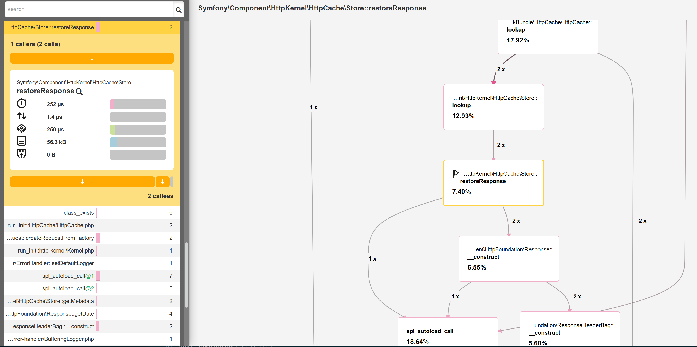
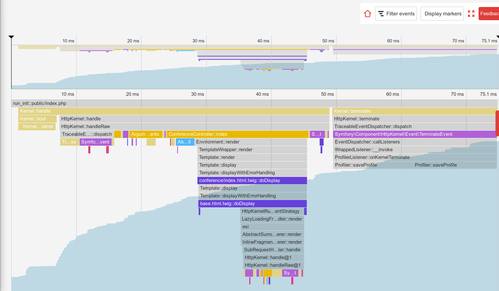
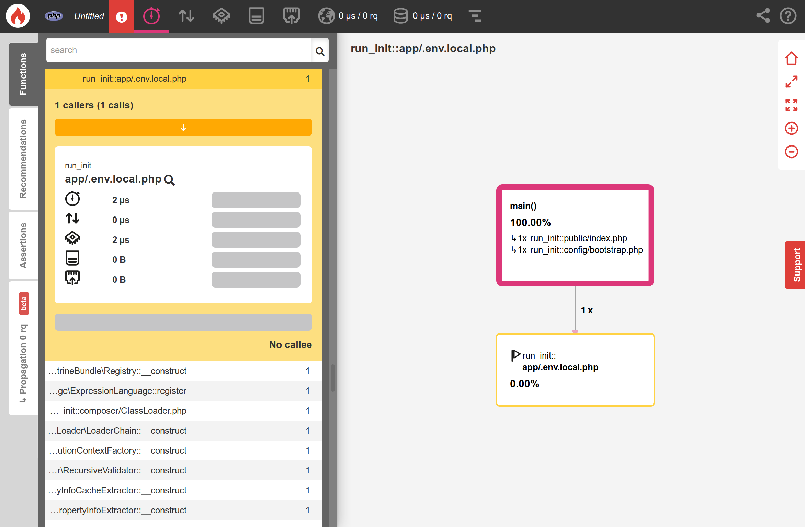
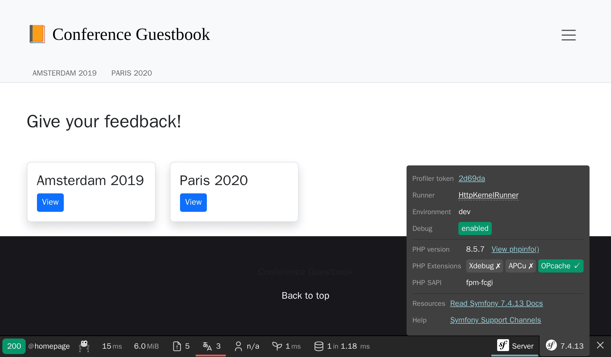

Voyager au cœur de Symfony
===========================

.. index::
    single: Blackfire
    single: Debugging
    single: Internals

Nous utilisons Symfony pour développer une application performante depuis un certain temps déjà, mais la plupart du code exécuté par l'application provient de Symfony. Quelques centaines de lignes de code contre des milliers de lignes de code.

J'aime comprendre comment les choses fonctionnent en coulisses. Et j'ai toujours été fasciné par les outils qui m'aident à comprendre comment fonctionnent les choses. La première fois que j'ai utilisé un débogueur pas à pas ou le moment où j'ai découvert ``ptrace`` sont des souvenirs magiques.

Vous souhaitez mieux comprendre le fonctionnement de Symfony ? Il est temps d'examiner comment Symfony fait fonctionner votre application. Au lieu de décrire comment Symfony gère une requête HTTP d'un point de vue théorique, ce qui serait assez ennuyeux, nous allons utiliser Blackfire pour obtenir quelques représentations visuelles et pour découvrir des sujets plus avancés.

Comprendre le fonctionnement interne de Symfony avec Blackfire
--------------------------------------------------------------

Vous savez déjà que toutes les requêtes HTTP sont servies par un seul point d'entrée : le fichier ``public/index.php``. Mais que se passe-t-il ensuite ? Comment sont appelés les contrôleurs ?

Profilons la page d'accueil anglaise en production avec Blackfire via l'extension de navigateur Blackfire :

.. code-block:: terminal
    :class: ignore

    $ symfony remote:open

Ou directement via la ligne de commande :

.. code-block:: terminal
    :class: ignore

    $ blackfire curl `symfony cloud:env:url --pipe --primary`en/

Allez dans la vue "Timeline" du profil, vous devriez voir quelque chose qui ressemble à cela :

.. figure:: images/blackfire-homepage-prod.png
    :alt: /
    :align: center
    :figclass: with-browser

À partir de la timeline, passez le curseur sur les barres colorées pour avoir plus d'informations sur chaque appel, vous apprendrez beaucoup sur le fonctionnement de Symfony :

* Le point d'entrée principal est ``public/index.php`` ;

* La méthode ``Kernel::handle()`` traite la requête ;

* Il appelle le ``HttpKernel`` qui envoit des événements ;

* Le premier événement est ``RequestEvent`` ;

* La méthode ``ControllerResolver::getController()`` est appelée pour déterminer quel contrôleur doit être appelé pour l'URL entrante ;

* La méthode ``ControllerResolver::getArguments()`` est appelée pour déterminer quels arguments passer au contrôleur (le param converter est appelé) ;

* La méthode ``ConferenceController::index()`` est appelée et la majorité de notre code est exécutée par cet appel ;

* La méthode ``ConferenceRepository::findAll()`` récupère toutes les conférences de la base de données (notez la connexion à la base de données via ``PDO::__construct()``) ;

* La méthode ``Twig\Environment::render()`` génère le template ;

* Les événements ``ResponseEvent`` et ``FinishRequestEvent`` sont envoyés, mais il semble qu'aucun *listener* ne soit déclaré car ils sont exécutés très rapidement.

La timeline est un excellent moyen de comprendre le fonctionnement de certains codes, ce qui est très utile lorsque vous faites développer un projet par quelqu'un d'autre.

Maintenant, profilez la même page depuis la machine locale dans l'environnement de développement :

.. code-block:: terminal
    :class: ignore

    $ blackfire curl `symfony var:export SYMFONY_PROJECT_DEFAULT_ROUTE_URL`en/

Ouvrez le profil. Vous devriez être redirigé vers l'affichage du graphique d'appel car la demande a été très rapide et la timeline sera quasiment vide :

Comprenez-vous ce qui se passe ? Le cache HTTP est activé et, par conséquent, nous profilons la couche cache HTTP de Symfony. Comme la page est dans le cache, ``HttpCache\Store::restoreResponse()`` obtient la réponse HTTP de son cache et le contrôleur n'est jamais appelé.

Désactivez la couche cache ``public/index.php`` comme nous l'avons fait à l'étape précédente et réessayez. Vous pouvez immédiatement voir que le profil est très différent :

Les principales différences sont les suivantes :

* Le ``TerminateEvent``, qui n'était pas visible en production, prend un grand pourcentage du temps d'exécution. En y regardant de plus près, vous pouvez voir que c'est l'événement responsable du stockage des données nécessaires au profileur Symfony.

* Sous l'appel ``ConferenceController::index()``, remarquez la méthode ``SubRequestHandler::handle()`` qui affiche l'ESI (c'est pourquoi nous avons deux appels à ``Profiler::saveProfile()``, un pour la requête principale et un pour l'ESI).

Explorez la timeline pour en savoir plus ; passez à la vue du graphique d'appel pour avoir une représentation différente des mêmes données.

Comme nous venons de le découvrir, le code exécuté en développement et en production est assez différent. L'environnement de développement est plus lent car le profileur de Symfony essaie de rassembler beaucoup de données pour faciliter le débogage des problèmes. C'est pourquoi vous devez toujours profiler avec l'environnement de production, même au niveau local.

Quelques expériences intéressantes : profilez une page d'erreur, profilez la page ``/`` (qui est une redirection) ou une ressource API. Chaque profil vous en dira un peu plus sur le fonctionnement de Symfony, les classes/méthodes appelées, ce qui est lent à exécuter et ce qui est rapide.

Utiliser l'addon de débogage Blackfire
---------------------------------------

.. index::
    single: Blackfire;Debug Addon

Par défaut, Blackfire supprime tous les appels de méthode qui ne sont pas assez significatifs pour éviter d'avoir de grosses charges utiles et de gros graphiques. Lorsque vous utilisez Blackfire comme outil de débogage, il est préférable de conserver tous les appels. Cela est fourni par l'addon de débogage.

Depuis la ligne de commande, utilisez l'option ``--debug`` :

.. code-block:: terminal
    :class: ignore

    $ blackfire --debug curl `symfony var:export SYMFONY_PROJECT_DEFAULT_ROUTE_URL`en/
    $ blackfire --debug curl `symfony cloud:env:url --pipe --primary`en/

.. index::
    single: .env.local.prod

En production, vous verrez par exemple le chargement d'un fichier nommé ``.env.local.php`` :

.. index::
    single: Composer;Optimizations
    single: Composer;Autoloader
    single: Autoloader

D'où vient-il ? Upsun effectue certaines optimisations lors du déploiement d'une application Symfony comme l'optimisation de l'autoloader Composer (``--optimize-autoloader --apcu-autoloader --classmap-authoritative``). Il optimise également les variables d'environnement définies dans le fichier ``.env`` (pour éviter d'analyser le fichier pour chaque requête) en générant le fichier ``.env.local.php`` :

.. code-block:: terminal
    :class: ignore

    $ symfony run composer dump-env prod

Blackfire est un outil très puissant qui aide à comprendre comment le code est exécuté par PHP. L'amélioration des performances n'est qu'une raison parmi d'autres d'utiliser un profileur.

Utiliser un point d'arrêt avec Xdebug
--------------------------------------

.. index::
    single: Xdebug
    single: Debugger

Les timelines et les graphs d'appels de Blackfire permettent aux développeurs de visualiser quels fichiers/fonctions/méthodes sont exécutés par le moteur de PHP afin de comprendre le code du projet.

Un autre moyen de suivre l'exécution du code est d'utiliser un **débogueur pas à pas** tel que `Xdebug`_. Un débogueur pas à pas permet aux développeurs d'avancer manuellement au fil du code d'un projet PHP pour déboguer les structures de contrôles et analyser les structures de données. Cela est très pratique pour déboguer des comportements inattendus et il se substitue aux techniques de débogage populaires "var_dump()/exit()".

Avant tout, installez l'extension PHP ``xdebug``. Vérifiez qu'elle est bien installée en lançant la commande suivante :

.. code-block:: terminal

    $ symfony php -v

Vous devriez voir Xdebug dans l'affichage :

.. code-block:: text
    :emphasize-lines: 5
    :class: ignore

    PHP 8.0.1 (cli) (built: Jan 13 2021 08:22:35) ( NTS )
    Copyright (c) The PHP Group
    Zend Engine v4.0.1, Copyright (c) Zend Technologies
        with Zend OPcache v8.0.1, Copyright (c), by Zend Technologies
        with Xdebug v3.0.2, Copyright (c) 2002-2021, by Derick Rethans
        with blackfire v1.49.0~linux-x64-non_zts80, https://blackfire.io, by Blackfire

Vous pouvez aussi vérifier que Xdebug est activé pour PHP-FPM en allant dans le navigateur et en cliquant sur le lien "View phpinfo()" quand vous survolez le logo Symfony de la barre de debug web.

Maintenant, activez le mode ``debug`` de Xdebug :

.. code-block:: ini
    :caption: php.ini
    :class: ignore

    [xdebug]
    xdebug.mode=debug
    xdebug.start_with_request=yes

Par défaut, Xdebug envoie des données au port 9003 de la machine hôte.

Déclencher Xdebug peut être fait de plusieurs manières, mais la plus simple reste de l'utiliser dans votre IDE. Dans ce chapitre, nous allons utiliser Visual Studio Code pour montrer comment cela fonctionne. Installez l'extension `PHP Debug`_ en lançant la fonctionnalité "Quick Open" (``Ctrl+P``), copiez la commande suivante, et appuyez sur entrée :

.. code-block:: text
    :class: ignore

    ext install felixfbecker.php-debug

Créez le fichier de configuration suivant :

.. code-block:: json
    :caption: .vscode/launch.json
    :emphasize-lines: 8,16
    :class: ignore

    {
        "version": "0.2.0",
        "configurations": [
            {
                "name": "Listen for XDebug",
                "type": "php",
                "request": "launch",
                "port": 9003
            },
            {
                "name": "Launch currently open script",
                "type": "php",
                "request": "launch",
                "program": "${file}",
                "cwd": "${fileDirname}",
                "port": 9003
            }
        ]
    }

Depuis Visual Studio Code et en étant dans le répertoire du projet, allez dans le debugger et cliquez sur le bouton de lecture vert appelé "Listen for Xdebug" :

.. figure:: images/vs-xdebug-run.png
    :align: center

Si vous allez dans le navigateur et que vous rafraichissez, l'IDE devrait automatiquement prendre la main, signifiant que la session de débogage est prête. Par défault, tout est un point d'arrêt, ainsi l'exécution s'arrête à la première instruction. C'est ensuite à vous d'inspecter les variables actuelles, d'avancer dans le code, d'entrer dans le code, ...

Au cours du débogage, vous pouvez décocher le point d'arrêt "Everything" et définir explicitement les points d'arrêt dans votre code.

Si c'est votre première fois avec les débogueurs pas à pas, lisez l'`excellent tutoriel pour Visual Studio Code`_, qui vous explique tout en vidéos.

.. sidebar:: Aller plus loin

    * `La documentation du débogueur pas à pas Xdebug`_ ;

    * `Déboguer avec Visual Studio Code`_.

.. _`Xdebug`: https://xdebug.org
.. _`PHP Debug`: https://marketplace.visualstudio.com/items?itemName=felixfbecker.php-debug
.. _`La documentation du débogueur pas à pas Xdebug`: https://xdebug.org/docs/step_debug
.. _`excellent tutoriel pour Visual Studio Code`: https://code.visualstudio.com/Docs/editor/debugging
.. _`Déboguer avec Visual Studio Code`: https://code.visualstudio.com/Docs/editor/debugging
