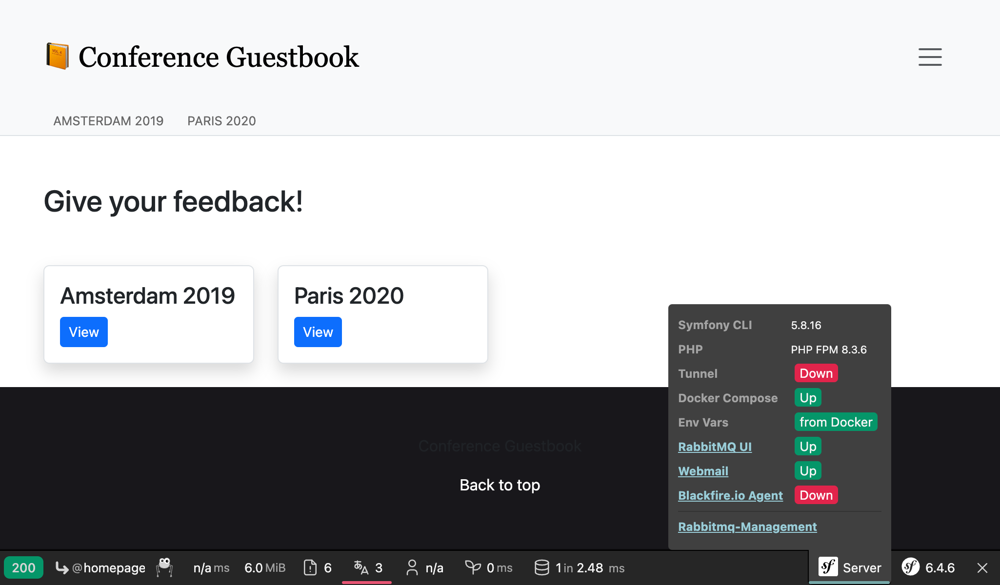
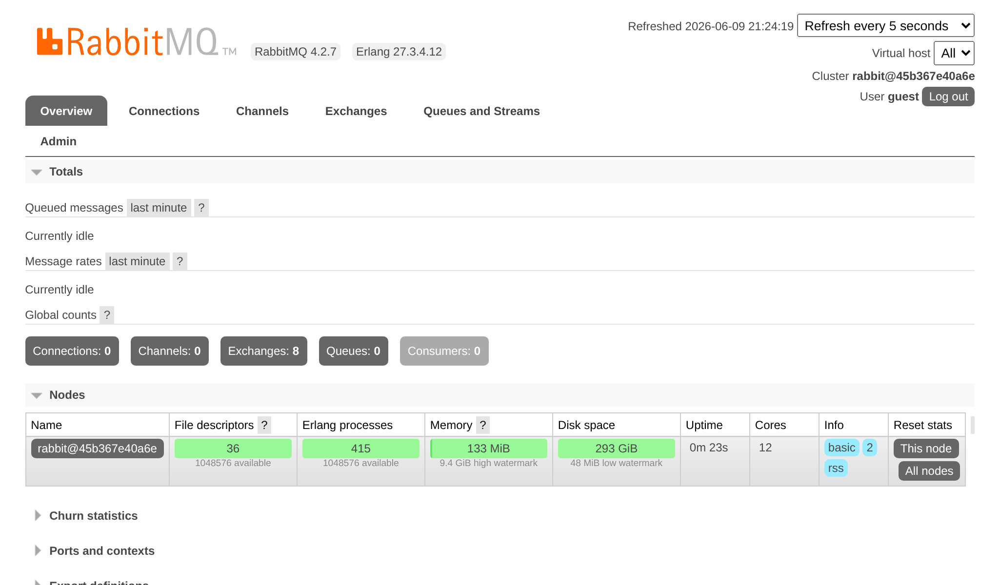

Utiliser RabbitMQ comme gestionnaire de messages
================================================

.. index::
    single: RabbitMQ

RabbitMQ est un gestionnaire de messages très répandu que vous pouvez utiliser comme alternative à PostgreSQL

Basculer de PostgreSQL à RabbitMQ
----------------------------------

Pour utiliser RabbitMQ à la place de PostgreSQL comme gestionnaire de messages :

.. code-block:: diff
    :caption: patch_file

    --- i/config/packages/messenger.yaml
    +++ w/config/packages/messenger.yaml
    @@ -5,7 +5,7 @@ framework:
             transports:
                 # https://symfony.com/doc/current/messenger.html#transport-configuration
                 async:
    -                dsn: '%env(MESSENGER_TRANSPORT_DSN)%'
    +                dsn: '%env(RABBITMQ_URL)%'
                     retry_strategy:
                         max_retries: 3
                         multiplier: 2

Nous devons également ajouter le support RabbitMQ pour Messenger :

.. code-block:: terminal

    $ symfony composer req amqp-messenger

Ajouter RabbitMQ aux services Docker
------------------------------------

.. index::
    single: Docker;RabbitMQ

Comme vous l'avez sûrement deviné, nous avons aussi besoin d'ajouter RabbitMQ aux services Docker Compose :

.. code-block:: diff
    :caption: patch_file

    --- i/compose.yaml
    +++ w/compose.yaml
    @@ -18,6 +18,10 @@ services:
         image: redis:8.0-alpine
         ports: [6379]

    +  rabbitmq:
    +    image: rabbitmq:4.2-management
    +    ports: [5672, 15672]
    +
     volumes:
     ###> doctrine/doctrine-bundle ###
       database_data:

Redémarrer les services Docker
-------------------------------

Pour forcer Docker Compose à prendre en compte le conteneur RabbitMQ, arrêter les conteneurs et relancer les :

.. code-block:: terminal

    $ docker-compose stop
    $ docker-compose up -d --remove-orphans

.. code-block:: terminal
    :class: hide

    $ sleep 10

Explorer l'interface web de gestion de RabbitMQ
-----------------------------------------------

.. index::
    single: Symfony CLI;open:local:rabbitmq

Si vous voulez voir les files et les messages défilant dans RabbitMQ, ouvrez son interface web de gestion :

.. code-block:: terminal
    :class: ignore

    $ symfony open:local:rabbitmq

Ou depuis la barre de débogage web :

Utilisez ``guest``/``guest`` pour vous connecter sur l'interface de gestion RabbitMQ :

Déployer RabbitMQ
------------------

.. index::
    single: Platform.sh;RabbitMQ
    single: RabbitMQ

Ajouter RabbitMQ aux serveurs de production peut être fait en l'ajoutant à la liste des services :

.. code-block:: diff
    :caption: patch_file

    --- i/.upsun/config.yaml
    +++ w/.upsun/config.yaml
    @@ -25,4 +25,8 @@ services:
             rediscache:
                 type: redis:8.0

    +    queue:
    +        type: rabbitmq:4.2
    +        size: S
    +
     applications:

Référencez-le également dans la configuration du conteneur web et activez l'extension PHP ``amqp`` :

.. code-block:: diff
    :caption: patch_file

    --- i/.upsun/config.yaml
    +++ w/.upsun/config.yaml
    @@ -39,6 +39,7 @@ applications:

             runtime:
                 extensions:
    +                - amqp
                     - apcu
                     - blackfire
                     - ctype
    @@ -72,5 +73,6 @@ applications:
             relationships:
                 database: "database:postgresql"
                 redis: "rediscache:redis"
    +            rabbitmq: "queue:rabbitmq"

             hooks:
                 build: |

.. index::
    single: Platform.sh;Tunnel
    single: Symfony CLI;cloud:tunnel:open
    single: Symfony CLI;cloud:tunnel:close
    single: Symfony CLI;open:remote:rabbitmq

Quand le service RabbitMQ est installé sur un projet, vous pouvez accéder à l'interface web de gestion en ouvrant tout d'abord un tunnel :

.. code-block:: terminal
    :class: ignore

    $ symfony cloud:tunnel:open
    $ symfony open:remote:rabbitmq

    # when done
    $ symfony cloud:tunnel:close

.. sidebar:: Aller plus loin

    * `Documentation de RabbitMQ`_.

.. _`Documentation de RabbitMQ`: https://www.rabbitmq.com/documentation.html
