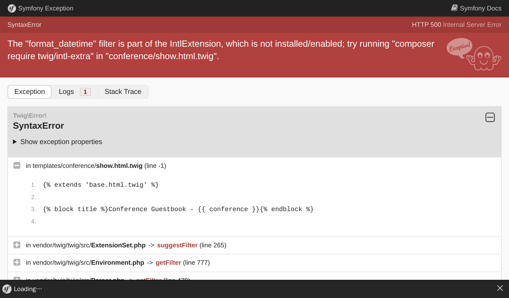

Costruire l'interfaccia utente
==============================

.. index::
    single: Twig
    single: Templates

È tutto pronto per creare la prima versione dell'interfaccia utente del sito. Non la renderemo carina. Solo funzionale per ora.

Ricordate l'escape che dovevamo fare nel controller per evitare problemi di sicurezza? Per questo motivo non useremo PHP per i nostri template. Invece, useremo Twig. Oltre a gestire l'escape dell'output per noi, `Twig`_ porta molte caratteristiche carine che sfrutteremo, come l'ereditarietà dei template.

Utilizzo di Twig per i template
-------------------------------

.. index::
    single: Twig;Layout
    single: Twig;block

Tutte le pagine del sito condivideranno lo stesso *layout*. Durante l'installazione di Twig è stata creata automaticamente una cartella ``templates/`` ed è stato creato anche un layout di esempio in ``base.html.twig``.

.. code-block:: html+twig
    :caption: templates/base.html.twig
    :class: ignore

    <!DOCTYPE html>
    <html>
        <head>
            <meta charset="UTF-8">
            <title>Welcome!</title>
            <link rel="icon" href="data:image/svg+xml,<svg xmlns=%22http://www.w3.org/2000/svg%22 viewBox=%220 0 128 128%22><text y=%221.2em%22 font-size=%2296%22>⚫️</text></svg>">
            {# Run `composer require symfony/webpack-encore-bundle` to start using Symfony UX #}
            
                {{ encore_entry_link_tags('app') }}
            

            
                {{ encore_entry_script_tags('app') }}
            
        </head>
        <body>
            
        </body>
    </html>

Un layout può definire elementi ``block``, che sono i contenitori in cui i *template figlii* che *estendono* il layout aggiungono il loro contenuto.

.. index::
    single: Twig;extends
    single: Twig;for

Creiamo un template per la homepage del progetto in ``templates/conference/index.html.twig``:

.. code-block:: html+twig
    :caption: templates/conference/index.html.twig

    

    Conference Guestbook

    
        <h2>Give your feedback!</h2>

        
            <h4>{{ conference }}</h4>
        
    

Il template *estende* ``base.html.twig`` e ridefinisce i blocchi ``title`` e ``body``.

.. index::
    single: Twig;Syntax

La notazione ```` in un template indica le *azioni* e la *struttura*.

La notazione ``{{ }}`` viene utilizzata per *visualizzare* qualcosa. ``{{ conference }}`` visualizza la rappresentazione della conferenza (il risultato della chiamata ``__toString`` sull'oggetto ``Conference``).

Utilizzare twig in un controller
--------------------------------

Aggiornare il controller per fare rendering del template Twig:

.. code-block:: diff
    :caption: patch_file

    --- i/src/Controller/ConferenceController.php
    +++ w/src/Controller/ConferenceController.php
    @@ -2,22 +2,19 @@

     namespace App\Controller;

    +use App\Repository\ConferenceRepository;
     use Symfony\Bundle\FrameworkBundle\Controller\AbstractController;
     use Symfony\Component\HttpFoundation\Response;
     use Symfony\Component\Routing\Attribute\Route;
    +use Twig\Environment;

     final class ConferenceController extends AbstractController
     {
         #[Route('/', name: 'homepage')]
    -    public function index(): Response
    +    public function index(Environment $twig, ConferenceRepository $conferenceRepository): Response
         {
    -        return new Response(<<<EOF
    -            <html>
    -                <body>
    -                    
    -                </body>
    -            </html>
    -            EOF
    -        );
    +        return new Response($twig->render('conference/index.html.twig', [
    +            'conferences' => $conferenceRepository->findAll(),
    +        ]));
         }
     }

C'è molto da fare qui.

Per poter fare rendering di un template abbiamo bisogno dell'oggetto ``Environment`` di Twig (il punto di ingresso principale di Twig). Si noti che chiediamo l'istanza di Twig attraverso *type-hinting* nel metodo del controller. Symfony è abbastanza intelligente da sapere come iniettare l'oggetto giusto.

Abbiamo anche bisogno del repository delle conferenze per ottenere tutte le conferenze dal database.

Nel codice del controller, il metodo ``render()`` compila il template passando un array di variabili. Stiamo passando l'elenco degli oggetti ``Conference`` utilizzando una variabile ``conferences``.

Un controller è una classe PHP standard. Non abbiamo nemmeno bisogno di estendere la classe ``AbstractController`` se vogliamo essere espliciti riguardo le dipendenze. È possibile eliminarla (ma meglio non farlo, dato che nei prossimi passi useremo le scorciatoie carine che fornisce).

Creare la pagina per una conferenza
-----------------------------------

Ogni conferenza dovrebbe avere una pagina dedicata per elencare i propri commenti. L'aggiunta di una nuova pagina è una questione di aggiungere un controller, definire una rotta e creare il relativo template.

Aggiungiamo un metodo ``show()`` in ``src/Controller/ConferenceController.php``:

.. code-block:: diff
    :caption: patch_file

    --- i/src/Controller/ConferenceController.php
    +++ w/src/Controller/ConferenceController.php
    @@ -2,6 +2,9 @@

     namespace App\Controller;

    +use App\Entity\Conference;
    +use App\Repository\CommentRepository;
     use App\Repository\ConferenceRepository;
    +use Symfony\Bridge\Doctrine\Attribute\MapEntity;
     use Symfony\Bundle\FrameworkBundle\Controller\AbstractController;
     use Symfony\Component\HttpFoundation\Response;
    @@ -17,4 +20,13 @@ final class ConferenceController extends AbstractController
                 'conferences' => $conferenceRepository->findAll(),
             ]));
         }
    +
    +    #[Route('/conference/{id}', name: 'conference')]
    +    public function show(Environment $twig, #[MapEntity] Conference $conference, CommentRepository $commentRepository): Response
    +    {
    +        return new Response($twig->render('conference/show.html.twig', [
    +            'conference' => $conference,
    +            'comments' => $commentRepository->findBy(['conference' => $conference], ['createdAt' => 'DESC']),
    +        ]));
    +    }
     }

Questo metodo ha un comportamento speciale che non abbiamo ancora visto. Chiediamo un'istanza ``Conference`` da iniettare nel metodo, ma potrebbero essercene molte nel database. L'attributo ``#[MapEntity]`` indica a Symfony di recuperare quella giusta in base al valore di ``{id}`` passato nel percorso dell'URL della richiesta (essendo la chiave primaria della tabella ``conference`` nel database).

Possiamo recuperare i commenti relativi alla conferenza attraverso il metodo ``findBy()``, il quale accetta un filtro come primo parametro.

.. index::
    single: Twig;extends
    single: Twig;block
    single: Twig;for
    single: Twig;if
    single: Twig;else
    single: Twig;asset
    single: Twig;format_datetime
    single: Twig;length

L'ultimo passo è quello di creare il file ``templates/conference/show.html.twig``:

.. code-block:: html+twig
    :caption: templates/conference/show.html.twig

    

    Conference Guestbook - {{ conference }}

    
        <h2>{{ conference }} Conference</h2>

        
            
                
                    
                

                <h4>{{ comment.author }}</h4>
                <small>
                    {{ comment.createdAt|format_datetime('medium', 'short') }}
                </small>

                
{{ comment.text }}

            
        
            
No comments have been posted yet for this conference.

        
    

In questo template stiamo usando la notazione ``|`` per richiamare i *filtri* di Twig. Un filtro trasforma un valore. ``comments|length`` restituisce il numero di commenti e ``comment.createdAt|format_datetime('medium', 'short')`` formatta la data restituendo una sua rappresentazione leggibile.

Provando a caricare la "prima" conferenza tramite ``/conference/1`` potremo notare il seguente errore:

L'errore proviene dal filtro ``format_datetime``, che non fa parte del core di Twig. Il messaggio di errore fornisce un suggerimento sul pacchetto da installare per risolvere il problema:

.. code-block:: terminal

    $ symfony composer req "twig/intl-extra:^3"

Ora la pagina funziona correttamente.

Collegare le pagine
-------------------

.. index::
    single: Twig;Link
    single: Link

L'ultimo passo per completare la nostra prima versione dell'interfaccia utente è quello di collegare le pagine della conferenza dalla homepage:

.. code-block:: diff
    :caption: patch_file

    --- i/templates/conference/index.html.twig
    +++ w/templates/conference/index.html.twig
    @@ -7,5 +7,8 @@

         
             <h4>{{ conference }}</h4>
    +        

    +            <a href="/conference/{{ conference.id }}">View</a>
    +        

         
     

Scrivere manualmente un percorso è una cattiva idea per diversi motivi. La ragione più importante è che se si cambia il percorso (da ``/conference/{id}`` a ``/conferences/{id}`` per esempio), tutti i link devono essere aggiornati manualmente.

.. index::
    single: Twig;path

Utilizziamo invece la *funzione* ``path()`` di Twig passando il *nome della rotta*:

.. code-block:: diff
    :caption: patch_file

    --- i/templates/conference/index.html.twig
    +++ w/templates/conference/index.html.twig
    @@ -8,7 +8,7 @@
         
             <h4>{{ conference }}</h4>
             

    -            <a href="/conference/{{ conference.id }}">View</a>
    +            <a href="{{ path('conference', { id: conference.id }) }}">View</a>
             

         
     

La funzione ``path()`` genera il percorso di una pagina utilizzando il nome della rotta. I valori dei parametri del percorso vengono passati come array Twig.

Paginazione dei commenti
------------------------

.. index::
    single: Doctrine;Paginator
    single: Paginator

Con migliaia di partecipanti, possiamo aspettarci un bel po' di commenti. Se li visualizziamo tutti su una singola pagina, le sue dimensioni cresceranno molto velocemente.

Creare un metodo ``getCommentPaginator()`` nel repository dei commenti che restituisce un *paginatore* di commenti basato su una conferenza e un offset (il punto di partenza):

.. code-block:: diff
    :caption: patch_file

    --- i/src/Repository/CommentRepository.php
    +++ w/src/Repository/CommentRepository.php
    @@ -3,19 +3,37 @@
     namespace App\Repository;

     use App\Entity\Comment;
    +use App\Entity\Conference;
     use Doctrine\Bundle\DoctrineBundle\Repository\ServiceEntityRepository;
     use Doctrine\Persistence\ManagerRegistry;
    +use Doctrine\ORM\Tools\Pagination\Paginator;

     /**
      * @extends ServiceEntityRepository<Comment>
      */
     class CommentRepository extends ServiceEntityRepository
     {
    +    public const COMMENTS_PER_PAGE = 2;
    +
         public function __construct(ManagerRegistry $registry)
         {
             parent::__construct($registry, Comment::class);
         }

    +    public function getCommentPaginator(Conference $conference, int $offset): Paginator
    +    {
    +        $query = $this->createQueryBuilder('c')
    +            ->andWhere('c.conference = :conference')
    +            ->setParameter('conference', $conference)
    +            ->orderBy('c.createdAt', 'DESC')
    +            ->setMaxResults(self::COMMENTS_PER_PAGE)
    +            ->setFirstResult($offset)
    +            ->getQuery()
    +        ;
    +
    +        return new Paginator($query);
    +    }
    +
         //    /**
         //     * @return Comment[] Returns an array of Comment objects
         //     */

Abbiamo impostato il numero massimo di commenti per pagina a 2 per facilitare i test.

Per gestire la paginazione nel template, passare a Twig il paginatore di Doctrine invece della collezione Doctrine:

.. code-block:: diff
    :caption: patch_file

    --- i/src/Controller/ConferenceController.php
    +++ w/src/Controller/ConferenceController.php
    @@ -6,7 +6,8 @@ use App\Entity\Conference;
     use App\Repository\CommentRepository;
     use App\Repository\ConferenceRepository;
     use Symfony\Bridge\Doctrine\Attribute\MapEntity;
     use Symfony\Bundle\FrameworkBundle\Controller\AbstractController;
    +use Symfony\Component\HttpFoundation\Request;
     use Symfony\Component\HttpFoundation\Response;
     use Symfony\Component\Routing\Attribute\Route;
     use Twig\Environment;
    @@ -22,11 +23,16 @@ final class ConferenceController extends AbstractController
         }

         #[Route('/conference/{id}', name: 'conference')]
    -    public function show(Environment $twig, #[MapEntity] Conference $conference, CommentRepository $commentRepository): Response
    +    public function show(Request $request, Environment $twig, #[MapEntity] Conference $conference, CommentRepository $commentRepository): Response
         {
    +        $offset = max(0, $request->query->getInt('offset', 0));
    +        $paginator = $commentRepository->getCommentPaginator($conference, $offset);
    +
             return new Response($twig->render('conference/show.html.twig', [
                 'conference' => $conference,
    -            'comments' => $commentRepository->findBy(['conference' => $conference], ['createdAt' => 'DESC']),
    +            'comments' => $paginator,
    +            'previous' => $offset - CommentRepository::COMMENTS_PER_PAGE,
    +            'next' => min(count($paginator), $offset + CommentRepository::COMMENTS_PER_PAGE),
             ]));
         }
     }

Il controller riceve la stringa ``offset`` dalla query string della Request (``$request->query``) come un intero (``getInt()``), con un valore predefinito a 0 se non disponibile.

Gli offset ``previous`` e ``next`` sono calcolati in base a tutte le informazioni fornite dal paginatore.

.. index::
    single: Twig;if

Infine, aggiornare il template per aggiungere link alle pagine successive e precedenti:

.. code-block:: diff
    :caption: patch_file

    --- i/templates/conference/show.html.twig
    +++ w/templates/conference/show.html.twig
    @@ -6,6 +6,8 @@
         <h2>{{ conference }} Conference</h2>

         
    +        
There are {{ comments|length }} comments.

    +
             
                 
                     
    @@ -18,6 +20,13 @@

                 
{{ comment.text }}

             
    +
    +        
    +            <a href="{{ path('conference', { id: conference.id, offset: previous }) }}">Previous</a>
    +        
    +        
    +            <a href="{{ path('conference', { id: conference.id, offset: next }) }}">Next</a>
    +        
         
             
No comments have been posted yet for this conference.

         

Ora dovremmo essere in grado di navigare tra i commenti tramite i link "Previous" e "Next":

.. figure:: screenshots/pagination-next.png
    :alt: /conference/1
    :align: center
    :figclass: with-browser

.. figure:: screenshots/pagination-previous.png
    :alt: /conference/1?offset=2
    :align: center
    :figclass: with-browser

Rifattorizzazione del controller
--------------------------------

Potresti aver notato che entrambi i metodi in ``ConferenceController`` richiedono l'environment di Twig come parametro. Invece di iniettarlo in ogni metodo, usiamo il metodo ``render()`` dell 'helper fornito dalla parent class:

.. code-block:: diff
    :caption: patch_file

    --- i/src/Controller/ConferenceController.php
    +++ w/src/Controller/ConferenceController.php
    @@ -9,29 +9,28 @@ use Symfony\Bundle\FrameworkBundle\Controller\AbstractController;
     use Symfony\Component\HttpFoundation\Request;
     use Symfony\Component\HttpFoundation\Response;
     use Symfony\Component\Routing\Attribute\Route;
    -use Twig\Environment;

     final class ConferenceController extends AbstractController
     {
         #[Route('/', name: 'homepage')]
    -    public function index(Environment $twig, ConferenceRepository $conferenceRepository): Response
    +    public function index(ConferenceRepository $conferenceRepository): Response
         {
    -        return new Response($twig->render('conference/index.html.twig', [
    +        return $this->render('conference/index.html.twig', [
                 'conferences' => $conferenceRepository->findAll(),
    -        ]));
    +        ]);
         }

         #[Route('/conference/{id}', name: 'conference')]
    -    public function show(Request $request, Environment $twig, #[MapEntity] Conference $conference, CommentRepository $commentRepository): Response
    +    public function show(Request $request, #[MapEntity] Conference $conference, CommentRepository $commentRepository): Response
         {
             $offset = max(0, $request->query->getInt('offset', 0));
             $paginator = $commentRepository->getCommentPaginator($conference, $offset);

    -        return new Response($twig->render('conference/show.html.twig', [
    +        return $this->render('conference/show.html.twig', [
                 'conference' => $conference,
                 'comments' => $paginator,
                 'previous' => $offset - CommentRepository::COMMENTS_PER_PAGE,
                 'next' => min(count($paginator), $offset + CommentRepository::COMMENTS_PER_PAGE),
    -        ]));
    +        ]);
         }
     }

.. sidebar:: Andare oltre

    * `Documentazione Twig`_;

    * `Creare e utilizzare i template`_ nelle applicazioni di Symfony;

    * `Tutorial Twig su SymfonyCasts`_;

    * Le `funzioni e i filtri Twig disponibili solo in Symfony`_;

    * Il `controller di base AbstractController`_.

.. _`Twig`: https://twig.symfony.com/
.. _`Documentazione Twig`: https://twig.symfony.com/doc/3.x/
.. _`Creare e utilizzare i template`: https://symfony.com/doc/current/templates.html
.. _`Tutorial Twig su SymfonyCasts`: https://symfonycasts.com/screencast/symfony/twig-recipe
.. _`funzioni e i filtri Twig disponibili solo in Symfony`: https://symfony.com/doc/current/reference/twig_reference.html
.. _`controller di base AbstractController`: https://symfony.com/doc/current/controller.html#the-base-controller-classes-services
