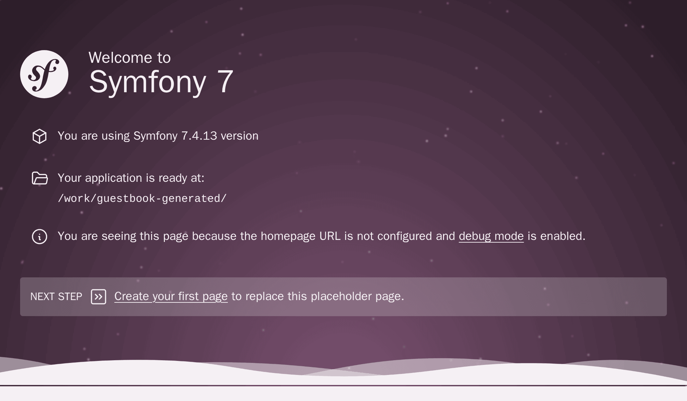

Da zero alla produzione
=======================

Mi piace andare veloce. Voglio che il nostro piccolo progetto sia pronto il prima possibile, possibilmente ora. In produzione. Dato che non abbiamo ancora sviluppato nulla, inizieremo con una bella e semplice pagina "In costruzione". Sarà bellissima!

Ho passato un po' di tempo a cercare su Internet una GIF animata vecchio stile "In costruzione". Ecco `quella`_ che userò:

.. image:: images/under-construction.gif
    :align: center

L'avevo detto che sarebbe stato divertente.

Inizializzazione del progetto
-----------------------------

Creare un nuovo progetto Symfony con lo strumento CLI ``symfony``, che abbiamo precedentemente installato:

.. code-block:: terminal

    $ symfony new guestbook --version=7.4 --php=8.5 --webapp --docker --upsun
    $ cd guestbook

Questo comando si appoggia a ``Composer`` e facilita la creazione di progetti Symfony. Utilizza uno `scheletro di progetto`_ con dipendenze minime: i componenti di Symfony necessari per quasi ogni progetto, una console e l'astrazione HTTP necessaria per creare applicazioni web.

Poiché stiamo creando un'applicazione web completa, abbiamo aggiunto qualche opzione che ci renderà la vita più facile:

* ``--webapp``: verrà create un'applicazione con il minor numero di dipendenze possibili. Per molti progetti web, è consigliato l'utilizzo del pacchetto ``webapp``. Quest'ultimo contiene la maggior parte dei pacchetti necessari per applicazioni web "moderne". Il pacchetto ``webapp`` aggiunge molti pacchetti Symfony, inclusi Symfony Messenger e PostgreSQL attraverso Doctrine.

* ``--docker``: sulla macchina locale utilizzeremo Docker per gestire i servizi come PostgreSQL. Questa opzione abilita Docker in modo che Symfony aggiunga automaticamente i servizi Docker a seconda dei pecchetti richiesti (ad esempio, un servizio PostgreSQL quando si aggiunge l'ORM, oppure un mail catcher quando si aggiunge Symfony Mailer).

* ``--upsun``: se vogliamo eseguire il deploy del progetto su Upsun, questa opzione genera automaticamente la configurazione consigliata per Upsun. Upsun è la maniera più semplice e preferita per eseguire deploy su cloud di ambienti Symfony quali test, stage e produzione.

Se date un'occhiata al repository GitHub per lo scheletro, noterete che è quasi vuoto: solo un file ``composer.json``. Ma la cartella ``guestbook`` è piena di file. Com'è possibile? La risposta è nel pacchetto ``symfony/flex``. Symfony Flex è un plugin di Composer che si aggancia al processo di installazione. Quando rileva un pacchetto per il quale ha una *ricetta*, la esegue.

Il punto di ingresso principale di una ricetta di Symfony è un file manifest, che descrive le operazioni da eseguire per registrare automaticamente il pacchetto in un'applicazione Symfony. Non è necessario leggere il file README per installare un pacchetto con Symfony. L'automazione è una caratteristica chiave di Symfony.

Poiché Git è installato sulla nostra macchina, il comando ``symfony new`` ha anche creato un repository Git per noi e ha aggiunto il primo commit.

Date un'occhiata alla struttura delle cartelle:

.. code-block:: text
    :class: ignore

    ├── bin/
    ├── composer.json
    ├── composer.lock
    ├── config/
    ├── public/
    ├── src/
    ├── symfony.lock
    ├── var/
    └── vendor/

La cartella ``bin/`` contiene il punto di ingresso principale della CLI: ``console``. La useremo spesso.

La cartella ``config/`` è composta da un insieme di file di configurazione predefiniti. Un file per pacchetto. Li modificheremo a malapena, fidarsi delle impostazioni predefinite è quasi sempre una buona idea.

La cartella ``public/`` è la root del server web, e lo script ``index.php`` è il punto di ingresso principale per tutte le risorse HTTP dinamiche.

La cartella ``src/`` conterrà tutto il codice da scrivere: è lì che trascorreremo la maggior parte del tempo. Per impostazione predefinita, tutte le classi di questa cartella usano il namespace ``App``. Qui ci sarà tutta la logica del dominio, con la quale Symfony non avrà quasi nulla a che vedere.

La cartella ``var/`` contiene cache, log e file generati a runtime dall'applicazione. Possiamo lasciarla stare. È l'unica cartella sulla quale dovrà essere possibile scrivere, in produzione.

La cartella ``vendor/`` contiene tutti i pacchetti installati da Composer, incluso Symfony stesso. È la nostra arma segreta per essere più produttivi. Cerchiamo di non reinvenare la ruota. Per fare il lavoro sporco ci affideremo a librerie esistenti. La cartella è gestita da Composer e non va toccata.

Questo è tutto ciò che c'è da sapere per ora.

Creazione di alcune risorse pubbliche
-------------------------------------

Tutto ciò che si trova sotto ``public/`` è accessibile tramite browser. Per esempio, se si sposta la GIF animata (nominandola ``under-construction.gif``) in una nuova cartella ``public/images/``, sarà disponibile in un URL come ``https://localhost/images/under-construction.gif``.

Scarichiamo qui la mia GIF:

.. code-block:: terminal

    $ mkdir public/images/
    $ php -r "copy('https://clipartmag.com/images/website-under-construction-image-6.gif', 'public/images/under-construction.gif');"

Avvio di un server web locale
-----------------------------

.. index::
    single: Symfony CLI;server:start

La CLI ``symfony`` fornisce anche un server web ottimizzato per lo sviluppo. Non bisogna sorprendersi che questo funzioni bene con Symfony, ma non va mai usato in produzione.

Dalla cartella del progetto, avviare il server web in background (passando ``-d``):

.. code-block:: terminal

    $ symfony server:start -d

Il server è partito dalla prima porta disponibile, a partire da 8000. Come scorciatoia, aprire il sito web in un browser dalla CLI:

.. code-block:: terminal
    :class: ignore

    $ symfony open:local

Il tuo browser preferito dovrebbe passare in primo piano, e aprire una nuova scheda che mostri qualcosa di simile a quanto segue:

.. tip::

    Per risolvere i problemi, eseguite ``symfony server:log``: farà un tail dei log del server web, di PHP e della vostra applicazione.

Date un'occhiata a ``/images/under-construction.gif``. Assomiglia a questa?

.. figure:: screenshots/under-construction-web.png
    :alt: /images/under-construction.gif
    :align: center
    :figclass: with-browser

.. index::
    single: Git;add
    single: Git;commit

Soddisfatti? Facciamo un commit:

.. code-block:: terminal
    :class: ignore

    $ git add public/images
    $ git commit -m'Add the under construction image'

Preparasi alla produzione
-------------------------

.. index::
    single: Upsun;Initialization

Facciamo un deploy in produzione di quanto fatto finora? Lo so, non abbiamo ancora una pagina HTML adeguata per accogliere i nostri utenti, ma poter vedere l'immagine "in costruzione" su un server di produzione sarebbe un grande passo avanti. In inglese si dice *deploy early, deploy often*, che significa che è buona norma fare deploy fin da subito e in modo frequente.

Si può pubblicare questa applicazione su qualsiasi provider che supporti PHP... il che significa quasi tutti i provider di hosting. Bisogna controllare alcune cose però: vogliamo l'ultima versione di PHP e la possibilità di avere servizi come un database, una coda e altro ancora.

Ho fatto la mia scelta, sarà `Upsun`_. Fornisce tutto ciò di cui abbiamo bisogno e aiuta a finanziare lo sviluppo di Symfony.

.. index::
    single: Symfony CLI;project:init

Siccome abbiamo utilizzato l'opzione ``--upsun`` quando abbiamo creato il progetto, il supporto per Upsun è già stato inizializzato con l'unico file di configurazione di cui ha bisogno, ovvero ``.upsun/config.yaml``.

Andare in produzione
--------------------

.. index::
    single: Symfony CLI;cloud:project:create
    single: Symfony CLI;cloud:push

È ora di un deploy?

Creare un nuovo progetto remoto su Upsun:

.. code-block:: terminal

    $ symfony cloud:project:create --title="Guestbook" --plan=development

Questo comando fa un sacco di cose:

* La prima volta che si lancia questo comando, bisognerà autenticarsi con le proprie credenziali di Upsun, se non lo si ha già fatto.

* Inizializza un nuovo progetto su Upsun (si hanno trenta giorni di tempo *gratis* sul primo progetto creato).

Poi, fare un deploy:

.. code-block:: terminal

    $ symfony cloud:push

Il deploy avviene automaticamente dopo il push nel repository. Alla fine del comando, il progetto avrà un nome di dominio specifico a cui accedere.

.. index::
    single: Symfony CLI;cloud:url

Controllare che tutto abbia funzionato bene:

.. code-block:: terminal
    :class: ignore

    $ symfony cloud:url -1

Si dovrebbe ottenere un 404, ma visitando ``/images/under-construction.gif`` dovremmo trovare un riscontro del nostro lavoro.

Si noti che non si ottiene la bellissima pagina predefinita di Symfony su Upsun. Perché? Scopriremo presto che Symfony supporta diversi ambienti e Upsun ha fatto automaticamente deploy del codice nell'ambiente di produzione.

.. index::
    single: Symfony CLI;cloud:project:delete

.. tip::

    Per cancellare il progetto da Upsun, usiamo il comando ``cloud:project:delete``.

.. sidebar:: Andare oltre

    * I repository per le `ricette ufficiali di Symfony`_ e per le `ricette fornite dalla comunità`_, dove è possibile inviare le proprie ricette;

    * Il `server web locale di Symfony`_;

    * La `documentazione di Upsun`_.

.. _`quella`: https://clipartmag.com/images/website-under-construction-image-6.gif
.. _`scheletro di progetto`: https://github.com/symfony/skeleton
.. _`Upsun`:     https://upsun.com/symfony/?utm_source=symfony-cloud-sign-up&utm_medium=backlink&utm_campaign=Symfony-Cloud-sign-up&utm_content=symfony-book
.. _`ricette ufficiali di Symfony`: https://github.com/symfony/recipes
.. _`ricette fornite dalla comunità`: https://github.com/symfony/recipes-contrib
.. _`server web locale di Symfony`: https://symfony.com/doc/current/setup/symfony_server.html
.. _`documentazione di Upsun`: https://developer.upsun.com/docs/get-started/stacks/symfony/index?utm_source=symfony-cloud-sign-up&utm_medium=backlink&utm_campaign=Symfony-Cloud-sign-up&utm_content=symfony-book
