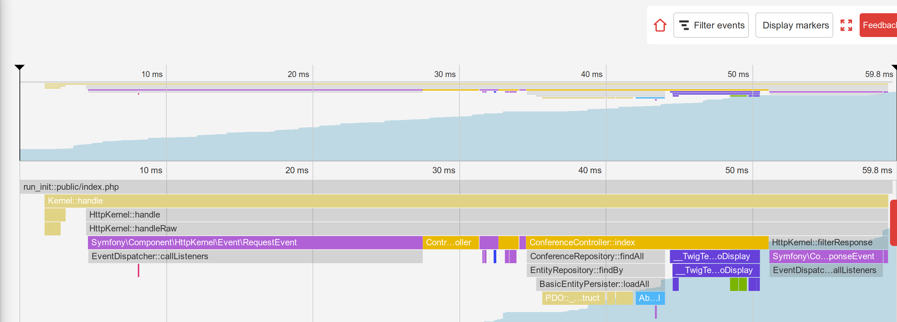

Symfony の内部を知る
==========================

.. index::
    single: Blackfire
    single: Debugging
    single: Internals

ここまで長い間 Symfony を使ってアプリケーションを開発してきましたが、ほとんどのコードは Symfony 内部から実行されています。実際書いたコードは200行か300行のコードくらいで、Symfony 内部には数千行のコードがあります。

舞台裏でどうやって動いているか理解したいですね。どうやって動いているかを理解するのに役に立つツールにはいつも感心させられます。初めてデバッガーのステップ実行を使ったときや ``ptrace`` を使ってみたときの記憶は魔法のような感覚でした。

Symfony がどうやって動いているかより理解したくなりませんか？Symfony があなたのアプリケーションを動かす仕組みを調べてみましょう。理論的な視点から HTTP リクエストをどう扱っているかを説明するのではなく、 Blackfire を使って視覚的な表現を使い、さらに高度なトピックを調べてみましょう。

Blackfire で Symfony の内部を理解する
----------------------------------------------

全ての HTTP リクエストは、``public/index.php`` ファイルが受けているのはご存知だと思いますが、次に何が起きるか、どうやってコントローラーが呼ばれるかわかりますか？

Blackfire のブラウザ拡張を使用して、本番の英語のホームページのプロファイリングをしてみましょう:

.. code-block:: terminal
    :class: ignore

    $ symfony remote:open

もしくは直接コマンドラインで:

.. code-block:: terminal
    :class: ignore

    $ blackfire curl `symfony cloud:env:url --pipe --primary`en/

プロファイルの "Timeline" へ行くと、次のような画面が表示されるはずです:

タイムラインでは、色の付いたバーにマウスをポインタをホバーすれば、各呼び出しについてのより詳細な情報を見ることができ、Symfony がどうやって動いているかを知ることができます。

* メインエントリーポイントは、``public/index.php`` です;

* ``Kernel::handle()`` メソッドがリクエストを扱います;

* イベントをディスパッチする ``HttpKernel`` を呼び出します;

* 最初のイベントは、 ``RequetEvent`` です;

* ``ControllerResolver::getController()`` メソッドは、やってきた URL からどのコントロラーが呼ばれるか決定します;

* ``ControllerResolver::getArguments()`` メソッドは、コントローラーにどの引数を渡すか決定します（Param Converter はここで呼ばれます）;

* ``ConferenceController::index()`` メソッドが呼ばれます。この呼び出しでほとんどの私たちが書いたコードが実行されます;

* ``ConferenceRepository::findAll()`` メソッドが、データベースから全てのカンファレンスを取得します（``PDO::_construct()`` でデータベース接続をしています）;

* ``Twig\Environment::render()`` メソッドがテンプレートをレンダリングします;

* ``ResponseEvent`` と ``FinishRequestEvent`` がディスパッチされますが、実行速度が早すぎてリスナーが何も登録されていないかのように見えます。

タイムラインは、コードがどうやって動くかを理解するのに良い方法です; 他の誰かが開発したプロジェクトを受け取ったときにとても便利です。

開発環境で、ローカルマシンから同じページをプロファイルしましょう:

.. code-block:: terminal
    :class: ignore

    $ blackfire curl `symfony var:export SYMFONY_PROJECT_DEFAULT_ROUTE_URL`en/

プロファイルを開いてください。リクエストはすぐ終わり、タイムラインはほとんど空のため、コールグラフ画面へリダイレクトされるはずです:

.. figure:: images/blackfire-homepage-cached-dev.png
    :alt: /
    :align: center
    :figclass: with-browser

何が起きているか説明しましょう。HTTPキャッシュが有効化されているので、 Symfony HTTP キャッシュのレイヤーをプロファイルしていしまっているのです。ページはキャッシュ（``HttpCache\Store::restoreResponse()``）にあり HTTP レスポンスはキャッシュから取得されるのでコントローラーは呼ばれることがないのです。

前回のステップでやったように、もう一度  ``public/index.php`` 内のキャッシュレイヤーを無効にしてみてください。今度は全く違ったプロファイルになったはずです:

.. figure:: images/blackfire-homepage-dev.png
    :alt: /
    :align: center
    :figclass: with-browser

主な違いは次の通りです:

* 本番では、実行時間をかなり占める ``TerminateEvent`` は見えません。なぜなら ``TerminateEvent`` は、 Symfony プロファイラーがリクエストを受けた際に集めたデータを格納する責務のイベントだからです;

* ``ConferenceController::index()`` コールの下に ``SubRequestHandler::handle()`` メソッドがあります。このメソッドは ESI をレンダリングします。 ``Profiler::saveProfile()`` が二度呼ばれているのはそのためです。一度目はメインのリクエスト用、もう一つは ESI 用です。

さらに詳しく知るために、タイムラインを使って、コールグラフ画面から同データの他の表示に切り替えたりしてみてください。

ここまで見てきたように、開発環境と本番ではコードはかなり違って実行されます。開発環境では、Symfony プロファイラーがデバッグをしやすいように多くのデータを集めようとしています。そのため、ローカルでも本番環境でプロファイルをした方が良いです。

興味深い実験として、 エラーページや ``/`` ページ（リダイレクトのページ）、API リソースをプロファイルしてみてください。各プロファイルから Symfony がどうやって動いているか、少し知ることができます。例えば、どのクラスのメソッドが呼ばれ、何が時間がかかっていたり、何がすぐ終わっていたりするか、などです。

Blackfire のデバッグアドオンを使用する
----------------------------------------------------

.. index::
    single: Blackfire;Debug Addon

デフォルトでは、Blackfire は、大きいペイロードやグラフを避けるためにあまり重要でないメソッド呼び出しを全て除去します。しかし、デバッグツールとして Blackfire を使用する際にには全ての呼び出しを捨てないでおくことがベターです。デフォルトではできませんが、デバッグのアドオンを入れることで可能になります。

コマンドラインからは、 ``--debug`` フラグを使用してください:

.. code-block:: terminal
    :class: ignore

    $ blackfire --debug curl `symfony var:export SYMFONY_PROJECT_DEFAULT_ROUTE_URL`en/
    $ blackfire --debug curl `symfony cloud:env:url --pipe --primary`en/

.. index::
    single: .env.local.prod

本番では、 ``.env.local.php`` という名前のファイルがロードされるのが確認できます:

.. figure:: images/blackfire-env-local-prod.png
    :alt: /
    :align: center
    :figclass: with-browser

.. index::
    single: Composer;Optimizations
    single: Composer;Autoloader
    single: Autoloader

Upsun は、Symfony アプリケーションをデプロイする際に、 最適化を行います。Composer のオートローダーを最適化するのと同じようなものです (``--optimize-autoloader --apcu-autoloader --classmap-authoritative``)。また、  ``.env.local.php`` ファイルによって生成される  ``.env`` ファイルに定義してある環境変数も最適化してリクエスト毎にファイルをパースしないようにします:

.. code-block:: terminal
    :class: ignore

    $ symfony run composer dump-env prod

Blackfire は コードがどうやってPHP で実行されるかを理解するのにとても役立つツールです。パフォーマンスの向上は、プロファイラーの使い道の1つに過ぎません。

Xdebugのステップ実行を利用する
------------------------------------------

.. index::
    single: Xdebug
    single: Debugger

Blackfireのタイムラインとコールグラフによって、開発者はどのファイル/関数/メソッドがPHPエンジン上で実行されているか視覚化でき、プロジェクトのコードベースをよりよく理解することができます。

コードの実行を追跡するもう一つの方法は `Xdebug`_ のような **ステップ実行** を使うことです。ステップ実行を使うと、開発者はPHPプロジェクトのコードをインタラクティブに見て歩いて、制御構造をデバッグしたりデータ構造を確認したりすることができます。ステップ実行によるデバッグは、予想外の挙動をデバッグするのにとても役立ち、ありがちな "var_dump()/exit()" デバッグを置き換えることができます。

まず、 ``xdebug`` PHP拡張をインストールしましょう。xdebugがインストールされていることは次のコマンドで確認できます:

.. code-block:: terminal

    $ symfony php -v

Xdebugが出力されるのが見えます:

.. code-block:: text
    :emphasize-lines: 5
    :class: ignore

    PHP 8.0.1 (cli) (built: Jan 13 2021 08:22:35) ( NTS )
    Copyright (c) The PHP Group
    Zend Engine v4.0.1, Copyright (c) Zend Technologies
        with Zend OPcache v8.0.1, Copyright (c), by Zend Technologies
        with Xdebug v3.0.2, Copyright (c) 2002-2021, by Derick Rethans
        with blackfire v1.49.0~linux-x64-non_zts80, https://blackfire.io, by Blackfire

Xdebugが PHP-FPM で有効になっていることは、ブラウザに行き、WebデバッグツールバーのSymfonyロゴの上にポインタを合わせて "View phpinfo()" リンクをクリックすることでも確認できます:

.. figure:: screenshots/phpinfo.png
    :alt: /
    :align: center
    :figclass: with-browser

今度はXdebugの ``debug`` モードを有効にします:

.. code-block:: ini
    :caption: php.ini
    :class: ignore

    [xdebug]
    xdebug.mode=debug
    xdebug.start_with_request=yes

デフォルトでは、Xdebugはローカルホストの9003ポートにデータを送ります。

Xdebugを起動する方法はたくさんありますが、一番簡単なのはIDEからXdebugを使う方法です。この章ではVisual Studio Codeを使い、やり方を示します。 "Quick Open" (``Ctrl+P``)を開き、次のコマンドを貼り付けてエンターキーを押すと、 `PHP Debug`_ 拡張がインストールされます:

.. code-block:: text
    :class: ignore

    ext install felixfbecker.php-debug

次の内容で設定ファイルを作ります:

.. code-block:: json
    :caption: .vscode/launch.json
    :emphasize-lines: 8,16
    :class: ignore

    {
        "version": "0.2.0",
        "configurations": [
            {
                "name": "Listen for XDebug",
                "type": "php",
                "request": "launch",
                "port": 9003
            },
            {
                "name": "Launch currently open script",
                "type": "php",
                "request": "launch",
                "program": "${file}",
                "cwd": "${fileDirname}",
                "port": 9003
            }
        ]
    }

Visual Studio Code でプロジェクトディレクトリに入り、デバッガーを開いて "Listen for Xdebug" というラベルのついた緑の再生ボタンをクリックします:

.. figure:: images/vs-xdebug-run.png
    :align: center

ページをブラウザで開いて更新すると、自動的にIDEにフォーカスが移りますが、デバッグセッションが開かれたことを意味します。デフォルトでは、全てがブレークポイントになっており、最初の行で実行が止まります。開発者はその時点の変数を調べ、コードのステップを進めて、進めて…

デバッグするときは、"Everything" チェックを外してすべてをブレークポイントにするのをやめて、コードの中で明示的にブレークポイントを設定することができます。

もしステップ実行が初めてであれば、 `excellent tutorial for Visual Studio Code`_ を読むと良いでしょう。ステップ実行のすべてをわかりやすく説明してくれます。

.. sidebar:: より深く学ぶために

    * `Xdebugのステップ実行のドキュメント`_;

    * `Visual Studio Code を使ったデバッグ`_.

.. _`Xdebug`: https://xdebug.org
.. _`PHP Debug`: https://marketplace.visualstudio.com/items?itemName=felixfbecker.php-debug
.. _`Xdebugのステップ実行のドキュメント`: https://xdebug.org/docs/step_debug
.. _`excellent tutorial for Visual Studio Code`: https://code.visualstudio.com/Docs/editor/debugging
.. _`Visual Studio Code を使ったデバッグ`: https://code.visualstudio.com/Docs/editor/debugging
