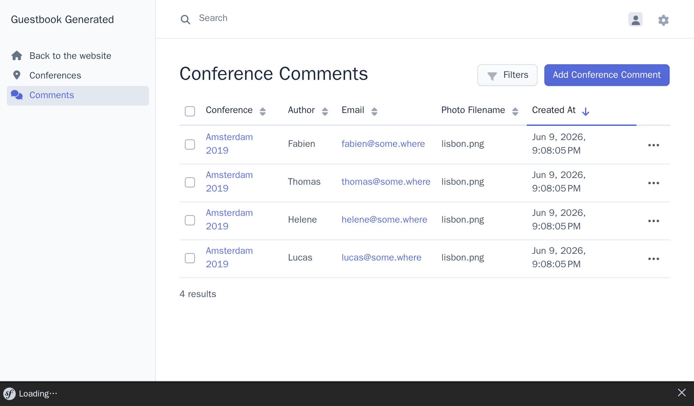
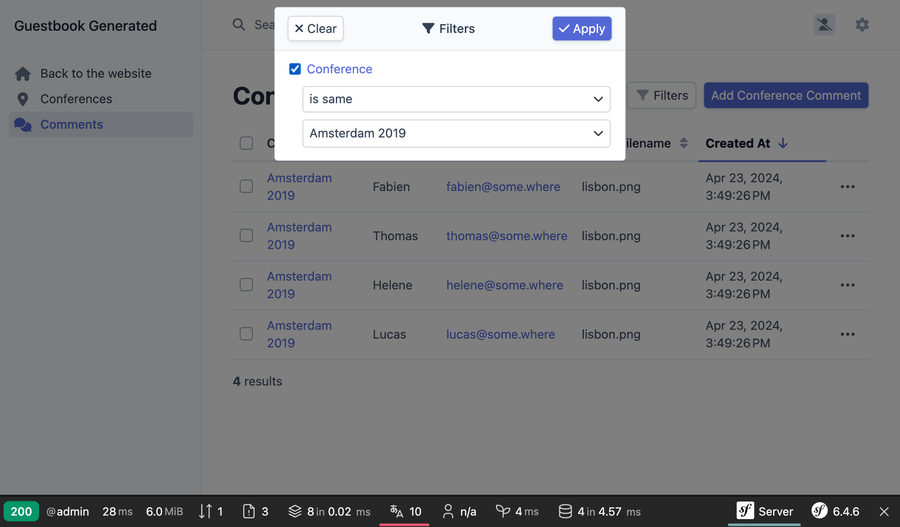

管理者用のバックエンドをセットアップする
============================================================

.. index::
    single: EasyAdmin
    single: Admin
    single: Backend

データベースに次のカンファレンスを追加するのは、プロジェクトの管理者の仕事です。 *管理者用のバックエンド* は、Webサイトの保護された場所となり、そこで *プロジェクト管理者* は、Webサイトのデータを管理したり、フィードバックをモデレートしたりできます。

早く作成するのにどうしましょうか？プロジェクトのモデルに基づく管理者用のバックエンドを生成することができる EasyAdmin バンドルを使いましょう。

更に依存パッケージをインストールする
------------------------------------------------------

``webapp`` パッケージはたくさんの便利なパッケージを追加しますが、より特殊な機能を使うためには更に依存を追加しなければなりません。どうやって依存を追加するのでしょうか？ Composerを使います。"普通" のComposerパッケージの他に、2種類の "特別" なパッケージを使います:

* *Symfony Components*: コア機能とほとんどのアプリケーションで必要な低レベルの抽象（ルーティング、コンソール、HTTPクライアント、メーラー、キャッシュ...）を実装したパッケージ。

* *Symfony Bundles*: 高レベル機能を追加したり、サードパーティライブラリを統合するパッケージ（ほとんどのバンドルはコミュニティによって開発されています）。

EasyAdmin をプロジェクトの依存に追加しましょう:

.. code-block:: terminal

    $ symfony composer req "easycorp/easyadmin-bundle:^5"

*エイリアス* はComposerの機能ではありませんが、Symfonyが提供している便利な概念です。エイリアスはポピュラーなComposerパッケージのショートカットです。アプリケーションでORMを使いたいですか？ ``orm`` を追加してください。APIを開発したいですか？ ``api`` を追加してください。エイリアスは自動的に1つ以上の通常のComposerパッケージとして解決されます。エイリアスは、Symfonyコアチームによって作成されています。

もう一つの便利な機能として、いつでも ``symfony`` ベンダープリフィクスを省略することができます。 ``symfony/cache`` の代わりに ``cache`` を追加してください。

.. tip::

    ``symfony/flex`` というComposerプラグインについて説明したのを覚えているでしょうか？エイリアスは flex の機能の一つです。

EasyAdmin を設定する
-------------------------

EasyAdminは特別なコントローラーによって、アプリケーションの管理者画面を自動的に作成します。

EasyAdminを使い始めるにあたって、Webサイトのデータを管理するメインの入口になる "管理者ダッシュボード" を作りましょう。

.. code-block:: terminal
    :class: answers(DashboardController||src/Controller/Admin/)

    $ symfony console make:admin:dashboard

デフォルトの答えをそのまま選んでいくと次のようなコントローラーができます:

.. code-block:: php
    :caption: src/Controller/Admin/DashboardController.php
    :class: ignore

    namespace App\Controller\Admin;

    use EasyCorp\Bundle\EasyAdminBundle\Attribute\AdminDashboard;
    use EasyCorp\Bundle\EasyAdminBundle\Config\Dashboard;
    use EasyCorp\Bundle\EasyAdminBundle\Config\MenuItem;
    use EasyCorp\Bundle\EasyAdminBundle\Controller\AbstractDashboardController;
    use Symfony\Component\HttpFoundation\Response;

    #[AdminDashboard(routePath: '/admin', routeName: 'admin')]
    class DashboardController extends AbstractDashboardController
    {
        public function index(): Response
        {
            return parent::index();
        }

        public function configureDashboard(): Dashboard
        {
            return Dashboard::new()
                ->setTitle('Guestbook');
        }

        public function configureMenuItems(): iterable
        {
            yield MenuItem::linkToDashboard('Dashboard', 'fa fa-home');
            // yield MenuItem::linkTo(SomeCrudController::class, 'The Label', 'fas fa-list');
        }
    }

慣例により全ての管理者用コントローラーは ``App\Controller\Admin`` というネームスペースに保存されます。

生成された管理者用バックエンドには、 ``#[AdminDashboard]`` 属性で設定した ``/admin`` からアクセスできます。このURLは何でも好きなものに変更することができます:

.. figure:: screenshots/easy-admin-empty.png
    :alt: /admin
    :align: center
    :figclass: with-browser

ドーン! 素敵な見た目の管理者インターフェースができました。しかも必要に応じてカスタマイズできます。

.. index::
    single: CRUD

次のステップでは、カンファレンスとコメントを管理するためのコントローラーを作ります。

ダッシュボードのコントローラの中に、"CRUDs" へのリンクを追加するというコメントが入った ``configureMenuItem()`` メソッドがあることに気づいたかもしれません。 **CRUD** は "Create, Read, Update, Delete" （作成、参照、更新、削除）の頭文字を取った略語で、エンティティに対して行う4つの基本的な操作です。この4つはまさに管理者画面でやりたいことです。EasyAdminでは検索と絞り込みもできるので、次のレベルまで対応しています。

カンファレンスのためのCRUDを作ってみます:

.. code-block:: terminal
    :class: answers(1||src/Controller/Admin/||App\\Controller\\Admin)

    $ symfony console make:admin:crud

カンファレンスの管理者画面を作るために ``1`` を選び、残りの質問にはデフォルトの答えを選んでください。次のようなファイルが作成されます:

.. code-block:: php
    :caption: src/Controller/Admin/ConferenceCrudController.php
    :class: ignore

    namespace App\Controller\Admin;

    use App\Entity\Conference;
    use EasyCorp\Bundle\EasyAdminBundle\Controller\AbstractCrudController;

    class ConferenceCrudController extends AbstractCrudController
    {
        public static function getEntityFqcn(): string
        {
            return Conference::class;
        }

        /*
        public function configureFields(string $pageName): iterable
        {
            return [
                IdField::new('id'),
                TextField::new('title'),
                TextEditorField::new('description'),
            ];
        }
        */
    }

コメントについても同じことをします:

.. code-block:: terminal
    :class: answers(0||src/Controller/Admin/||App\\Controller\\Admin)

    $ symfony console make:admin:crud

最後のステップでは、カンファレンスとコメントの管理者用CRUD画面をダッシュボードにリンクします:

.. code-block:: diff
    :caption: patch_file

    --- i/src/Controller/Admin/DashboardController.php
    +++ w/src/Controller/Admin/DashboardController.php
    @@ -44,7 +44,8 @@ class DashboardController extends AbstractDashboardController

         public function configureMenuItems(): iterable
         {
    -        yield MenuItem::linkToDashboard('Dashboard', 'fa fa-home');
    -        // yield MenuItem::linkTo(SomeCrudController::class, 'The Label', 'fas fa-list');
    +        yield MenuItem::linkToRoute('Back to the website', 'fas fa-home', 'homepage');
    +        yield MenuItem::linkTo(ConferenceCrudController::class, 'Conferences', 'fas fa-map-marker-alt');
    +        yield MenuItem::linkTo(CommentCrudController::class, 'Comments', 'fas fa-comments');
         }
     }

``configureMenuItems()`` メソッドを上書きして、関連するアイコンつきのメニューを追加し、更にWebサイトのトップページに戻るリンクも追加しました。``ConferenceCrudController`` クラスと ``CommentCrudController`` クラスはダッシュボードと同じ ``App\Controller\Admin`` 名前空間にあるため、追加の ``use`` 文は不要です。

EasyAdminでは ``MenuItem::linkTo()`` メソッドにより、エンティティのCRUDに簡単にリンクするAPIを公開しています。このメソッドはCRUDコントローラーのクラスを引数に取ります。

メインのダッシュボードページは現時点では空っぽです。ダッシュボードは、様々な統計や関連情報を表示することができる場所です。ダッシュボードに表示したい重要事項は特にないので、カンファレンス一覧にリダイレクトすることにしましょう。

.. code-block:: diff
    :caption: patch_file

    --- i/src/Controller/Admin/DashboardController.php
    +++ w/src/Controller/Admin/DashboardController.php
    @@ -8,6 +8,7 @@ use EasyCorp\Bundle\EasyAdminBundle\Attribute\AdminDashboard;
     use EasyCorp\Bundle\EasyAdminBundle\Config\Dashboard;
     use EasyCorp\Bundle\EasyAdminBundle\Config\MenuItem;
     use EasyCorp\Bundle\EasyAdminBundle\Controller\AbstractDashboardController;
    +use EasyCorp\Bundle\EasyAdminBundle\Router\AdminUrlGenerator;
     use Symfony\Component\HttpFoundation\Response;

     #[AdminDashboard(routePath: '/admin', routeName: 'admin')]
    @@ -15,7 +16,10 @@ class DashboardController extends AbstractDashboardController
     {
         public function index(): Response
         {
    -        return parent::index();
    +        $routeBuilder = $this->container->get(AdminUrlGenerator::class);
    +        $url = $routeBuilder->setController(ConferenceCrudController::class)->generateUrl();
    +
    +        return $this->redirect($url);

             // Option 1. You can make your dashboard redirect to some common page of your backend
             //

エンティティのリレーション（コメントと紐づくカンファレンス）を表示するとき、EasyAdminはカンファレンスの文字列としての表現を使おうとします。エンティティに ``__toString()`` マジックメソッドが定義されていなければ、デフォルトとしてエンティティの名前と主キーを利用します（ ``Conference #1`` のように）。リレーションの表示をより意味のあるものにするためには、 ``Conference`` クラスにメソッドを追加しましょう:

.. code-block:: diff
    :caption: patch_file

    --- i/src/Entity/Conference.php
    +++ w/src/Entity/Conference.php
    @@ -35,6 +35,11 @@ class Conference
             $this->comments = new ArrayCollection();
         }

    +    public function __toString(): string
    +    {
    +        return $this->city.' '.$this->year;
    +    }
    +
         public function getId(): ?int
         {
             return $this->id;

これで、管理者用バックエンドからカンファレンスを直接追加/変更/削除することができるようになりました。一つ以上カンファレンスを作成して遊んでみましょう。

.. figure:: screenshots/easy-admin.png
    :alt: /admin
    :align: center
    :figclass: with-browser

EasyAdmin をカスタマイズする
-------------------------------------

デフォルトの管理者用のバックエンドが正しく動くようになりましたが、カスタマイズしてさらに改善することができます。コメントのエンティティに簡単な修正をして、どんなことができるか見てみましょう:

.. code-block:: diff
    :caption: patch_file

    --- i/src/Controller/Admin/CommentCrudController.php
    +++ w/src/Controller/Admin/CommentCrudController.php
    @@ -3,10 +3,17 @@
     namespace App\Controller\Admin;

     use App\Entity\Comment;
    +use EasyCorp\Bundle\EasyAdminBundle\Config\Crud;
    +use EasyCorp\Bundle\EasyAdminBundle\Config\Filters;
     use EasyCorp\Bundle\EasyAdminBundle\Controller\AbstractCrudController;
    +use EasyCorp\Bundle\EasyAdminBundle\Field\AssociationField;
    +use EasyCorp\Bundle\EasyAdminBundle\Field\DateTimeField;
    +use EasyCorp\Bundle\EasyAdminBundle\Field\EmailField;
     use EasyCorp\Bundle\EasyAdminBundle\Field\IdField;
    +use EasyCorp\Bundle\EasyAdminBundle\Field\TextareaField;
     use EasyCorp\Bundle\EasyAdminBundle\Field\TextEditorField;
     use EasyCorp\Bundle\EasyAdminBundle\Field\TextField;
    +use EasyCorp\Bundle\EasyAdminBundle\Filter\EntityFilter;

     class CommentCrudController extends AbstractCrudController
     {
    @@ -15,14 +22,43 @@ class CommentCrudController extends AbstractCrudController
             return Comment::class;
         }

    -    /*
    +    public function configureCrud(Crud $crud): Crud
    +    {
    +        return $crud
    +            ->setEntityLabelInSingular('Conference Comment')
    +            ->setEntityLabelInPlural('Conference Comments')
    +            ->setSearchFields(['author', 'text', 'email'])
    +            ->setDefaultSort(['createdAt' => 'DESC'])
    +        ;
    +    }
    +
    +    public function configureFilters(Filters $filters): Filters
    +    {
    +        return $filters
    +            ->add(EntityFilter::new('conference'))
    +        ;
    +    }
    +
         public function configureFields(string $pageName): iterable
         {
    -        return [
    -            IdField::new('id'),
    -            TextField::new('title'),
    -            TextEditorField::new('description'),
    -        ];
    +        yield AssociationField::new('conference');
    +        yield TextField::new('author');
    +        yield EmailField::new('email');
    +        yield TextareaField::new('text')
    +            ->hideOnIndex()
    +        ;
    +        yield TextField::new('photoFilename')
    +            ->onlyOnIndex()
    +        ;
    +
    +        $createdAt = DateTimeField::new('createdAt')->setFormTypeOptions([
    +            'years' => range(date('Y'), date('Y') + 5),
    +            'widget' => 'single_text',
    +        ]);
    +        if (Crud::PAGE_EDIT === $pageName) {
    +            yield $createdAt->setFormTypeOption('disabled', true);
    +        } else {
    +            yield $createdAt;
    +        }
         }
    -    */
     }

``Comment`` 画面をカスタマイズするために、 ``configureFields()`` メソッドで明示的に項目名を列挙すると、思い通りの順番で項目を並べることができます。項目ごとにより詳細に設定することもできます。たとえば、一覧画面ではテキスト項目を隠すことができます。

写真なしのコメントを追加しましょう。ここでは日付は手動でセットしましょう; 後のステップで ``createdAt`` カラムを自動的にセットするようにします。

``configureFilters()`` メソッドでは、検索画面にどんな絞り込み項目を表示するかを定義することができます。

これらのカスタマイズで、EasyAdmin を使って可能なことを少し紹介をしました。

カンファレンスでコメントをフィルターしたり、メールアドレスでコメントを検索したりして、管理者画面を遊んでみてください。問題が一つあるとすれば、誰もがバックエンドにアクセスできるようになっていることですが、後のステップでセキュアにしていきますので、心配しないでください。

.. code-block:: terminal
    :class: hide

    $ symfony run psql -c "TRUNCATE conference RESTART IDENTITY CASCADE"

.. sidebar:: より深く学ぶために

    * `EasyAdmin ドキュメント`_;

    * `Symfony フレームワーク設定リファレンス`_;

    * `PHP マジックメソッド`_.

.. _`EasyAdmin ドキュメント`: https://symfony.com/bundles/EasyAdminBundle/4.x/index.html
.. _`Symfony フレームワーク設定リファレンス`: https://symfony.com/doc/current/reference/configuration/framework.html
.. _`PHP マジックメソッド`: https://www.php.net/manual/en/language.oop5.magic.php
