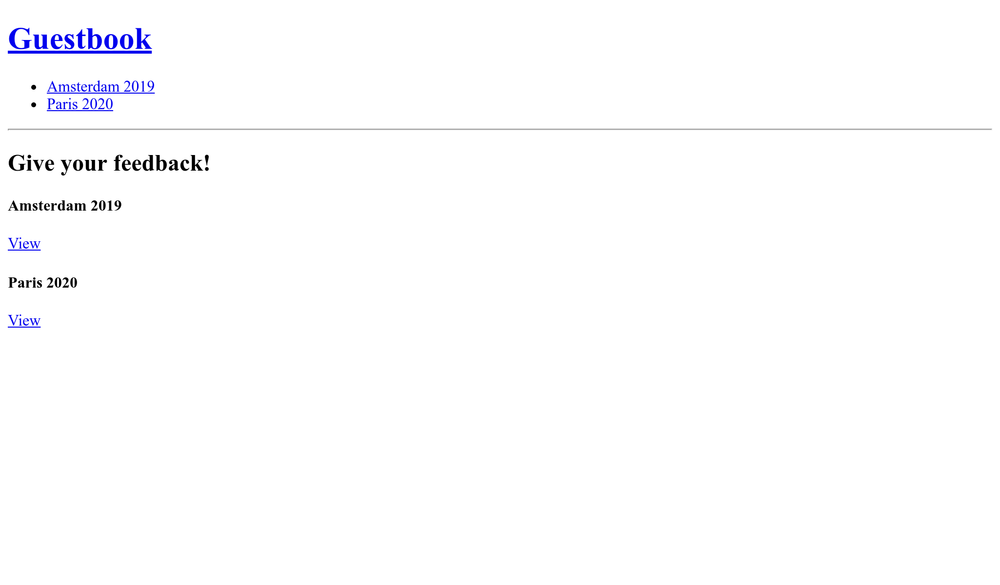

الاستماع إلى الأحداث
======================================

يفتقد التخطيط الحالي إلى رأس تنقل للعودة إلى الصفحة الرئيسية أو التبديل من مؤتمر إلى آخر.

إضافة رأس موقع header
---------------------------------

.. index::
    single: Twig;for
    single: Twig;path

يجب أن يكون أي شيء يجب عرضه على جميع صفحات الويب ، مثل الرأس ، جزءًا من التخطيط الأساسي الرئيسي:

.. code-block:: diff
    :caption: patch_file

    --- i/templates/base.html.twig
    +++ w/templates/base.html.twig
    @@ -12,6 +12,15 @@
             
         </head>
         <body>
    +        <header>
    +            <h1><a href="{{ path('homepage') }}">Guestbook</a></h1>
    +            <ul>
    +            
    +                <li><a href="{{ path('conference', { id: conference.id }) }}">{{ conference }}</a></li>
    +            
    +            </ul>
    +            

    +        </header>
             
         </body>
     </html>

إن إضافة هذا الكود إلى التخطيط يعني أن جميع القوالب التي توسعه يجب أن تحدد متغير ``المؤتمرات``، الذي يجب إنشاؤه وتمريره من وحدات التحكم الخاصة بهم.

نظرًا لأن لدينا وحدتا تحكم فقط ، *يمكنك* القيام بما يلي (لا تقم بتطبيق التغيير على التعليمات البرمجية الخاصة بك لأننا سنتعلم طريقة أفضل قريبًا جدًا):

.. code-block:: diff
    :class: ignore

    --- i/src/Controller/ConferenceController.php
    +++ w/src/Controller/ConferenceController.php
    @@ -21,11 +21,12 @@ final class ConferenceController extends AbstractController
         }

         #[Route('/conference/{id}', name: 'conference')]
    -    public function show(#[MapEntity] Conference $conference, CommentRepository $commentRepository, #[MapQueryParameter(options: ['min_range' => 0])] int $offset = 0): Response
    +    public function show(#[MapEntity] Conference $conference, CommentRepository $commentRepository, ConferenceRepository $conferenceRepository, #[MapQueryParameter(options: ['min_range' => 0])] int $offset = 0): Response
         {
             $paginator = $commentRepository->getCommentPaginator($conference, $offset);

             return $this->render('conference/show.html.twig', [
    +            'conferences' => $conferenceRepository->findAll(),
                 'conference' => $conference,
                 'comments' => $paginator,
                 'previous' => $offset - CommentRepository::COMMENTS_PER_PAGE,

تخيل أنك مضطر لتحديث العشرات من وحدات التحكم. وتفعل نفس الشيء مع كل ما هو جديد. هذه ليست عملية للغاية. يجب أن تكون هناك طريقة أفضل.

لدى Twig مفهوم المتغيرات العالمية.  * متغير عام * متاح في جميع النماذج المقدمة. يمكنك تحديدها في ملف تكوين ، ولكنها تعمل فقط للقيم الثابتة. لإضافة جميع المؤتمرات كمتغير عالمي Twig ، سنقوم بإنشاء مستمع.

اكتشاف أحداث سيمفوني Symfony Events
-----------------------------------------------------

.. index::
    single: Components;Event Dispatcher
    single: Event

يأتي سيمفوني مدمجًا مع مكون مرسل الأحداث (Event Dispatcher Component). يقوم المرسل * بإرسال * أحداث معينة * في أوقات محددة يمكن * للمستمعين * الاستماع إليها. المستمعون هم خطافات في الإطار الداخلي.

على سبيل المثال ، تسمح لك بعض الأحداث بالتفاعل مع دورة حياة طلبات HTTP. أثناء معالجة الطلب ، يرسل المرسل الأحداث عند إنشاء الطلب ، أو عندما تكون وحدة التحكم على وشك التنفيذ ، أو عندما تكون الاستجابة جاهزة للإرسال ، أو عندما يتم طرح استثناء. يمكن * المستمع * الاستماع إلى حدث واحد أو أكثر وتنفيذ بعض المنطق بناءً على سياق الحدث.

الأحداث عبارة عن نقاط امتداد محددة جيدًا تجعل الإطار أكثر شمولاً وقابلية للتوسيع. تستخدم العديد من مكونات سيمفوني مثل Security أو Messenger أو Workflow أو Mailer على نطاق واسع.

مثال آخر مضمن للأحداث والمستمعين قيد التنفيذ هو دورة حياة الأمر: يمكنك إنشاء مستمع لتنفيذ التعليمات البرمجية قبل تشغيل *أي أمر*.

يمكن لأي حزمة أو حزمة أيضًا إرسال أحداثها الخاصة لجعل رمزها قابلاً للتوسيع.

لتجنب وجود ملف تكوين يصف الأحداث التي يرغب المستمع في الاستماع إليها ، أضف السمة ``#[AsEventListener]`` على فئة المستمع أو الدالة. هذا يسمح للمستمعين بالتسجيل في مرسل سيمفوني تلقائيًا.

إنجاز مستمع Listener
--------------------------------

.. index::
    single: Event;Listener
    single: Listener
    single: Command;make:listener

أنت تعرف الأغنية عن ظهر قلب الآن ، استخدم حزمة صانع لإنشاء مستمع Listener:

.. code-block:: terminal
    :class: answers(Symfony\\Component\\HttpKernel\\Event\\ControllerEvent)

    $ symfony console make:listener TwigEventListener

يسألك الأمر عن الحدث الذي تريد الاستماع إليه. اختر حدث `` Symfony \ Component \ HttpKernel \ Event \ ControllerEvent `` ، الذي يتم إرساله قبل استدعاء وحدة التحكم. هذا هو أفضل وقت لحقن المتغير العالمي `` للمؤتمرات '' حتى يتمكن Twig من الوصول إليه عندما تقوم وحدة التحكم بتقديم القالب. قم بتحديث المستمع كما يلي:

.. code-block:: diff
    :caption: patch_file

    --- i/src/EventListener/TwigEventListener.php
    +++ w/src/EventListener/TwigEventListener.php
    @@ -2,14 +2,22 @@

     namespace App\EventListener;

    +use App\Repository\ConferenceRepository;
     use Symfony\Component\EventDispatcher\Attribute\AsEventListener;
     use Symfony\Component\HttpKernel\Event\ControllerEvent;
    +use Twig\Environment;

     final class TwigEventListener
     {
    +    public function __construct(
    +        private Environment $twig,
    +        private ConferenceRepository $conferenceRepository,
    +    ) {
    +    }
    +
         #[AsEventListener]
         public function onControllerEvent(ControllerEvent $event): void
         {
    -        // ...
    +        $this->twig->addGlobal('conferences', $this->conferenceRepository->findAll());
         }
     }

الآن ، يمكنك إضافة أي عدد تريده من وحدات التحكم: سيكون متغير متغيرات `` المؤتمرات `` متاحًا دائمًا في Twig.

.. note::

    سوف نتحدث عن أداء بديل أفضل بكثير في خطوة لاحقة.

فرز المؤتمرات حسب السنة والمدينة
------------------------------------------------------------

ترتيب قائمة المؤتمرات حسب السنة قد يسهل التصفح. يمكننا إنشاء طريقة مخصصة لاسترداد جميع المؤتمرات وفرزها ، ولكن بدلاً من ذلك ، سنقوم بإلغاء التطبيق الافتراضي لطريقة `` findAll () `` للتأكد من تطبيق الفرز في كل مكان:

.. code-block:: diff
    :caption: patch_file

    --- i/src/Repository/ConferenceRepository.php
    +++ w/src/Repository/ConferenceRepository.php
    @@ -16,6 +16,11 @@ class ConferenceRepository extends ServiceEntityRepository
             parent::__construct($registry, Conference::class);
         }

    +    public function findAll(): array
    +    {
    +        return $this->findBy([], ['year' => 'ASC', 'city' => 'ASC']);
    +    }
    +
         //    /**
         //     * @return Conference[] Returns an array of Conference objects
         //     */

في نهاية هذه الخطوة ، يجب أن يبدو موقع الويب كما يلي:

.. sidebar:: الذهاب أبعد من ذلك

    * `تدفق الطلب-الاستجابة`_ في تطبيقات Symfony؛

    * `أحداث Symfony HTTP المضمنة`_؛

    * أحداث `Symfony Console المدمجة`_.

.. _`تدفق الطلب-الاستجابة`: https://symfony.com/doc/current/components/http_kernel.html#the-workflow-of-a-request
.. _`أحداث Symfony HTTP المضمنة`: https://symfony.com/doc/current/reference/events.html
.. _`Symfony Console المدمجة`: https://symfony.com/doc/current/components/console/events.html
