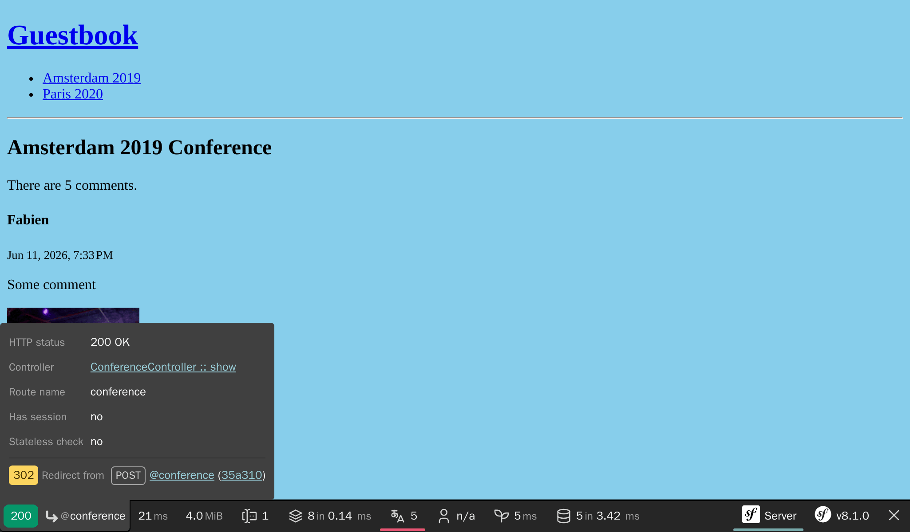

قبول الملاحظات مع النماذج
===============================================

.. index::
    single: Components;Form
    single: Form

حان الوقت للسماح للحضور بإعطاء ملاحظات علي المؤتمرات. سوف يقوموا بمشاركة تعليقاتهم عن طريق *نموذج HTML*.

إنشاء نوع النموذج (Form Type)
--------------------------------------------

.. index::
    single: Command;make:form

استخدم ال Maker bundle لإنشاء فئة نموذج:

.. code-block:: terminal

    $ symfony console make:form CommentType Comment

.. code-block:: text
    :class: ignore
    :emphasize-lines: 1

     created: src/Form/CommentType.php

      Success!

     Next: Add fields to your form and start using it.
     Find the documentation at https://symfony.com/doc/current/forms.html

تحدد فئة ``App\Form\CommentType`` نموذجًا للكيان ``App\Entity\Comment``:

.. code-block:: php
    :caption: src/Form/CommentType.php
    :class: ignore

    namespace App\Form;

    use App\Entity\Comment;
    use Symfony\Component\Form\AbstractType;
    use Symfony\Component\Form\FormBuilderInterface;
    use Symfony\Component\OptionsResolver\OptionsResolver;

    class CommentType extends AbstractType
    {
        public function buildForm(FormBuilderInterface $builder, array $options): void
        {
            $builder
                ->add('author')
                ->add('text')
                ->add('email')
                ->add('createdAt')
                ->add('photoFilename')
                ->add('conference')
            ;
        }

        public function configureOptions(OptionsResolver $resolver): void
        {
            $resolver->setDefaults([
                'data_class' => Comment::class,
            ]);
        }
    }

يصف `نوع النموذج / form type`_ *حقول النموذج* المرتبطة بالميدان Model. يقوم بتحويل البيانات بين البيانات المقدمة وخصائص فئة الميدان Model. تستخدم منظومة Symfony بشكل افتراضي البيانات الوصفية من كيان `` التعليق `` - مثل  ال Doctrine Metadata  - لتخمين الترتيب (Configuration) حول كل حقل. على سبيل المثال ، يتم عرض حقل ``النص Text`` كـ ``مساحة النص Textarea`` لأنه يستخدم عمودًا أكبر (A larger column) في قاعدة البيانات.

عرض نموذج
-----------------

لعرض النموذج للمستخدم ، قم بإنشاء النموذج في ال Controller  وتمريره إلى ال Template :

.. code-block:: diff
    :caption: patch_file
    :emphasize-lines: 19,29

    --- i/src/Controller/ConferenceController.php
    +++ w/src/Controller/ConferenceController.php
    @@ -2,7 +2,9 @@

     namespace App\Controller;

    +use App\Entity\Comment;
     use App\Entity\Conference;
    +use App\Form\CommentType;
     use App\Repository\CommentRepository;
     use App\Repository\ConferenceRepository;
     use Symfony\Bundle\FrameworkBundle\Controller\AbstractController;
    @@ -23,5 +25,8 @@ final class ConferenceController extends AbstractController
         #[Route('/conference/{slug:conference}', name: 'conference')]
         public function show(Conference $conference, CommentRepository $commentRepository, #[MapQueryParameter(options: ['min_range' => 0])] int $offset = 0): Response
         {
    +        $comment = new Comment();
    +        $form = $this->createForm(CommentType::class, $comment);
    +
             $paginator = $commentRepository->getCommentPaginator($conference, $offset);

    @@ -30,6 +35,7 @@ final class ConferenceController extends AbstractController
                 'comments' => $paginator,
                 'previous' => $offset - CommentRepository::COMMENTS_PER_PAGE,
                 'next' => min(count($paginator), $offset + CommentRepository::COMMENTS_PER_PAGE),
    +            'comment_form' => $form,
             ]);
         }
     }

لا يجب أن تقوم بنسخ نوع النموذج مباشرة. بدلاً من ذلك ، استخدم طريقة ``()createForm``. هذه الطريقة هي جزء من ``AbstractController`` وتسهل إنشاء النماذج.

.. index::
    single: Twig;form

يمكن عرض النموذج في ال Template عن طريق وظيفة `` النموذج `` ل Twig:

.. code-block:: diff
    :caption: patch_file
    :emphasize-lines: 10

    --- i/templates/conference/show.html.twig
    +++ w/templates/conference/show.html.twig
    @@ -30,4 +30,8 @@
         
             
No comments have been posted yet for this conference.

         
    +
    +    <h2>Add your own feedback</h2>
    +
    +    {{ form(comment_form) }}
     

عند تحديث صفحة مؤتمر (Conference) في المتصفح ، لاحظ أن كل حقل نموذج يعرض ال Widget HTML الصحيح (يتم اشتقاق نوع البيانات من النموذج):

.. figure:: screenshots/form.png
    :alt: /conference/amsterdam-2019
    :align: center
    :figclass: with-browser

تنشئ وظيفة `` ()form  `` نموذج HTML بناءً على جميع المعلومات المحددة في نوع النموذج. كما تضيف أيضًا `` enctype = multipart / form-data `` على علامة `` <form> `` كما هو مطلوب في حقل إدخال تحميل الملف (File upload input field ). بالإضافة إلى ذلك ، فإنها تعتني بعرض الأخطاء عندما يحتوي الإرسال على بعضها. يمكن تخصيص كل شيء عن طريق تجاوز القوالب الافتراضية(default templates) ، لكننا لن نحتاجها لهذا المشروع.

تخصيص نوع النموذج
--------------------------------

حتى إذا تم تكوين حقول النموذج استنادًا إلى نظير الميدان (Model) الخاص بها ، يمكنك تخصيص الترتيب الافتراضي (Default configuration) في فئة نوع النموذج مباشرة:

.. code-block:: diff
    :caption: patch_file

    --- i/src/Form/CommentType.php
    +++ w/src/Form/CommentType.php
    @@ -6,26 +6,32 @@ use App\Entity\Comment;
     use App\Entity\Conference;
     use Symfony\Bridge\Doctrine\Form\Type\EntityType;
     use Symfony\Component\Form\AbstractType;
    +use Symfony\Component\Form\Extension\Core\Type\EmailType;
    +use Symfony\Component\Form\Extension\Core\Type\FileType;
    +use Symfony\Component\Form\Extension\Core\Type\SubmitType;
     use Symfony\Component\Form\FormBuilderInterface;
     use Symfony\Component\OptionsResolver\OptionsResolver;
    +use Symfony\Component\Validator\Constraints\Image;

     class CommentType extends AbstractType
     {
         public function buildForm(FormBuilderInterface $builder, array $options): void
         {
             $builder
    -            ->add('author')
    +            ->add('author', null, [
    +                'label' => 'Your name',
    +            ])
                 ->add('text')
    -            ->add('email')
    -            ->add('createdAt', null, [
    -                'widget' => 'single_text',
    +            ->add('email', EmailType::class)
    +            ->add('photo', FileType::class, [
    +                'required' => false,
    +                'mapped' => false,
    +                'constraints' => [
    +                    new Image(maxSize: '1024k')
    +                ],
                 ])
    -            ->add('photoFilename')
    -            ->add('conference', EntityType::class, [
    -                'class' => Conference::class,
    -                'choice_label' => 'id',
    -            ])
    -        ;
    +            ->add('submit', SubmitType::class)
    +       ;
         }

         public function configureOptions(OptionsResolver $resolver): void

لاحظ أننا أضفنا زر إرسال (Submit) (يسمح لنا بالاستمرار في استخدام تعبير`` {{(form (comment_form)}} `` البسيط في النموذج).

لا يمكن ترتيب بعض الحقول تلقائيًا ، مثل حقل ``photoFilename``. يحتاج كيان ``التعليق`` فقط إلى حفظ اسم ملف الصورة ، ولكن يجب أن يتعامل النموذج مع تحميل الملف نفسه. للتعامل مع هذه الحالة ، قمنا بإضافة حقل يسمى حقل ``الصورة / photo`` على أنه ``غير محدد un-mapped``: لن يتم تعيينه لأي خاصية في ``التعليق / Comment``. سنقوم بإدارته يدويًا لتنفيذ منطق معين (مثل تخزين الصورة التي تم تحميلها على القرص).

كمثال للتخصيص ، قمنا أيضًا بتعديل التسمية الافتراضية لبعض الحقول.

.. figure:: screenshots/form-customized.png
    :alt: /conference/amsterdam-2019
    :align: center
    :figclass: with-browser

التحقق من الميادين (Models)
-------------------------------------------

يقوم نوع النموذج بترتيب عرض الواجهة الأمامية للنموذج (عبر HTML5 validation). فيما يلي نموذج HTML الذي تم إنشاؤه:

.. code-block:: html
    :class: ignore

    <form name="comment_form" method="post" enctype="multipart/form-data">
        

            

                <label for="comment_form_author" class="required">Your name</label>
                <input type="text" id="comment_form_author" name="comment_form[author]" required="required" maxlength="255" />
            

            

                <label for="comment_form_text" class="required">Text</label>
                <textarea id="comment_form_text" name="comment_form[text]" required="required"></textarea>
            

            

                <label for="comment_form_email" class="required">Email</label>
                <input type="email" id="comment_form_email" name="comment_form[email]" required="required" />
            

            

                <label for="comment_form_photo">Photo</label>
                <input type="file" id="comment_form_photo" name="comment_form[photo]" />
            

            

                <button type="submit" id="comment_form_submit" name="comment_form[submit]">Submit</button>
            

            <input type="hidden" id="comment_form__token" name="comment_form[_token]" value="DwqsEanxc48jofxsqbGBVLQBqlVJ_Tg4u9-BL1Hjgac" />
        

    </form>

يستخدم النموذج إدخال ``البريد الإلكتروني / email`` للبريد الإلكتروني للتعليق ويجعل معظم الحقول `` مطلوبة ``. لاحظ أن النموذج يحتوي أيضًا على حقل مخفي لـ ``_token`` لحماية النموذج من `هجمات CSRF`_.

ولكن إذا تجاوز إرسال النموذج التحقق من HTML (باستخدام عميل HTTP لا يفرض قواعد التحقق من الصحة مثل cURL) ، فقد تصل البيانات غير الصالحة إلى الخادم.

نحتاج أيضًا إلى إضافة بعض قيود التحقق من الصحة إلى نموذج بيانات`` التعليق / Comment``:

.. code-block:: diff
    :caption: patch_file

    --- i/src/Entity/Comment.php
    +++ w/src/Entity/Comment.php
    @@ -5,6 +5,7 @@ namespace App\Entity;
     use App\Repository\CommentRepository;
     use Doctrine\DBAL\Types\Types;
     use Doctrine\ORM\Mapping as ORM;
    +use Symfony\Component\Validator\Constraints as Assert;

     #[ORM\Entity(repositoryClass: CommentRepository::class)]
     #[ORM\HasLifecycleCallbacks]
    @@ -16,12 +17,16 @@ class Comment
         private ?int $id = null;

         #[ORM\Column(length: 255)]
    +    #[Assert\NotBlank]
         private ?string $author = null;

         #[ORM\Column(type: Types::TEXT)]
    +    #[Assert\NotBlank]
         private ?string $text = null;

         #[ORM\Column(length: 255)]
    +    #[Assert\NotBlank]
    +    #[Assert\Email]
         private ?string $email = null;

         #[ORM\Column]

التعامل مع نموذج
------------------------------

الكود الذي كتبناه حتى الآن يكفي لعرض النموذج.

يجب علينا الآن معالجة إرسال النموذج وتسجيل  معلوماته في قاعدة البيانات في وحدة التحكم:

.. code-block:: diff
    :caption: patch_file

    --- i/src/Controller/ConferenceController.php
    +++ w/src/Controller/ConferenceController.php
    @@ -7,7 +7,9 @@ use App\Entity\Conference;
     use App\Form\CommentType;
     use App\Repository\CommentRepository;
     use App\Repository\ConferenceRepository;
    +use Doctrine\ORM\EntityManagerInterface;
     use Symfony\Bundle\FrameworkBundle\Controller\AbstractController;
    +use Symfony\Component\HttpFoundation\Request;
     use Symfony\Component\HttpFoundation\Response;
     use Symfony\Component\HttpKernel\Attribute\MapQueryParameter;
     use Symfony\Component\Routing\Attribute\Route;
    @@ -14,6 +15,11 @@ use Symfony\Component\Routing\Attribute\Route;

     final class ConferenceController extends AbstractController
     {
    +    public function __construct(
    +        private EntityManagerInterface $entityManager,
    +    ) {
    +    }
    +
         #[Route('/', name: 'homepage')]
         public function index(ConferenceRepository $conferenceRepository): Response
         {
    @@ -24,9 +30,18 @@ final class ConferenceController extends AbstractController
         }

         #[Route('/conference/{slug:conference}', name: 'conference')]
    -    public function show(Conference $conference, CommentRepository $commentRepository, #[MapQueryParameter(options: ['min_range' => 0])] int $offset = 0): Response
    +    public function show(Request $request, Conference $conference, CommentRepository $commentRepository, #[MapQueryParameter(options: ['min_range' => 0])] int $offset = 0): Response
         {
             $comment = new Comment();
             $form = $this->createForm(CommentType::class, $comment);
    +        $form->handleRequest($request);
    +        if ($form->isSubmitted() && $form->isValid()) {
    +            $comment->setConference($conference);
    +
    +            $this->entityManager->persist($comment);
    +            $this->entityManager->flush();
    +
    +            return $this->redirectToRoute('conference', ['slug' => $conference->getSlug()]);
    +        }

             $paginator = $commentRepository->getCommentPaginator($conference, $offset);

لاحظ أن كائن ``Request`` يُحقن الآن في وحدة التحكم ، لأن النموذج يحتاجه لفحص البيانات المرسلة عبر ``handleRequest()``.

عندما يتم إرسال النموذج ، يتم تحديث كائن `` التعليق / Comment `` وفقًا للبيانات المقدمة.

يُضطر المؤتمر إلى أن يكون هو نفسه الذي أتى من عنوان URL (قمنا بإزالته من النموذج).

إذا كان النموذج غير صالح ، فنحن نعرض الصفحة ، ولكن النموذج سيحتوي الآن على القيم المرسلة ورسائل الخطأ بحيث يمكن عرضها مرة أخرى للمستخدم.

جرب النموذج. يجب أن يعمل بشكل جيد ويجب تخزين البيانات في قاعدة البيانات (تحقق من ذلك في الواجهة الخلفية للمشرف). هناك مشكلة واحدة: الصور. إنها لا تعمل لأننا لم نتعامل معها بعد في وحدة التحكم.

تحميل الملفات
-------------------------

يجب تخزين الصور التي تم تحميلها على القرص المحلي ، في مكان يمكن الوصول إليه من خلال الواجهة الأمامية حتى نتمكن من عرضها على صفحة المؤتمر. سنقوم بتخزينها تحت دليل ``public/uploads/photos``.

.. index::
    single: Attribute;Autowire
    single: Autowire

نظرًا لأننا لا نريد ترميز مسار الدليل بشكل ثابت في الكود ، نحتاج إلى طريقة لتخزينه عالميًا في الإعدادات. تستطيع حاوية Symfony تخزين *المعلمات / parameters* بالإضافة إلى الخدمات ، وهي مقاييس تساعد في تكوين الخدمات:

.. code-block:: diff
    :caption: patch_file

    --- i/config/services.yaml
    +++ w/config/services.yaml
    @@ -4,6 +4,7 @@
     # Put parameters here that don't need to change on each machine where the app is deployed
     # https://symfony.com/doc/current/best_practices.html#use-parameters-for-application-configuration
     parameters:
    +    photo_dir: "%kernel.project_dir%/public/uploads/photos"

     services:
         # default configuration for services in *this* file

لقد رأينا بالفعل كيف يتم حقن الخدمات تلقائيًا في وسائط المُنشئ. بالنسبة لمعلمات الحاوية ، يمكننا حقنها بشكل صريح عبر السمة ``Autowire``.

الآن ، لدينا كل ما نحتاج لمعرفته لتنفيذ المنطق اللازم لتخزين الملف الذي تم تحميله إلى وجهته النهائية:

.. code-block:: diff
    :caption: patch_file

    --- i/src/Controller/ConferenceController.php
    +++ w/src/Controller/ConferenceController.php
    @@ -9,6 +9,7 @@ use App\Repository\CommentRepository;
     use App\Repository\ConferenceRepository;
     use Doctrine\ORM\EntityManagerInterface;
     use Symfony\Bundle\FrameworkBundle\Controller\AbstractController;
    +use Symfony\Component\DependencyInjection\Attribute\Autowire;
     use Symfony\Component\HttpFoundation\Request;
     use Symfony\Component\HttpFoundation\Response;
     use Symfony\Component\Routing\Attribute\Route;
    @@ -29,13 +30,23 @@ final class ConferenceController extends AbstractController
         }

         #[Route('/conference/{slug:conference}', name: 'conference')]
    -    public function show(Request $request, Conference $conference, CommentRepository $commentRepository, #[MapQueryParameter(options: ['min_range' => 0])] int $offset = 0): Response
    -    {
    +    public function show(
    +        Request $request,
    +        Conference $conference,
    +        CommentRepository $commentRepository,
    +        #[Autowire('%photo_dir%')] string $photoDir,
    +        #[MapQueryParameter(options: ['min_range' => 0])] int $offset = 0,
    +    ): Response {
             $comment = new Comment();
             $form = $this->createForm(CommentType::class, $comment);
             $form->handleRequest($request);
             if ($form->isSubmitted() && $form->isValid()) {
                 $comment->setConference($conference);
    +            if ($photo = $form['photo']->getData()) {
    +                $filename = bin2hex(random_bytes(6)).'.'.$photo->guessExtension();
    +                $photo->move($photoDir, $filename);
    +                $comment->setPhotoFilename($filename);
    +            }

                 $this->entityManager->persist($comment);
                 $this->entityManager->flush();

لإدارة تحميل الصور ، نقوم بإنشاء اسم عشوائي للملف. ثم ننقل الملف الذي تم تحميله إلى موقعه النهائي (دليل الصور). أخيرًا ، نقوم بتخزين اسم الملف في كائن التعليق.

حاول تحميل ملف PDF بدلاً من الصورة. يجب أن ترى رسائل الخطأ . التصميم قبيح للغاية في الوقت الحالي ، ولكن لا تقلق ، كل شيء سيصبح جميلًا في بضع خطوات عندما سنعمل على تصميم الموقع. بالنسبة للنماذج ، سنقوم بتغيير سطر واحد من التكوين لنمط جميع عناصر النموذج.

علاج وتصحيح النماذج
------------------------------------

عندما يتم إرسال نموذج لا يعمل  بشكل جيد ، استخدم لوحة "النموذج" في Symfony Profiler. يمنحك معلومات حول النموذج وخياراته والبيانات المقدمة وكيفية تحويلها داخليًا. إذا احتوى النموذج على أية أخطاء ، فسيتم سردها أيضًا.

يسير العمل النموذجي على النحو التالي:

* يتم عرض النموذج على صفحة ؛

* يقدم المستخدم النموذج عبر طلب POST ؛

* يقوم الخادم بإعادة توجيه المستخدم إلى صفحة أخرى أو إلى نفس الصفحة.

ولكن كيف يمكنك الوصول إلى ال Profiler يخص طلب إرسال ناجح؟ نظرًا لأنه تتم إعادة توجيه الصفحة على الفور ، لا نرى شريط أدوات تصحيح الويب (web debug toolbar) لطلب POST. هذا ليس بمشكل: في الصفحة المعاد توجيهها ، مرر مؤشر الماوس فوق الجزء الأخضر "200" الأيسر. يجب أن تشاهد إعادة التوجيه "302" مع ارتباط إلى ملف التعريف (بين قوسين).

انقر عليه للوصول إلى ملف طلب POST ، وانتقل إلى لوحة "النموذج / Form":

.. code-block:: terminal
    :class: hide

    $ rm -rf var/cache

.. figure:: screenshots/form-profiler.png
    :alt: /_profiler/450aa5
    :align: center
    :figclass: with-browser

عرض الصور التي تم تحميلها في الخلفية الإدارية
-----------------------------------------------------------------------------------

تعرض الواجهة الخلفية للمسؤول حاليًا اسم ملف الصورة ، لكننا نريد أن نرى الصورة الفعلية:

.. code-block:: diff
    :caption: patch_file

    --- i/src/Controller/Admin/CommentCrudController.php
    +++ w/src/Controller/Admin/CommentCrudController.php
    @@ -10,6 +10,7 @@ use EasyCorp\Bundle\EasyAdminBundle\Field\AssociationField;
     use EasyCorp\Bundle\EasyAdminBundle\Field\DateTimeField;
     use EasyCorp\Bundle\EasyAdminBundle\Field\EmailField;
     use EasyCorp\Bundle\EasyAdminBundle\Field\IdField;
    +use EasyCorp\Bundle\EasyAdminBundle\Field\ImageField;
     use EasyCorp\Bundle\EasyAdminBundle\Field\TextareaField;
     use EasyCorp\Bundle\EasyAdminBundle\Field\TextEditorField;
     use EasyCorp\Bundle\EasyAdminBundle\Field\TextField;
    @@ -47,7 +48,9 @@ class CommentCrudController extends AbstractCrudController
             yield TextareaField::new('text')
                 ->hideOnIndex()
             ;
    -        yield TextField::new('photoFilename')
    +        yield ImageField::new('photoFilename')
    +            ->setBasePath('/uploads/photos')
    +            ->setLabel('Photo')
                 ->onlyOnIndex()
             ;

إستبعاد الصور التي تم تحميلها من Git
---------------------------------------------------------------

لا تنفذ commit بعد! لا نريد تخزين الصور التي تم تحميلها في مستودع Git. أضف دليل ``/public/uploads`` إلى ملف ``.gitignore`` :

.. code-block:: diff
    :caption: patch_file

    --- i/.gitignore
    +++ w/.gitignore
    @@ -1,3 +1,4 @@
    +/public/uploads

     ###> symfony/framework-bundle ###
     /.env.local

تخزين الملفات التي تم تحميلها على خوادم الإنتاج (Production Servers)
------------------------------------------------------------------------------------------------------------

الخطوة الأخيرة هي تخزين الملفات التي تم تحميلها على خوادم الإنتاج. لماذا يجب علينا القيام بشيء خاص؟ لأن معظم منصات السحابة الحديثة تستخدم حاويات للقراءة فقط لأسباب مختلفة. Upsun ليست استثناء.

ليس كل شيء للقراءة فقط في مشروع Symfony. نحاول جاهدين إنشاء أكبر قدر ممكن من ذاكرة التخزين المؤقت عند بناء الحاوية (خلال مرحلة تدفئة ذاكرة التخزين المؤقت) ، ولكن لا تزال Symfony بحاجة إلى الكتابة في مكان ما لذاكرة التخزين المؤقت للمستخدم ، والسجلات ، والجلسات إذا تم تخزينها على نظام الملفات، واكثر.

ألق نظرة على  ``.upsun/config.yaml`` ، يوجد بالفعل *جبل قابل للكتابة* للدليل ``/var``. الدليل ``/var`` هو الدليل الوحيد الذي تكتب فيه Symfony (ذاكرة التخزين المؤقت ، السجلات ، ...).

لنقم بإنشاء حامل جديد للصور التي تم تحميلها:

.. code-block:: diff
    :caption: patch_file

    --- i/.upsun/config.yaml
    +++ w/.upsun/config.yaml
    @@ -41,6 +41,7 @@ applications:
             mounts:
                 "/var/cache": { source: instance, source_path: var/cache }
                 "/var/share": { source: storage, source_path: var/share }
    +            "/public/uploads": { source: storage, source_path: uploads }

             relationships:

يمكنك الآن نشر الكود وسيتم تخزين الصور في دليل `` /public/uploads `` مثل نسختنا المحلية.

.. sidebar:: الذهاب أبعد من ذلك

    * `البرنامج التعليمي لـ SymfonyCasts Forms`_؛

    * كيفية `تخصيص عرض نموذج Symfony في HTML`_؛

    * `التحقق من نماذج Symfony`_؛

    * `مرجع أنواع نماذج Symfony`_؛

    * `مستندات FlysystemBundle`_, والتي توفر التكامل مع العديد من موفري التخزين السحابي ، مثل AWS S3 ، Azure و Google Cloud Storage؛

    * `معلمات إعداد Symfony`_.

    * `قيود المصادقة ل Symfony`_؛

    * `سيمفوني ورقة غش نموذج`_.

.. _`نوع النموذج / form type`: https://symfony.com/doc/current/forms.html#form-types
.. _`هجمات CSRF`: https://owasp.org/www-community/attacks/csrf
.. _`البرنامج التعليمي لـ SymfonyCasts Forms`: https://symfonycasts.com/screencast/symfony-forms
.. _`تخصيص عرض نموذج Symfony في HTML`: https://symfony.com/doc/current/form/form_customization.html
.. _`التحقق من نماذج Symfony`: https://symfony.com/doc/current/forms.html#validating-forms
.. _`مرجع أنواع نماذج Symfony`: https://symfony.com/doc/current/reference/forms/types.html
.. _`مستندات FlysystemBundle`: https://github.com/thephpleague/flysystem-bundle/blob/master/docs/1-getting-started.md
.. _`معلمات إعداد Symfony`: https://symfony.com/doc/current/configuration.html#configuration-parameters
.. _`قيود المصادقة ل Symfony`: https://symfony.com/doc/current/validation.html#basic-constraints
.. _`سيمفوني ورقة غش نموذج`: https://github.com/andreia/symfony-cheat-sheets/blob/master/Symfony2/how_symfony2_forms_works_en.pdf
