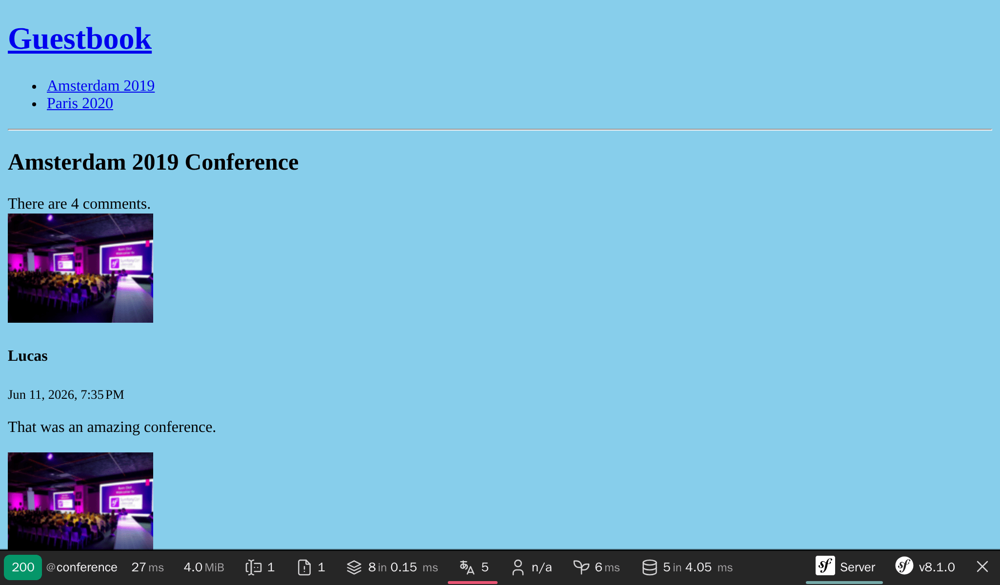

الإختبار
================

.. index::
    single: PHPUnit

حيث اننا نقوم بإضافه المزيد من الوظائف للتطبيق. يبدو انه الوقت المناسب للتحدث عن الاختبارات (Tests)

*حقيقة مضحكة*: لقد وجدت خطأ أثناء كتابة الاختبارات في هذا الفصل.

سيمفوني يعتمد علي PHPUnit لاختبار الوحدات. لنقم بتنصيبه

.. code-block:: terminal

    $ symfony composer req phpunit --dev

كتابة وحدات الاختبار
--------------------------------------

.. index::
    single: Test;Unit Tests
    single: Unit Tests
    single: Command;make:test

``SpamChecker`` هو أول شئ سنقوم بكتابة إختبارات له. لصنع وحدة :

.. code-block:: terminal

    $ symfony console make:test TestCase SpamCheckerTest

اختبار كاشف الزيف تحدٍ حيث اننا بالتأكيد لا نريد ان نستدعي OpenAI API: سيكون بطيئًا، ومكلفًا، ولن تكون الإجابات حتمية أصلاً. سنستبدل *المنصة* (platform) بأخرى زائفة.

.. index::
    single: Mock

لنقوم بكتابة أول اختبار لحالة تعذّر الوصول إلى النموذج:

.. code-block:: diff
    :caption: patch_file

    --- i/tests/SpamCheckerTest.php
    +++ w/tests/SpamCheckerTest.php
    @@ -2,12 +2,25 @@

     namespace App\Tests;

    +use App\Entity\Comment;
    +use App\SpamChecker;
     use PHPUnit\Framework\TestCase;
    +use Symfony\AI\Agent\Agent;
    +use Symfony\AI\Platform\Exception\RuntimeException;
    +use Symfony\AI\Platform\Test\InMemoryPlatform;

     class SpamCheckerTest extends TestCase
     {
    -    public function testSomething(): void
    +    public function testSpamScoreWhenTheModelIsDown(): void
         {
    -        $this->assertTrue(true);
    +        $comment = new Comment();
    +        $comment->setAuthor('Fabien');
    +        $comment->setEmail('fabien@example.com');
    +        $comment->setText('Such a nice conference!');
    +
    +        $platform = new InMemoryPlatform(fn () => throw new RuntimeException('The model is down.'));
    +        $checker = new SpamChecker(new Agent($platform, 'gpt-5-mini'));
    +
    +        $this->assertSame(1, $checker->getSpamScore($comment, []));
         }
     }

تُنفّذ فئة ``InMemoryPlatform`` واجهة المنصة دون استدعاء أي واجهة برمجة خارجية. بإعطائها callable، يمكنها محاكاة أي سلوك، بما في ذلك الأعطال. نحن نغلّفها في ``Agent`` حقيقي حتى يُختبَر منطق ``SpamChecker`` فعليًا.

عندما يكون النموذج معطّلاً، يجب أن تصل التعليقات إلى مُشرِف بشري: النتيجة المتوقعة هي ``1``.

قم بتشغيل الاختبارات للتحقق من نجاحها:

.. code-block:: terminal

    $ symfony php bin/phpunit

.. index::
    single: PHPUnit;Data Provider
    single: Data Provider
    single: Attributes;DataProvider

لنقم بإضافة اختبارات للمسار السعيد:

.. code-block:: diff
    :caption: patch_file

    --- i/tests/SpamCheckerTest.php
    +++ w/tests/SpamCheckerTest.php
    @@ -4,6 +4,7 @@ namespace App\Tests;

     use App\Entity\Comment;
     use App\SpamChecker;
    +use PHPUnit\Framework\Attributes\DataProvider;
     use PHPUnit\Framework\TestCase;
     use Symfony\AI\Agent\Agent;
     use Symfony\AI\Platform\Exception\RuntimeException;
    @@ -23,4 +24,25 @@ class SpamCheckerTest extends TestCase

             $this->assertSame(1, $checker->getSpamScore($comment, []));
         }
    +
    +    #[DataProvider('provideComments')]
    +    public function testSpamScore(int $expectedScore, string $answer): void
    +    {
    +        $comment = new Comment();
    +        $comment->setAuthor('Fabien');
    +        $comment->setEmail('fabien@example.com');
    +        $comment->setText('Such a nice conference!');
    +
    +        $platform = new InMemoryPlatform($answer);
    +        $checker = new SpamChecker(new Agent($platform, 'gpt-5-mini'));
    +
    +        $this->assertSame($expectedScore, $checker->getSpamScore($comment, []));
    +    }
    +
    +    public static function provideComments(): iterable
    +    {
    +        yield 'blatant_spam' => [2, 'blatant spam'];
    +        yield 'maybe_spam' => [1, 'Maybe spam.'];
    +        yield 'ham' => [0, 'ham'];
    +    }
     }

يسمح موفر البيانات (PHPUnit data providers) باستخدام نفس الاختبار لتجربة اكثر من حالة.

لنكتب الاختبار الوظيفي للـمتحكمات (Controllers)
-----------------------------------------------------------------------------

.. index::
    single: Test;Functional Tests
    single: Functional Tests
    single: Components;Browser Kit
    single: Browser Kit

اختبار وحدات التحكم يختلف قليلا عن اختبار كائن PHP "عادي" حيث اننا نريد ان نشغل وحدات التحكم في سياق طلب من الخادم (HTTP Request)

لنصنع اختبار وظيفي لوحده تحكم المؤتمرات:

.. code-block:: php
    :caption: tests/Controller/ConferenceControllerTest.php

    namespace App\Tests\Controller;

    use Symfony\Bundle\FrameworkBundle\Test\WebTestCase;

    class ConferenceControllerTest extends WebTestCase
    {
        public function testIndex(): void
        {
            $client = static::createClient();
            $client->request('GET', '/');

            $this->assertResponseIsSuccessful();
            $this->assertSelectorTextContains('h2', 'Give your feedback');
        }
    }

يمنحنا استخدام ```Symfony\Bundle\FrameworkBundle\Test\WebTestCase`` بدلاً من ``PHPUnit\Framework\TestCase`` كفئة أساسية لاختباراتنا تجريدًا رائعًا للاختبارات الوظيفية.

متغير الـ ```$client``` يحاكي متصفح الانترنت. ف بدلا من ارسال طلبات HTTP للخادم، يقوم بإرسالها الي تطبيق سيمفوني مباشرة. هذه الإستراتيجيه لها فوائد كثيره: إنها اسرع من الطلبات بين الخادم و العميل، و ايضا تسمح باستكشاف حاله الخدمات بعد كل طلب (HTTP Request)

الإختبار الأول يتحقق ان الصفحة الرئيسية تعطي استجابه بكود 200.

التاكيدات مثل ``assertResponseIsSuccessful`` موجوده فوق PHPUnit لتسهل عليك العمل. يوجد الكثير من التاكيدات المعرفه من سيمفوني

.. tip::

    قمنا باستخدام ``/`` كرابط بدلا من صنعه عن طريق وحدة التوجيه (Router). تم ذلك عن قصد لأن اختبار الروابط للمستخدم النهائي هو جزء مما نريد اختباره. فلو قمت بتغيير مسار الرابط لاحقا. سيفشل الاختبار كتذكير لطيف انه يجب عليك تحويل المستخدم من الرابط القديم للرابط الجديد حتي تكون لطيف مع محركات البحث و المواقع التي تستخدم الرابط القديم لموقعك.

تكوين بيئة الاختبار
------------------------------------

.. index::
    single: Symfony Environments

بالوضع الأساسي، اختبارات PHPUnit يتم تشغلها في بيئه `اختبار` سيمفوني كما هي معرفة في ملف إعدادات PHPUnit:

.. code-block:: xml
    :caption: phpunit.xml.dist
    :emphasize-lines: 4
    :class: ignore

    <phpunit>
        <php>
            <ini name="error_reporting" value="-1" />
            <server name="APP_ENV" value="test" force="true" />
            <server name="SHELL_VERBOSITY" value="-1" />
            <server name="SYMFONY_PHPUNIT_REMOVE" value="" />
            <server name="SYMFONY_PHPUNIT_VERSION" value="8.5" />
            ...

.. index:: Command;secrets:set

لإنجاح الاختبارات ، يجب علينا تعيين سر ``OPENAI_API_KEY`` لبيئة ``test`` هذه:

.. code-block:: terminal
    :class: answers(OPENAI_API_KEY_VALUE)

    $ symfony console secrets:set OPENAI_API_KEY --env=test

لنعمل مع اختبار قاعدة البيانات
--------------------------------------------------------

.. index::
    single: Test;Database
    single: Functional Tests,Database

كما رأينا بالفعل ، يعرض Symfony CLI تلقائيًا ملف متغيرات البيئة ``DATABASE_URL``. عندما تكون ``APP_ENV`` في وضع  ``test`` ، مثل تعيين عند تشغيل PHPUnit ، فإن اسم قاعدة البيانات يتغير من ``app`` إلى ``app_test`` بحيث يكون للاختبارات قاعدة بيانات خاصة بها:

.. code-block:: yaml
    :class: ignore
    :emphasize-lines: 5
    :caption: config/packages/doctrine.yaml

    when@test:
        doctrine:
            dbal:
                # "TEST_TOKEN" is typically set by ParaTest
                dbname_suffix: '_test%env(default::TEST_TOKEN)%'

هذا مهم للغاية لأننا سنحتاج إلى بعض البيانات الثابتة لإجراء اختباراتنا ولا نريد بالتأكيد تجاوز ما قمنا بتخزينه في قاعدة بيانات التطوير.

قبل التمكن من تشغيل الاختبار ، نحتاج إلى "initialize" قاعدة بيانات ``test`` (إنشاء قاعدة البيانات وترحيلها):

.. code-block:: terminal

    $ symfony console doctrine:database:create --env=test
    $ symfony console doctrine:migrations:migrate -n --env=test

.. note::

    على نظام Linux والأنظمة المشابهة، يمكنك استخدام ``APP_ENV=test`` بدلاً من
    ``--env=test``:

    .. code-block:: terminal
        :class: ignore

        $ APP_ENV=test symfony console doctrine:database:create

إذا قمت بإجراء الاختبارات الآن ، فلن تتفاعل PHPUnit مع قاعدة بيانات التطوير الخاصة بك بعد الآن. لإجراء الاختبارات الجديدة فقط ، مرر المسار إلى مسار الفصل الدراسي الخاص بهم:

.. code-block:: terminal

    $ symfony php bin/phpunit tests/Controller/ConferenceControllerTest.php

.. tip::

    عندما يفشل اختبار، قد يكون من المفيد التحقق من كائن الاستجابه (Response object). يمكنك ان تصل اليه عن طريق ``$client->getResponse()`` و ``echo`` لتري كيف يبدو.

تعريف المصانع
-----------------------------

.. index::
    single: Foundry
    single: Fixtures
    single: Test;Factories
    single: Command;make:factory

لتتمكن من اختبار قائمة التعليقات، وترقيم الصفحات، وإرسال النموذج، نحتاج إلى ملء قاعدة البيانات ببعض البيانات. ولإبقاء الاختبارات مستقلة عن بعضها، يجب أن يُنشئ كل اختبار مجموعة البيانات الدقيقة التي يحتاجها. *مصانع الكائنات* (Object factories) هي الأداة المثالية لذلك.

قم بتنصيب Zenstruck Foundry:

.. code-block:: terminal

    $ symfony composer req foundry --dev

أنشئ مصنعًا لكل كيان تحتاجه الاختبارات:

.. code-block:: terminal

    $ symfony console make:factory Conference

.. code-block:: terminal

    $ symfony console make:factory Comment

يصف المصنع كيفية بناء كيان صالح: تُولَّد قيمة افتراضية لكل خاصية بفضل مكتبة Faker. إنشاء كائن عبر مصنع يحفظه أيضًا. اضبط القيم الافتراضية للمؤتمر لتكون أكثر واقعية:

.. code-block:: diff
    :caption: patch_file

    --- i/src/Factory/ConferenceFactory.php
    +++ w/src/Factory/ConferenceFactory.php
    @@ -34,9 +34,9 @@ final class ConferenceFactory extends PersistentObjectFactory
     protected function defaults(): array|callable
     {
         return [
    -        'city' => self::faker()->text(255),
    +        'city' => self::faker()->city(),
             'isInternational' => self::faker()->boolean(),
    -        'slug' => self::faker()->text(255),
    -        'year' => self::faker()->text(4),
    +        'slug' => '-',
    +        'year' => self::faker()->year(),
         ];
     }

ضبط ال slug على ``-`` يسمح لمستمع الكيان الذي كتبناه عند إضافة ال slugs بحساب القيمة الحقيقية: مؤتمر أُنشئ بمدينة ``Amsterdam`` وعام ``2019`` يحصل تلقائيًا على ال slug ``amsterdam-2019``.

افعل الشيء نفسه للتعليقات:

.. code-block:: diff
    :caption: patch_file

    --- i/src/Factory/CommentFactory.php
    +++ w/src/Factory/CommentFactory.php
    @@ -34,10 +34,10 @@ final class CommentFactory extends PersistentObjectFactory
     protected function defaults(): array|callable
     {
         return [
    -        'author' => self::faker()->text(255),
    +        'author' => self::faker()->name(),
             'conference' => ConferenceFactory::new(),
             'createdAt' => \DateTimeImmutable::createFromMutable(self::faker()->dateTime()),
    -        'email' => self::faker()->text(255),
    +        'email' => self::faker()->email(),
             'text' => self::faker()->text(),
         ];
     }

لاحظ القيمة الافتراضية لـ ``conference``: عند إنشاء تعليق دون مؤتمر صريح، يُنشئ Foundry واحدًا في الحال.

استخراج البيانات من الموقع في الاختبارات الوظيفية
--------------------------------------------------------------------------------------------

.. index::
    single: Components;CssSelector
    single: Components;DomCrawler
    single: Test;Crawling
    single: Crawling

كما رأينا من قبل، الـ (HTTP Client) المتسخدم في الاختبارات يحاكي متصفح الانترنت. لذلك نستطيع  التنقل في الموقع كاننا نستخدم المتصفح الغير مرئي (headless browser).

لنقوم بإضافة اختبار يضغط علي رابط المؤتمر من الصفحة الرئيسية:

.. code-block:: diff
    :caption: patch_file

    --- i/tests/Controller/ConferenceControllerTest.php
    +++ w/tests/Controller/ConferenceControllerTest.php
    @@ -2,10 +2,17 @@

     namespace App\Tests\Controller;

    +use App\Factory\CommentFactory;
    +use App\Factory\ConferenceFactory;
     use Symfony\Bundle\FrameworkBundle\Test\WebTestCase;
    +use Zenstruck\Foundry\Test\Factories;
    +use Zenstruck\Foundry\Test\ResetDatabase;

     class ConferenceControllerTest extends WebTestCase
     {
    +    use Factories;
    +    use ResetDatabase;
    +
         public function testIndex(): void
         {
             $client = static::createClient();
    @@ -14,4 +21,24 @@ class ConferenceControllerTest extends WebTestCase
             $this->assertResponseIsSuccessful();
             $this->assertSelectorTextContains('h2', 'Give your feedback');
         }
    +
    +    public function testConferencePage(): void
    +    {
    +        $client = static::createClient();
    +
    +        $amsterdam = ConferenceFactory::createOne(['city' => 'Amsterdam', 'year' => '2019', 'isInternational' => true]);
    +        ConferenceFactory::createOne(['city' => 'Paris', 'year' => '2020', 'isInternational' => false]);
    +        CommentFactory::createOne(['conference' => $amsterdam]);
    +
    +        $crawler = $client->request('GET', '/');
    +
    +        $this->assertCount(2, $crawler->filter('h4'));
    +
    +        $client->clickLink('View');
    +
    +        $this->assertPageTitleContains('Amsterdam');
    +        $this->assertResponseIsSuccessful();
    +        $this->assertSelectorTextContains('h2', 'Amsterdam 2019');
    +        $this->assertSelectorExists('div:contains("There are 1 comments")');
    +    }
     }

تُفعّل سمة ``Factories`` المصانعَ في الاختبارات، وتُعيد ``ResetDatabase`` ضبط قاعدة البيانات في بداية كل تشغيل للاختبارات.

لنقم بوصف ماذا حدث في الاختبار بشكل بسيط:

* يُنشئ الاختبار مجموعة البيانات الدقيقة التي يحتاجها: مؤتمران وتعليق واحد، عبر المصانع؛

* كما الاختبار الأول، قمنا بالذهاب للصفحة الرئيسية؛

* دالة الطلب ``request()`` تعطي كائن زاحف ``Crawler`` يساعدنا في إيجاد عناصر في الصفحة (مثل الروابط، النماذج، اي شئ يمكن الوصول اليه بمحدد CSS او XPath)؛

* بفضل محدد CSS، نقوم بتاكيد ان لدينا مؤتمرين فقط في الصفحة الرئيسية؛

* بعد ذلك نضغط علي عرض الرابط "View" (بما انه لا يمكن الضغط علي اكثر من رابط في وقت واحد. سيمفوني تلقائي يختار أول عنصر من القائمة)؛

* قمنا بالتاكد من عنوان الصفحة، المحتوي  و ``<h2>`` للتاكد من اننا في الصفحة الصحيحة (يمكننا ايضا التاكد من ان رابط الصفحة مطابق للرابط المتوقع)؛

* في النهايه، قمنا بالتاكد انه يوجد تعليق واحد في الصفحه. ``div:contains()`` ليس من المحددات (CSS selector)، ولكن سيمفوني لديها بعض الاضافات، تم استعارتها من jQuery.

بدلا من الضغط علي النص (مثل ``View``)، كان يمكننا تحديد الرابط عن طريق محدد css:

.. code-block:: php
    :class: ignore

    $client->click($crawler->filter('h4 + p a')->link());

لنتاكد من أن الاختبار الجديد أخضر:

.. code-block:: terminal

    $ symfony php bin/phpunit tests/Controller/ConferenceControllerTest.php

التعامل مع النماذج في الاختبارات الوظيفية
-----------------------------------------------------------------------------

هل تريد الانتقال للمستوي التالي؟ جرب ان تقوم بإضافه تعليق وصورة علي مؤتمر من الاختبار عن طريق محاكاة تقديم نموذج ``Form submission``. يبدو طموح، اليس كذلك؟ تفقد الكود المطلوب: ليس اصعب من ما قمنا بكتابته مسبقا:

.. code-block:: diff
    :caption: patch_file

    --- i/tests/Controller/ConferenceControllerTest.php
    +++ w/tests/Controller/ConferenceControllerTest.php
    @@ -41,4 +41,23 @@ class ConferenceControllerTest extends WebTestCase
             $this->assertSelectorTextContains('h2', 'Amsterdam 2019');
             $this->assertSelectorExists('div:contains("There are 1 comments")');
         }
    +
    +    public function testCommentSubmission(): void
    +    {
    +        $client = static::createClient();
    +
    +        $berlin = ConferenceFactory::createOne(['city' => 'Berlin', 'year' => '2021', 'isInternational' => false]);
    +        CommentFactory::createOne(['conference' => $berlin]);
    +
    +        $client->request('GET', '/conference/berlin-2021');
    +        $client->submitForm('Submit', [
    +            'comment[author]' => 'Fabien',
    +            'comment[text]' => 'Some feedback from an automated functional test',
    +            'comment[email]' => 'me@automat.ed',
    +            'comment[photo]' => dirname(__DIR__, 2).'/public/images/under-construction.gif',
    +        ]);
    +        $this->assertResponseRedirects();
    +        $client->followRedirect();
    +        $this->assertSelectorExists('div:contains("There are 2 comments")');
    +    }
     }

لتقديم نموذج عن طريق ``submitForm()``، قم بإيجاد اسماء المدخلات بفضل ادوات التطوير الخاصه بالمتصفح او عن طريق لوحه النموذج من محلل سيمفوني (Symfony Profiler). لاحظ الاستخدام الذكي لإعادة استخدام صوره تحت البناء (Under construction)!

قم بتشغيل الإختبارات مرة أخري للتاكد من أن كل شئ أخضر:

.. code-block:: terminal

    $ symfony php bin/phpunit tests/Controller/ConferenceControllerTest.php

اذا أردت التحقق من النتيجة في المتصفح ، أوقف خادم الويب وأعد تشغيله لبيئة ``test``:

.. code-block:: terminal
    :class: ignore

    $ symfony server:stop
    $ APP_ENV=test symfony server:start -d



تشغيل الاختبارات مرة أخرى
----------------------------------------

إذا قمت بتشغيل الاختبارات مرة ثانية، فإنها لا تزال تنجح: تُعيد سمة ``ResetDatabase`` ضبط قاعدة البيانات في بداية كل تشغيل، ويُنشئ كل اختبار مجموعة البيانات الدقيقة التي يحتاجها. لا توجد حالة مشتركة ولا بقايا من تشغيل سابق:

.. code-block:: terminal

    $ symfony php bin/phpunit tests/Controller/ConferenceControllerTest.php

أتمتة (Automating) خطوات العمل مع Makefile
-----------------------------------------------------------

.. index::
    single: Makefile

من المزعج تذكر خطوات تشغيل الإختبارت في كل مره. يجب توثيقها علي الأقل. ولكن التوثيق ينبغي ان يكون ملاذنا الأخير. بدلاً من ذلك، ما رايك ان نجعلها اتوماتيكه؟ سوف تخدم كتوثيق و ايضاً تساعد المطورين الاخريين، وتجعل حياة المطوريين اسهل و اسرع

ان استخدام ``MakeFile`` طريقة واحده لجعل الأوامر اوتوماتيكية

.. code-block:: makefile
    :caption: Makefile

    SHELL := /bin/bash

    tests:
    	symfony console doctrine:database:drop --force --env=test || true
    	symfony console doctrine:database:create --env=test
    	symfony console doctrine:migrations:migrate -n --env=test
    	symfony php bin/phpunit $(MAKECMDGOALS)
    .PHONY: tests

.. warning::

    في قاعدة Makefile ، **يجب** أن تتكون المسافة البادئة من حرف جدولة واحد بدلاً من مسافات.

لاحظ الـ ``-n`` في امر Doctrine، هو علم طبيعي في اوامر سيمفوني يجعلهم غير متفاعلين.

متي تريد ان تشغل الاختبارات، استخدم ``make tests``

.. code-block:: terminal

    $ make tests

إعادة ضبط قاعدة البيانات بعد كل اختبار
----------------------------------------------------------------------

.. index::
    single: PHPUnit;Performance

إعادة ضبط قاعدة البيانات بعد كل اختبار امر لطيف، ولكن الاختبارات المستقلة افضل. لا نريد ان يكون لدينا اختبار يعتمد علي نتائج اختباره اخر قبله. تغيير ترتيب الاختبارات لا ينبغي ان يغير النتائج. كما سنعرف الان. هذه ليست القضيه التي نريدها الان.

قم بنقل اختبار ``testConferencePage`` بعد ``testCommentSubmission``:

.. code-block:: diff
    :caption: patch_file

    --- i/tests/Controller/ConferenceControllerTest.php
    +++ w/tests/Controller/ConferenceControllerTest.php
    @@ -22,26 +22,6 @@ class ConferenceControllerTest extends WebTestCase
             $this->assertSelectorTextContains('h2', 'Give your feedback');
         }

    -    public function testConferencePage(): void
    -    {
    -        $client = static::createClient();
    -
    -        $amsterdam = ConferenceFactory::createOne(['city' => 'Amsterdam', 'year' => '2019', 'isInternational' => true]);
    -        ConferenceFactory::createOne(['city' => 'Paris', 'year' => '2020', 'isInternational' => false]);
    -        CommentFactory::createOne(['conference' => $amsterdam]);
    -
    -        $crawler = $client->request('GET', '/');
    -
    -        $this->assertCount(2, $crawler->filter('h4'));
    -
    -        $client->clickLink('View');
    -
    -        $this->assertPageTitleContains('Amsterdam');
    -        $this->assertResponseIsSuccessful();
    -        $this->assertSelectorTextContains('h2', 'Amsterdam 2019');
    -        $this->assertSelectorExists('div:contains("There are 1 comments")');
    -    }
    -
         public function testCommentSubmission(): void
         {
             $client = static::createClient();
    @@ -41,5 +22,25 @@ class ConferenceControllerTest extends WebTestCase
             $this->assertResponseRedirects();
             $client->followRedirect();
             $this->assertSelectorExists('div:contains("There are 2 comments")');
         }
    +
    +    public function testConferencePage(): void
    +    {
    +        $client = static::createClient();
    +
    +        $amsterdam = ConferenceFactory::createOne(['city' => 'Amsterdam', 'year' => '2019', 'isInternational' => true]);
    +        ConferenceFactory::createOne(['city' => 'Paris', 'year' => '2020', 'isInternational' => false]);
    +        CommentFactory::createOne(['conference' => $amsterdam]);
    +
    +        $crawler = $client->request('GET', '/');
    +
    +        $this->assertCount(2, $crawler->filter('h4'));
    +
    +        $client->clickLink('View');
    +
    +        $this->assertPageTitleContains('Amsterdam');
    +        $this->assertResponseIsSuccessful();
    +        $this->assertSelectorTextContains('h2', 'Amsterdam 2019');
    +        $this->assertSelectorExists('div:contains("There are 1 comments")');
    +    }
     }

ستفشل الاختبارات الآن.

.. index::
    single: Doctrine;TestBundle

لتقوم بإعادة ضبط قاعدة البيانات بين الاختبارات، قم بتنصيب DoctrineTestBundle:

.. code-block:: terminal
    :class: hide

    $ symfony composer config extra.symfony.allow-contrib true

.. code-block:: terminal

    $ symfony composer req "dama/doctrine-test-bundle:^8" --dev

ستحتاج ان توافق علي تنصيب الوصفه (بما انها ليست حزمه مدعومه "رسمياً"):

.. code-block:: text
    :class: ignore

    Symfony operations: 1 recipe (a5c79a9ff21bc3ae26d9bb25f1262ed7)
      -  WARNING  dama/doctrine-test-bundle (>=4.0): From github.com/symfony/recipes-contrib:master
        The recipe for this package comes from the "contrib" repository, which is open to community contributions.
        Review the recipe at https://github.com/symfony/recipes-contrib/tree/master/dama/doctrine-test-bundle/4.0

        Do you want to execute this recipe?
        [y] Yes
        [n] No
        [a] Yes for all packages, only for the current installation session
        [p] Yes permanently, never ask again for this project
        (defaults to n): p

و انتهينا.  اي تغييرات علي قاعدة البيانات اثناء الاختبارات تلقائيا يتم تجاهلها بعد الانتهاء من كل اختبار.

ينبغي ان تكون الاختبارات خضراء الآن:

.. code-block:: terminal

    $ make tests

استخدام متصفح حقيقي للاختبارات الوظيفيه
--------------------------------------------------------------------------

.. index::
    single: Test;Panther
    single: Panther

الاختبارات الوظيفيه تستخدم متصفح مخصص يتصل بيسمفوني مباشرة. لكن يمكنك استخدام متصفح حقيقي يتصل بـ HTTP بفضل Panther من سيمفوني:

.. code-block:: terminal

    $ symfony composer req panther --dev

يمكنك كتابه اختبارات تستخدم متصفح Google Chrome مع التغييرات الآتيه:

.. code-block:: diff
    :class: ignore

    --- i/tests/Controller/ConferenceControllerTest.php
    +++ w/tests/Controller/ConferenceControllerTest.php
    @@ -2,13 +2,13 @@

     namespace App\Tests\Controller;

    -use Symfony\Bundle\FrameworkBundle\Test\WebTestCase;
    +use Symfony\Component\Panther\PantherTestCase;

    -class ConferenceControllerTest extends WebTestCase
    +class ConferenceControllerTest extends PantherTestCase
     {
         public function testIndex(): void
         {
    -        $client = static::createClient();
    +        $client = static::createPantherClient(['external_base_uri' => rtrim($_SERVER['SYMFONY_PROJECT_DEFAULT_ROUTE_URL'], '/')]);
             $client->request('GET', '/');

             $this->assertResponseIsSuccessful();

المتغير ``SYMFONY_PROJECT_DEFAULT_ROUTE_URL``  يحتوي علي رابط الخادم المحلي.

اختيار نوع الاختبار المناسب
----------------------------------------

.. index::
    single: Command;make:test

لقد أنشأنا حتى الآن ثلاثة أنواع مختلفة من الاختبارات. ومع أننا استخدمنا حزمة الصانع (maker bundle) فقط لتوليد فئة اختبار الوحدة، كان يمكننا استخدامها لتوليد فئات الاختبار الأخرى أيضًا:

.. code-block:: terminal
    :class: ignore

    $ symfony console make:test WebTestCase Controller\\ConferenceController

    $ symfony console make:test PantherTestCase Controller\\ConferenceController

تدعم حزمة الصانع توليد الأنواع التالية من الاختبارات بحسب الطريقة التي تريد بها اختبار تطبيقك:

* ``TestCase``: اختبارات PHPUnit الأساسية؛

* ``KernelTestCase``: اختبارات أساسية لها وصول إلى خدمات Symfony؛

* ``WebTestCase``: لتشغيل سيناريوهات شبيهة بالمتصفح، لكنها لا تنفّذ كود JavaScript؛

* ``ApiTestCase``: لتشغيل سيناريوهات موجَّهة لواجهات API؛

* ``PantherTestCase``: لتشغيل سيناريوهات شاملة (e2e)، باستخدام متصفح حقيقي أو عميل HTTP وخادم ويب حقيقي.

تشغيل اختبارات الصندوق الأسود الوظيفية باستخدام Blackfire
---------------------------------------------------------------------------------------------------

طريقه اخري لتشغيل الاختبارات الوظيفيه عن طريق `Blackfire player`_. بالاضافه لما يمكنك فعله مع الاختبارات الوظيفيه. يمكنك  ان تؤدي اختبارات الاداء.

اقرأ خطوة :doc:`الأداء <29-performance>` لمعرفة المزيد.

.. sidebar:: الذهاب أبعد من ذلك

    * `قائمه بالتجديدات المعرفه في سيمفوني`_ للاختبارات الوظيفيه؛

    * `توثيقات PHPUnit`_؛

    * `توثيقات Foundry`_؛

    * مكتبه التزوير `Faker`_ تولد بيانات حقيقة للتركبيات؛

    * `مستندات مكون الـ CssSelector`_؛

    * `سيمفوني بانثر`_ مكتبه لاختبار التصفح و استخراج بيانات الموقع في تطبيقات سيمفوني؛

    * توثيقات `Make/Makefile`_.

.. _`Blackfire player`: https://blackfire.io/player
.. _`قائمه بالتجديدات المعرفه في سيمفوني`: https://symfony.com/doc/current/testing/functional_tests_assertions.html
.. _`توثيقات PHPUnit`: https://phpunit.de/documentation.html
.. _`توثيقات Foundry`: https://symfony.com/bundles/ZenstruckFoundryBundle/current/index.html
.. _`Faker`: https://github.com/FakerPHP/Faker
.. _`مستندات مكون الـ CssSelector`: https://symfony.com/doc/current/components/css_selector.html
.. _`سيمفوني بانثر`: https://github.com/symfony/panther
.. _`Make/Makefile`: https://www.gnu.org/software/make/manual/make.html
