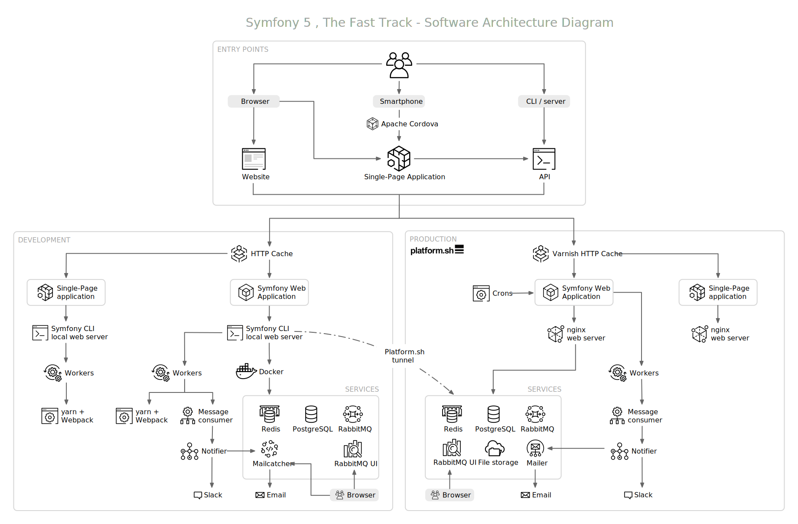

تقديم المشروع
=========================

نحتاج إلى ايجاد مشروع للعمل عليه، التحدي هنا أننا نريد إيجاد مشروع كبير بما يكفي لتغطية سيمفوني بشكل عميق، لكن في نفس الوقت يجب أن يكون المشروع صغيرا، لا أريدك أن تصاب بالملل أثناء تطوير مميزات متشابهه بشكل متكرر.

كشف المشروع
---------------------

لأن المشروع يجب أن يتم اصداره أثناء مؤتمر سيمفوني في أمستردام، سيكون من اللطيف اذا كان المشروع متعلق بسيمفوني و المؤتمرات، ماذا عن `سجل زوار <https://en.wikipedia.org/wiki/Guestbook>`_? ، كتاب الذهب A livre d'or كما نقول بالفرنسية، أحب الشعور بالاحساس التقليدي الذي عفا عليه الزمن لتطوير سجل زوار في ٢٠١٩!

وجدناها. المشروع سيكون لتلقي الأراء والتعليقات على المؤتمرات: عرض قائمة لكل المؤتمرات في الصفحة الأولى، صفحة لكل مؤتمر، مليئة بالتعليقات اللطيفة، كل تعليق مكون من نص صغير و صورة اختياريه مأخوذة أثناء المؤتمر. أفترض أنني قد سجلت كل المواصفات التي نحتاجها لبدء العمل.

هذا *المشروع* سيحوي عدة *تطبيقات*. تطبيق ويب تقليدي من واجهة HTML، أيضا واجهة برمجة تطبيقات API، و كذلك تطبيق وحيد الصفحة SPA للهواتف المحمولة. ما رأيك في هذا ؟

التعلم بالممارسة
-------------------------------

العمل طريق التعليم. حقيقة. قراءة كتاب عن سيمفوني شيء لطيف. تطوير التطبيق وكتابة الكود البرمجي على حاسوبك الشخصي أثناء قراءة كتاب عن سيمفوني هو شيء بالتأكيد أفضل. ما يميز هذا الكتاب أنه مخصص لجعلك تتابع التطوير، اكتب الكود، وتأكد أنك حصلت على نفس النتائج التي حصلت عليها أنا أيضا على جهازي أثناء كتابتي للكود بشكل مبدئي.

الكتاب يحتوي كل الكود الذي تحتاجه، كل الأوامر التي ستقوم بتنفيذها أيضا للحصول على النتيجة النهائية. لا يوجد كود مفقود. كل الأوامر تم تسجيلها. هذا ممكن لأن تطبيقات سيمفوني الحديثة لديها نسبة ضئيلة من الكود المتداول. معظم الكود الذي سنكتبه معا سيخدم *متطلبات العمل* الخاصة بالمشروع. كل شيء أخر سيكون تلقائيا بشكل آلي أو سيتم توليده بشكل آلي لنا.

النظر إلى المخطط النهائي للبنية التحتية.
--------------------------------------------------------------------------

حتى لو كانت فكرة المشروع تبدو بسيطة، لن نقوم ببناء المشاريع من نوعية "مرحبا بالعالم". لن نستخدم فقط لغة PHP مع قاعدة بيانات.

الهدف هو بناء مشروع مع بعض التعقيدات التي ستواجهك في مشاريع حقيقية. تريد اثبات ؟ الق نظرة على البنية التحتية للمشروع:

واحدة من المميزات العظيمة لاستخدام اطار عمل هو الحجم الصغير من الكود المطلوب لتطوير مثل هذا المشروع:

* ٢٠ فقط من PHP Classes تحت ``src/`` لموقع الويب هذا؛

* ٥٥٠ سطر من الكود المنطقي المكتوب ب PHP كما يدل عليه `PHPLOC <https://github.com/sebastianbergmann/phploc>`_؛

* ٤٠ سطر من تحسينات الإعدادات في ٣ ملفات (باستخدام الشروح و نسق YAML)، لضبط تصميم الواجهة الخلفية بشكل أساسي.

* ٢٠ سطر من اعدادات البنية التحتية للتطوير (Docker)؛

* ١٠٠ سطر من اعدادات البنية التحتية للمنتج النهائي (Symfony Cloud)؛

* ٥ متغيرات بيئة environment variables معرفه بشكل صريح.

جاهز للتحدي؟

الحصول على الكود المصدري للمشروع
------------------------------------------------------------

للمتابعة على النسق التقليدي القديم، كان بإمكاني انشاء قرص ممغنط مرفق به الكود المصدري، صحيح؟ لكن ماذا عن ارفاق مستودع Git بديلا عن ذلك؟

.. index::
    single: Project;Git Repository
    single: Git;clone

استنسخ `guestbook repository <https://github.com/symfony/guestbook.example.com>`_ في مكان ما على جهازك المحلي.

.. code-block:: terminal
    :class: ignore

    $ symfony new --version=8.1-1 --book guestbook

هذا المستودع يتضمن كل الكود الموجود بالكتاب.

لاحظ اننا نستخدم ``symfony new`` بدلا من ``git clone`` حيث أن الأمر يفعل أكثر من مجرد استنساخ المستودع (المستضاف على github تحت مؤسسة ``the-fast-track``: ``https://github.com/the-fast-track/5.2-2``). الأمر أيضا يبدأ خادم ويب، الحاويات the containers، نقل قاعدة البيانات، تحميل التركيبات fixtures، ... بعد تشغيل الأمر، موقع الويب يجب أن يكون يعمل بشكل جاهز للاستخدام.

الكود مضمون بشكل كامل ١٠٠٪ أن يكون محدثا مع الكود الموجود بالكتاب (استخدم نفس عنوان المستودع المذكور بالأعلى). محاولة تحديث التغييرات من الكتاب بشكل يدوي مع الكود في المستودع شبه مستحيل. حاولت في الماضي. فشلت. شيء مستحيل. خصوصا للكتب من النوعية التي أكتبها: الكتب التي تحكي قصة عن تطوير موقع ويب. حيث أن كل فصل يعتمد على الفصول السابقة، أي تغيير يحدث قد يكون له عواقب على الفصول التالية.

الخبر السار أن مستودع Git لهذا الكتاب *يتولد تلقائيا* من محتوى الكتاب. أنت تقرأ هذا بشكل صحيح. أنا أحب ميكنة كل شيء، لذا هناك سكربت وظيفته هي قراءة الكتاب و انشاء مستودع Git. هناك تأثير جانبي لطيف: حين يتم تحديث الكتاب، سيفشل السكربت اذا تعرض لتغييرات متعارضة أو اذا نسيت تحديث بعض التعليمات. هذا هو BDD، التطوير المدفوع بكتاب Book Driven Development!

الإبحار في الكود المصدري.
----------------------------------------------

الأفضل من ذلك، المستودع ليس خاص فقط بالنسخة النهائية من الكود على التفريعة ``master`` . السكربت يقوم بتنفيذ كل إجراء مشروح بالكتاب ويقوم بتثبيت عمله في نهاية القسم. كذلك يعمل على وسم كل خطوة و خطوة فرعية لتسهيل تصفح الكود. هذا لطيف، أليس كذلك ؟

.. index::
    single: Git;checkout

اذا كنت كسولا، تستطيع جلب حالة الكود في نهاية كل خطوة عن طريق تفريغ الوسم المناسب. مثلا، اذا أردت قراءة واختبار الكود في نهاية الخطوة رقم 10، قم بتنفيذ التالي:

.. code-block:: terminal
    :class: ignore

    $ symfony book:checkout 10

مثل استنساخ المستودع، لن نقوم باستخدام ``git checkout`` لكن ``symfony book:checkout``. الأمر يتأكد أن أيا كانت الحالة التي أنت عليها الأن سيتنهي بك الأمر مع موقع ويب يعمل بشكل تام للخطوة التي أردتها. **انتبه أن كل البيانات، الحاويات سيتم مسحها بنهاية هذه العملية.**

يمكنك أيضا فحص أي خطوة فرعية:

.. code-block:: terminal
    :class: ignore

    $ symfony book:checkout 10.2

مرة أخرى، أنصح بشدة أن تقوم بكتابة الكود بنفسك. لكن اذا تعطلت، يمكنك دائما مقارنة ما لديك مع محتوى الكتاب.

.. index::
    single: Git;diff

لست متأكدا أنك حصلت على كل شيء بشكل صحيح في الخطوة الفرعية 10.2 ؟ راجع الفروقات:

.. code-block:: terminal
    :class: ignore

    $ git diff step-10-1...step-10-2

    # And for the very first substep of a step:
    $ git diff step-9...step-10-1

.. index::
    single: Git;log

تريد معرفة متى تم انشاء أو تعديل ملف؟

.. code-block:: terminal
    :class: ignore

    $ git log -- src/Controller/ConferenceController.php

يمكنك دائما استعراض الفروقات، الوسوم، وكذلك التثبيتات بشكل مباشر على GitHub. هذه طريقة رائعة لنسخ و لصق الكود اذا كنت تقرأ من كتاب ورقي!
