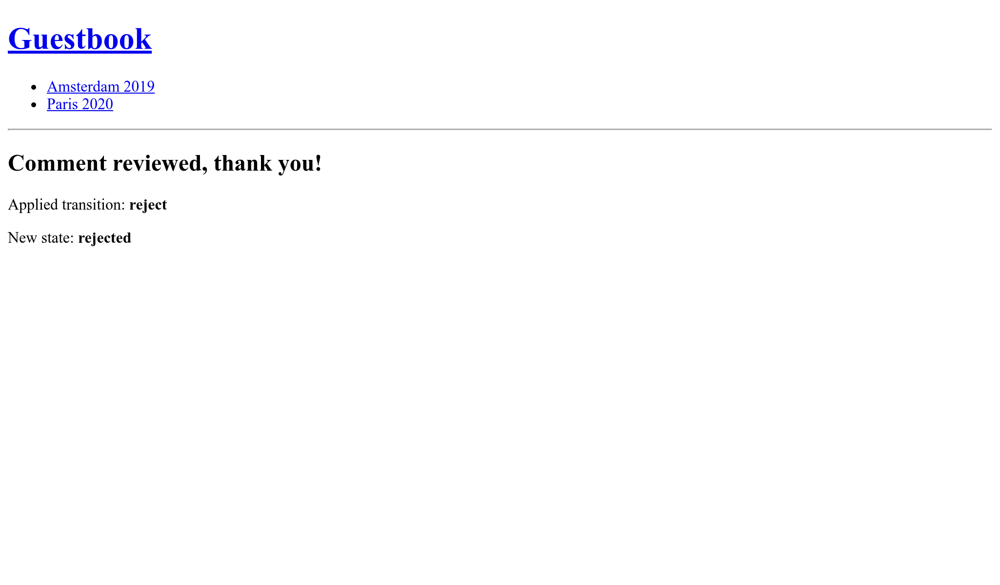

مراسلة المدراء
===========================

.. index::
    single: Components;Mailer
    single: Mailer
    single: Emails

لضمان تعليقات عالية الجودة ، يجب على المشرف الإشراف على جميع التعليقات. عندما يكون التعليق في حالة ``ham`` أو ``potential_spam`` ، يجب إرسال *بريد إلكتروني* إلى المسؤول برابطين: أحدهما لقبول التعليق والآخر لرفضه.

اولا , قم بتثبيت مكون Symfony Mailer

.. code-block:: terminal

    $ symfony composer req mailer

اعداد بريد خاص بالمدير
-----------------------------------------

لحفظ البريد الالكتروني للمدير، إستخدم مُعامل حاوية. لغرض العرض، نسمح أيضاً ان يتم وضعه عن طريق مُتغير بيئة العمل (لا يجب ان تكون هناك حاجة لهذا في الحياة الحقيقية). لتسهيل الحقن في الخدمات التي تحتاج البريد الالكتروني للمدير، قم بتعريف إعداد الربط ``bind`` للحاوية:

.. code-block:: diff
    :caption: patch_file

    --- a/config/services.yaml
    +++ b/config/services.yaml
    @@ -4,6 +4,7 @@
     # Put parameters here that don't need to change on each machine where the app is deployed
     # https://symfony.com/doc/current/best_practices/configuration.html#application-related-configuration
     parameters:
    +    default_admin_email: admin@example.com

     services:
         # default configuration for services in *this* file
    @@ -13,6 +14,7 @@ services:
             bind:
                 $photoDir: "%kernel.project_dir%/public/uploads/photos"
                 $akismetKey: "%env(AKISMET_KEY)%"
    +            $adminEmail: "%env(string:default:default_admin_email:ADMIN_EMAIL)%"

         # makes classes in src/ available to be used as services
         # this creates a service per class whose id is the fully-qualified class name

قد تتم مُعالجة متغير بيئة العمل قبل إستخدامه. هنا نستخدم المُعالج الإفتراضي (``default``) للعودة الي قيمة مُعامِل الـ ``default_admin_email`` لو ان متغير بيئة العمل ``ADMIN_EMAIL`` غير موجود.

إرسال رسالة إعلام بالبريد الإلكتروني
--------------------------------------------------------------------

لإرسال بريد إلكتروني، يمكنك الاختيار بين عدة مُلخصات (abstractions) لفئة الـ ``Email``؛ من الـ ``Message`` أدني مستوي الي الـ  ``NotificationEmail`` أعلي مستوي. في الأغلب سوف تستخدم فئة الـ ``Email`` أكثر، ولكن ``NotificationEmail`` أفضل إختيار لرسائل البريد الإلكترونية الداخلية.

في معالج الرسائل ، دعنا نعوض منطق التحقق-الالي

.. code-block:: diff
    :caption: patch_file

    --- a/src/MessageHandler/CommentMessageHandler.php
    +++ b/src/MessageHandler/CommentMessageHandler.php
    @@ -7,6 +7,8 @@ use App\Repository\CommentRepository;
     use App\SpamChecker;
     use Doctrine\ORM\EntityManagerInterface;
     use Psr\Log\LoggerInterface;
    +use Symfony\Bridge\Twig\Mime\NotificationEmail;
    +use Symfony\Component\Mailer\MailerInterface;
     use Symfony\Component\Messenger\Handler\MessageHandlerInterface;
     use Symfony\Component\Messenger\MessageBusInterface;
     use Symfony\Component\Workflow\WorkflowInterface;
    @@ -18,15 +20,19 @@ class CommentMessageHandler implements MessageHandlerInterface
         private $commentRepository;
         private $bus;
         private $workflow;
    +    private $mailer;
    +    private $adminEmail;
         private $logger;

    -    public function __construct(EntityManagerInterface $entityManager, SpamChecker $spamChecker, CommentRepository $commentRepository, MessageBusInterface $bus, WorkflowInterface $commentStateMachine, LoggerInterface $logger = null)
    +    public function __construct(EntityManagerInterface $entityManager, SpamChecker $spamChecker, CommentRepository $commentRepository, MessageBusInterface $bus, WorkflowInterface $commentStateMachine, MailerInterface $mailer, string $adminEmail, LoggerInterface $logger = null)
         {
             $this->entityManager = $entityManager;
             $this->spamChecker = $spamChecker;
             $this->commentRepository = $commentRepository;
             $this->bus = $bus;
             $this->workflow = $commentStateMachine;
    +        $this->mailer = $mailer;
    +        $this->adminEmail = $adminEmail;
             $this->logger = $logger;
         }

    @@ -51,8 +57,13 @@ class CommentMessageHandler implements MessageHandlerInterface

                 $this->bus->dispatch($message);
             } elseif ($this->workflow->can($comment, 'publish') || $this->workflow->can($comment, 'publish_ham')) {
    -            $this->workflow->apply($comment, $this->workflow->can($comment, 'publish') ? 'publish' : 'publish_ham');
    -            $this->entityManager->flush();
    +            $this->mailer->send((new NotificationEmail())
    +                ->subject('New comment posted')
    +                ->htmlTemplate('emails/comment_notification.html.twig')
    +                ->from($this->adminEmail)
    +                ->to($this->adminEmail)
    +                ->context(['comment' => $comment])
    +            );
             } elseif ($this->logger) {
                 $this->logger->debug('Dropping comment message', ['comment' => $comment->getId(), 'state' => $comment->getState()]);
             }

تعد ``MailerInterface`` نقطة الدخول الرئيسية وتسمح بإرسال``() send `` البريد الإلكتروني.

لإرسال بريد إلكتروني، نحتاج الي مُرسِل (عنوان الـ مِن/مُرسِل ``From``/``Sender``). بدلاً من تعريفه بشكل صريح علي نموذج (instance) البريد الالكتروني، عرفها بشكل عام:

.. code-block:: diff
    :caption: patch_file

    --- a/config/packages/mailer.yaml
    +++ b/config/packages/mailer.yaml
    @@ -1,3 +1,5 @@
     framework:
         mailer:
             dsn: '%env(MAILER_DSN)%'
    +        envelope:
    +            sender: "%env(string:default:default_admin_email:ADMIN_EMAIL)%"

تمديد قالب البريد الإلكتروني للاشعار
--------------------------------------------------------------------

.. index::
    single: Twig;extends
    single: Twig;block
    single: Twig;url

يرث قالب الإشعار بالبريد الإلكتروني من قالب البريد الإلكتروني للإشعار الافتراضي الذي يأتي مع سيمفوني:

.. code-block:: twig
    :caption: templates/emails/comment_notification.html.twig

    

    
        Author: {{ comment.author }} 
        Email: {{ comment.email }} 
        State: {{ comment.state }} 

        

            {{ comment.text }}
        

    

    
        <spacer size="16"></spacer>
        <button href="{{ url('review_comment', { id: comment.id }) }}">Accept</button>
        <button href="{{ url('review_comment', { id: comment.id, reject: true }) }}">Reject</button>
    

يقوم القالب بتجاوز بعض الكتل لتخصيص رسالة البريد الالكتروني وإضافة بعض الروابط التي تمكن المسؤول من قبول او رفض التعليق. تتم إضافة وسيطة مسار (route argument) ليست مُعامل مسار صالحة كعنصر جملة الاستعلام (query string item) (رابط الرفض يبدو مثل ``/admin/comment/review/42?reject=true``).

قالب الـ ``NotificationEmail`` الاساسي (الافتراضي) يستخدم `Inky <https://get.foundation/emails/docs/inky.html>`_  بدلاً من HTML لتصميم الرسائل الالكترونية. تساعد علي إنشاء بريد إلكتروني سريعة الاستجابة (responsive) تتوافق مع جميع عملاء البريد الالكتروني الاكثر رواجاً.

لتحقيق أقصى قدر من التوافق مع برامج قراءة البريد الإلكتروني ، يشتمل تخطيط قاعدة الإعلام على جميع أوراق الأنماط (عبر حزمة CSS inliner) بشكل افتراضي.

تعتبر هاتان الميزتان جزءًا من ملحقات Twig الاختيارية التي يجب تثبيتها:

.. code-block:: terminal

    $ symfony composer req "twig/cssinliner-extra:^3" "twig/inky-extra:^3"

توليد عناوين URL المطلقة في أمر
------------------------------------------------------

.. index::
    single: Twig;Link
    single: Link

في رسائل البريد الالكترونية، إنشاء روابط باستخدام ``url()`` بدلاً من ``path()`` لانك تحتاج روابط كاملة (مع المُخطط والمُضيف).

يتم إرسال البريد الإلكتروني من معالج الرسائل ، في سياق وحدة التحكم. يعد إنشاء عناوين URL المطلقة في سياق الويب أسهل حيث نعرف مخطط ونطاق الصفحة الحالية. ليس هذا هو الحال في سياق وحدة التحكم.

حدد اسم النطاق ومخطط الاستخدام بشكل صريح:

.. code-block:: diff
    :caption: patch_file

    --- a/config/services.yaml
    +++ b/config/services.yaml
    @@ -5,6 +5,11 @@
     # https://symfony.com/doc/current/best_practices/configuration.html#application-related-configuration
     parameters:
         default_admin_email: admin@example.com
    +    default_domain: '127.0.0.1'
    +    default_scheme: 'http'
    +
    +    router.request_context.host: '%env(default:default_domain:SYMFONY_DEFAULT_ROUTE_HOST)%'
    +    router.request_context.scheme: '%env(default:default_scheme:SYMFONY_DEFAULT_ROUTE_SCHEME)%'

     services:
         # default configuration for services in *this* file

يتم تعريف متغيرات بيئة العمل ``SYMFONY_DEFAULT_ROUTE_HOST`` و ``SYMFONY_DEFAULT_ROUTE_PORT`` محلياً عن استخدام شاشة اوامر سيمفوني (symfony CLI) ويتم تحديده بناءاً علي الاعدادات علي سيمفوني كلاود SymfonyCloud.

توصيل مسار (Route) إلى جهاز تحكم (Controller)
-----------------------------------------------------------------

مسار ``review_comment`` غير موجود حتى الآن ، فلننشئ وحدة تحكم المدير للتعامل معه:

.. code-block:: php
    :caption: src/Controller/AdminController.php

    namespace App\Controller;

    use App\Entity\Comment;
    use App\Message\CommentMessage;
    use Doctrine\ORM\EntityManagerInterface;
    use Symfony\Bundle\FrameworkBundle\Controller\AbstractController;
    use Symfony\Component\HttpFoundation\Request;
    use Symfony\Component\HttpFoundation\Response;
    use Symfony\Component\Messenger\MessageBusInterface;
    use Symfony\Component\Routing\Annotation\Route;
    use Symfony\Component\Workflow\Registry;
    use Twig\Environment;

    class AdminController extends AbstractController
    {
        private $twig;
        private $entityManager;
        private $bus;

        public function __construct(Environment $twig, EntityManagerInterface $entityManager, MessageBusInterface $bus)
        {
            $this->twig = $twig;
            $this->entityManager = $entityManager;
            $this->bus = $bus;
        }

        #[Route('/admin/comment/review/{id}', name: 'review_comment')]
        public function reviewComment(Request $request, Comment $comment, Registry $registry): Response
        {
            $accepted = !$request->query->get('reject');

            $machine = $registry->get($comment);
            if ($machine->can($comment, 'publish')) {
                $transition = $accepted ? 'publish' : 'reject';
            } elseif ($machine->can($comment, 'publish_ham')) {
                $transition = $accepted ? 'publish_ham' : 'reject_ham';
            } else {
                return new Response('Comment already reviewed or not in the right state.');
            }

            $machine->apply($comment, $transition);
            $this->entityManager->flush();

            if ($accepted) {
                $this->bus->dispatch(new CommentMessage($comment->getId()));
            }

            return $this->render('admin/review.html.twig', [
                'transition' => $transition,
                'comment' => $comment,
            ]);
        }
    }

يبدا رابط مراجعة التعليق بـ ``/admin/`` لحمايته بواسطة جدار الحماية المُحدد في الخطوة السابقة. يجب مُصادقة (authenticated) المسؤول للوصول الي هذا المصدر (resource).

بدلاص من إنشاء نموذج رد (``Response``)، قمنا باستخدام ``render()``، دالة إختصار مُقدمة بواسطة الفئة الاساسية لوحدة تحكم الـ ``AbstractController``.

.. index::
    single: Twig;extends
    single: Twig;block

عند الانتهاء من المراجعة ، يشكر قالب قصير المشرف على عملهم الشاق:

.. code-block:: twig
    :caption: templates/admin/review.html.twig

    

    
        <h2>Comment reviewed, thank you!</h2>

        
Applied transition: <strong>{{ transition }}</strong>

        
New state: <strong>{{ comment.state }}</strong>

    

باستخدام بريد الماسك (Mail Catcher)
-----------------------------------------------------

.. index::
    single: Docker;Mail Catcher

بدلاً من استخدام خادم SMTP "حقيقي" أو موفر جهة خارجية لإرسال رسائل البريد الإلكتروني ، دعنا نستخدم أداة التقاط البريد (Mail catcher). يوفر أداة التقاط البريد خادم SMTP لا يقوم بتسليم رسائل البريد الإلكتروني ، ولكنه يجعلها متاحة من خلال واجهة ويب بدلاً من ذلك:

.. code-block:: diff

    --- a/docker-compose.yaml
    +++ b/docker-compose.yaml
    @@ -8,3 +8,7 @@ services:
                 POSTGRES_PASSWORD: main
                 POSTGRES_DB: main
             ports: [5432]
    +
    +    mailer:
    +        image: schickling/mailcatcher
    +        ports: [1025, 1080]

أغلق وأعد تشغيل الحاويات لإضافة ماسك البريد (mail catcher):

.. code-block:: terminal

    $ docker-compose stop
    $ docker-compose up -d

يجب عليك أيضًا إيقاف مستهلك الرسائل لأنه ليس على علم بعد بمُلتقط البريد:

.. code-block:: terminal

    $ symfony console messenger:stop-workers

وابدأ مرة أخرى. يتم الآن عرض ``MAILER_DSN`` تلقائيًا:

.. code-block:: terminal
    :class: ignore

    $ symfony run -d --watch=config,src,templates,vendor symfony console messenger:consume async

.. code-block:: terminal
    :class: hide

    $ sleep 10

الوصول إلى بريد الويب (webmail)
-------------------------------------------------

.. index::
    single: Symfony CLI;open:local:webmail

يمكنك فتح بريد الويب (webmail) من محطة طرفية (terminal):

.. code-block:: terminal
    :class: ignore

    $ symfony open:local:webmail

أو من شريط أدوات تصحيح الويب (web debug toolbar):

.. figure:: screenshots/webmail-wdt.png
    :alt: /
    :align: center
    :figclass: with-browser

إرسال تعليق ، يجب أن تتلقى بريدًا إلكترونيًا في واجهة بريد الويب (webmail):

.. figure:: screenshots/webmail.png
    :alt: /
    :align: center
    :figclass: with-browser

انقر على عنوان البريد الإلكتروني على الواجهة واقبل أو ارفض التعليق كما تراه مناسبًا:

تحقق من السجلات عن طريق ``server:log`` إذا لم يعمل ذلك كما هو متوقع.

إدارة البرامج النصية طويلة الأمد
------------------------------------------------------------

يأتي وجود نصوص طويلة الأمد بسلوكيات يجب أن تكون على دراية بها.على عكس نموذج PHP المستخدم لـ HTTP حيث يبدأ كل طلب بحالة نظيفة ، فإن مستهلك الرسالة يعمل بشكل مستمر في الخلفية.كل معالجة للرسالة ترث الحالة الحالية ، بما في ذلك ذاكرة التخزين المؤقت. لتجنب أي مشاكل في العقيدة ، يتم مسح مديري الكيانات تلقائيًا بعد معالجة الرسالة.يجب عليك التحقق مما إذا كانت خدماتك الخاصة تحتاج إلى القيام بنفس الشيء أم لا.

إرسال رسائل البريد الإلكتروني بشكل غير متزامن
------------------------------------------------------------------------------------

قد يستغرق إرسال البريد الالكتروني المُرسل في مُعالج الرسائل بعض الوقت. بل ربما تُلقي إعتراض (exception). في حالة ان اعتراض حدث اثناء معالجة الرسالة، ستتم إعادةالمحاولة. لكن بدلاً من إعادة محاولة استهلاك رسالة التعليق، سوف يكون من الافضل إعادة محاولة إرسال البريد الالكتروني.

نحن نعرف بالفعل كيفية القيام بذلك: أرسل رسالة البريد الإلكتروني في الحافلة.

نموذج ``MailerInterface`` يقوم بالعمل الشاق: عند تعريف ناقل، يُرسل رسائل البريد الالكتروني إليه بدلاً من إرسالهم. لا حاجة لاي تغييرات في الرمز البرمجي (code).

ولكن الآن، يُرسل الناقل البريد الالكتروني بشكل متزامن لأننا لم نقوم بإعداد قائمة الانتظار التي نريد استخدامها لرسائل البريد الالكتروني. لنستعمل RabbitMQ مجدداً:

.. code-block:: diff
    :caption: patch_file

    --- a/config/packages/messenger.yaml
    +++ b/config/packages/messenger.yaml
    @@ -20,3 +20,4 @@ framework:
             routing:
                 # Route your messages to the transports
                 App\Message\CommentMessage: async
    +            Symfony\Component\Mailer\Messenger\SendEmailMessage: async

حتى إذا كنا نستخدم نفس النقل (RabbitMQ) لرسائل التعليق ورسائل البريد الإلكتروني ، فلا يجب أن يكون الأمر كذلك. يمكنك أن تقرر استخدام وسيلة نقل أخرى لإدارة أولويات الرسائل المختلفة على سبيل المثال.يمنحك استخدام وسائل النقل المختلفة أيضًا فرصة وجود أجهزة عاملة مختلفة تتعامل مع أنواع مختلفة من الرسائل. إنه مرن و متروك لكم.

اختبار رسائل البريد الإلكتروني
---------------------------------------------------------

هناك طرق عديدة لاختبار رسائل البريد الإلكتروني.

يمكنك كتابة اختبارات الوحدة (unit tests) إذا كنت تكتب فئة (class) لكل بريد الكتروني (علي سبيل المثال بتمديد ``Email`` او ``TemplatedEmail``).

الاختبارات الأكثر شيوعًا التي ستكتبها هي الاختبارات الوظيفية التي تتحقق من أن بعض الإجراءات تؤدي إلى إرسال بريد إلكتروني ، وربما اختبارات حول محتوى رسائل البريد الإلكتروني إذا كانت ديناميكية.

يأتي سيمفوني مع تأكيدات (assertions) تُسهل من مثل هذه الاختبارات، هاك أحد الأمثلة لعرض بعض الاحتمالات:

.. code-block:: php
    :class: ignore

    public function testMailerAssertions()
    {
        $client = static::createClient();
        $client->request('GET', '/');

        $this->assertEmailCount(1);
        $event = $this->getMailerEvent(0);
        $this->assertEmailIsQueued($event);

        $email = $this->getMailerMessage(0);
        $this->assertEmailHeaderSame($email, 'To', 'fabien@example.com');
        $this->assertEmailTextBodyContains($email, 'Bar');
        $this->assertEmailAttachmentCount($email, 1);
    }

تعمل هذه التأكيدات عندما يتم إرسال رسائل البريد الإلكتروني بشكل متزامن أو غير متزامن.

إرسال رسائل بريد الكتروني علي سحابية سيمفوني (SymfonyCloud)
-------------------------------------------------------------------------------------------------

.. index::
    single: SymfonyCloud;Emails
    single: SymfonyCloud;Mailer
    single: SymfonyCloud;SMTP
    single: Emails

لا يوجد تكوين محدد لـ SymfonyCloud. تأتي جميع الحسابات مع حساب Sendgrid الذي يتم استخدامه تلقائيًا لإرسال رسائل البريد الإلكتروني.

ما زلت بحاجة إلى تحديث تهيئة SymfonyCloud لتضمين ملحق PHP لـ xsl الذي يحتاجه Inky:

.. code-block:: diff
    :caption: patch_file

    --- a/.symfony.cloud.yaml
    +++ b/.symfony.cloud.yaml
    @@ -4,6 +4,7 @@ type: php:8.0

     runtime:
         extensions:
    +        - xsl
             - pdo_pgsql
             - apcu
             - mbstring

.. index::
    single: Symfony CLI;env:setting:set

.. note::

    لتكون علي الجانب الآمن، رسائل البريد الالكتروني يتم ارسالها فقط علي الفرع الرئيسي (``master`` branch) بشكل افتراضي (default). قم بتفعيل SMTP بشكل صريح علي الفروع غير الرئيسية (non-``master`` branches) إدا كنت تعرف ما تفعله.

    .. code-block:: terminal

        $ symfony env:setting:set email on

.. sidebar:: الذهاب أبعد من ذلك

    * `دروس باعث البريد الالكتروني علي SymfonyCasts <https://symfonycasts.com/screencast/mailer>`_؛

    * `مراجع لغة النماذج Inky <https://get.foundation/emails/docs/inky.html>`_؛

    * `مُعالجات متغير بيئة العمل <https://symfony.com/doc/current/configuration/env_var_processors.html>`_؛

    * `مراجع باعث بريد إطار سيموفني <https://symfony.com/doc/current/mailer.html>`_؛

    * `مراجع سيموفني كلاود عن رسائل البريد الإلكتروني <https://symfony.com/doc/current/cloud/services/emails.html>`_.
