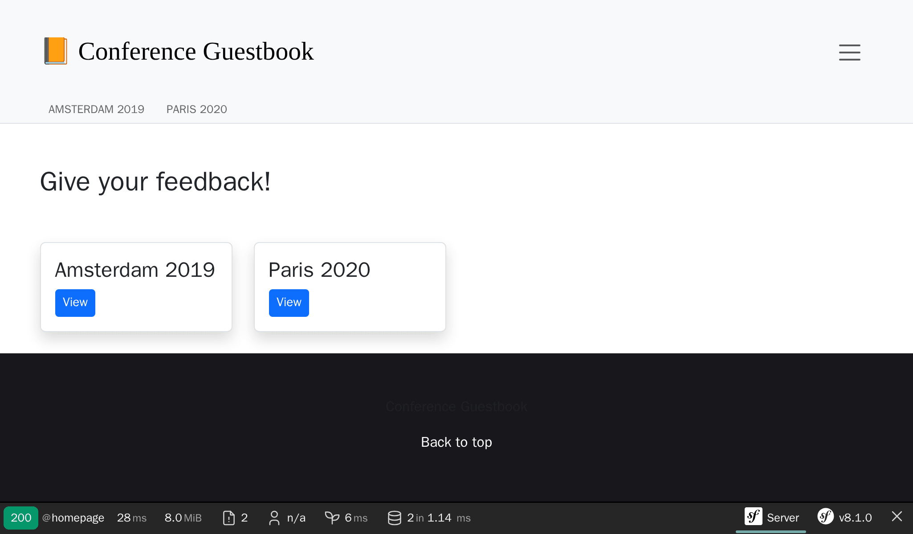

تصميم واجهة المستخدم
==================================

.. index::
    single: AssetMapper
    single: Components;AssetMapper
    single: Stylesheet

لم نقضِ أي وقت في تصميم واجهة المستخدم. لتصميمها كالمحترفين، سنستخدم حزمة تقنية حديثة مبنية على *AssetMapper*، مكوّن Symfony الذي ظل يدير أصولنا (assets) منذ أول خطوة في هذا الكتاب.

يتبنى AssetMapper معايير الويب الحديثة: تُقدَّم ملفات JavaScript و CSS كما هي وتُربَط معًا عبر *importmap*، مما يتيح للمتصفح تحميل *وحدات ES* (ES modules) الأصلية مباشرة. لا حزم تجميع (bundler)، ولا خطوة بناء، ولا Node.js.

ألقِ نظرة على ملف ``importmap.php`` في جذر المشروع: فهو يصف حزم JavaScript التي يستخدمها التطبيق. تكشف دالة Twig المسماة ``importmap()`` والمُستدعاة في ``templates/base.html.twig`` هذه الحزم للمتصفح.

الاستفادة من Bootstrap
------------------------------

.. index::
    single: Bootstrap

للبدء بإعدادات افتراضية جيدة وبناء موقع متجاوب (responsive)، يمكن لإطار عمل CSS مثل `Bootstrap`_ أن يقطع شوطًا طويلاً. قم بتثبيته كحزمة importmap:

.. code-block:: terminal

    $ symfony console importmap:require bootstrap bootstrap/dist/css/bootstrap.min.css

يُسجّل الأمر الحزمة في ``importmap.php`` ويُنزّلها (مع تبعيتها ``@popperjs/core``) إلى ``assets/vendor/``؛ لا يعتمد التطبيق على CDN في وقت التشغيل.

قم باستيراد Bootstrap في نقطة دخول JavaScript الرئيسية (قمنا أيضًا بتنظيف رسالة الترحيب الافتراضية):

.. code-block:: diff
    :caption: patch_file

    --- i/assets/app.js
    +++ w/assets/app.js
    @@ -5,6 +5,6 @@ import './stimulus_bootstrap.js';
      * This file will be included onto the page via the importmap() Twig function,
      * which should already be in your base.html.twig.
      */
    +import 'bootstrap';
    +import 'bootstrap/dist/css/bootstrap.min.css';
     import './styles/app.css';
    -
    -console.log('This log comes from assets/app.js - welcome to AssetMapper! 🎉');

لاحظ أن ``app.css`` يُستورَد *بعد* أنماط Bootstrap حتى تفوز تخصيصاتنا.

يدعم نظام النماذج في Symfony إطار Bootstrap أصلاً عبر سمة (theme) خاصة، قم بتفعيلها:

.. code-block:: yaml
    :caption: config/packages/twig.yaml

    twig:
        form_themes: ['bootstrap_5_layout.html.twig']

تصميم HTML
----------------

نحن الآن جاهزون لتصميم التطبيق. قم بتنزيل الأرشيف وفك ضغطه في جذر المشروع:

.. code-block:: terminal

    $ php -r "copy('https://symfony.com/uploads/assets/guestbook-8.1.zip', 'guestbook-8.1.zip');"
    $ unzip -o guestbook-8.1.zip
    $ rm guestbook-8.1.zip

ألقِ نظرة على القوالب، فقد تتعلم حيلة أو اثنتين حول Twig.

تقديم الأصول (Assets)
------------------------------

.. index::
    single: AssetMapper;asset-map:compile

لا يوجد ما يجب بناؤه: حدّث الصفحة وتكون التغييرات حيّة. في بيئة التطوير، يقدّم AssetMapper ملفات الأصول مباشرة.

خذ وقتك لاكتشاف التغييرات المرئية. ألقِ نظرة على التصميم الجديد في المتصفح.

.. figure:: screenshots/design-conference.png
    :alt: /conference/amsterdam-2019
    :align: center
    :figclass: with-browser

أصبح نموذج تسجيل الدخول المُولَّد مُصمَّمًا أيضًا حيث تستخدم حزمة Maker فئات CSS الخاصة بـ Bootstrap افتراضيًا:

.. figure:: screenshots/login-styled.png
    :alt: /login
    :align: center
    :figclass: with-browser

بالنسبة للإنتاج، يقوم Upsun تلقائيًا بتشغيل الأمر ``asset-map:compile`` أثناء مرحلة البناء: تُنسَخ جميع الأصول إلى ``public/assets/`` مع بصمة إصدار (version hash) في أسماء ملفاتها، مما يتيح تخزينًا مؤقتًا آمنًا وطويل الأمد لـ HTTP.

.. sidebar:: الذهاب أبعد من ذلك

    * `مستندات مكون AssetMapper`_؛

    * `مواصفات importmap`_؛

    * `مستندات Bootstrap`_.

.. _`Bootstrap`: https://getbootstrap.com/
.. _`مستندات مكون AssetMapper`: https://symfony.com/doc/current/frontend/asset_mapper.html
.. _`مواصفات importmap`: https://html.spec.whatwg.org/multipage/webappapis.html#import-maps
.. _`مستندات Bootstrap`: https://getbootstrap.com/docs/
