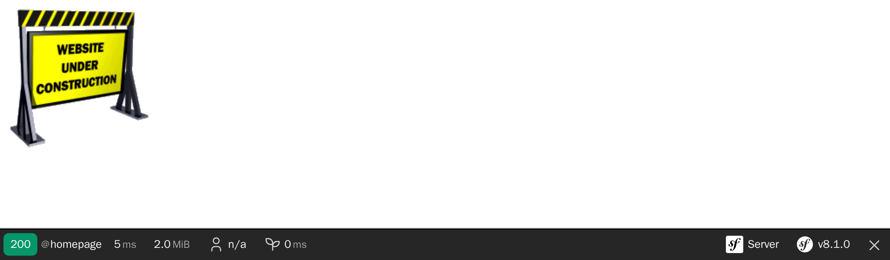

إنشاء وحدة تحكم
============================

.. index::
    single: Controller
    single: Routing;Route

إن مشروع دفتر الضيوف الخاص بنا موجود بالفعل علي خوادم الانتاجية ولكننا قمنا بالخداع قليلاً. لا يحتوي الموقع علي أي صفحات بعد. الصفحة الرئيسية عبارة عن صفحة خطأ 404. هيا نقوم بتصليح ذلك.

عندما يأتي طلب HTTP، مثل الصفحة الرئيسية (``http://localhost:8000/``)، يحاول سيمفوني العثور علي *مسار* يطابق *مسار الطلب* (``/``). *المسار* هو رابط بين مسار الطلب ودالة *PHP* التي تقوم بعمل *الرد* علي طلب ال HTTP.

تسمي هذه الدوال القابلة للاستدعاء "بوحدات التحكم". في سيمفوني، أغلب وحدات التحكم يتم كتابتها كفئات PHP. يمكنك إنشاء هذه الفئة يدويا، ولكننا نحب ان نتحرك بسرعة، فدعنا نري كيف يمكن لسيمفوني ان يساعدنا.

كن كسول مع Maker Bundle
-------------------------------

.. index::
    single: Components;Maker Bundle
    single: Maker Bundle

لانشاء وحدات تحكم دون اي عناء، يمكننا استخدام حزمة ``symfony/maker-bundle``، التي تم تثبيتها كجزء من حزمة ``webapp``.

تساعدك حزمة المُصنع علي انشاء العديد من وحدات التحكم المختلفة. سنستخدمها طوال الوقت في هذا الكتاب. كل "مولد" مُعرف في أمر وكل الاوامر جزء من مساحة اسم امر ``make``.

.. index::
    single: Command;list

يقوم امر ``list`` المدمج مع سيمفوني بسرد جميع الاوامر الموجودة في مساحة الاسم المعطاة؛ استخدمه لتقوم باكتشاف جميع المولدات التي توفرها حزمة maker.

.. code-block:: terminal
    :class: ignore

    $ symfony console list make

إختيار شكل الإعدادات
--------------------------------------

قبل عمل اول مُتحكم للمشروع، نحتاج الي تحديد تنسيق الاعدادات التي نريد استخدامها. يدعم سيمفوني YAML، XML، PHP و سمات PHP خارج الصندوق.

يعتبر *YAML* افضل اختيار من اجل *الاعدادات الخاصة بالحزم*. هذا هو التنسيق المستخدم في مجلد ``config/``. في الغالب عندما تقوم بتنصيب حزمة جديدة ستقوم وصفة هذه الحزمة بإضافة ملف جديد ينتهي بــ``.yaml`` الي هذا المجلد.

*بالنسبة للاعدادات الخاصة برمز الـ PHP* يعتبر افضل اختيار هو *السمات (attributes)* حيث انه يتم تعريفها بجوار الرمز. اسمحوا لي ان اشرح هذا بمثال. عندما يأتي طلب بعد الاعدادات تحتاج ان تخبر سيمفوني بالمُتحكم (PHP class) الخاص بمعالجة مسار هذا الطلب. عند استخدام YAML، XML، او PHP كتنسيقات الاعدادات يتم اشراك ملفين (ملف الاعدادات وملف مُتحكم PHP). عند استخدام السمات الاعدادات تتم مباشرة في فئة المُتحكم.

قد تتساءل كيف يمكنك تخمين اسم الحزمة التي تحتاج لتثبيتها من اجل ميزة؟ أغلب الاحيان لا تحتاج أن تعرف. في معظم الحالات تحتوي رسائل الخطأ في سيمفوني علي اسم الحزمة التي تحتاج لثبيتها. علي سبيل المثال تشغيل ``symfony console make:message`` دون وجود حزمة ``messenger`` سوف ينتهي برسالة خطأ تشمل تلميح عن تثبيت الحزمة الصحيحة.

إنتاج وحدة تحكم (مُتحكم)
-------------------------------------------

.. index::
    single: Command;make:controller

إنشاء اول *وحدة تحكم* خاصة بك عن طريق امر ``make:controller``:

.. code-block:: terminal
    :class: answers(no)

    $ symfony console make:controller ConferenceController

.. index::
    single: Components;Routing
    single: Attributes;Route

ينشئ الامر فئة ``ConferenceController`` تحت مجلد الـ ``src/Controller/``. تحتوي الفئة التي تم انشاؤها من بعض الرموز (الكود) النمطية (الصيغة التشكلية) الجاهزة ليتم تحسينها (ضبطها):

.. code-block:: php
    :caption: src/Controller/ConferenceController.php
    :class: ignore
    :emphasize-lines: 9

    namespace App\Controller;

    use Symfony\Bundle\FrameworkBundle\Controller\AbstractController;
    use Symfony\Component\HttpFoundation\Response;
    use Symfony\Component\Routing\Attribute\Route;

    final class ConferenceController extends AbstractController
    {
        #[Route('/conference', name: 'app_conference')]
        public function index(): Response
        {
            return $this->render('conference/index.html.twig', [
                'controller_name' => 'ConferenceController',
            ]);
        }
    }

تعتبر السمة ``#[Route('/conference', name: 'app_conference')]`` هي ما يجعل دالة الـ ``index()`` وحدة تحكم (مُتحكم) (الاعدادات بجوار الرمز البرمجي التي تقوم بضبطه).

عندما تضغط ``/conference`` في المتصفح يتم تنفيذ وحدة التحكم ويعُاد الرد.

قم بتعديل الرابط ليتطابق مع الصفحة الرئيسية:

.. code-block:: diff
    :caption: patch_file
    :emphasize-lines: 7

    --- i/src/Controller/ConferenceController.php
    +++ w/src/Controller/ConferenceController.php
    @@ -8,7 +8,7 @@ use Symfony\Component\Routing\Attribute\Route;

     final class ConferenceController extends AbstractController
     {
    -    #[Route('/conference', name: 'app_conference')]
    +    #[Route('/', name: 'homepage')]
         public function index(): Response
         {
             return $this->render('conference/index.html.twig', [

*اسم* المسار سوف يكون مفيد عندما نريد ان نُشير الي الصفحة الرئيسية في الرمز البرمجي. بدلاً من ترميز مسار الـ ``/`` بصعوبة سوف نستخدم اسم المسار.

بدلاً من الصفحة الإفتراضية المعروضة فلنرجع صفحة HTML بسيطة:

.. code-block:: diff
    :caption: patch_file
    :emphasize-lines: 18

    --- i/src/Controller/ConferenceController.php
    +++ w/src/Controller/ConferenceController.php
    @@ -11,8 +11,13 @@ final class ConferenceController extends AbstractController
         #[Route('/', name: 'homepage')]
         public function index(): Response
         {
    -        return $this->render('conference/index.html.twig', [
    -            'controller_name' => 'ConferenceController',
    -        ]);
    +        return new Response(<<<EOF
    +            <html>
    +                <body>
    +                    
    +                </body>
    +            </html>
    +            EOF
    +        );
         }
     }

تحديث المتصفح:

المسئولية الرئيسية لوحدة التحكم هي اعادة ``رد`` HTTP للطلب.

بما أن بقية الفصل تدور حول كود لن نحتفظ به، دعنا نسجّل تغييراتنا الآن:

.. code-block:: terminal
    :class: ignore

    $ git add .
    $ git commit -m'Add the index controller'

.. _easter-egg:

إضافة بيضة عيد الربيع
---------------------------------------

لتوضيح كيف تستفيد الاستجابة من المعلومات الواردة من الطلب سنقوم بإضافة `Easter egg`_. عندما تحتوي الصفحة الرئيسية علي جملة استعلام مثل ``?hello=Fabien``، سنقوم بإضفة نص لتحية الشخص:

.. code-block:: diff
    :emphasize-lines: 18

    --- i/src/Controller/ConferenceController.php
    +++ w/src/Controller/ConferenceController.php
    @@ -3,17 +3,24 @@
     namespace App\Controller;

     use Symfony\Bundle\FrameworkBundle\Controller\AbstractController;
    +use Symfony\Component\HttpFoundation\Request;
     use Symfony\Component\HttpFoundation\Response;
     use Symfony\Component\Routing\Attribute\Route;

     final class ConferenceController extends AbstractController
     {
         #[Route('/', name: 'homepage')]
    -    public function index(): Response
    +    public function index(Request $request): Response
         {
    +        $greet = '';
    +        if ($name = $request->query->get('hello')) {
    +            $greet = sprintf('<h1>Hello %s!</h1>', htmlspecialchars($name));
    +        }
    +
             return new Response(<<<EOF
                 <html>
                     <body>
    +                    $greet
                         
                     </body>
                 </html>

يكشف سيمفوني بيانات الطلب عن طريق كائن ``Request``. عندما يري سيمفوني دلالة وحدة تحكم بهذا التلميح، يعرف تلقائياً ان يمررها اليك. يمكننا ان نستخدما للحصول علي عنصر الـ ``name`` من جملة الاستعلام واضافة عنوان ``<h1>``.

قم بضغط ``/`` ومن ثم ``/?hello=Fabien`` في المتصفح لتري الفرق.

.. note::

    إنتبه لمناداة ``htmlspecialchars()`` لتجنب مشاكل الـ XSS. هذا شئ سوف يتم تنفيذه بشكل تلقائي عندما نقوم بالتغير الي محرك قالب مناسب.

كان من الممكن ايضا ان نجعل الاسم جزي من ال URL:

.. code-block:: diff

    --- i/src/Controller/ConferenceController.php
    +++ w/src/Controller/ConferenceController.php
    @@ -9,11 +9,11 @@ use Symfony\Component\Routing\Attribute\Route;

     final class ConferenceController extends AbstractController
     {
    -    #[Route('/', name: 'homepage')]
    -    public function index(Request $request): Response
    +    #[Route('/hello/{name}', name: 'homepage')]
    +    public function index(string $name = ''): Response
         {
             $greet = '';
    -        if ($name = $request->query->get('hello')) {
    +        if ($name) {
                 $greet = sprintf('<h1>Hello %s!</h1>', htmlspecialchars($name));
             }

جزء الـ ``{name}`` الموجود في المسار يعتبر *معامل مسار* ديناميكي - وهو يعمل كبديل. يمكن الان ضغط ``/hello`` ومن ثم ``/hello/Fabien`` في المتصفح للحصول علي النتائج نفسها التي حصلت عليها من قبل. يمكنك الحصول علي *قيمة* معامل الـ ``{name}`` بإضافة دلالة في وحدة التحكم بنفس *الاسم*. إذاً، ``$name``.

تراجع عن التغييرات التي أجريناها للتو:

.. code-block:: terminal

    $ git checkout src/Controller/ConferenceController.php

.. code-block:: terminal
    :class: hide

    $ git reset HEAD src/Controller/ConferenceController.php
    $ git checkout src/Controller/ConferenceController.php

تصحيح المتغيرات
-------------------------

.. index::
    single: Components;VarDumper
    single: VarDumper
    single: dump

من مساعدات التصحيح الرائعة دالة سيمفوني ``dump()``. إنها متاحة دائماً وتمكنك من طباعة متغيرات معقدة بشكل جميل وتفاعلي.

بشكل مؤقت غيّر ``src/Controller/ConferenceController.php`` لطباعة كائن الطلب:

.. code-block:: diff
    :emphasize-lines: 17

    --- i/src/Controller/ConferenceController.php
    +++ w/src/Controller/ConferenceController.php
    @@ -3,14 +3,17 @@
     namespace App\Controller;

     use Symfony\Bundle\FrameworkBundle\Controller\AbstractController;
    +use Symfony\Component\HttpFoundation\Request;
     use Symfony\Component\HttpFoundation\Response;
     use Symfony\Component\Routing\Attribute\Route;

     final class ConferenceController extends AbstractController
     {
         #[Route('/', name: 'homepage')]
    -    public function index(): Response
    -    {
    +    public function index(Request $request): Response
    +        {
    +        dump($request);
    +
             return new Response(<<<EOF
                 <html>
                     <body>

عند تحديث الصفحة، تلاحظ ايقونة الـ"target" الجديدة في شريط الادوات؛ تتيح لك فحص التفريغ. إضغط عليها للحصول علي صفحة كاملة حيث يصبح التنقل (التصفح) اسهل:

.. figure:: screenshots/dumper.png
    :alt: /
    :align: center
    :figclass: with-browser

.. index::
    single: Git;checkout

تراجع عن التغييرات التي أجريناها للتو:

.. code-block:: terminal

    $ git checkout src/Controller/ConferenceController.php

.. code-block:: terminal
    :class: hide

    $ git reset HEAD src/Controller/ConferenceController.php
    $ git checkout src/Controller/ConferenceController.php

.. sidebar:: الذهاب أبعد من ذلك

    * نظام `المسارات`_ الخاص بسيمفوني؛

    * `SymfonyCasts Routes, Controllers & Pages tutorial`_؛

    * `سمات PHP`_؛

    * مكون الـ `HttpFoundation`_؛

    * `XSS (Cross-Site Scripting)`_ security attacks؛

    * The `Symfony Routing Cheat Sheet`_.

.. _`Easter egg`: https://en.wikipedia.org/wiki/Easter_egg_(media)#In_computing
.. _`المسارات`: https://symfony.com/doc/current/routing.html
.. _`SymfonyCasts Routes, Controllers & Pages tutorial`: https://symfonycasts.com/screencast/symfony/route-controller
.. _`سمات PHP`: https://www.php.net/attributes
.. _`HttpFoundation`: https://symfony.com/doc/current/components/http_foundation.html
.. _`XSS (Cross-Site Scripting)`: https://owasp.org/www-community/attacks/xss/
.. _`Symfony Routing Cheat Sheet`: https://github.com/andreia/symfony-cheat-sheets/blob/master/Symfony4/routing_en_part1.pdf
