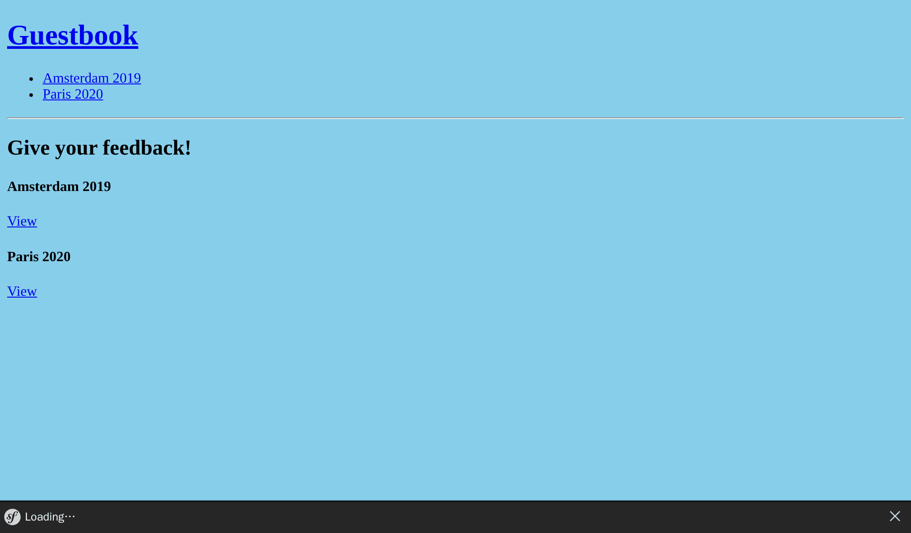

Mit Events arbeiten
===================

Dem aktuellen Layout fehlt eine Navigation, um zur Homepage zurückzukehren oder von einer Konferenz zur nächsten zu wechseln.

Einen Website-Header hinzufügen
--------------------------------

.. index::
    single: Twig;for
    single: Twig;path

Alles, was auf allen Webseiten angezeigt werden soll, wie z. B. ein Header, sollte Teil des Haupt-Basislayouts sein:

.. code-block:: diff
    :caption: patch_file

    --- i/templates/base.html.twig
    +++ w/templates/base.html.twig
    @@ -12,6 +12,15 @@
             
         </head>
         <body>
    +        <header>
    +            <h1><a href="{{ path('homepage') }}">Guestbook</a></h1>
    +            <ul>
    +            
    +                <li><a href="{{ path('conference', { id: conference.id }) }}">{{ conference }}</a></li>
    +            
    +            </ul>
    +            

    +        </header>
             
         </body>
     </html>

Das Hinzufügen dieses Codes zum Layout bedeutet, dass alle Templates, die es erweitern, eine ``conferences``-Variable definieren müssen, die von ihren Controllern erstellt und übergeben werden muss.

Da wir nur zwei Controller haben, "könntest" Du Folgendes tun (ändere das jetzt nicht in deinem Code - wir werden schon bald eine bessere Art und Weise lernen):

.. code-block:: diff
    :class: ignore

    --- i/src/Controller/ConferenceController.php
    +++ w/src/Controller/ConferenceController.php
    @@ -21,12 +21,13 @@ final class ConferenceController extends AbstractController
         }

         #[Route('/conference/{id}', name: 'conference')]
    -    public function show(#[MapEntity] Conference $conference, CommentRepository $commentRepository, #[MapQueryParameter] int $offset = 0): Response
    +    public function show(#[MapEntity] Conference $conference, CommentRepository $commentRepository, ConferenceRepository $conferenceRepository, #[MapQueryParameter] int $offset = 0): Response
         {
             $offset = max(0, $offset);
             $paginator = $commentRepository->getCommentPaginator($conference, $offset);

             return $this->render('conference/show.html.twig', [
    +            'conferences' => $conferenceRepository->findAll(),
                 'conference' => $conference,
                 'comments' => $paginator,
                 'previous' => $offset - CommentRepository::COMMENTS_PER_PAGE,

Stelle Dir vor, Du müsstest Dutzende von Controllern aktualisieren. Und das Gleiche bei allen neuen Controllern tun. Das ist nicht besonders praktisch. Es muss einen besseren Weg geben.

Twig bietet die Möglichkeit globale Variablen zu definieren. Eine *globale Variable* ist in allen gerenderten Vorlagen verfügbar. Du kannst sie in einer Konfigurationsdatei definieren, aber das funktioniert nur bei statischen Werten. Um alle Konferenzen als globale Variable zu Twig hinzuzufügen, werden wir einen Listener erstellen.

Symfony Events entdecken
------------------------

.. index::
    single: Components;Event Dispatcher
    single: Event

Symfony ist mit einer Event Dispatcher Komponente ausgestattet. Ein Dispatcher *verteilt* bestimmte *Events* zu bestimmten Zeiten, die ein *Listener* abonnieren kann. Listener sind Hooks im Inneren des Frameworks.

Einige Events erlauben es Dir beispielsweise, mit dem Lifecycle von HTTP-Requests zu interagieren. Während der Bearbeitung eines Requests sendet der Dispatcher Events, sobald ein Request erstellt wurde, ein Controller aufgerufen werden soll, eine Response zum Senden bereit ist oder eine Exception geworfen wurde. Ein *Listener* kann auf ein oder mehrere Events reagieren und Logik basierend auf dem Eventkontext ausführen.

Events sind klar definierte Erweiterungspunkte, die das Framework generischer und erweiterbarer machen. Viele Symfony-Komponenten wie Security, Messenger, Workflow oder Mailer verwenden sie häufig.

Ein weiteres eingebautes Beispiel für Events und Listener ist der Lifecycle eines Befehls: Du kannst einen Listener erstellen, um Code vor *jedem* Befehl auszuführen.

Jedes Paket oder Bundle kann auch eigene Events auslösen, um seinen Code erweiterbar zu machen.

Damit du nicht alle Events und Listener in einer Konfigurationsdatei beschreiben musst, kannst du das ``#[AsEventListener]``-Attribut an der Klasse oder Methode des Listeners hinzufügen. Dadurch können Listener automatisch im Symfony Dispatcher registriert werden.

Einen Listener implementieren
-----------------------------

.. index::
    single: Event;Listener
    single: Listener
    single: Command;make:listener

Du kennst das Lied bestimmt schon auswendig, verwende das Maker-Bundle, um einen Listener zu generieren:

.. code-block:: terminal
    :class: answers(Symfony\\Component\\HttpKernel\\Event\\ControllerEvent)

    $ symfony console make:listener TwigEventListener

Der Befehl fragt Dich, über welches Event Du informiert werden möchtest. Wähle das ``Symfony\Component\HttpKernel\Event\ControllerEvent``-Event, welches kurz vor dem Aufruf eines Controllers ausgelöst wird. Dies ist der beste Zeitpunkt, die globale ``conferences``-Variable einzuspeisen, damit Twig Zugriff darauf hat, wenn der Controller das Template rendert. Passe Deinen Listener wie folgt an:

.. code-block:: diff
    :caption: patch_file

    --- i/src/EventListener/TwigEventListener.php
    +++ w/src/EventListener/TwigEventListener.php
    @@ -2,14 +2,22 @@

     namespace App\EventListener;

    +use App\Repository\ConferenceRepository;
     use Symfony\Component\EventDispatcher\Attribute\AsEventListener;
     use Symfony\Component\HttpKernel\Event\ControllerEvent;
    +use Twig\Environment;

     final class TwigEventListener
     {
    +    public function __construct(
    +        private Environment $twig,
    +        private ConferenceRepository $conferenceRepository,
    +    ) {
    +    }
    +
         #[AsEventListener]
         public function onControllerEvent(ControllerEvent $event): void
         {
    -        // ...
    +        $this->twig->addGlobal('conferences', $this->conferenceRepository->findAll());
         }
     }

Jetzt kannst Du beliebig viele Controller hinzufügen: Die ``conferences``-Variable wird in Twig immer verfügbar sein.

.. note::

    Wir werden in einem späteren Schritt über eine viel bessere Alternative in Bezug auf Performance sprechen.

Konferenzen nach Jahr und Stadt sortieren
-----------------------------------------

Eine nach Jahren sortierte Konferenzliste kann das Durchsuchen erleichtern. Wir könnten eine spezifische Methode erstellen, um alle Konferenzen abzurufen und zu sortieren, stattdessen werden wir jedoch die Standardimplementierung der ``findAll()``-Methode überschreiben. Auf diese Weise stellen wir sicher, dass die Sortierung überall angewendet wird:

.. code-block:: diff
    :caption: patch_file

    --- i/src/Repository/ConferenceRepository.php
    +++ w/src/Repository/ConferenceRepository.php
    @@ -16,6 +16,11 @@ class ConferenceRepository extends ServiceEntityRepository
             parent::__construct($registry, Conference::class);
         }

    +    public function findAll(): array
    +    {
    +        return $this->findBy([], ['year' => 'ASC', 'city' => 'ASC']);
    +    }
    +
         //    /**
         //     * @return Conference[] Returns an array of Conference objects
         //     */

Nach diesem Schritt sollte die Seite wie folgt aussehen:

.. sidebar:: Weiterführendes

    * Der `Request-Response Ablauf`_ in Symfony-Anwendungen;

    * Die `eingebauten Symfony HTTP-Events`_;

    * Die `eingebauten Events der Symfony Console`_.

.. _`Request-Response Ablauf`: https://symfony.com/doc/current/components/http_kernel.html#the-workflow-of-a-request
.. _`eingebauten Symfony HTTP-Events`: https://symfony.com/doc/current/reference/events.html
.. _`eingebauten Events der Symfony Console`: https://symfony.com/doc/current/components/console/events.html
