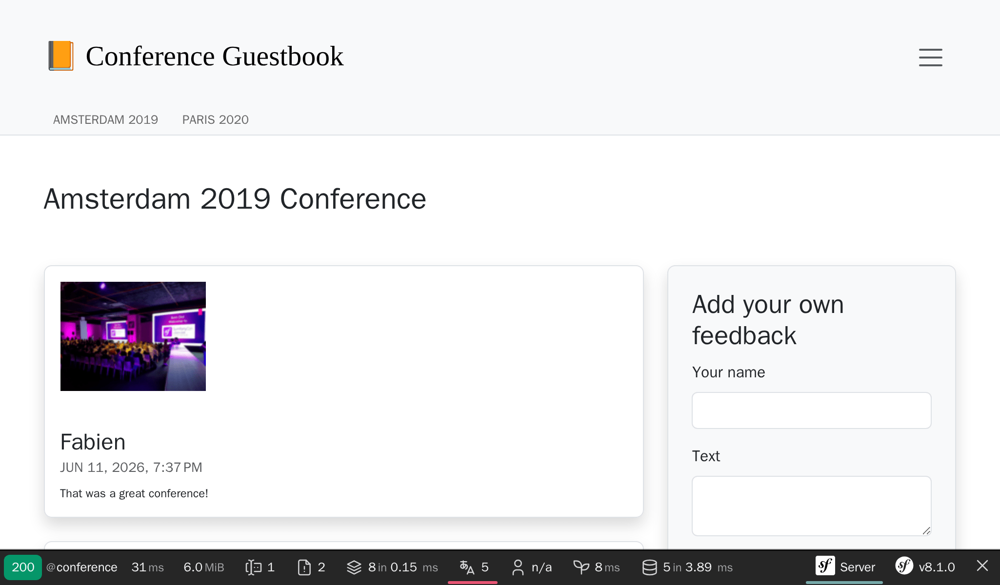

Die Benutzeroberfläche stylen
=============================

.. index::
    single: AssetMapper
    single: Components;AssetMapper
    single: Stylesheet

Wir haben bisher keine Zeit in das Design der Benutzeroberfläche investiert. Um wie ein Profi zu stylen, verwenden wir einen modernen Stack auf Basis von *AssetMapper*, der Symfony-Komponente, die unsere Assets seit dem allerersten Schritt dieses Buches verwaltet.

AssetMapper setzt auf moderne Webstandards: JavaScript- und CSS-Dateien werden unverändert ausgeliefert und über eine *Importmap* miteinander verbunden, sodass der Browser native *ES-Module* direkt laden kann. Kein Bundler, kein Build-Schritt, kein Node.js.

Wirf einen Blick auf die Datei ``importmap.php`` im Projektverzeichnis: Sie beschreibt die JavaScript-Pakete, die von der Anwendung verwendet werden. Die in ``templates/base.html.twig`` aufgerufene Twig-Funktion ``importmap()`` stellt sie dem Browser bereit.

Bootstrap nutzen
----------------

.. index::
    single: Bootstrap

Um mit guten Standardwerten zu starten und eine responsive Website zu bauen, kann ein CSS-Framework wie `Bootstrap`_ viel Arbeit abnehmen. Installiere es als Importmap-Paket:

.. code-block:: terminal

    $ symfony console importmap:require bootstrap bootstrap/dist/css/bootstrap.min.css

Der Befehl registriert das Paket in ``importmap.php`` und lädt es (samt seiner ``@popperjs/core``-Abhängigkeit) nach ``assets/vendor/`` herunter; die Anwendung hängt zur Laufzeit von keinem CDN ab.

Importiere Bootstrap im JavaScript-Haupteinstiegspunkt (wir haben dabei auch die Standard-Willkommensnachricht entfernt):

.. code-block:: diff
    :caption: patch_file

    --- i/assets/app.js
    +++ w/assets/app.js
    @@ -5,6 +5,6 @@ import './stimulus_bootstrap.js';
      * This file will be included onto the page via the importmap() Twig function,
      * which should already be in your base.html.twig.
      */
    +import 'bootstrap';
    +import 'bootstrap/dist/css/bootstrap.min.css';
     import './styles/app.css';
    -
    -console.log('This log comes from assets/app.js - welcome to AssetMapper! 🎉');

Beachte, dass ``app.css`` *nach* den Bootstrap-Styles importiert wird, damit unsere Anpassungen Vorrang haben.

Das Symfony-Formularsystem unterstützt Bootstrap nativ mit einem speziellen Theme, aktiviere es:

.. code-block:: yaml
    :caption: config/packages/twig.yaml

    twig:
        form_themes: ['bootstrap_5_layout.html.twig']

Das HTML stylen
---------------

Wir sind nun bereit, die Anwendung zu gestalten. Lade das Archiv herunter und entpacke es im Projektverzeichnis:

.. code-block:: terminal

    $ php -r "copy('https://symfony.com/uploads/assets/guestbook-8.1.zip', 'guestbook-8.1.zip');"
    $ unzip -o guestbook-8.1.zip
    $ rm guestbook-8.1.zip

Wirf einen Blick auf die Templates, vielleicht lernst Du den einen oder anderen Twig-Trick.

Die Assets ausliefern
---------------------

.. index::
    single: AssetMapper;asset-map:compile

Es gibt nichts zu builden: Lade eine Seite neu und die Änderungen sind live. In der Entwicklung liefert AssetMapper die Asset-Dateien direkt aus.

Nimm Dir die Zeit, die visuellen Veränderungen zu erkunden. Wirf einen Blick auf das neue Design im Browser.

.. figure:: screenshots/design-homepage.png
    :alt: /
    :align: center
    :figclass: with-browser

Das generierte Anmeldeformular ist sieht jetzt gut aus, weil das Maker-Bundle standardmäßig Bootstrap-CSS-Klassen verwendet:

.. figure:: screenshots/login-styled.png
    :alt: /login
    :align: center
    :figclass: with-browser

In der Produktion führt Upsun während der Build-Phase automatisch den Befehl ``asset-map:compile`` aus: Alle Assets werden mit einem Versions-Hash im Dateinamen nach ``public/assets/`` kopiert, was sicheres, langfristiges HTTP-Caching ermöglicht.

.. sidebar:: Weiterführendes

    * Die `AssetMapper-Komponenten-Dokumentation`_;

    * Die `Importmap-Spezifikation`_;

    * Die `Bootstrap-Dokumentation`_.

.. _`Bootstrap`: https://getbootstrap.com/
.. _`AssetMapper-Komponenten-Dokumentation`: https://symfony.com/doc/current/frontend/asset_mapper.html
.. _`Importmap-Spezifikation`: https://html.spec.whatwg.org/multipage/webappapis.html#import-maps
.. _`Bootstrap-Dokumentation`: https://getbootstrap.com/docs/
