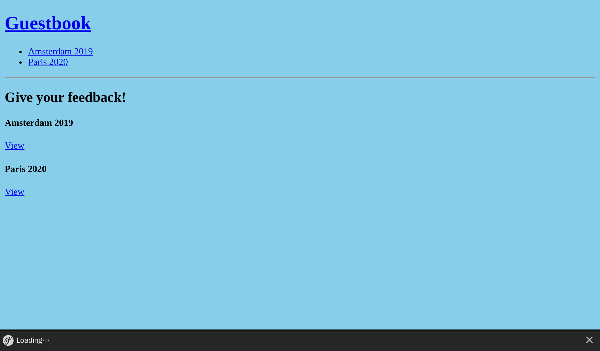

Listening to Events
===================

The current layout is missing a navigation header to go back to the homepage or switch from one conference to the next.

Adding a Website Header
-----------------------

.. index::
    single: Twig;for
    single: Twig;path

Anything that should be displayed on all web pages, like a header, should be part of the main base layout:

.. code-block:: diff
    :caption: patch_file

    --- i/templates/base.html.twig
    +++ w/templates/base.html.twig
    @@ -12,6 +12,15 @@
             
         </head>
         <body>
    +        <header>
    +            <h1><a href="{{ path('homepage') }}">Guestbook</a></h1>
    +            <ul>
    +            
    +                <li><a href="{{ path('conference', { id: conference.id }) }}">{{ conference }}</a></li>
    +            
    +            </ul>
    +            

    +        </header>
             
         </body>
     </html>

Adding this code to the layout means that all templates extending it must define a ``conferences`` variable, which must be created and passed from their controllers.

As we only have two controllers, you *might* do the following (do not apply the change to your code as we will learn a better way very soon):

.. code-block:: diff
    :class: ignore

    --- i/src/Controller/ConferenceController.php
    +++ w/src/Controller/ConferenceController.php
    @@ -21,11 +21,12 @@ final class ConferenceController extends AbstractController
         }

         #[Route('/conference/{id}', name: 'conference')]
    -    public function show(#[MapEntity] Conference $conference, CommentRepository $commentRepository, #[MapQueryParameter(options: ['min_range' => 0])] int $offset = 0): Response
    +    public function show(#[MapEntity] Conference $conference, CommentRepository $commentRepository, ConferenceRepository $conferenceRepository, #[MapQueryParameter(options: ['min_range' => 0])] int $offset = 0): Response
         {
             $paginator = $commentRepository->getCommentPaginator($conference, $offset);

             return $this->render('conference/show.html.twig', [
    +            'conferences' => $conferenceRepository->findAll(),
                 'conference' => $conference,
                 'comments' => $paginator,
                 'previous' => $offset - CommentRepository::COMMENTS_PER_PAGE,

Imagine having to update dozens of controllers. And doing the same on all new ones. This is not very practical. There must be a better way.

Twig has the notion of global variables. A *global variable* is available in all rendered templates. You can define them in a configuration file, but it only works for static values. To add all conferences as a Twig global variable, we are going to create a listener.

Discovering Symfony Events
--------------------------

.. index::
    single: Components;Event Dispatcher
    single: Event

Symfony comes built-in with an Event Dispatcher Component. A dispatcher *dispatches* certain *events* at specific times that *listeners* can listen to. Listeners are hooks into the framework internals.

For instance, some events allow you to interact with the lifecycle of HTTP requests. During the handling of a request, the dispatcher dispatches events when a request has been created, when a controller is about to be executed, when a response is ready to be sent, or when an exception has been thrown. A *listener* can listen to one or more events and execute some logic based on the event context.

Events are well-defined extension points that make the framework more generic and extensible. Many Symfony Components like Security, Messenger, Workflow, or Mailer use them extensively.

Another built-in example of events and listeners in action is the lifecycle of a command: you can create a listener to execute code before *any* command is run.

Any package or bundle can also dispatch their own events to make their code extensible.

To avoid having a configuration file that describes which events a listener wants to listen to, add the ``#[AsEventListener]`` attribute on the listener class or method. This allows listeners to be registered in the Symfony dispatcher automatically.

Implementing a Listener
-----------------------

.. index::
    single: Event;Listener
    single: Listener
    single: Command;make:listener

You know the song by heart now, use the maker bundle to generate a listener:

.. code-block:: terminal
    :class: answers(Symfony\\Component\\HttpKernel\\Event\\ControllerEvent)

    $ symfony console make:listener TwigEventListener

The command asks you about which event you want to listen to. Choose the ``Symfony\Component\HttpKernel\Event\ControllerEvent`` event, which is dispatched just before the controller is called. It is the best time to inject the ``conferences`` global variable so that Twig will have access to it when the controller renders the template. Update your listener as follows:

.. code-block:: diff
    :caption: patch_file

    --- i/src/EventListener/TwigEventListener.php
    +++ w/src/EventListener/TwigEventListener.php
    @@ -2,14 +2,22 @@

     namespace App\EventListener;

    +use App\Repository\ConferenceRepository;
     use Symfony\Component\EventDispatcher\Attribute\AsEventListener;
     use Symfony\Component\HttpKernel\Event\ControllerEvent;
    +use Twig\Environment;

     final class TwigEventListener
     {
    +    public function __construct(
    +        private Environment $twig,
    +        private ConferenceRepository $conferenceRepository,
    +    ) {
    +    }
    +
         #[AsEventListener]
         public function onControllerEvent(ControllerEvent $event): void
         {
    -        // ...
    +        $this->twig->addGlobal('conferences', $this->conferenceRepository->findAll());
         }
     }

Now, you can add as many controllers as you want: the ``conferences`` variable will always be available in Twig.

.. note::

    We will talk about a much better alternative performance-wise in a later step.

Sorting Conferences by Year and City
------------------------------------

Ordering the conference list by year may facilitate browsing. We could create a custom method to retrieve and sort all conferences, but instead, we are going to override the default implementation of the ``findAll()`` method to be sure that sorting applies everywhere:

.. code-block:: diff
    :caption: patch_file

    --- i/src/Repository/ConferenceRepository.php
    +++ w/src/Repository/ConferenceRepository.php
    @@ -16,6 +16,11 @@ class ConferenceRepository extends ServiceEntityRepository
             parent::__construct($registry, Conference::class);
         }

    +    public function findAll(): array
    +    {
    +        return $this->findBy([], ['year' => 'ASC', 'city' => 'ASC']);
    +    }
    +
         //    /**
         //     * @return Conference[] Returns an array of Conference objects
         //     */

At the end of this step, the website should look like the following:

.. sidebar:: Going Further

    * The `Request-Response Flow`_ in Symfony applications;

    * The `built-in Symfony HTTP events`_;

    * The `built-in Symfony Console events`_.

.. _`Request-Response Flow`: https://symfony.com/doc/current/components/http_kernel.html#the-workflow-of-a-request
.. _`built-in Symfony HTTP events`: https://symfony.com/doc/current/reference/events.html
.. _`built-in Symfony Console events`: https://symfony.com/doc/current/components/console/events.html
