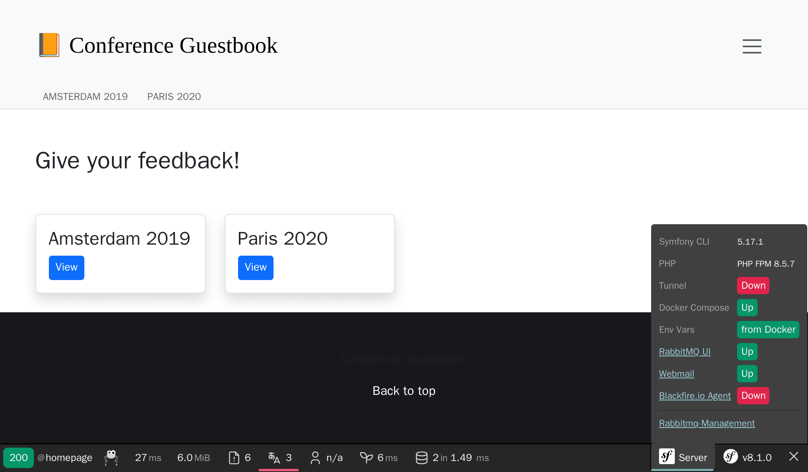
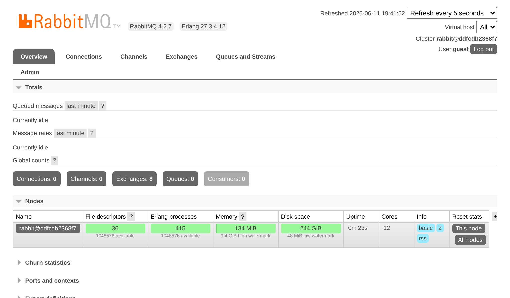

Using RabbitMQ as a Message Broker
==================================

.. index::
    single: RabbitMQ

RabbitMQ is a very popular message broker that you can use as an alternative to PostgreSQL.

Switching from PostgreSQL to RabbitMQ
-------------------------------------

To use RabbitMQ instead of PostgreSQL as a message broker:

.. code-block:: diff
    :caption: patch_file

    --- i/config/packages/messenger.yaml
    +++ w/config/packages/messenger.yaml
    @@ -5,7 +5,7 @@ framework:
             transports:
                 # https://symfony.com/doc/current/messenger.html#transport-configuration
                 async:
    -                dsn: '%env(MESSENGER_TRANSPORT_DSN)%'
    +                dsn: '%env(RABBITMQ_URL)%'
                     retry_strategy:
                         max_retries: 3
                         multiplier: 2

We also need to add RabbitMQ support for Messenger:

.. code-block:: terminal

    $ symfony composer req amqp-messenger

Adding RabbitMQ to the Docker Stack
-----------------------------------

.. index::
    single: Docker;RabbitMQ

As you might have guessed, we also need to add RabbitMQ to the Docker Compose stack:

.. code-block:: diff
    :caption: patch_file

    --- i/compose.yaml
    +++ w/compose.yaml
    @@ -18,6 +18,10 @@ services:
         image: redis:8.0-alpine
         ports: [6379]

    +  rabbitmq:
    +    image: rabbitmq:4.2-management
    +    ports: [5672, 15672]
    +
     volumes:
     ###> doctrine/doctrine-bundle ###
       database_data:

Restarting Docker Services
--------------------------

To force Docker Compose to take the RabbitMQ container into account, stop the containers and restart them:

.. code-block:: terminal

    $ docker compose stop
    $ docker compose up -d --remove-orphans

.. code-block:: terminal
    :class: hide

    $ sleep 10

Exploring the RabbitMQ Web Management Interface
-----------------------------------------------

.. index::
    single: Symfony CLI;open:local:rabbitmq

If you want to see queues and messages flowing through RabbitMQ, open its web management interface:

.. code-block:: terminal
    :class: ignore

    $ symfony open:local:rabbitmq

Or from the web debug toolbar:

Use ``guest``/``guest`` to login to the RabbitMQ management UI:

Deploying RabbitMQ
------------------

.. index::
    single: Upsun;RabbitMQ
    single: RabbitMQ

Adding RabbitMQ to the production servers can be done by adding it to the list of services:

.. code-block:: diff
    :caption: patch_file

    --- i/.upsun/config.yaml
    +++ w/.upsun/config.yaml
    @@ -25,4 +25,8 @@ services:
             rediscache:
                 type: redis:8.0

    +    queue:
    +        type: rabbitmq:4.2
    +        size: S
    +
     applications:

Reference it in the web container configuration as well and enable the ``amqp`` PHP extension:

.. code-block:: diff
    :caption: patch_file

    --- i/.upsun/config.yaml
    +++ w/.upsun/config.yaml
    @@ -39,6 +39,7 @@ applications:

             runtime:
                 extensions:
    +                - amqp
                     - apcu
                     - blackfire
                     - ctype
    @@ -72,5 +73,6 @@ applications:
             relationships:
                 database: "database:postgresql"
                 redis: "rediscache:redis"
    +            rabbitmq: "queue:rabbitmq"

             hooks:
                 build: |

.. index::
    single: Upsun;Tunnel
    single: Symfony CLI;cloud:tunnel:open
    single: Symfony CLI;cloud:tunnel:close
    single: Symfony CLI;open:remote:rabbitmq

When the RabbitMQ service is installed on a project, you can access its web management interface by opening the tunnel first:

.. code-block:: terminal
    :class: ignore

    $ symfony cloud:tunnel:open
    $ symfony open:remote:rabbitmq

    # when done
    $ symfony cloud:tunnel:close

.. sidebar:: Going Further

    * `RabbitMQ docs`_.

.. _`RabbitMQ docs`: https://www.rabbitmq.com/documentation.html
