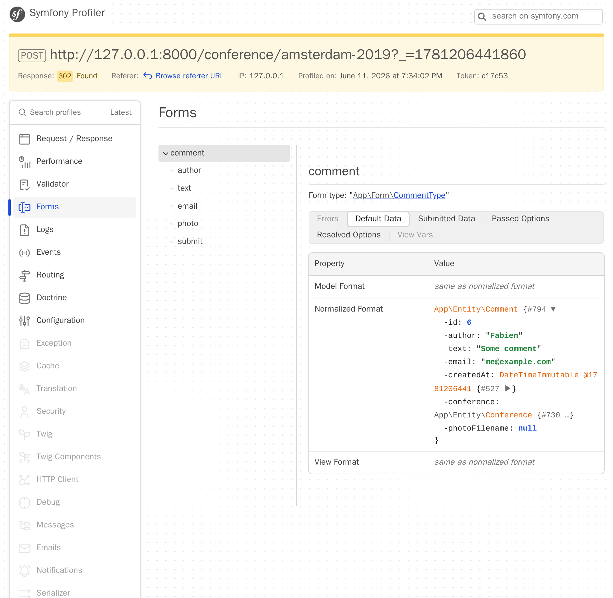

Obteniendo realimentación con formularios
==========================================

.. index::
    single: Components;Form
    single: Form

Es hora de dejar que nuestros asistentes den su opinión sobre las conferencias. Ellos contribuirán con sus comentarios a través de un *formulario HTML* .

Generando una clase de tipo de formulario (*Form Type*)
-------------------------------------------------------

.. index::
    single: Command;make:form

Utiliza el bundle Maker para generar una clase de formulario:

.. code-block:: terminal

    $ symfony console make:form CommentType Comment

.. code-block:: text
    :class: ignore
    :emphasize-lines: 1

     created: src/Form/CommentType.php

      Success!

     Next: Add fields to your form and start using it.
     Find the documentation at https://symfony.com/doc/current/forms.html

La clase ``App\Form\CommentType`` define un formulario para la entidad ``App\Entity\Comment``:

.. code-block:: php
    :caption: src/Form/CommentType.php
    :class: ignore

    namespace App\Form;

    use App\Entity\Comment;
    use Symfony\Component\Form\AbstractType;
    use Symfony\Component\Form\FormBuilderInterface;
    use Symfony\Component\OptionsResolver\OptionsResolver;

    class CommentType extends AbstractType
    {
        public function buildForm(FormBuilderInterface $builder, array $options): void
        {
            $builder
                ->add('author')
                ->add('text')
                ->add('email')
                ->add('createdAt')
                ->add('photoFilename')
                ->add('conference')
            ;
        }

        public function configureOptions(OptionsResolver $resolver): void
        {
            $resolver->setDefaults([
                'data_class' => Comment::class,
            ]);
        }
    }

Un `tipo de formulario`_ describe los *campos de formulario* vinculados a un modelo. Realiza la conversión de datos entre los datos enviados y las propiedades de la clase de modelo. Por defecto, Symfony utiliza metadatos de la entidad ``Comment`` - como los metadatos de Doctrine - para intuir la configuración de cada campo. Por ejemplo, el campo ``text`` se muestra como un ``textarea`` porque utiliza una columna más grande en la base de datos.

Visualizando un formulario
--------------------------

Para mostrar el formulario al usuario, crea el formulario en el controlador y pásalo a la plantilla:

.. code-block:: diff
    :caption: patch_file
    :emphasize-lines: 19,29

    --- i/src/Controller/ConferenceController.php
    +++ w/src/Controller/ConferenceController.php
    @@ -2,7 +2,9 @@

     namespace App\Controller;

    +use App\Entity\Comment;
     use App\Entity\Conference;
    +use App\Form\CommentType;
     use App\Repository\CommentRepository;
     use App\Repository\ConferenceRepository;
     use Symfony\Bundle\FrameworkBundle\Controller\AbstractController;
    @@ -23,5 +25,8 @@ final class ConferenceController extends AbstractController
         #[Route('/conference/{slug:conference}', name: 'conference')]
         public function show(Conference $conference, CommentRepository $commentRepository, #[MapQueryParameter(options: ['min_range' => 0])] int $offset = 0): Response
         {
    +        $comment = new Comment();
    +        $form = $this->createForm(CommentType::class, $comment);
    +
             $paginator = $commentRepository->getCommentPaginator($conference, $offset);

    @@ -30,6 +35,7 @@ final class ConferenceController extends AbstractController
                 'comments' => $paginator,
                 'previous' => $offset - CommentRepository::COMMENTS_PER_PAGE,
                 'next' => min(count($paginator), $offset + CommentRepository::COMMENTS_PER_PAGE),
    +            'comment_form' => $form,
             ]);
         }
     }

Nunca debes instanciar el tipo de formulario directamente. En su lugar, utiliza el método ``createForm()``. Este método es parte de ``AbstractController`` y facilita la creación de formularios.

.. index::
    single: Twig;form

La visualización del formulario en la plantilla se puede realizar a través de la función ``form`` de Twig:

.. code-block:: diff
    :caption: patch_file
    :emphasize-lines: 10

    --- i/templates/conference/show.html.twig
    +++ w/templates/conference/show.html.twig
    @@ -30,4 +30,8 @@
         
             
No comments have been posted yet for this conference.

         
    +
    +    <h2>Add your own feedback</h2>
    +
    +    {{ form(comment_form) }}
     

Al actualizar una página de conferencia en el navegador, ten en cuenta que cada campo del formulario muestra el widget HTML correcto (el tipo de datos se deriva del modelo):

.. figure:: screenshots/form.png
    :alt: /conference/amsterdam-2019
    :align: center
    :figclass: with-browser

La función ``form()`` genera el formulario HTML a partir de toda la información definida en el tipo de formulario. También agrega ``enctype=multipart/form-data`` en el ``<form>`` como lo requiere el campo de entrada de carga de archivos. Además, se encarga de mostrar mensajes de error cuando el envío tiene algunos errores. Todo se puede personalizar sobreescribiendo las plantillas predeterminadas, pero no lo necesitaremos para este proyecto.

Personalizando una clase de tipo de formulario
----------------------------------------------

Aunque los campos del formulario se configuran en función de su correspondiente propiedad en el modelo, es posible personalizar directamente la configuración por defecto en la clase de tipo de formulario:

.. code-block:: diff
    :caption: patch_file

    --- i/src/Form/CommentType.php
    +++ w/src/Form/CommentType.php
    @@ -6,26 +6,32 @@ use App\Entity\Comment;
     use App\Entity\Conference;
     use Symfony\Bridge\Doctrine\Form\Type\EntityType;
     use Symfony\Component\Form\AbstractType;
    +use Symfony\Component\Form\Extension\Core\Type\EmailType;
    +use Symfony\Component\Form\Extension\Core\Type\FileType;
    +use Symfony\Component\Form\Extension\Core\Type\SubmitType;
     use Symfony\Component\Form\FormBuilderInterface;
     use Symfony\Component\OptionsResolver\OptionsResolver;
    +use Symfony\Component\Validator\Constraints\Image;

     class CommentType extends AbstractType
     {
         public function buildForm(FormBuilderInterface $builder, array $options): void
         {
             $builder
    -            ->add('author')
    +            ->add('author', null, [
    +                'label' => 'Your name',
    +            ])
                 ->add('text')
    -            ->add('email')
    -            ->add('createdAt', null, [
    -                'widget' => 'single_text',
    +            ->add('email', EmailType::class)
    +            ->add('photo', FileType::class, [
    +                'required' => false,
    +                'mapped' => false,
    +                'constraints' => [
    +                    new Image(maxSize: '1024k')
    +                ],
                 ])
    -            ->add('photoFilename')
    -            ->add('conference', EntityType::class, [
    -                'class' => Conference::class,
    -                'choice_label' => 'id',
    -            ])
    -        ;
    +            ->add('submit', SubmitType::class)
    +       ;
         }

         public function configureOptions(OptionsResolver $resolver): void

Ten en cuenta que hemos añadido un botón de enviar (eso nos permite seguir usando la expresión simple ``{{ form(comment_form) }}`` en la plantilla).

Algunos campos no pueden ser configurados automáticamente, como es el caso de ``photoFilename``. La entidad ``Comment`` sólo necesita guardar el nombre del archivo de la foto, pero el formulario tiene que ocuparse de la carga del archivo en sí. Para gestionar este caso, hemos añadido un campo llamado ``photo`` que no está "mapeado" (un-``mapped``): no será asociado a ninguna propiedad en ``Comment``. Lo procesaremos manualmente para implementar alguna lógica específica (como almacenar la foto enviada en el disco).

Como ejemplo de personalización, también hemos modificado la etiqueta por defecto para algunos campos.

.. figure:: screenshots/form-customized.png
    :alt: /conference/amsterdam-2019
    :align: center
    :figclass: with-browser

Validación de modelos
----------------------

El tipo de formulario configura cómo se muestra en el navegador (a través de alguna validación HTML5). Aquí está el formulario HTML generado:

.. code-block:: html
    :class: ignore

    <form name="comment_form" method="post" enctype="multipart/form-data">
        

            

                <label for="comment_form_author" class="required">Your name</label>
                <input type="text" id="comment_form_author" name="comment_form[author]" required="required" maxlength="255" />
            

            

                <label for="comment_form_text" class="required">Text</label>
                <textarea id="comment_form_text" name="comment_form[text]" required="required"></textarea>
            

            

                <label for="comment_form_email" class="required">Email</label>
                <input type="email" id="comment_form_email" name="comment_form[email]" required="required" />
            

            

                <label for="comment_form_photo">Photo</label>
                <input type="file" id="comment_form_photo" name="comment_form[photo]" />
            

            

                <button type="submit" id="comment_form_submit" name="comment_form[submit]">Submit</button>
            

            <input type="hidden" id="comment_form__token" name="comment_form[_token]" value="DwqsEanxc48jofxsqbGBVLQBqlVJ_Tg4u9-BL1Hjgac" />
        

    </form>

El formulario utiliza el campo ``email`` para el correo electrónico del comentario y marca la mayoría de los campos como ``required`` –obligatorios–. Ten en cuenta que el formulario también contiene un campo oculto: ``_token``, para protegerlo de `ataques CSRF`_.

Pero si el envío del formulario pasa por alto la validación HTML (utilizando un cliente HTTP que no aplica estas reglas de validación como cURL), los datos no válidos pueden llegar al servidor.

También tenemos que añadir algunas restricciones de validación en el modelo de datos de ``Comment``:

.. code-block:: diff
    :caption: patch_file

    --- i/src/Entity/Comment.php
    +++ w/src/Entity/Comment.php
    @@ -5,6 +5,7 @@ namespace App\Entity;
     use App\Repository\CommentRepository;
     use Doctrine\DBAL\Types\Types;
     use Doctrine\ORM\Mapping as ORM;
    +use Symfony\Component\Validator\Constraints as Assert;

     #[ORM\Entity(repositoryClass: CommentRepository::class)]
     #[ORM\HasLifecycleCallbacks]
    @@ -16,12 +17,16 @@ class Comment
         private ?int $id = null;

         #[ORM\Column(length: 255)]
    +    #[Assert\NotBlank]
         private ?string $author = null;

         #[ORM\Column(type: Types::TEXT)]
    +    #[Assert\NotBlank]
         private ?string $text = null;

         #[ORM\Column(length: 255)]
    +    #[Assert\NotBlank]
    +    #[Assert\Email]
         private ?string $email = null;

         #[ORM\Column]

Manejando un formulario
-----------------------

El código que hemos escrito hasta ahora es suficiente para mostrar el formulario.

Ahora debemos ocuparnos del envío del formulario y de la persistencia de su contenido en la base de datos desde el controlador:

.. code-block:: diff
    :caption: patch_file

    --- i/src/Controller/ConferenceController.php
    +++ w/src/Controller/ConferenceController.php
    @@ -7,7 +7,9 @@ use App\Entity\Conference;
     use App\Form\CommentType;
     use App\Repository\CommentRepository;
     use App\Repository\ConferenceRepository;
    +use Doctrine\ORM\EntityManagerInterface;
     use Symfony\Bundle\FrameworkBundle\Controller\AbstractController;
    +use Symfony\Component\HttpFoundation\Request;
     use Symfony\Component\HttpFoundation\Response;
     use Symfony\Component\HttpKernel\Attribute\MapQueryParameter;
     use Symfony\Component\Routing\Attribute\Route;
    @@ -14,6 +15,11 @@ use Symfony\Component\Routing\Attribute\Route;

     final class ConferenceController extends AbstractController
     {
    +    public function __construct(
    +        private EntityManagerInterface $entityManager,
    +    ) {
    +    }
    +
         #[Route('/', name: 'homepage')]
         public function index(ConferenceRepository $conferenceRepository): Response
         {
    @@ -24,9 +30,18 @@ final class ConferenceController extends AbstractController
         }

         #[Route('/conference/{slug:conference}', name: 'conference')]
    -    public function show(Conference $conference, CommentRepository $commentRepository, #[MapQueryParameter(options: ['min_range' => 0])] int $offset = 0): Response
    +    public function show(Request $request, Conference $conference, CommentRepository $commentRepository, #[MapQueryParameter(options: ['min_range' => 0])] int $offset = 0): Response
         {
             $comment = new Comment();
             $form = $this->createForm(CommentType::class, $comment);
    +        $form->handleRequest($request);
    +        if ($form->isSubmitted() && $form->isValid()) {
    +            $comment->setConference($conference);
    +
    +            $this->entityManager->persist($comment);
    +            $this->entityManager->flush();
    +
    +            return $this->redirectToRoute('conference', ['slug' => $conference->getSlug()]);
    +        }

             $paginator = $commentRepository->getCommentPaginator($conference, $offset);

Ten en cuenta que el objeto ``Request`` se inyecta ahora en el controlador, ya que el formulario lo necesita para inspeccionar los datos enviados a través de ``handleRequest()``.

Cuando se envía el formulario, el objeto ``Comment`` se actualiza con los datos que contiene.

Se obliga a que la conferencia sea la misma que la pasada por la URL (la hemos eliminado del formulario).

Si el formulario no es válido, se muestra la página, pero ahora el formulario contendrá los valores enviados y los correspondientes mensajes de error para que el usuario pueda verlos de nuevo.

Prueba el formulario. Debería funcionar correctamente y los datos deberían actualizarse en la base de datos (compruébalo en el panel de administración). Sin embargo, hay un problema: las fotos. No funcionan ya que no las hemos procesado todavía en el controlador.

Subiendo archivos
-----------------

Las fotos subidas deben ser almacenadas en el disco local, en un lugar accesible por el frontend (navegador) para que podamos mostrarlas en la página de la conferencia. Las guardaremos en el directorio ``public/uploads/photos``.

.. index::
    single: Attribute;Autowire
    single: Autowire

Como no queremos codificar la ruta del directorio en el código, necesitamos una forma de almacenarla globalmente en la configuración. El Container de Symfony es capaz de almacenar *parámetros* además de servicios, que son valores escalares que ayudan a configurar los servicios:

.. code-block:: diff
    :caption: patch_file

    --- i/config/services.yaml
    +++ w/config/services.yaml
    @@ -4,6 +4,7 @@
     # Put parameters here that don't need to change on each machine where the app is deployed
     # https://symfony.com/doc/current/best_practices.html#use-parameters-for-application-configuration
     parameters:
    +    photo_dir: "%kernel.project_dir%/public/uploads/photos"

     services:
         # default configuration for services in *this* file

Ya hemos visto cómo los servicios se inyectan automáticamente en los argumentos del constructor. Para los parámetros del contenedor, podemos inyectarlos explícitamente a través del atributo ``Autowire``.

Ahora, tenemos todo lo que necesitamos saber para implementar la lógica necesaria para almacenar el archivo subido en su destino final:

.. code-block:: diff
    :caption: patch_file

    --- i/src/Controller/ConferenceController.php
    +++ w/src/Controller/ConferenceController.php
    @@ -9,6 +9,7 @@ use App\Repository\CommentRepository;
     use App\Repository\ConferenceRepository;
     use Doctrine\ORM\EntityManagerInterface;
     use Symfony\Bundle\FrameworkBundle\Controller\AbstractController;
    +use Symfony\Component\DependencyInjection\Attribute\Autowire;
     use Symfony\Component\HttpFoundation\Request;
     use Symfony\Component\HttpFoundation\Response;
     use Symfony\Component\Routing\Attribute\Route;
    @@ -29,13 +30,23 @@ final class ConferenceController extends AbstractController
         }

         #[Route('/conference/{slug:conference}', name: 'conference')]
    -    public function show(Request $request, Conference $conference, CommentRepository $commentRepository, #[MapQueryParameter(options: ['min_range' => 0])] int $offset = 0): Response
    -    {
    +    public function show(
    +        Request $request,
    +        Conference $conference,
    +        CommentRepository $commentRepository,
    +        #[Autowire('%photo_dir%')] string $photoDir,
    +        #[MapQueryParameter(options: ['min_range' => 0])] int $offset = 0,
    +    ): Response {
             $comment = new Comment();
             $form = $this->createForm(CommentType::class, $comment);
             $form->handleRequest($request);
             if ($form->isSubmitted() && $form->isValid()) {
                 $comment->setConference($conference);
    +            if ($photo = $form['photo']->getData()) {
    +                $filename = bin2hex(random_bytes(6)).'.'.$photo->guessExtension();
    +                $photo->move($photoDir, $filename);
    +                $comment->setPhotoFilename($filename);
    +            }

                 $this->entityManager->persist($comment);
                 $this->entityManager->flush();

Para gestionar la carga de fotos, creamos un nombre aleatorio para el archivo. Luego, movemos el archivo cargado a su ubicación final (el directorio de fotos). Finalmente, almacenamos el nombre del archivo en el objeto Comment.

Intenta cargar un archivo PDF en lugar de una foto. Deberías ver los mensajes de error en acción. El diseño es bastante poco atractivo en este momento, pero no te preocupes, todo se mejorará en unos pocos pasos cuando trabajemos en el diseño del sitio web. Para los formularios, cambiaremos una línea de configuración para darle estilo a todos los elementos de los formularios.

Depurando formularios
---------------------

Cuando un formulario es enviado y algo no funciona del todo bien, utiliza el panel "Form" del Profiler de Symfony. Éste proporciona información sobre el formulario, todas sus opciones, los datos enviados y cómo se convierten internamente. Si el formulario contiene errores, también se detallarán.

El típico flujo de trabajo de formularios es similar al siguiente:

* El formulario se muestra en una página;

* El usuario envía el formulario a través de una solicitud POST;

* El servidor redirige al usuario a otra página o a la misma página.

Pero, ¿cómo puedes acceder al Profiler para una solicitud de envío con éxito? Debido a que la página es redirigida inmediatamente no vemos la barra de herramientas de depuración web para la petición POST. No hay problema: en la página redirigida, pasa el ratón por encima de la sección verde con un "200" de la izquierda. Deberías ver la redirección "302" con un enlace al perfil (entre paréntesis).

.. figure:: screenshots/form-wdt.png
    :alt: /conference/amsterdam-2019
    :align: center
    :figclass: with-browser

Haz clic en él para acceder al perfil de la petición POST, y ve al panel "Form":

.. code-block:: terminal
    :class: hide

    $ rm -rf var/cache

Visualizando las fotos cargadas en el panel de administración
--------------------------------------------------------------

El panel de administración está mostrando el nombre del archivo de la foto, pero queremos ver la foto actual:

.. code-block:: diff
    :caption: patch_file

    --- i/src/Controller/Admin/CommentCrudController.php
    +++ w/src/Controller/Admin/CommentCrudController.php
    @@ -10,6 +10,7 @@ use EasyCorp\Bundle\EasyAdminBundle\Field\AssociationField;
     use EasyCorp\Bundle\EasyAdminBundle\Field\DateTimeField;
     use EasyCorp\Bundle\EasyAdminBundle\Field\EmailField;
     use EasyCorp\Bundle\EasyAdminBundle\Field\IdField;
    +use EasyCorp\Bundle\EasyAdminBundle\Field\ImageField;
     use EasyCorp\Bundle\EasyAdminBundle\Field\TextareaField;
     use EasyCorp\Bundle\EasyAdminBundle\Field\TextEditorField;
     use EasyCorp\Bundle\EasyAdminBundle\Field\TextField;
    @@ -47,7 +48,9 @@ class CommentCrudController extends AbstractCrudController
             yield TextareaField::new('text')
                 ->hideOnIndex()
             ;
    -        yield TextField::new('photoFilename')
    +        yield ImageField::new('photoFilename')
    +            ->setBasePath('/uploads/photos')
    +            ->setLabel('Photo')
                 ->onlyOnIndex()
             ;

Excluyendo las fotos subidas de Git
-----------------------------------

¡No hagas commit todavía! No queremos almacenar imágenes subidas en el repositorio de Git. Añade el directorio ``/public/uploads`` al archivo ``.gitignore``:

.. code-block:: diff
    :caption: patch_file

    --- i/.gitignore
    +++ w/.gitignore
    @@ -1,3 +1,4 @@
    +/public/uploads

     ###> symfony/framework-bundle ###
     /.env.local

Almacenando archivos enviados en servidores de producción
----------------------------------------------------------

El último paso es almacenar los archivos cargados en servidores de producción. ¿Por qué tenemos que tenerlo en cuenta? Porque la mayoría de las plataformas de nube modernas utilizan contenedores de sólo lectura por varias razones. Upsun no es una excepción.

No todo es de sólo lectura en un proyecto Symfony. Nos esforzamos en incluir la mayor cantidad posible de información en la caché al construir el contenedor (durante la fase de escritura de caché), pero Symfony aún necesita poder escribir en algún lugar para la caché de usuario, los registros, las sesiones si están almacenados en el sistema de archivos, y mucho más.

Echa un vistazo a ``.upsun/config.yaml``, ya hay un *montaje* con permisos de escritura para el directorio ``var/``. El directorio ``var/`` es el único directorio donde Symfony escribe (cachés, registros...).

Vamos a crear un nuevo montaje para almacenar las fotos subidas:

.. code-block:: diff
    :caption: patch_file

    --- i/.upsun/config.yaml
    +++ w/.upsun/config.yaml
    @@ -41,6 +41,7 @@ applications:
             mounts:
                 "/var/cache": { source: instance, source_path: var/cache }
                 "/var/share": { source: storage, source_path: var/share }
    +            "/public/uploads": { source: storage, source_path: uploads }

             relationships:

Ahora se puede desplegar el código y las fotos se almacenarán en el directorio ``public/uploads/`` como en nuestra versión local.

.. sidebar:: Yendo más allá

    * `Tutorial de formularios de SymfonyCasts`_ ;

    * Cómo `personalizar la presentación (renderizado) de formularios Symfony en HTML`_ ;

    * `Validando formularios de Symfony`_ ;

    * La `referencia de los tipos de formularios Symfony`_ ;

    * La `documentación de FlysystemBundle`_ , que proporciona integración con múltiples proveedores de almacenamiento en nube, como AWS S3, Azure y Google Cloud Storage;

    * Los `parámetros de configuración de Symfony`_ .

    * Las `Restricciones de Validación de Symfony`_ ;

    * La `chuleta de formularios de Symfony`_ .

.. _`tipo de formulario`: https://symfony.com/doc/current/forms.html#form-types
.. _`ataques CSRF`: https://owasp.org/www-community/attacks/csrf
.. _`Tutorial de formularios de SymfonyCasts`: https://symfonycasts.com/screencast/symfony-forms
.. _`personalizar la presentación (renderizado) de formularios Symfony en HTML`: https://symfony.com/doc/current/form/form_customization.html
.. _`Validando formularios de Symfony`: https://symfony.com/doc/current/forms.html#validating-forms
.. _`referencia de los tipos de formularios Symfony`: https://symfony.com/doc/current/reference/forms/types.html
.. _`documentación de FlysystemBundle`: https://github.com/thephpleague/flysystem-bundle/blob/master/docs/1-getting-started.md
.. _`parámetros de configuración de Symfony`: https://symfony.com/doc/current/configuration.html#configuration-parameters
.. _`Restricciones de Validación de Symfony`: https://symfony.com/doc/current/validation.html#basic-constraints
.. _`chuleta de formularios de Symfony`: https://github.com/andreia/symfony-cheat-sheets/blob/master/Symfony2/how_symfony2_forms_works_en.pdf
