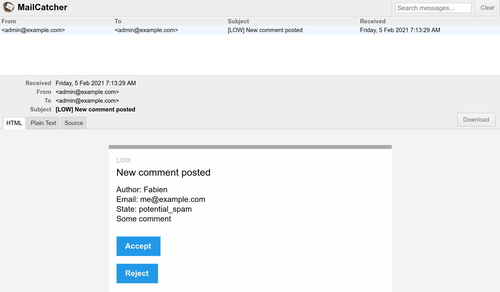

Envío de correos electrónicos a los administradores
=====================================================

.. index::
    single: Components;Mailer
    single: Mailer
    single: Emails

Para asegurar que los comentarios aporten realmente información útil, el administrador debe moderarlos. Cuando un comentario se encuentra en el estado ``ham`` o ``potential_spam``, se debe enviar un *correo electrónico* al administrador con dos enlaces: uno para aceptar el comentario y otro para rechazarlo.

Primero, instala el componente Symfony Mailer:

.. code-block:: terminal

    $ symfony composer req mailer

Configurando una dirección de correo electrónico para el administrador
------------------------------------------------------------------------

Para almacenar el correo electrónico del administrador, utiliza un parámetro de contenedor. A efectos de demostración, también permitimos que se establezca a través de una variable de entorno (aunque no debería ser necesario en la "vida real"). Para facilitar la inyección en servicios que necesitan el correo electrónico del administrador, define un ajuste de contenedor ``bind``:

.. code-block:: diff
    :caption: patch_file

    --- a/config/services.yaml
    +++ b/config/services.yaml
    @@ -4,6 +4,7 @@
     # Put parameters here that don't need to change on each machine where the app is deployed
     # https://symfony.com/doc/current/best_practices/configuration.html#application-related-configuration
     parameters:
    +    default_admin_email: admin@example.com

     services:
         # default configuration for services in *this* file
    @@ -13,6 +14,7 @@ services:
             bind:
                 $photoDir: "%kernel.project_dir%/public/uploads/photos"
                 $akismetKey: "%env(AKISMET_KEY)%"
    +            $adminEmail: "%env(string:default:default_admin_email:ADMIN_EMAIL)%"

         # makes classes in src/ available to be used as services
         # this creates a service per class whose id is the fully-qualified class name

Una variable de entorno puede ser "procesada" antes de ser utilizada. Aquí, estamos usando el procesador ``default`` para devolver el valor del parámetro ``default_admin_email`` si la variable de entorno ``ADMIN_EMAIL`` no existe.

Enviando un correo electrónico de notificación
------------------------------------------------

Para enviar un correo electrónico, puedes elegir entre varias abstracciones de la clase ``Email``; desde ``Message``, el nivel más bajo, hasta ``NotificationEmail``, el más alto. Probablemente usarás la clase ``Email`` la mayoría de las veces, pero ``NotificationEmail`` es la opción perfecta para los correos electrónicos internos.

En el manejador de mensajes, vamos a reemplazar la lógica de validación automática:

.. code-block:: diff
    :caption: patch_file

    --- a/src/MessageHandler/CommentMessageHandler.php
    +++ b/src/MessageHandler/CommentMessageHandler.php
    @@ -7,6 +7,8 @@ use App\Repository\CommentRepository;
     use App\SpamChecker;
     use Doctrine\ORM\EntityManagerInterface;
     use Psr\Log\LoggerInterface;
    +use Symfony\Bridge\Twig\Mime\NotificationEmail;
    +use Symfony\Component\Mailer\MailerInterface;
     use Symfony\Component\Messenger\Handler\MessageHandlerInterface;
     use Symfony\Component\Messenger\MessageBusInterface;
     use Symfony\Component\Workflow\WorkflowInterface;
    @@ -18,15 +20,19 @@ class CommentMessageHandler implements MessageHandlerInterface
         private $commentRepository;
         private $bus;
         private $workflow;
    +    private $mailer;
    +    private $adminEmail;
         private $logger;

    -    public function __construct(EntityManagerInterface $entityManager, SpamChecker $spamChecker, CommentRepository $commentRepository, MessageBusInterface $bus, WorkflowInterface $commentStateMachine, LoggerInterface $logger = null)
    +    public function __construct(EntityManagerInterface $entityManager, SpamChecker $spamChecker, CommentRepository $commentRepository, MessageBusInterface $bus, WorkflowInterface $commentStateMachine, MailerInterface $mailer, string $adminEmail, LoggerInterface $logger = null)
         {
             $this->entityManager = $entityManager;
             $this->spamChecker = $spamChecker;
             $this->commentRepository = $commentRepository;
             $this->bus = $bus;
             $this->workflow = $commentStateMachine;
    +        $this->mailer = $mailer;
    +        $this->adminEmail = $adminEmail;
             $this->logger = $logger;
         }

    @@ -51,8 +57,13 @@ class CommentMessageHandler implements MessageHandlerInterface

                 $this->bus->dispatch($message);
             } elseif ($this->workflow->can($comment, 'publish') || $this->workflow->can($comment, 'publish_ham')) {
    -            $this->workflow->apply($comment, $this->workflow->can($comment, 'publish') ? 'publish' : 'publish_ham');
    -            $this->entityManager->flush();
    +            $this->mailer->send((new NotificationEmail())
    +                ->subject('New comment posted')
    +                ->htmlTemplate('emails/comment_notification.html.twig')
    +                ->from($this->adminEmail)
    +                ->to($this->adminEmail)
    +                ->context(['comment' => $comment])
    +            );
             } elseif ($this->logger) {
                 $this->logger->debug('Dropping comment message', ['comment' => $comment->getId(), 'state' => $comment->getState()]);
             }

El ``MailerInterface`` es el punto de entrada principal y permite enviar correos electrónicos con ``send()``.

Para enviar un correo electrónico, necesitamos un remitente (el encabezado ``From``/``Sender``). En lugar de establecerlo explícitamente en la instancia del correo electrónico, defínelo globalmente:

.. code-block:: diff
    :caption: patch_file

    --- a/config/packages/mailer.yaml
    +++ b/config/packages/mailer.yaml
    @@ -1,3 +1,5 @@
     framework:
         mailer:
             dsn: '%env(MAILER_DSN)%'
    +        envelope:
    +            sender: "%env(string:default:default_admin_email:ADMIN_EMAIL)%"

Extendiendo la plantilla del correo electrónico de notificación
-----------------------------------------------------------------

.. index::
    single: Twig;extends
    single: Twig;block
    single: Twig;url

La plantilla del correo electrónico de notificación se hereda de la plantilla de correo electrónico de notificación predeterminada que viene con Symfony:

.. code-block:: twig
    :caption: templates/emails/comment_notification.html.twig

    

    
        Author: {{ comment.author }} 
        Email: {{ comment.email }} 
        State: {{ comment.state }} 

        

            {{ comment.text }}
        

    

    
        <spacer size="16"></spacer>
        <button href="{{ url('review_comment', { id: comment.id }) }}">Accept</button>
        <button href="{{ url('review_comment', { id: comment.id, reject: true }) }}">Reject</button>
    

La plantilla sobreescribe algunos bloques para personalizar el mensaje de correo electrónico y poder añadir algunos enlaces que permitan al administrador aceptar o rechazar un comentario. Cualquier argumento de ruta que no sea un parámetro de ruta válido se añadirá como un elemento de cadena de consulta (la URL de rechazo tiene este aspecto ``/admin/comment/review/42?reject=true``).

La plantilla predeterminada ``NotificationEmail`` utiliza `Inky <https://get.foundation/emails/docs/inky.html>`_ en lugar de HTML para diseñar correos electrónicos. Esto ayuda a crear mensajes de correo electrónico con capacidad de respuesta que son compatibles con todos los clientes de correo electrónico más populares.

Para una máxima compatibilidad con los lectores de correo electrónico, el diseño base de la notificación incluye todas las hojas de estilo (a través del paquete CSS inliner) de forma predeterminada.

Estas dos características son parte de las extensiones opcionales de Twig que necesitan ser instaladas:

.. code-block:: terminal

    $ symfony composer req "twig/cssinliner-extra:^3" "twig/inky-extra:^3"

Generando URLs absolutas en un comando
--------------------------------------

.. index::
    single: Twig;Link
    single: Link

En los correos electrónicos, genera las URLs con ``url()`` en lugar de ``path()`` pues necesitas los caminos absolutos (con el esquema y el host).

El correo electrónico se envía desde el gestor de mensajes, en un contexto de consola. Generar URLs absolutas en un contexto Web es más fácil ya que conocemos el esquema (http o https) y dominio de la página actual. Pero ése no es el caso en el contexto de una consola.

Define el nombre de dominio y el esquema a utilizar de manera explícita:

.. code-block:: diff
    :caption: patch_file

    --- a/config/services.yaml
    +++ b/config/services.yaml
    @@ -5,6 +5,11 @@
     # https://symfony.com/doc/current/best_practices/configuration.html#application-related-configuration
     parameters:
         default_admin_email: admin@example.com
    +    default_domain: '127.0.0.1'
    +    default_scheme: 'http'
    +
    +    router.request_context.host: '%env(default:default_domain:SYMFONY_DEFAULT_ROUTE_HOST)%'
    +    router.request_context.scheme: '%env(default:default_scheme:SYMFONY_DEFAULT_ROUTE_SCHEME)%'

     services:
         # default configuration for services in *this* file

Las variables de entorno ``SYMFONY_DEFAULT_ROUTE_PORT`` y ``SYMFONY_DEFAULT_ROUTE_HOST`` se establecen automáticamente de forma local cuando se utiliza el comando ``symfony`` y se determinan en función de la configuración de SymfonyCloud.

Enlazando una ruta con un controlador
-------------------------------------

La ruta ``review_comment`` no existe todavía, vamos a crear un controlador de administración para manejarla:

.. code-block:: php
    :caption: src/Controller/AdminController.php

    namespace App\Controller;

    use App\Entity\Comment;
    use App\Message\CommentMessage;
    use Doctrine\ORM\EntityManagerInterface;
    use Symfony\Bundle\FrameworkBundle\Controller\AbstractController;
    use Symfony\Component\HttpFoundation\Request;
    use Symfony\Component\HttpFoundation\Response;
    use Symfony\Component\Messenger\MessageBusInterface;
    use Symfony\Component\Routing\Annotation\Route;
    use Symfony\Component\Workflow\Registry;
    use Twig\Environment;

    class AdminController extends AbstractController
    {
        private $twig;
        private $entityManager;
        private $bus;

        public function __construct(Environment $twig, EntityManagerInterface $entityManager, MessageBusInterface $bus)
        {
            $this->twig = $twig;
            $this->entityManager = $entityManager;
            $this->bus = $bus;
        }

        #[Route('/admin/comment/review/{id}', name: 'review_comment')]
        public function reviewComment(Request $request, Comment $comment, Registry $registry): Response
        {
            $accepted = !$request->query->get('reject');

            $machine = $registry->get($comment);
            if ($machine->can($comment, 'publish')) {
                $transition = $accepted ? 'publish' : 'reject';
            } elseif ($machine->can($comment, 'publish_ham')) {
                $transition = $accepted ? 'publish_ham' : 'reject_ham';
            } else {
                return new Response('Comment already reviewed or not in the right state.');
            }

            $machine->apply($comment, $transition);
            $this->entityManager->flush();

            if ($accepted) {
                $this->bus->dispatch(new CommentMessage($comment->getId()));
            }

            return $this->render('admin/review.html.twig', [
                'transition' => $transition,
                'comment' => $comment,
            ]);
        }
    }

La URL de revisión del comentario comienza con ``/admin/`` para protegerlo con el cortafuegos definido en un paso anterior. El administrador necesita estar autenticado para acceder a este recurso.

En lugar de crear una instancia ``Response``, hemos utilizado ``render()``, un método abreviado proporcionado por la clase base del controlador ``AbstractController``.

.. index::
    single: Twig;extends
    single: Twig;block

Una vez terminada la revisión, una pequeña plantilla agradece al administrador su arduo trabajo:

.. code-block:: twig
    :caption: templates/admin/review.html.twig

    

    
        <h2>Comment reviewed, thank you!</h2>

        
Applied transition: <strong>{{ transition }}</strong>

        
New state: <strong>{{ comment.state }}</strong>

    

Usando un receptor de correos electrónicos
-------------------------------------------

.. index::
    single: Docker;Mail Catcher

En lugar de usar un servidor SMTP "real" o un proveedor externo para enviar correos electrónicos, usaremos un receptor de correo. Un receptor de correo proporciona un servidor SMTP que no entrega los correos electrónicos, sino que los hace disponibles a través de una interfaz Web:

.. code-block:: diff

    --- a/docker-compose.yaml
    +++ b/docker-compose.yaml
    @@ -8,3 +8,7 @@ services:
                 POSTGRES_PASSWORD: main
                 POSTGRES_DB: main
             ports: [5432]
    +
    +    mailer:
    +        image: schickling/mailcatcher
    +        ports: [1025, 1080]

Cierra y reinicia los contenedores para agregar el receptor de correos:

.. code-block:: terminal

    $ docker-compose stop
    $ docker-compose up -d

También debes detener el consumidor de mensajes, ya que aún no conoce el receptor de correo:

.. code-block:: terminal

    $ symfony console messenger:stop-workers

E inícialo de nuevo. El ``MAILER_DSN`` ahora se expone automáticamente:

.. code-block:: terminal
    :class: ignore

    $ symfony run -d --watch=config,src,templates,vendor symfony console messenger:consume async

.. code-block:: terminal
    :class: hide

    $ sleep 10

Accediendo al Webmail
---------------------

.. index::
    single: Symfony CLI;open:local:webmail

Puedes abrir el *webmail* desde un terminal:

.. code-block:: terminal
    :class: ignore

    $ symfony open:local:webmail

O desde la barra de herramientas de depuración web:

.. figure:: screenshots/webmail-wdt.png
    :alt: /
    :align: center
    :figclass: with-browser

Envía un comentario, deberías recibir un correo electrónico en la interfaz de *webmail*:

Haz clic en el título del correo electrónico en la interfaz y acepta o rechaza el comentario según te parezca conveniente:

.. figure:: screenshots/webmail-rejected.png
    :alt: /
    :align: center
    :figclass: with-browser

Comprueba los registros del *log* con ``server:log`` para ver si funciona como se espera.

Gestionando secuencias de comandos de larga duración
-----------------------------------------------------

Tener scripts de larga duración conlleva algunos efectos que debes conocer. A diferencia del modelo PHP usado para HTTP, donde cada petición comienza con un estado limpio, el receptor de mensajes se ejecuta continuamente en segundo plano. Para cada gestión de un mensaje se hereda el estado actual, incluyendo la memoria caché. Para evitar cualquier problema con Doctrine, los administradores de sus entidades se borran automáticamente después de gestionar un mensaje. Debes verificar si tus propios servicios necesitan hacer lo mismo o no.

Enviando correos electrónicos de manera asíncrona
---------------------------------------------------

El correo electrónico enviado con el gestor de mensajes puede tardar algún tiempo en enviarse. Incluso podría generar una excepción. En caso de que se produzca una excepción durante la gestión de un mensaje, se volverá a intentar. Pero en lugar de volver a intentar utilizar el mensaje del comentario, sería mejor intentar enviar sólo el correo electrónico.

Ya sabemos cómo hacer eso: envía el correo electrónico desde el bus de mensajes.

Una instancia ``MailerInterface`` hace el trabajo duro: cuando se define un bus, éste entrega los mensajes de correo electrónico que contiene en lugar de enviarlos. No se necesitan cambios en tu código.

Pero justo ahora, el bus está enviando el correo electrónico de forma síncrona ya que no hemos configurado la cola que queremos usar para los correos electrónicos. Vamos a usar RabbitMQ de nuevo:

.. code-block:: diff
    :caption: patch_file

    --- a/config/packages/messenger.yaml
    +++ b/config/packages/messenger.yaml
    @@ -20,3 +20,4 @@ framework:
             routing:
                 # Route your messages to the transports
                 App\Message\CommentMessage: async
    +            Symfony\Component\Mailer\Messenger\SendEmailMessage: async

Estamos utilizando el mismo transporte (RabbitMQ) para los mensajes de los comentarios y los correos electrónicos, pero esto no tiene por qué ser necesariamente así. Puedes decidir utilizar otro transporte para gestionar diferentes prioridades de mensajes, por ejemplo. El uso de diferentes transportes también te da la oportunidad de tener diferentes máquinas de trabajo manejando diferentes tipos de mensajes. Es flexible y depende de ti.

Comprobando los correos electrónicos
-------------------------------------

Hay muchas maneras de probar los correos electrónicos.

Puedes escribir pruebas unitarias si escribes una clase por correo electrónico (extendiendo ``Email`` o ``TemplatedEmail`` por ejemplo).

Sin embargo, las pruebas más comunes que escribirás son pruebas funcionales que comprueban que algunas acciones generan un correo electrónico, y probablemente pruebes también el contenido de los correos electrónicos si éstos son dinámicos.

Symfony incluye comprobaciones (*assertions*) que facilitan estas pruebas, aquí un ejemplo de prueba que demuestra algunas posibilidades:

.. code-block:: php
    :class: ignore

    public function testMailerAssertions()
    {
        $client = static::createClient();
        $client->request('GET', '/');

        $this->assertEmailCount(1);
        $event = $this->getMailerEvent(0);
        $this->assertEmailIsQueued($event);

        $email = $this->getMailerMessage(0);
        $this->assertEmailHeaderSame($email, 'To', 'fabien@example.com');
        $this->assertEmailTextBodyContains($email, 'Bar');
        $this->assertEmailAttachmentCount($email, 1);
    }

Estas comprobaciones funcionan tanto cuando los correos electrónicos se envían de forma síncrona como de forma asíncrona.

Enviando correos electrónicos en SymfonyCloud
----------------------------------------------

.. index::
    single: SymfonyCloud;Emails
    single: SymfonyCloud;Mailer
    single: SymfonyCloud;SMTP
    single: Emails

No hay una configuración específica para SymfonyCloud. Todas las cuentas vienen con una cuenta Sendgrid que se utiliza automáticamente para enviar correos electrónicos.

Tienes que actualizar aún la configuración de SymfonyCloud para incluir la extensión PHP ``xsl`` que necesita Inky:

.. code-block:: diff
    :caption: patch_file

    --- a/.symfony.cloud.yaml
    +++ b/.symfony.cloud.yaml
    @@ -4,6 +4,7 @@ type: php:8.0

     runtime:
         extensions:
    +        - xsl
             - pdo_pgsql
             - apcu
             - mbstring

.. index::
    single: Symfony CLI;env:setting:set

.. note::

    Por seguridad los correos electrónicos *solo* se envían de manera predeterminada en la rama ``master``. Habilita SMTP de forma explícita en las ramas del repositorio que no sean ``master`` si estás seguro de lo que estás haciendo:

    .. code-block:: terminal

        $ symfony env:setting:set email on

.. sidebar:: Yendo más allá

    * `Tutorial del Mailer en SymfonyCasts <https://symfonycasts.com/screencast/mailer>`_;

    * La `documentación del lenguaje de plantillas Inky <https://get.foundation/emails/docs/inky.html>`_;

    * Los `Procesadores de Variables de Entorno <https://symfony.com/doc/current/configuration/env_var_processors.html>`_;

    * La `documentación del componente Mailer del framework Symfony <https://symfony.com/doc/current/mailer.html>`_;

    * La `documentación de SymfonyCloud sobre correos electrónicos <https://symfony.com/doc/current/cloud/services/emails.html>`_.
