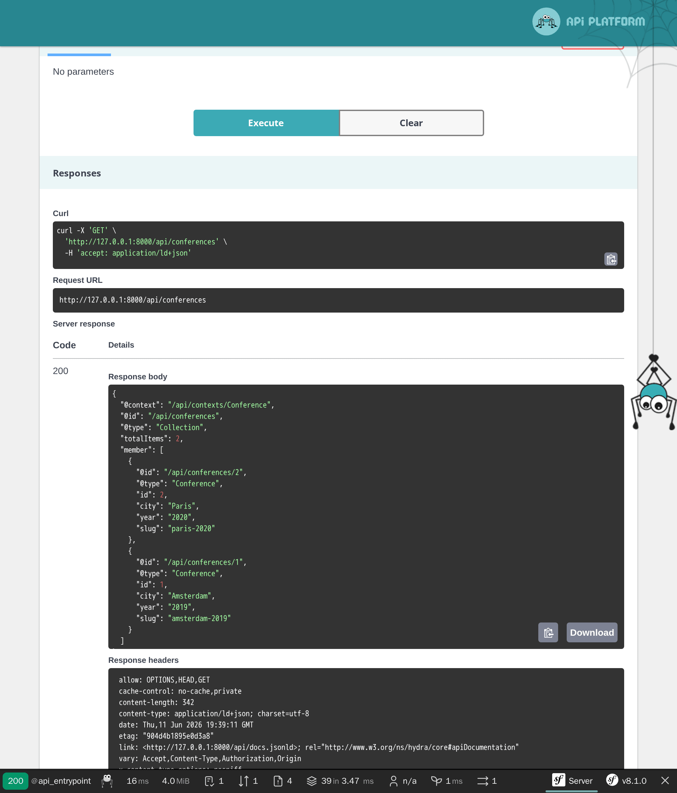

Exponiendo una API con API Platform
===================================

.. index::
    single: API
    single: HTTP API
    single: API Platform

Hemos terminado la implementación del sitio web del Libro de Visitas. Para dar más juego con los datos que tenemos, ¿qué te parece si los exponemos mediante una API? Una aplicación móvil podría utilizar esta API para mostrar todas las conferencias, los comentarios y posiblemente permitir a los asistentes enviar comentarios.

En este paso, vamos a implementar una API de sólo lectura.

Instalando API Platform
-----------------------

Es posible exponer una API escribiendo algo de código, pero si queremos usar estándares, es mejor utilizar una solución que se encargue del trabajo pesado. Una solución como API Platform:

.. code-block:: terminal

    $ symfony composer req api

Exponiendo una API para las conferencias
----------------------------------------

.. index::
    single: Annotations;@ApiResource
    single: Annotations;Groups

Solo necesitamos unas pocas anotaciones en la clase Conference para configurar la API:

.. code-block:: diff
    :caption: patch_file

    --- i/src/Entity/Conference.php
    +++ w/src/Entity/Conference.php
    @@ -2,29 +2,45 @@

     namespace App\Entity;

    +use ApiPlatform\Metadata\ApiResource;
    +use ApiPlatform\Metadata\Get;
    +use ApiPlatform\Metadata\GetCollection;
     use App\Repository\ConferenceRepository;
     use Doctrine\Common\Collections\ArrayCollection;
     use Doctrine\Common\Collections\Collection;
     use Doctrine\ORM\Mapping as ORM;
     use Symfony\Bridge\Doctrine\Validator\Constraints\UniqueEntity;
    +use Symfony\Component\Serializer\Attribute\Groups;
     use Symfony\Component\String\Slugger\SluggerInterface;

     #[ORM\Entity(repositoryClass: ConferenceRepository::class)]
     #[UniqueEntity('slug')]
    +#[ApiResource(
    +    operations: [
    +        new Get(normalizationContext: ['groups' => 'conference:item']),
    +        new GetCollection(normalizationContext: ['groups' => 'conference:list'])
    +    ],
    +    order: ['year' => 'DESC', 'city' => 'ASC'],
    +    paginationEnabled: false,
    +)]
     class Conference
     {
         #[ORM\Id]
         #[ORM\GeneratedValue]
         #[ORM\Column]
    +    #[Groups(['conference:list', 'conference:item'])]
         private ?int $id = null;

         #[ORM\Column(length: 255)]
    +    #[Groups(['conference:list', 'conference:item'])]
         private ?string $city = null;

         #[ORM\Column(length: 4)]
    +    #[Groups(['conference:list', 'conference:item'])]
         private ?string $year = null;

         #[ORM\Column]
    +    #[Groups(['conference:list', 'conference:item'])]
         private ?bool $isInternational = null;

         /**
    @@ -34,6 +50,7 @@ class Conference
         private Collection $comments;

         #[ORM\Column(length: 255, unique: true)]
    +    #[Groups(['conference:list', 'conference:item'])]
         private ?string $slug = null;

         public function __construct()

La anotación principal ``@ApiResource`` configura la API de conferencias. Restringe las operaciones posibles a ``get`` y configura varias cosas: como qué campos mostrar y cómo ordenar las conferencias.

Por defecto, el punto de entrada principal para la API es ``/api`` debido a la configuración que añadió en ``config/routes/api_platform.yaml`` la receta durante la instalación del paquete.

Una interfaz web te permite interactuar con la API:

.. figure:: screenshots/api.png
    :alt: /api
    :align: center
    :figclass: with-browser

Utilízala para probar la funcionalidad que ofrece:

¡Imagina el tiempo que te llevaría implementar todo esto desde cero!

Exponiendo una API para los comentarios
---------------------------------------

.. index::
    single: Annotations;@ApiResource
    single: Annotations;@ApiFilter
    single: Annotations;Groups

Haz lo mismo con los comentarios:

.. code-block:: diff
    :caption: patch_file

    --- i/src/Entity/Comment.php
    +++ w/src/Entity/Comment.php
    @@ -2,41 +2,63 @@

     namespace App\Entity;

    +use ApiPlatform\Doctrine\Orm\Filter\SearchFilter;
    +use ApiPlatform\Metadata\ApiFilter;
    +use ApiPlatform\Metadata\ApiResource;
    +use ApiPlatform\Metadata\Get;
    +use ApiPlatform\Metadata\GetCollection;
     use App\Repository\CommentRepository;
     use Doctrine\DBAL\Types\Types;
     use Doctrine\ORM\Mapping as ORM;
    +use Symfony\Component\Serializer\Attribute\Groups;
     use Symfony\Component\Validator\Constraints as Assert;

     #[ORM\Entity(repositoryClass: CommentRepository::class)]
     #[ORM\HasLifecycleCallbacks]
    +#[ApiResource(
    +    operations: [
    +        new Get(normalizationContext: ['groups' => 'comment:item']),
    +        new GetCollection(normalizationContext: ['groups' => 'comment:list'])
    +    ],
    +    order: ['createdAt' => 'DESC'],
    +    paginationEnabled: false,
    +)]
    +#[ApiFilter(SearchFilter::class, properties: ['conference' => 'exact'])]
     class Comment
     {
         #[ORM\Id]
         #[ORM\GeneratedValue]
         #[ORM\Column]
    +    #[Groups(['comment:list', 'comment:item'])]
         private ?int $id = null;

         #[ORM\Column(length: 255)]
         #[Assert\NotBlank]
    +    #[Groups(['comment:list', 'comment:item'])]
         private ?string $author = null;

         #[ORM\Column(type: Types::TEXT)]
         #[Assert\NotBlank]
    +    #[Groups(['comment:list', 'comment:item'])]
         private ?string $text = null;

         #[ORM\Column(length: 255)]
         #[Assert\NotBlank]
         #[Assert\Email]
    +    #[Groups(['comment:list', 'comment:item'])]
         private ?string $email = null;

         #[ORM\Column]
    +    #[Groups(['comment:list', 'comment:item'])]
         private ?\DateTimeImmutable $createdAt = null;

         #[ORM\ManyToOne(inversedBy: 'comments')]
         #[ORM\JoinColumn(nullable: false)]
    +    #[Groups(['comment:list', 'comment:item'])]
         private ?Conference $conference = null;

         #[ORM\Column(length: 255, nullable: true)]
    +    #[Groups(['comment:list', 'comment:item'])]
         private ?string $photoFilename = null;

         #[ORM\Column(length: 255, options: ['default' => 'submitted'])]

Utilizaremos el mismo tipo de anotaciones para configurar la clase.

Restringiendo los comentarios expuestos por la API
--------------------------------------------------

De forma predeterminada, API Platform expone todos los registros de la base de datos. Pero para los comentarios, solo aquellos que estén publicados deberían ser parte de la API.

Cuando necesites restringir los ítems devueltos por la API, crea un servicio que implemente ``QueryCollectionExtensionInterface`` para controlar la consulta de Doctrine utilizada para las colecciones y/o ``QueryItemExtensionInterface`` para controlar los ítems:

.. code-block:: php
    :caption: src/Api/FilterPublishedCommentQueryExtension.php
    :emphasize-lines: 14-16,21-23

    namespace App\Api;

    use ApiPlatform\Doctrine\Orm\Extension\QueryCollectionExtensionInterface;
    use ApiPlatform\Doctrine\Orm\Extension\QueryItemExtensionInterface;
    use ApiPlatform\Doctrine\Orm\Util\QueryNameGeneratorInterface;
    use ApiPlatform\Metadata\Operation;
    use App\Entity\Comment;
    use Doctrine\ORM\QueryBuilder;

    class FilterPublishedCommentQueryExtension implements QueryCollectionExtensionInterface, QueryItemExtensionInterface
    {
        public function applyToCollection(QueryBuilder $queryBuilder, QueryNameGeneratorInterface $queryNameGenerator, string $resourceClass, Operation $operation = null, array $context = []): void
        {
            if (Comment::class === $resourceClass) {
                $queryBuilder->andWhere(sprintf("%s.state = 'published'", $queryBuilder->getRootAliases()[0]));
            }
        }

        public function applyToItem(QueryBuilder $queryBuilder, QueryNameGeneratorInterface $queryNameGenerator, string $resourceClass, array $identifiers, Operation $operation = null, array $context = []): void
        {
            if (Comment::class === $resourceClass) {
                $queryBuilder->andWhere(sprintf("%s.state = 'published'", $queryBuilder->getRootAliases()[0]));
            }
        }
    }

La clase de extensión de consultas aplica su lógica sólo para el recurso ``Comment`` y modifica el *Doctrine query builder* para considerar únicamente los comentarios que están en estado ``published`` (publicado).

Configurando CORS
-----------------

.. index::
    single: CORS
    single: Cross-Origin Resource Sharing

Por defecto, la política de seguridad *same-origin* (mismo-origen) de los clientes HTTP modernos prohíbe llamar a la API desde otro dominio. El paquete CORS, instalado como parte de ``composer req api``, envía encabezados de CORS (Cross-Origin Resource Sharing) basados en la variable de entorno ``CORS_ALLOW_ORIGIN``.

Por defecto, su valor, definido en ``.env``, permite realizar peticiones HTTP desde ``localhost`` y ``127.0.0.1`` en cualquier puerto. Eso es exactamente lo que necesitamos para el siguiente paso, en el que crearemos una SPA (*Single Page Application*) que tendrá su propio servidor web y que consultará a la API.

.. sidebar:: Yendo más allá

    * `Tutorial de API Platform de SymfonyCasts <https://symfonycasts.com/screencast/api-platform>`_;

    * Para habilitar el soporte de GraphQL, ejecuta ``composer require webonyx/graphql-php``, y luego abre ``/api/graphql`` en el navegador.
