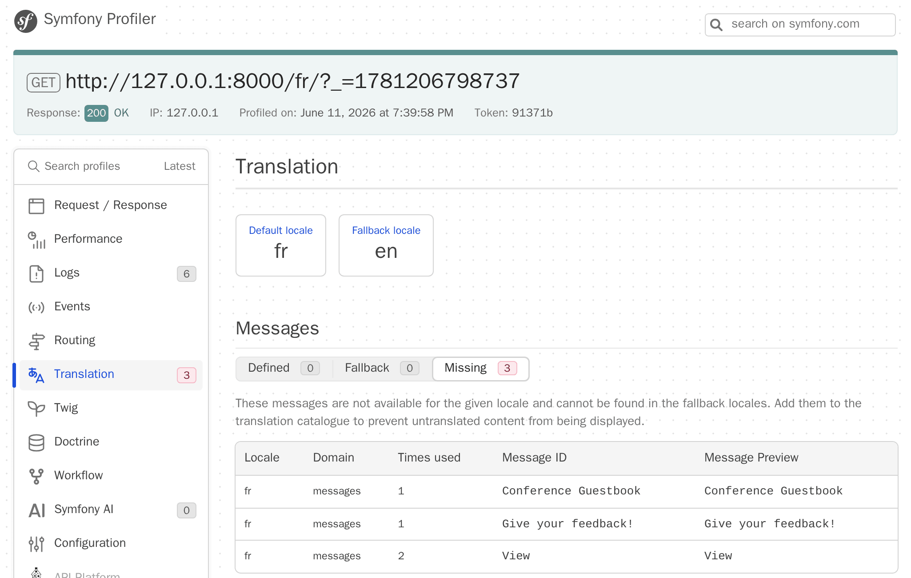
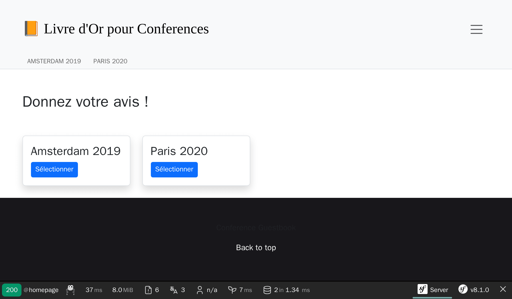

Internacionalizando una aplicación
===================================

Debido a su carácter internacional, desde el principio Symfony ha sido capaz de manejar la internacionalización (i18n) y la regionalización (l10n). La regionalización de una aplicación, proceso al que llamaremos localización a partir de ahora, no consiste sólo en traducir la interfaz, sino también las formas plurales, el formato de fecha y de moneda, las URLs y mucho más.

Internacionalizando URLs
------------------------

.. index::
    single: Components;Routing
    single: Routing;Locale
    single: Routing;Requirements
    single: Attributes;Route

El primer paso para internacionalizar el sitio web es internacionalizar las URLs. Al traducir la interfaz de un sitio web, la URL debe ser diferente para cada localización con el fin de que funcione bien con las cachés HTTP (nunca utilices la misma URL y almacenes la localización en la sesión).

Utiliza el parámetro especial de ruta ``_locale`` para hacer referencia a la regionalización en las rutas:

.. code-block:: diff
    :caption: patch_file
    :emphasize-lines: 8

    --- i/src/Controller/ConferenceController.php
    +++ w/src/Controller/ConferenceController.php
    @@ -28,7 +28,7 @@ final class ConferenceController extends AbstractController
         }

         #[Cache(smaxage: 3600)]
    -    #[Route('/', name: 'homepage')]
    +    #[Route('/{_locale}/', name: 'homepage')]
         public function index(ConferenceRepository $conferenceRepository): Response
         {
             return $this->render('conference/index.html.twig', [

Ahora, en la página de inicio, la localización se determina internamente dependiendo de la URL; por ejemplo, si usas ``/fr/``, ``$request->getLocale()`` devuelve ``fr``.

Como es probable que no puedas traducir el contenido a todas las localizaciones existentes, limítate a las que desees soportar:

.. code-block:: diff
    :caption: patch_file
    :emphasize-lines: 8

    --- i/src/Controller/ConferenceController.php
    +++ w/src/Controller/ConferenceController.php
    @@ -28,7 +28,7 @@ final class ConferenceController extends AbstractController
         }

         #[Cache(smaxage: 3600)]
    -    #[Route('/{_locale}/', name: 'homepage')]
    +    #[Route('/{_locale<en|fr>}/', name: 'homepage')]
         public function index(ConferenceRepository $conferenceRepository): Response
         {
             return $this->render('conference/index.html.twig', [

Se puede especificar una restricción para cada parámetro de ruta mediante una expresión regular colocada dentro de ``<`` ``>``. La ruta de la ``homepage`` ahora solo coincide cuando el parámetro ``_locale`` es ``en`` o ``fr``. Intenta usar ``/es/``, deberías obtener un error 404 ya que no coincide con ninguna ruta.

Como usaremos el mismo requisito en casi todas las rutas, vamos a moverlo a un parámetro del contenedor:

.. code-block:: diff
    :caption: patch_file

    --- i/config/services.yaml
    +++ w/config/services.yaml
    @@ -9,5 +9,6 @@ parameters:
         admin_email: "%env(string:default:default_admin_email:ADMIN_EMAIL)%"
         default_base_url: 'http://127.0.0.1'
    +    app.supported_locales: 'en|fr'

     services:
         # default configuration for services in *this* file
    --- i/src/Controller/ConferenceController.php
    +++ w/src/Controller/ConferenceController.php
    @@ -28,7 +28,7 @@ final class ConferenceController extends AbstractController
         }

         #[Cache(smaxage: 3600)]
    -    #[Route('/{_locale<en|fr>}/', name: 'homepage')]
    +    #[Route('/{_locale<%app.supported_locales%>}/', name: 'homepage')]
         public function index(ConferenceRepository $conferenceRepository): Response
         {
             return $this->render('conference/index.html.twig', [

La inclusión de un nuevo idioma se puede hacer actualizando el parámetro ``app.supported_languages``.

Añade el mismo prefijo de ruta de localización a las otras URLs:

.. code-block:: diff
    :caption: patch_file

    --- i/src/Controller/ConferenceController.php
    +++ w/src/Controller/ConferenceController.php
    @@ -38,7 +38,7 @@ final class ConferenceController extends AbstractController
         }

         #[Cache(smaxage: 3600)]
    -    #[Route('/conference_header', name: 'conference_header')]
    +    #[Route('/{_locale<%app.supported_locales%>}/conference_header', name: 'conference_header')]
         public function conferenceHeader(ConferenceRepository $conferenceRepository): Response
         {
             return $this->render('conference/header.html.twig', [
    @@ -46,9 +46,9 @@ final class ConferenceController extends AbstractController
             ]);
         }

         #[RateLimit('comment_submission', methods: ['POST'])]
    -    #[Route('/conference/{slug}', name: 'conference')]
    +    #[Route('/{_locale<%app.supported_locales%>}/conference/{slug}', name: 'conference')]
         public function show(
             Request $request,
             #[MapEntity(mapping: ['slug' => 'slug'])]
             Conference $conference,

Ya casi hemos terminado. Ahora ya no tenemos una ruta que coincida con ``/``. Vamos a añadirla de nuevo y redirigirla a ``/en/``:

.. code-block:: diff
    :caption: patch_file

    --- i/src/Controller/ConferenceController.php
    +++ w/src/Controller/ConferenceController.php
    @@ -27,6 +27,12 @@ final class ConferenceController extends AbstractController
         ) {
         }

    +    #[Route('/')]
    +    public function indexNoLocale(): Response
    +    {
    +        return $this->redirectToRoute('homepage', ['_locale' => 'en']);
    +    }
    +
         #[Cache(smaxage: 3600)]
         #[Route('/{_locale<%app.supported_locales%>}/', name: 'homepage')]
         public function index(ConferenceRepository $conferenceRepository): Response

Ahora que todas las rutas principales recogen el parámetro de la regionalización, observa que las URLs generadas en las páginas tienen en cuenta automáticamente la región actual.

Añadiendo un selector de localizaciones
----------------------------------------

.. index::
    single: Twig;path
    single: Twig;Locale

Para permitir a los usuarios cambiar de la localización predeterminada ``en`` a otra, vamos a añadir un selector en la cabecera:

.. code-block:: diff
    :caption: patch_file

    --- i/templates/base.html.twig
    +++ w/templates/base.html.twig
    @@ -34,6 +34,16 @@
                                         Admin
                                     </a>
                                 </li>
    +<li class="nav-item dropdown">
    +    <a class="nav-link dropdown-toggle" href="#" id="dropdown-language" role="button"
    +        data-bs-toggle="dropdown" aria-haspopup="true" aria-expanded="false">
    +        English
    +    </a>
    +    <ul class="dropdown-menu dropdown-menu-right" aria-labelledby="dropdown-language">
    +        <li><a class="dropdown-item" href="{{ path('homepage', {_locale: 'en'}) }}">English</a></li>
    +        <li><a class="dropdown-item" href="{{ path('homepage', {_locale: 'fr'}) }}">Français</a></li>
    +    </ul>
    +</li>
                             </ul>
                         

                     

Para cambiar a otra localización, pasamos explícitamente el parámetro de ruta ``_locale`` a la función ``path()``.

.. index::
    single: Twig;app.request
    single: Twig;locale_name

Actualiza la plantilla para que muestre el nombre de la localización actual en lugar del texto fijo "English" que hay en el código:

.. code-block:: diff
    :caption: patch_file

    --- i/templates/base.html.twig
    +++ w/templates/base.html.twig
    @@ -37,7 +37,7 @@
     <li class="nav-item dropdown">
         <a class="nav-link dropdown-toggle" href="#" id="dropdown-language" role="button"
             data-bs-toggle="dropdown" aria-haspopup="true" aria-expanded="false">
    -        English
    +        {{ app.request.locale|locale_name(app.request.locale) }}
         </a>
         <ul class="dropdown-menu dropdown-menu-right" aria-labelledby="dropdown-language">
             <li><a class="dropdown-item" href="{{ path('homepage', {_locale: 'en'}) }}">English</a></li>

``app`` es una variable global de Twig que da acceso a la petición web actual. Para convertir la localización en una cadena que sea comprensible para una persona, usaremos el filtro de Twig ``locale_name``.

.. index::
    single: Components;String

Dependiendo de la localización, el nombre de la localización no siempre está en mayúsculas. Para poner las mayúsculas y minúsculas correctamente en los textos necesitamos un filtro que sea compatible con Unicode, tal y como proporciona el componente Symfony String y su implementación en Twig:

.. code-block:: terminal

    $ symfony composer req twig/string-extra

.. index::
    single: Twig;u.title

.. code-block:: diff
    :caption: patch_file

    --- i/templates/base.html.twig
    +++ w/templates/base.html.twig
    @@ -37,7 +37,7 @@
     <li class="nav-item dropdown">
         <a class="nav-link dropdown-toggle" href="#" id="dropdown-language" role="button"
             data-bs-toggle="dropdown" aria-haspopup="true" aria-expanded="false">
    -        {{ app.request.locale|locale_name(app.request.locale) }}
    +        {{ app.request.locale|locale_name(app.request.locale)|u.title }}
         </a>
         <ul class="dropdown-menu dropdown-menu-right" aria-labelledby="dropdown-language">
             <li><a class="dropdown-item" href="{{ path('homepage', {_locale: 'en'}) }}">English</a></li>

Ahora puedes pasar del francés al inglés a través del selector y toda la interfaz se adapta bastante bien:

.. figure:: screenshots/intl-switcher.png
    :alt: /fr/conference/amsterdam-2019
    :align: center
    :figclass: with-browser

Traduciendo la interfaz
-----------------------

.. index::
    single: Components;Translation
    single: Translation
    single: Twig;trans

Traducir cada texto en un sitio web grande puede ser tedioso, pero, afortunadamente, sólo tenemos un puñado de mensajes en nuestro sitio web. Empecemos con todas las frases de la página de inicio:

.. code-block:: diff
    :caption: patch_file

    --- i/templates/base.html.twig
    +++ w/templates/base.html.twig
    @@ -20,7 +20,7 @@
                 <nav class="navbar navbar-expand-xl navbar-light bg-light">
                     

                         <a class="navbar-brand me-4 pr-2" href="{{ path('homepage') }}">
    -                        &#128217; Conference Guestbook
    +                        &#128217; {{ 'Conference Guestbook'|trans }}
                         </a>

                         <button class="navbar-toggler border-0" type="button" data-bs-toggle="collapse" data-bs-target="#header-menu" aria-controls="navbarSupportedContent" aria-expanded="false" aria-label="Show/Hide navigation">
    --- i/templates/conference/index.html.twig
    +++ w/templates/conference/index.html.twig
    @@ -4,7 +4,7 @@

     
         <h2 class="mb-5">
    -        Give your feedback!
    +        {{ 'Give your feedback!'|trans }}
         </h2>

         
    @@ -21,7 +21,7 @@

                                 <a href="{{ path('conference', { slug: conference.slug }) }}"
                                    class="btn btn-sm btn-primary stretched-link">
    -                                View
    +                                {{ 'View'|trans }}
                                 </a>
                             

                         

El filtro ``trans`` de Twig busca una traducción del texto dado en la localización actual. Si no la encuentra, vuelve a la *localización predeterminada* tal y como se ha configurado en ``config/packages/translation.yaml``:

.. code-block:: yaml
    :class: ignore
    :emphasize-lines: 2

    framework:
        default_locale: en
        translator:
            default_path: '%kernel.project_dir%/translations'
            fallbacks:
                - en

Fíjate en que la "pestaña" de traducción de la barra de herramientas de depuración web se ha vuelto roja:

.. figure:: screenshots/intl-wdt.png
    :alt: /fr/
    :align: center
    :figclass: with-browser

Nos dice que aún no se han traducido 3 mensajes.

Haz clic en la "pestaña" para ver una lista de todos los mensajes para los que Symfony no ha encontrado una traducción:

Proporcionando traducciones
---------------------------

Como habrás visto en ``config/packages/translation.yaml``, las traducciones se almacenan en el directorio raíz ``translations/``, que se ha creado automáticamente para nosotros.

En lugar de crear los archivos de traducción a mano, utiliza el comando ``translation:extract``:

.. code-block:: terminal

    $ symfony console translation:extract fr --force --domain=messages

Este comando genera un archivo de traducción (con el parámetro ``--force``) para la localización ``fr`` y el dominio ``messages``. El dominio ``messages`` contiene todos los mensajes de la **aplicación** excepto los que provienen del propio Symfony como errores de validación o de seguridad.

Edita el fichero ``translations/messages+intl-icu.fr.xlf`` y traduce los mensajes al francés. ¿No hablas francés? Déjame ayudarte:

.. code-block:: diff
    :caption: patch_file
    :class: ignore

    --- i/translations/messages+intl-icu.fr.xlf
    +++ w/translations/messages+intl-icu.fr.xlf
    @@ -7,15 +7,15 @@
         <body>
           <trans-unit id="eOy4.6V" resname="Conference Guestbook">
             <source>Conference Guestbook</source>
    -        <target>__Conference Guestbook</target>
    +        <target>Livre d'Or pour Conferences</target>
           </trans-unit>
           <trans-unit id="LNAVleg" resname="Give your feedback!">
             <source>Give your feedback!</source>
    -        <target>__Give your feedback!</target>
    +        <target>Donnez votre avis !</target>
           </trans-unit>
           <trans-unit id="3Mg5pAF" resname="View">
             <source>View</source>
    -        <target>__View</target>
    +        <target>Sélectionner</target>
           </trans-unit>
         </body>
       </file>

.. code-block:: xml
    :caption: translations/messages+intl-icu.fr.xlf
    :class: hide

    <?xml version="1.0" encoding="utf-8"?>
    <xliff xmlns="urn:oasis:names:tc:xliff:document:1.2" version="1.2">
    <file source-language="en" target-language="fr" datatype="plaintext" original="file.ext">
        <header>
        <tool tool-id="symfony" tool-name="Symfony" />
        </header>
        <body>
        <trans-unit id="LNAVleg" resname="Give your feedback!">
            <source>Give your feedback!</source>
            <target>Donnez votre avis !</target>
        </trans-unit>
        <trans-unit id="3Mg5pAF" resname="View">
            <source>View</source>
            <target>Sélectionner</target>
        </trans-unit>
        <trans-unit id="eOy4.6V" resname="Conference Guestbook">
            <source>Conference Guestbook</source>
            <target>Livre d'Or pour Conferences</target>
        </trans-unit>
        </body>
    </file>
    </xliff>

Ten en cuenta que no traduciremos todas las plantillas, pero lánzate si te apetece:

Traduciendo formularios
-----------------------

.. index::
    single: Translation;Form
    single: Form;Translation

Symfony muestra automáticamente las etiquetas de los formularios a través del sistema de traducción. Dirígete a la página de una conferencia y haz clic en la pestaña "Translation" de la barra de herramientas de depuración web; deberías ver todas las etiquetas listas para la traducción:

.. figure:: screenshots/intl-form-profiler.png
    :alt: /_profiler/64282d?panel=translation
    :align: center
    :figclass: with-browser

Localizando fechas
------------------

.. index::
    single: Localization
    single: Twig;format_datetime
    single: Twig;format_time
    single: Twig;format_date
    single: Twig;format_currency
    single: Twig;format_number

Si cambias al idioma francés y te diriges a la página de una conferencia que tenga varios comentarios, notarás que las fechas de los comentarios están localizadas de manera automática. Esto es así porque utilizamos el filtro de Twig ``format_datetime``, que aplica distintos formatos de fecha/hora según la localización (``{{ comment.createdAt|format_datetime('medium', 'short') }}``).

La localización funciona para fechas, horas (``format_time``), monedas (``format_currency``) y números (``format_number``) en general (porcentajes, duraciones, detalles, etc.).

Traduciendo plurales
--------------------

.. index::
    single: Translation;Plurals
    single: Translation;Conditions

Gestionar los plurales en las traducciones no es más que un caso particular del mecanismo que permite elegir una traducción dependiendo de una condición.

En la página de una conferencia mostramos el número de comentarios: ``There are 2 comments``. Para 1 comentario, mostramos ``There are 1 comments``, lo que es incorrecto. Modifica la plantilla para convertir el texto en un mensaje traducible:

.. code-block:: diff
    :caption: patch_file

    --- i/templates/conference/show.html.twig
    +++ w/templates/conference/show.html.twig
    @@ -44,7 +44,7 @@
                             

                         

                     
    -                
There are {{ comments|length }} comments.

    +                
{{ 'nb_of_comments'|trans({count: comments|length}) }}

                     
                         <a href="{{ path('conference', { slug: conference.slug, offset: previous }) }}">Previous</a>
                     

Para este mensaje hemos utilizado otra estrategia de traducción. En lugar de mantener la versión en inglés en la plantilla, la hemos sustituido por un identificador único. Esta estrategia funciona mejor para textos complejos y con muchas palabras.

Actualiza el archivo de traducción añadiendo el nuevo mensaje:

.. code-block:: diff
    :caption: patch_file

    --- i/translations/messages+intl-icu.fr.xlf
    +++ w/translations/messages+intl-icu.fr.xlf
    @@ -17,6 +17,10 @@
             <source>Conference Guestbook</source>
             <target>Livre d'Or pour Conferences</target>
         </trans-unit>
    +    <trans-unit id="Dg2dPd6" resname="nb_of_comments">
    +        <source>nb_of_comments</source>
    +        <target>{count, plural, =0 {Aucun commentaire.} =1 {1 commentaire.} other {# commentaires.}}</target>
    +    </trans-unit>
         </body>
     </file>
     </xliff>

Aún no hemos terminado, ya que ahora tenemos que proporcionar la traducción al inglés. Crea el fichero ``translations/messages+intl-icu.en.xlf``:

.. code-block:: xml
    :caption: translations/messages+intl-icu.en.xlf
    :emphasize-lines: 10

    <?xml version="1.0" encoding="utf-8"?>
    <xliff xmlns="urn:oasis:names:tc:xliff:document:1.2" version="1.2">
      <file source-language="en" target-language="en" datatype="plaintext" original="file.ext">
        <header>
          <tool tool-id="symfony" tool-name="Symfony" />
        </header>
        <body>
          <trans-unit id="maMQz7W" resname="nb_of_comments">
            <source>nb_of_comments</source>
            <target>{count, plural, =0 {There are no comments.} one {There is one comment.} other {There are # comments.}}</target>
          </trans-unit>
        </body>
      </file>
    </xliff>

Actualización de las pruebas funcionales
-----------------------------------------

No olvides actualizar las pruebas funcionales para tener en cuenta los cambios en las URLs y en el contenido:

.. code-block:: diff
    :caption: patch_file

    --- i/tests/Controller/ConferenceControllerTest.php
    +++ w/tests/Controller/ConferenceControllerTest.php
    @@ -16,7 +16,7 @@ class ConferenceControllerTest extends WebTestCase
         public function testIndex(): void
         {
             $client = static::createClient();
    -        $client->request('GET', '/');
    +        $client->request('GET', '/en/');

             $this->assertResponseIsSuccessful();
             $this->assertSelectorTextContains('h2', 'Give your feedback');
    @@ -29,7 +29,7 @@ class ConferenceControllerTest extends WebTestCase
             $berlin = ConferenceFactory::createOne(['city' => 'Berlin', 'year' => '2021', 'isInternational' => false]);
             CommentFactory::createOne(['conference' => $berlin]);

    -        $client->request('GET', '/conference/berlin-2021');
    +        $client->request('GET', '/en/conference/berlin-2021');
             $client->submitForm('Submit', [
                 'comment[author]' => 'Fabien',
                 'comment[text]' => 'Some feedback from an automated functional test',
    @@ -50,7 +50,7 @@ class ConferenceControllerTest extends WebTestCase
             ConferenceFactory::createOne(['city' => 'Paris', 'year' => '2020', 'isInternational' => false]);
             CommentFactory::createOne(['conference' => $amsterdam]);

    -        $crawler = $client->request('GET', '/');
    +        $crawler = $client->request('GET', '/en/');

             $this->assertCount(2, $crawler->filter('h4'));

    @@ -59,6 +59,6 @@ class ConferenceControllerTest extends WebTestCase
             $this->assertPageTitleContains('Amsterdam');
             $this->assertResponseIsSuccessful();
             $this->assertSelectorTextContains('h2', 'Amsterdam 2019');
    -        $this->assertSelectorExists('div:contains("There are 1 comments")');
    +        $this->assertSelectorExists('div:contains("There is one comment")');
         }
     }

.. sidebar:: Yendo más allá

    * `Traducción de mensajes utilizando el formateador de la ICU`_ ;

    * `Uso de filtros de traducción Twig`_ .

.. _`Traducción de mensajes utilizando el formateador de la ICU`: https://symfony.com/doc/current/translation/message_format.html
.. _`Uso de filtros de traducción Twig`: https://symfony.com/doc/current/translation/templates.html#translation-filters
