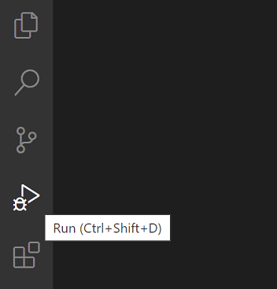

Descubriendo el corazón de Symfony
===================================

.. index::
    single: Blackfire
    single: Debugging
    single: Internals

Hemos estado usando Symfony durante un tiempo para desarrollar una poderosa aplicación, pero la mayor parte del código ejecutado por la aplicación proviene de Symfony. Cientos de líneas de código frente a miles de ellas.

Me gusta entender cómo funcionan las cosas detrás de bastidores. Y siempre me han fascinado las herramientas que me ayudan a entender cómo funcionan las cosas. La primera vez que usé un depurador paso a paso o la primera vez que descubrí ``ptrace`` son recuerdos mágicos.

¿Te gustaría entender mejor cómo funciona Symfony? Es hora de indagar en cómo Symfony hace funcionar tu aplicación. En lugar de describir cómo Symfony maneja una petición HTTP desde una perspectiva teórica, lo que sería bastante aburrido, vamos a utilizar Blackfire para obtener algunas representaciones visuales y utilizarlo para descubrir algunos temas más avanzados.

Entendiendo el corazón de Symfony con Blackfire
------------------------------------------------

Ya sabes que todas las peticiones HTTP se sirven por un único punto de entrada: el archivo ``public/index.php``. Pero ¿qué pasa después? ¿cómo se llama a los controladores?

Hagamos un perfil en producción de la página de inicio en inglés con Blackfire a través de la extensión del navegador Blackfire:

.. code-block:: terminal
    :class: ignore

    $ symfony remote:open

O directamente a través de la línea de comandos:

.. code-block:: terminal
    :class: ignore

    $ blackfire curl `symfony cloud:env:url --pipe --primary`en/

Dirígete a la vista "Timeline" (línea de tiempo) del perfil, deberías ver algo similar a lo siguiente:

.. figure:: images/blackfire-homepage-prod.png
    :alt: /
    :align: center
    :figclass: with-browser

Desde la línea de tiempo, pasa el puntero del ratón por las barras de color para tener más información sobre cada llamada; aprenderás mucho sobre cómo funciona Symfony:

* El punto de entrada principal es ``public/index.php``;

* El método ``Kernel::handle()`` gestiona la solicitud;

* Llama al ``HttpKernel`` que dispara algunos eventos;

* El primer evento es ``RequestEvent``;

* El método ``ControllerResolver::getController()`` se invoca para determinar qué controlador se debería llamar para la URL entrante;

* El método ``ControllerResolver::getArguments()`` se invoca para determinar qué argumentos pasar al controlador (se llama al convertidor de parámetros);

* El método ``ConferenceController::index()`` se invoca ahora, con lo que la mayor parte de nuestro código es ejecutado por esta llamada;

* El método ``ConferenceRepository::findAll()`` obtiene todas las conferencias de la base de datos (observa la conexión a la base de datos vía ``PDO::__construct()``);

* El método ``Twig\Environment::render()`` renderiza la plantilla;

* Los eventos ``ResponseEvent`` y ``FinishRequestEvent`` se disparan, aunque da la sensación de que no hay oyentes (*listeners*) registrados, ya que parecen ser muy rápidos en su ejecución.

La línea de tiempo es una forma excelente de entender cómo funciona parte del código; esto es especialmente útil cuando te enfrentas a un proyecto desarrollado por otra persona.

Ahora, genera un perfil de la misma página desde la máquina local en el entorno de desarrollo:

.. code-block:: terminal
    :class: ignore

    $ blackfire curl `symfony var:export SYMFONY_PROJECT_DEFAULT_ROUTE_URL`en/

Abre el perfil. Deberías ser redirigido a la vista del gráfico de llamadas ya que la solicitud fue muy rápida y la línea de tiempo estará bastante vacía:

.. figure:: images/blackfire-homepage-cached-dev.png
    :alt: /
    :align: center
    :figclass: with-browser

¿Entiendes lo que está pasando? La caché HTTP está habilitada y como tal, estamos analizando la capa de caché HTTP de Symfony. Como la página está en la caché, ``HttpCache\Store::restoreResponse()`` está obteniendo la respuesta HTTP de su caché y nunca se llama al controlador.

Deshabilita la capa de caché en ``public/index.php`` como hicimos en el paso anterior e inténtalo de nuevo. Puedes ver inmediatamente que el perfil se ve muy diferente:

.. figure:: images/blackfire-homepage-dev.png
    :alt: /
    :align: center
    :figclass: with-browser

Las principales diferencias son las siguientes:

* El ``TerminateEvent``, que no era visible en producción, toma un gran porcentaje del tiempo de ejecución; mirando más de cerca, se puede ver que este es el evento responsable de almacenar los datos del Symfony profiler recopilados durante la solicitud;

* Bajo la llamada ``ConferenceController::index()``, observa el método ``SubRequestHandler::handle()`` que crea el ESI (es por eso que tenemos dos llamadas a ``Profiler::saveProfile()``, una para la solicitud principal y otra para el ESI).

Explora la línea de tiempo para obtener más información; cambia a la vista del gráfico de llamadas para tener una representación diferente de los mismos datos.

Como acabamos de descubrir, el código ejecutado en desarrollo y producción es bastante diferente. El entorno de desarrollo es más lento ya que Symfony Profiler intenta recopilar muchos datos para facilitar la depuración. Es por eso que siempre debes hacer un perfil con el entorno de producción, incluso en local.

Algunos experimentos interesantes: analizar una página de error, analizar la página ``/`` (que es un redireccionamiento), o un recurso de la API. Cada perfil te dirá un poco más sobre cómo funciona Symfony, qué clase/métodos se llaman, qué es caro de ejecutar y qué es barato.

Usando el complemento de depuración de Blackfire
-------------------------------------------------

.. index::
    single: Blackfire;Debug Addon

Por defecto, Blackfire elimina todas las llamadas a métodos que no son lo suficientemente significativas para evitar tener grandes cargas y grandes gráficos. Cuando se utiliza Blackfire como herramienta de depuración, es mejor mantener todas las llamadas. Esto es proporcionado por el complemento de depuración.

Desde la línea de comandos, utiliza el parámetro ``--debug``:

.. code-block:: terminal
    :class: ignore

    $ blackfire --debug curl `symfony var:export SYMFONY_PROJECT_DEFAULT_ROUTE_URL`en/
    $ blackfire --debug curl `symfony cloud:env:url --pipe --primary`en/

.. index::
    single: .env.local.prod

En producción, verías, por ejemplo, que se carga un archivo llamado ``.env.local.php``:

.. figure:: images/blackfire-env-local-prod.png
    :alt: /
    :align: center
    :figclass: with-browser

.. index::
    single: Composer;Optimizations
    single: Composer;Autoloader
    single: Autoloader

¿De dónde viene? Upsun hace algunas optimizaciones cuando despliega una aplicación Symfony, como optimizar el *Composer autoloader* (``--optimize-autoloader --apcu-autoloader --classmap-authoritative``). También optimiza las variables de entorno definidas en el archivo ``.env`` (para evitar el análisis del archivo para cada solicitud) mediante la generación del archivo ``.env.local.prod``:

.. code-block:: terminal
    :class: ignore

    $ symfony run composer dump-env prod

Blackfire es una herramienta muy poderosa que ayuda a entender cómo es ejecutado el código por PHP. Mejorar el rendimiento es sólo una de las ventajas de usar un *profiler*.

Usando un depurador de pasos con Xdebug
---------------------------------------

.. index::
    single: Xdebug
    single: Debugger

Las líneas de tiempo y los grafos de llamada de Blackfire permiten a los desarrolladores visualizar qué archivos/funciones/métodos son ejecutados por el motor PHP para comprender mejor el código base del proyecto.

Otra forma de seguir la ejecución del código es usar un **depurador de pasos** como `Xdebug <https://xdebug.org>`_. Un depurador de pasos permite a los desarrolladores recorrer de forma interactiva el código de un proyecto PHP para depurar el flujo y examinar las estructuras de datos. Es muy útil para depurar comportamientos inesperados y reemplaza la técnica de depuración común "var_dump()/exit()".

Primero, instala la extensión PHP ``xdebug``. Comprueba que esté instalada ejecutando el siguiente comando:

.. code-block:: terminal

    $ symfony php -v

Debería verse Xdebug en la salida:

.. code-block:: text
    :emphasize-lines: 5
    :class: ignore

    PHP 8.0.1 (cli) (built: Jan 13 2021 08:22:35) ( NTS )
    Copyright (c) The PHP Group
    Zend Engine v4.0.1, Copyright (c) Zend Technologies
        with Zend OPcache v8.0.1, Copyright (c), by Zend Technologies
        with Xdebug v3.0.2, Copyright (c) 2002-2021, by Derick Rethans
        with blackfire v1.49.0~linux-x64-non_zts80, https://blackfire.io, by Blackfire

También puedes verificar que Xdebug esté habilitado para PHP-FPM yendo al navegador y haciendo clic en el enlace "View phpinfo()" al pasar el cursor sobre el logotipo de Symfony de la barra de herramientas de depuración:

.. figure:: screenshots/phpinfo.png
    :alt: /
    :align: center
    :figclass: with-browser

Ahora, habilita el modo de `debug`` de Xdebug:

.. code-block:: ini
    :caption: php.ini
    :class: ignore

    [xdebug]
    xdebug.mode=debug
    xdebug.start_with_request=yes

De manera predeterminada, Xdebug envía la información al puerto 9003 del host local.

La activación de Xdebug se puede realizar de muchas formas, pero la más sencilla es utilizar Xdebug desde tu IDE. En este capítulo, usaremos Visual Studio Code para demostrar cómo funciona. Instala la extensión `PHP Debug <https://marketplace.visualstudio.com/items?itemName=felixfbecker.php-debug>`_ iniciando la función "Quick Open" (``Ctrl+P``), pega el siguiente comando, y presiona enter:

.. code-block:: text
    :class: ignore

    ext install felixfbecker.php-debug

Crea el siguiente archivo de configuración:

.. code-block:: json
    :caption: .vscode/launch.json
    :emphasize-lines: 8,16
    :class: ignore

    {
        "version": "0.2.0",
        "configurations": [
            {
                "name": "Listen for XDebug",
                "type": "php",
                "request": "launch",
                "port": 9003
            },
            {
                "name": "Launch currently open script",
                "type": "php",
                "request": "launch",
                "program": "${file}",
                "cwd": "${fileDirname}",
                "port": 9003
            }
        ]
    }

Desde Visual Studio Code y mientras te encuentras en el directorio de tu proyecto, vete al depurador y haz clic en el botón de reproducción verde con la etiqueta "Escuchar Xdebug":

Si vas al navegador y actualizas, el IDE debería tomar el foco automáticamente, lo que significa que la sesión de depuración está lista. De forma predeterminada, todo es un punto de interrupción, por lo que la ejecución se detiene en la primera instrucción. Depende de ti inspeccionar las variables actuales, pasar por encima del código, entrar en el código...

Al depurar, puedes desmarcar el punto de interrupción "Todo" y establecer puntos de interrupción explícitamente en tu código.

Si eres nuevo en depuradores por pasos, lee el `excelente tutorial para Visual Studio Code <https://code.visualstudio.com/Docs/editor/debugging>`_, que explica todo visualmente.

.. sidebar:: Yendo más allá

    * `Documentación de depuración por pasos con Xdebug <https://xdebug.org/docs/step_debug>`_;

    * `Depurar con Visual Studio Code <https://code.visualstudio.com/Docs/editor/debugging>`_.
