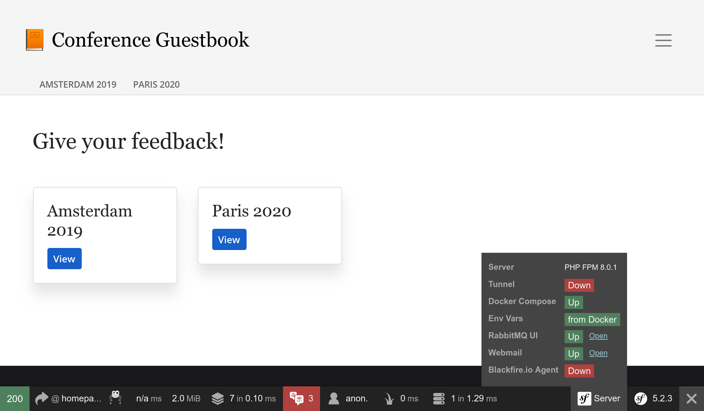

Usando RabbitMQ como agente de mensajes
=======================================

.. index::
    single: RabbitMQ

RabbitMQ es un agente de mensajes muy popular que puedes utilizar como alternativa a PostgreSQL.

Cambiando de PostgreSQL a RabbitMQ
----------------------------------

Para utilizar RabbitMQ en lugar de PostgreSQL como agente de mensajes:

.. code-block:: diff
    :caption: patch_file

    --- i/config/packages/messenger.yaml
    +++ w/config/packages/messenger.yaml
    @@ -5,7 +5,7 @@ framework:
             transports:
                 # https://symfony.com/doc/current/messenger.html#transport-configuration
                 async:
    -                dsn: '%env(MESSENGER_TRANSPORT_DSN)%'
    +                dsn: '%env(RABBITMQ_URL)%'
                     retry_strategy:
                         max_retries: 3
                         multiplier: 2

También necesitamos añadir el soporte de RabbitMQ para Messenger:

.. code-block:: terminal

    $ symfony composer req amqp-messenger

Agregando RabbitMQ a la pila de Docker
--------------------------------------

.. index::
    single: Docker;RabbitMQ

Como habrás adivinado, también necesitamos agregar RabbitMQ a la pila de Docker Compose:

.. code-block:: diff
    :caption: patch_file

    --- i/compose.yaml
    +++ w/compose.yaml
    @@ -18,6 +18,10 @@ services:
         image: redis:8.0-alpine
         ports: [6379]

    +  rabbitmq:
    +    image: rabbitmq:4.2-management
    +    ports: [5672, 15672]
    +
     volumes:
     ###> doctrine/doctrine-bundle ###
       database_data:

Reiniciando los servicios de Docker
-----------------------------------

Para forzar a Docker Compose a que tenga en cuenta el contenedor RabbitMQ, para los contenedores y reinícialos:

.. code-block:: terminal

    $ docker compose stop
    $ docker compose up -d --remove-orphans

.. code-block:: terminal
    :class: hide

    $ sleep 10

Explorando la interfaz web de administración de RabbitMQ
---------------------------------------------------------

.. index::
    single: Symfony CLI;open:local:rabbitmq

Si quieres ver las colas y los mensajes que fluyen por RabbitMQ, abre su interfaz web de administración:

.. code-block:: terminal
    :class: ignore

    $ symfony open:local:rabbitmq

O desde la barra de herramientas de depuración web:

Usa ``guest``/``guest`` para acceder a la interfaz de administración de RabbitMQ:

.. figure:: screenshots/rabbitmq-management.png
    :alt: /
    :align: center
    :figclass: with-browser

Desplegando RabbitMQ
--------------------

.. index::
    single: Upsun;RabbitMQ
    single: RabbitMQ

Se puede añadir RabbitMQ a los servidores de producción agregándolos a la lista de servicios:

.. code-block:: diff
    :caption: patch_file

    --- i/.upsun/config.yaml
    +++ w/.upsun/config.yaml
    @@ -25,4 +25,8 @@ services:
             rediscache:
                 type: redis:8.0

    +    queue:
    +        type: rabbitmq:4.2
    +        size: S
    +
     applications:

Añade la referencia también en la configuración del contenedor web y activa la extensión de PHP ``amqp``:

.. code-block:: diff
    :caption: patch_file

    --- i/.upsun/config.yaml
    +++ w/.upsun/config.yaml
    @@ -39,6 +39,7 @@ applications:

             runtime:
                 extensions:
    +                - amqp
                     - apcu
                     - blackfire
                     - ctype
    @@ -72,5 +73,6 @@ applications:
             relationships:
                 database: "database:postgresql"
                 redis: "rediscache:redis"
    +            rabbitmq: "queue:rabbitmq"

             hooks:
                 build: |

.. index::
    single: Upsun;Tunnel
    single: Symfony CLI;cloud:tunnel:open
    single: Symfony CLI;cloud:tunnel:close
    single: Symfony CLI;open:remote:rabbitmq

Cuando el servicio RabbitMQ está instalado en un proyecto, se puede acceder a su interfaz de administración web abriendo primeramente el túnel:

.. code-block:: terminal
    :class: ignore

    $ symfony cloud:tunnel:open
    $ symfony open:remote:rabbitmq

    # when done
    $ symfony cloud:tunnel:close

.. sidebar:: Yendo más allá

    * `Documentación de RabbitMQ`_ .

.. _`Documentación de RabbitMQ`: https://www.rabbitmq.com/documentation.html
