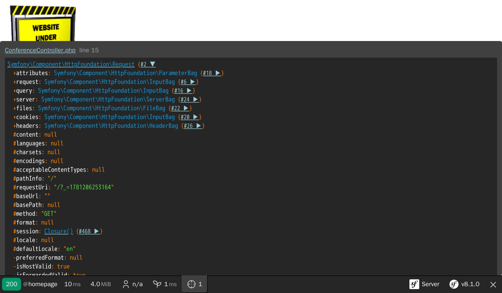

Solucionando problemas
======================

La creación de un proyecto también consiste en disponer de las herramientas adecuadas para depurar los problemas.

Instalando más dependencias
----------------------------

Recuerda que el proyecto se creó con muy pocas dependencias. Sin motor de plantillas. Sin herramientas de depuración. Sin sistema de *logs* (registros). La idea es que puedas añadir más dependencias cuando las necesites. ¿Para qué necesitarías añadir un motor de plantillas si desarrollas una API HTTP o una herramienta de línea de comandos?

¿Cómo podemos añadir más dependencias? A través de Composer. Además de los paquetes "normales" de Composer, trabajaremos con dos tipos "especiales" de paquetes:

* *Componentes Symfony*: Paquetes que implementan las características principales y abstracciones de bajo nivel que la mayoría de las aplicaciones necesitan (enrutamiento, consola, cliente HTTP, mailer, caché, etc.);

* *Bundles Symfony*: Paquetes que añaden características de alto nivel o proporcionan integraciones con librerías de terceros (los bundles son, en su mayoría, aportados por la comunidad).

.. index::
    single: Components;Profiler
    single: Profiler
    single: Web Profiler
    single: Web Debug Toolbar

Para empezar, vamos a agregar el componente Symfony Profiler, una herramienta que te ayudará a ahorrar tiempo a la hora de identificar la causa de un problema:

.. code-block:: terminal

    $ symfony composer req profiler --dev

``profiler`` es un alias para el paquete ``symfony/profiler-pack``.

*Los alias* no son una característica propia de Composer, sino un concepto proporcionado por Symfony para hacer tu vida más fácil. Los alias son atajos para los paquetes populares de Composer. ¿Quieres un ORM para tu aplicación? Utiliza ``orm``. ¿Quieres desarrollar una API? Utiliza ``api``. Estos alias resuelven automáticamente a uno o más paquetes regulares de Composer y son escogidos por consenso entre los miembros del equipo central de Symfony.

Otra característica muy interesante es que siempre puedes omitir la palabra ``symfony`` en el nombre del vendor. Por ejemplo, puedes utilizar ``cache`` en lugar de ``symfony/cache``.

.. tip::

    ¿Recuerdas que antes mencionamos un plugin de Composer llamado ``symfony/flex``? Los alias son una de sus características.

Entendiendo los entornos de Symfony
-----------------------------------

.. index::
    single: Symfony Environments

¿Te has fijado en la opción ``--dev`` en el comando ``composer req``? Como Symfony Profiler sólo es útil durante la fase de desarrollo, queremos evitar que se instale en producción.

Symfony soporta la noción de *entornos* . De forma predeterminada, tiene soporte integrado para tres entornos, pero puedes añadir tantos como desees: ``dev``, ``prod`` y ``test``. Todos los entornos comparten el mismo código, pero trabajan con *configuraciones* diferentes.

Por ejemplo, todas las herramientas de depuración están habilitadas en el entorno ``dev``. En el entorno ``prod`` la aplicación está optimizada para el rendimiento.

El cambio de un entorno a otro puede realizarse modificando la variable de entorno ``APP_ENV``.

Cuando desplegaste el proyecto en Upsun, el entorno (almacenado en ``APP_ENV``) se cambió automáticamente a ``prod``.

Gestionando la configuración de los entornos
---------------------------------------------

.. index::
    single: Environment Variables
    single: .env
    single: .env.local

La variable de entorno ``APP_ENV`` se puede establecer empleando variables de entorno "reales" en tu terminal:

.. code-block:: terminal
    :class: ignore

    $ export APP_ENV=dev

El uso de variables de entorno reales es la forma preferida de establecer valores como ``APP_ENV`` en los servidores de producción. Pero en las máquinas de desarrollo, tener que definir muchas variables de entorno puede ser engorroso. En su lugar, defínelos en un fichero ``.env``.

Un archivo ``.env`` con unos valores cuidadosamente elegidos se genera automáticamente cuando se crea el proyecto:

.. code-block:: text
    :caption: .env
    :class: ignore

    ###> symfony/framework-bundle ###
    APP_ENV=dev
    APP_SECRET=c2927f273163f7225a358e3a1bbbed8a
    #TRUSTED_PROXIES=127.0.0.1,127.0.0.2
    #TRUSTED_HOSTS='^localhost|example\.com$'
    ###< symfony/framework-bundle ###

.. tip::

    Cualquier paquete puede añadir más variables de entorno a este archivo gracias a su receta utilizada por Symfony Flex.

El fichero ``.env`` se envía al repositorio y describe los valores *por defecto* del entorno de producción. Puede sustituir estos valores creando un fichero ``.env.local``. Este archivo no debe ser enviado al repositorio y es por ello que el fichero ``.gitignore`` ya lo está ignorando.

Nunca guardes datos secretos o confidenciales en estos archivos. Veremos cómo manejar los datos confidenciales en otro paso.

Registrando todas las cosas
---------------------------

.. index::
    single: Logger

De entrada, las capacidades de registro en el *log* y la depuración están limitadas en los nuevos proyectos. Agreguemos más herramientas que nos ayuden a investigar los problemas en el desarrollo, pero también los de producción:

.. code-block:: terminal

    $ symfony composer req logger

.. index::
    single: Components;Debug
    single: Debug

Para usar las herramientas de depuración, vamos a instalarlas sólo en desarrollo:

.. code-block:: terminal

    $ symfony composer req debug --dev

Descubriendo las herramientas de depuración de Symfony
-------------------------------------------------------

Si actualizas la página de inicio, ahora deberías ver una barra de herramientas en la parte inferior de la pantalla:

.. figure:: screenshots/wdt.png
    :alt: /
    :align: center
    :figclass: with-browser

Lo primero que vas a notar es el **404** en rojo. Recuerda que es una página de muestra ya que aún no hemos definido una página de inicio. Incluso siendo hermosa la página por defecto que te da la bienvenida, sigue siendo una página de error. Así que el código de estado HTTP correcto es el 404, no el 200. Gracias a la barra de herramientas de depuración web, tienes la información de inmediato.

Si haces clic en el pequeño signo de exclamación, obtendrás el mensaje de excepción "real" almacenado como parte de los registros del *log* en Symfony Profiler. Si deseas ver la traza de la pila del error, haz clic en el enlace "Exception" en el menú de la izquierda.

Siempre que haya un problema con tu código, verás una página de excepción como la siguiente que te da todo lo que necesitas para entender el problema y de dónde viene:

.. figure:: screenshots/exception.png
    :alt: //
    :align: center
    :figclass: with-browser

Tómate tu tiempo para investigar la información que te ofrece Symfony Profiler haciendo clic sobre los distintos elementos.

.. index::
    single: Symfony CLI;server:log

Los registros del *log* también son muy útiles en las sesiones de depuración. Symfony tiene un comando útil para rastrear todos los registros del *log* (desde el servidor web, desde PHP y también desde tu aplicación):

.. code-block:: terminal
    :class: ignore

    $ symfony server:log

Vamos a hacer un pequeño experimento. Abre el fichero ``public/index.php`` y rompe su código PHP (añade foobar en el medio del código, por ejemplo). Actualiza la página en el navegador y observa el flujo del *log*:

.. code-block:: text
    :class: ignore

    Dec 21 10:04:59 |DEBUG| PHP    PHP Parse error:  syntax error, unexpected 'use' (T_USE) in public/index.php on line 5 path="/usr/bin/php7.42" php="7.42.0"
    Dec 21 10:04:59 |ERROR| SERVER GET  (500) / ip="127.0.0.1"

La salida está hermosamente coloreada para llamar tu atención sobre los errores.

.. index::
    single: Components;VarDumper
    single: VarDumper
    single: dump

Otra gran ayuda para la depuración es la función de Symfony ``dump()``. Está siempre disponible y te permite volcar variables complejas en un formato agradable e interactivo.

Cambia ``public/index.php`` temporalmente para mostrar con ``dump()`` el objeto Request:

.. code-block:: diff
    :caption: patch_file

    --- a/public/index.php
    +++ b/public/index.php
    @@ -18,5 +18,8 @@ if ($_SERVER['APP_DEBUG']) {
     $kernel = new Kernel($_SERVER['APP_ENV'], (bool) $_SERVER['APP_DEBUG']);
     $request = Request::createFromGlobals();
     $response = $kernel->handle($request);
    +
    +dump($request);
    +
     $response->send();
     $kernel->terminate($request, $response);

Cuando actualices la página, observa el nuevo icono del "punto de mira" que hay en la barra de herramientas; te permite inspeccionar el volcado producido por ``dump()``. Haz clic en él para acceder a una página completa donde la navegación es más simple:

.. index::
    single: Git;checkout

Revierte los cambios antes de hacer commit de los demás cambios realizados en este paso:

.. code-block:: terminal

    $ git checkout public/index.php

Configurando tu IDE
-------------------

En el entorno de desarrollo, cuando se lanza una excepción, Symfony muestra una página con el mensaje de excepción y el seguimiento de su pila. Cuando se muestra una ruta de archivo, añade un enlace que abre el archivo en la línea correspondiente en tu IDE favorito. Para beneficiarte de esta característica, necesitas configurar tu IDE. Symfony soporta muchos IDEs desde el primer momento; yo estoy usando Visual Studio Code para este proyecto:

.. code-block:: diff
    :caption: patch_file

    --- a/php.ini
    +++ b/php.ini
    @@ -6,3 +6,4 @@ max_execution_time=30
     session.use_strict_mode=On
     realpath_cache_ttl=3600
     zend.detect_unicode=Off
    +xdebug.file_link_format=vscode://file/%f:%l

Los archivos vinculados no están libres de excepciones. Por ejemplo, el controlador en la barra de herramientas de depuración web permite hacer clic después de configurar el IDE.

Depurando en entorno de producción
-----------------------------------

.. index::
    single: Upsun;Remote Logs
    single: Upsun;SSH
    single: Symfony CLI;logs
    single: Symfony CLI;ssh

La depuración de los entornos de producción siempre es más complicada. Por ejemplo, no tienes acceso a Symfony Profiler. Los registros son menos descriptivos. Pero es posible analizar estos registros del *log*:

.. code-block:: terminal
    :class: ignore

    $ symfony logs

Puedes incluso conectarte a través de SSH al contenedor web:

.. code-block:: terminal
    :class: ignore

    $ symfony ssh

No te preocupes, no puedes romper nada fácilmente. La mayor parte del sistema de ficheros es de sólo lectura. No podrás arreglar sobre la marcha en producción. Pero aprenderás una manera de solucionarlo mucho mejor más adelante en el libro.

.. sidebar:: Yendo más allá

    * `Tutorial de SymfonyCasts de entornos y archivos de configuración <https://symfonycasts.com/screencast/symfony-fundamentals/environment-config-files>`_ ;

    * `Tutorial de SymfonyCasts de variables de entorno <https://symfonycasts.com/screencast/symfony-fundamentals/environment-variables>`_ ;

    * `Tutorial de SymfonyCasts de la barra de herramientas de depuración web y profiler <https://symfonycasts.com/screencast/symfony/debug-toolbar-profiler>`_ ;

    * `Gestión de múltiples archivos .env <https://symfony.com/doc/current/configuration.html#managing-multiple-env-files>`_ en aplicaciones Symfony.
