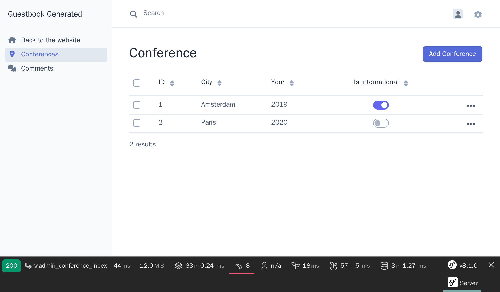
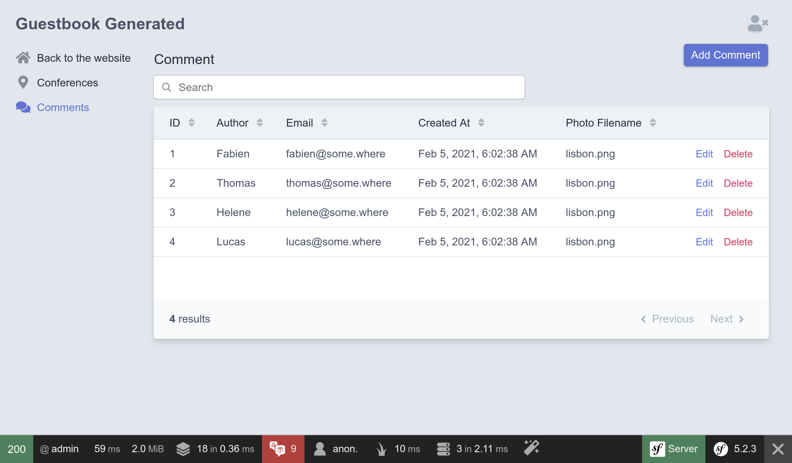

Configurando un panel de administración
========================================

.. index::
    single: EasyAdmin
    single: Admin
    single: Backend

Añadir las próximas conferencias a la base de datos es tarea de los administradores del proyecto. Un *panel de administración* es una sección protegida del sitio web donde *los administradores del proyecto* pueden  gestionar los datos del sitio web, moderar los comentarios y efectuar otro tipo de operaciones.

¿Cómo podemos crearlo rápidamente? Utilizando un *bundle* que  genera un panel de administración a partir del modelo del proyecto. EasyAdmin es perfecto para esta tarea.

Instalando más dependencias
---------------------------

Aunque el paquete ``webapp`` añadió automáticamente muchos paquetes útiles, para algunas características más específicas necesitamos añadir más dependencias. ¿Cómo podemos añadir más dependencias? A través de Composer. Además de los paquetes "normales" de Composer, trabajaremos con dos tipos "especiales" de paquetes:

* *Componentes Symfony*: Paquetes que implementan las características principales y abstracciones de bajo nivel que la mayoría de las aplicaciones necesitan (enrutamiento, consola, cliente HTTP, mailer, caché, etc.);

* *Bundles Symfony*: Paquetes que añaden características de alto nivel o proporcionan integraciones con librerías de terceros (los bundles son, en su mayoría, aportados por la comunidad).

Vamos a añadir EasyAdmin como una dependencia del proyecto:

.. code-block:: terminal

    $ symfony composer req "easycorp/easyadmin-bundle:^5"

*Los alias* no son una característica propia de Composer, sino un concepto proporcionado por Symfony para hacer tu vida más fácil. Los alias son atajos para los paquetes populares de Composer. ¿Quieres un ORM para tu aplicación? Utiliza ``orm``. ¿Quieres desarrollar una API? Utiliza ``api``. Estos alias resuelven automáticamente a uno o más paquetes regulares de Composer y son escogidos por consenso entre los miembros del equipo central de Symfony.

Otra característica muy interesante es que siempre puedes omitir la palabra ``symfony`` en el nombre del vendor. Por ejemplo, puedes utilizar ``cache`` en lugar de ``symfony/cache``.

.. tip::

    ¿Recuerdas que antes mencionamos un plugin de Composer llamado ``symfony/flex``? Los alias son una de sus características.

Configurando EasyAdmin
----------------------

EasyAdmin genera automáticamente un área de administración para tu aplicación basada en controladores específicos.

Para comenzar con EasyAdmin, generaremos un "panel de administración web" que será el punto de entrada principal para gestionar los datos de nuestro sitio web:

.. code-block:: terminal
    :class: answers(DashboardController||src/Controller/Admin/)

    $ symfony console make:admin:dashboard

Aceptando las respuestas predeterminadas se crea el siguiente controlador:

.. code-block:: php
    :caption: src/Controller/Admin/DashboardController.php
    :class: ignore

    namespace App\Controller\Admin;

    use EasyCorp\Bundle\EasyAdminBundle\Attribute\AdminDashboard;
    use EasyCorp\Bundle\EasyAdminBundle\Config\Dashboard;
    use EasyCorp\Bundle\EasyAdminBundle\Config\MenuItem;
    use EasyCorp\Bundle\EasyAdminBundle\Controller\AbstractDashboardController;
    use Symfony\Component\HttpFoundation\Response;

    #[AdminDashboard(routePath: '/admin', routeName: 'admin')]
    class DashboardController extends AbstractDashboardController
    {
        public function index(): Response
        {
            return parent::index();
        }

        public function configureDashboard(): Dashboard
        {
            return Dashboard::new()
                ->setTitle('Guestbook');
        }

        public function configureMenuItems(): iterable
        {
            yield MenuItem::linkToDashboard('Dashboard', 'fa fa-home');
            // yield MenuItem::linkTo(SomeCrudController::class, 'The Label', 'fas fa-list');
        }
    }

Por convención, todos los controladores de administración se almacenan bajo su propio espacio de nombres ``App\Controller\Admin``.

Accede al panel de administración generado en ``/admin`` según lo configurado por el atributo ``#[AdminDashboard]``; puedes cambiar la URL a la que quieras:

.. figure:: screenshots/easy-admin-empty.png
    :alt: /admin
    :align: center
    :figclass: with-browser

¡Boom! Disponemos de una atractiva interfaz shell, lista para ser modificada a nuestras necesidades.

.. index::
    single: CRUD

El siguiente paso es crear los controladores para gestionar conferencias y comentarios.

En el controlador del panel de administración, es posible que te hayas fijado que el método ``configureMenuItems()`` tiene un comentario sobre cómo agregar enlaces a "CRUDs". **CRUD** es un acrónimo de "Crear, Leer, Actualizar y Eliminar", las cuatro operaciones básicas a realizar por cualquier entidad. Eso es exactamente lo que queremos que haga un administrador por nosotros; EasyAdmin incluso lo lleva al siguiente nivel al encargarse también de la búsqueda y filtrado.

Generemos el CRUD para conferencias:

.. code-block:: terminal
    :class: answers(1||src/Controller/Admin/||App\\Controller\\Admin)

    $ symfony console make:admin:crud

Selecciona ``1`` para crear una interfaz de administración para conferencias y usa los valores predeterminados para las otras preguntas. Se debe generar el siguiente archivo:

.. code-block:: php
    :caption: src/Controller/Admin/ConferenceCrudController.php
    :class: ignore

    namespace App\Controller\Admin;

    use App\Entity\Conference;
    use EasyCorp\Bundle\EasyAdminBundle\Controller\AbstractCrudController;

    class ConferenceCrudController extends AbstractCrudController
    {
        public static function getEntityFqcn(): string
        {
            return Conference::class;
        }

        /*
        public function configureFields(string $pageName): iterable
        {
            return [
                IdField::new('id'),
                TextField::new('title'),
                TextEditorField::new('description'),
            ];
        }
        */
    }

Haz lo mismo para comentarios:

.. code-block:: terminal
    :class: answers(0||src/Controller/Admin/||App\\Controller\\Admin)

    $ symfony console make:admin:crud

El último paso es vincular los CRUD de administración de conferencia y comentario con el panel de administración:

.. code-block:: diff
    :caption: patch_file

    --- i/src/Controller/Admin/DashboardController.php
    +++ w/src/Controller/Admin/DashboardController.php
    @@ -44,7 +44,8 @@ class DashboardController extends AbstractDashboardController

         public function configureMenuItems(): iterable
         {
    -        yield MenuItem::linkToDashboard('Dashboard', 'fa fa-home');
    -        // yield MenuItem::linkTo(SomeCrudController::class, 'The Label', 'fas fa-list');
    +        yield MenuItem::linkToRoute('Back to the website', 'fas fa-home', 'homepage');
    +        yield MenuItem::linkTo(ConferenceCrudController::class, 'Conferences', 'fas fa-map-marker-alt');
    +        yield MenuItem::linkTo(CommentCrudController::class, 'Comments', 'fas fa-comments');
         }
     }

Hemos sobrescrito el método ``configureMenuItems()`` para añadir elementos de menú con iconos relevantes para conferencias y comentarios y para añadir un enlace de volver a la página de inicio. Las clases ``ConferenceCrudController`` y ``CommentCrudController`` viven en el mismo espacio de nombres ``App\Controller\Admin`` que el panel de administración, por lo que no necesitan sentencias ``use`` adicionales.

EasyAdmin expone una API para facilitar la vinculación con los CRUD de la entidad a través del método ``MenuItem::linkTo()``, que recibe la clase del controlador CRUD.

La página del panel de administración está vacía por ahora. Aquí es donde puedes mostrar algunas estadísticas o cualquier información relevante. Como no tenemos nada importante que mostrar, redirijamos a la lista de conferencias:

.. code-block:: diff
    :caption: patch_file

    --- i/src/Controller/Admin/DashboardController.php
    +++ w/src/Controller/Admin/DashboardController.php
    @@ -8,6 +8,7 @@ use EasyCorp\Bundle\EasyAdminBundle\Attribute\AdminDashboard;
     use EasyCorp\Bundle\EasyAdminBundle\Config\Dashboard;
     use EasyCorp\Bundle\EasyAdminBundle\Config\MenuItem;
     use EasyCorp\Bundle\EasyAdminBundle\Controller\AbstractDashboardController;
    +use EasyCorp\Bundle\EasyAdminBundle\Router\AdminUrlGenerator;
     use Symfony\Component\HttpFoundation\Response;

     #[AdminDashboard(routePath: '/admin', routeName: 'admin')]
    @@ -15,7 +16,10 @@ class DashboardController extends AbstractDashboardController
     {
         public function index(): Response
         {
    -        return parent::index();
    +        $routeBuilder = $this->container->get(AdminUrlGenerator::class);
    +        $url = $routeBuilder->setController(ConferenceCrudController::class)->generateUrl();
    +
    +        return $this->redirect($url);

             // Option 1. You can make your dashboard redirect to some common page of your backend
             //

Cuando se muestran las relaciones entre entidades (la conferencia vinculada a un comentario), EasyAdmin intenta utilizar una representación textual de la conferencia. De manera predeterminada, usa una convención que utiliza el nombre de la entidad y la clave principal (como ``Conference #1``) si la entidad no define el método "mágico" ``__toString()``. Para que la visualización sea más significativa, añade dicho método en la clase ``Conference``:

.. code-block:: diff
    :caption: patch_file

    --- i/src/Entity/Conference.php
    +++ w/src/Entity/Conference.php
    @@ -35,6 +35,11 @@ class Conference
             $this->comments = new ArrayCollection();
         }

    +    public function __toString(): string
    +    {
    +        return $this->city.' '.$this->year;
    +    }
    +
         public function getId(): ?int
         {
             return $this->id;

Ahora puedes añadir/modificar/eliminar conferencias directamente desde el panel de administración. Juega con él y añade al menos una conferencia.

Personalizando EasyAdmin
------------------------

El panel de administración por defecto funciona bien, pero se puede personalizar de muchas maneras para mejorar la experiencia. Hagamos algunos cambios sencillos en la entidad ``Comment`` para demostrar algunas de sus posibilidades:

.. code-block:: diff
    :caption: patch_file

    --- i/src/Controller/Admin/CommentCrudController.php
    +++ w/src/Controller/Admin/CommentCrudController.php
    @@ -3,10 +3,17 @@
     namespace App\Controller\Admin;

     use App\Entity\Comment;
    +use EasyCorp\Bundle\EasyAdminBundle\Config\Crud;
    +use EasyCorp\Bundle\EasyAdminBundle\Config\Filters;
     use EasyCorp\Bundle\EasyAdminBundle\Controller\AbstractCrudController;
    +use EasyCorp\Bundle\EasyAdminBundle\Field\AssociationField;
    +use EasyCorp\Bundle\EasyAdminBundle\Field\DateTimeField;
    +use EasyCorp\Bundle\EasyAdminBundle\Field\EmailField;
     use EasyCorp\Bundle\EasyAdminBundle\Field\IdField;
    +use EasyCorp\Bundle\EasyAdminBundle\Field\TextareaField;
     use EasyCorp\Bundle\EasyAdminBundle\Field\TextEditorField;
     use EasyCorp\Bundle\EasyAdminBundle\Field\TextField;
    +use EasyCorp\Bundle\EasyAdminBundle\Filter\EntityFilter;

     class CommentCrudController extends AbstractCrudController
     {
    @@ -15,14 +22,43 @@ class CommentCrudController extends AbstractCrudController
             return Comment::class;
         }

    -    /*
    +    public function configureCrud(Crud $crud): Crud
    +    {
    +        return $crud
    +            ->setEntityLabelInSingular('Conference Comment')
    +            ->setEntityLabelInPlural('Conference Comments')
    +            ->setSearchFields(['author', 'text', 'email'])
    +            ->setDefaultSort(['createdAt' => 'DESC'])
    +        ;
    +    }
    +
    +    public function configureFilters(Filters $filters): Filters
    +    {
    +        return $filters
    +            ->add(EntityFilter::new('conference'))
    +        ;
    +    }
    +
         public function configureFields(string $pageName): iterable
         {
    -        return [
    -            IdField::new('id'),
    -            TextField::new('title'),
    -            TextEditorField::new('description'),
    -        ];
    +        yield AssociationField::new('conference');
    +        yield TextField::new('author');
    +        yield EmailField::new('email');
    +        yield TextareaField::new('text')
    +            ->hideOnIndex()
    +        ;
    +        yield TextField::new('photoFilename')
    +            ->onlyOnIndex()
    +        ;
    +
    +        $createdAt = DateTimeField::new('createdAt')->setFormTypeOptions([
    +            'years' => range(date('Y'), date('Y') + 5),
    +            'widget' => 'single_text',
    +        ]);
    +        if (Crud::PAGE_EDIT === $pageName) {
    +            yield $createdAt->setFormTypeOption('disabled', true);
    +        } else {
    +            yield $createdAt;
    +        }
         }
    -    */
     }

Para personalizar la sección ``Comment``, enumerar los campos explícitamente en el método ``configureFields()`` nos permite ordenarlos del modo deseado. Algunos campos permiten más configuración, como ocultar el campo de texto en la página principal.

Añade algunos comentarios sin fotos. De momento, configura la fecha manualmente; rellenaremos la columna ``createdAt`` automáticamente en un paso posterior.

El método ``configureFilters()`` define qué filtros serán mostrados sobre del campo de búsqueda.

.. figure:: screenshots/easy-admin-filter.png
    :alt: /admin?crudAction=index&crudId=2bfa220&menuIndex=2&submenuIndex=-1
    :align: center
    :figclass: with-browser

Estas personalizaciones son solo una pequeña introducción a las posibilidades que ofrece EasyAdmin.

Juega con el panel, filtra los comentarios por conferencia, o busca comentarios por correo electrónico, por ejemplo. Pero todavía nos queda algo por resolver: cualquiera puede acceder al panel de administración. No te preocupes, lo protegeremos más adelante.

.. code-block:: terminal
    :class: hide

    $ symfony console dbal:run-sql "TRUNCATE conference RESTART IDENTITY CASCADE"

.. sidebar:: Yendo más allá

    * `Documentación de EasyAdmin`_ ;

    * `Configuración de referencia del framework Symfony`_ ;

    * `PHP métodos mágicos`_ .

.. _`Documentación de EasyAdmin`: https://symfony.com/bundles/EasyAdminBundle/4.x/index.html
.. _`Configuración de referencia del framework Symfony`: https://symfony.com/doc/current/reference/configuration/framework.html
.. _`PHP métodos mágicos`: https://www.php.net/manual/en/language.oop5.magic.php
