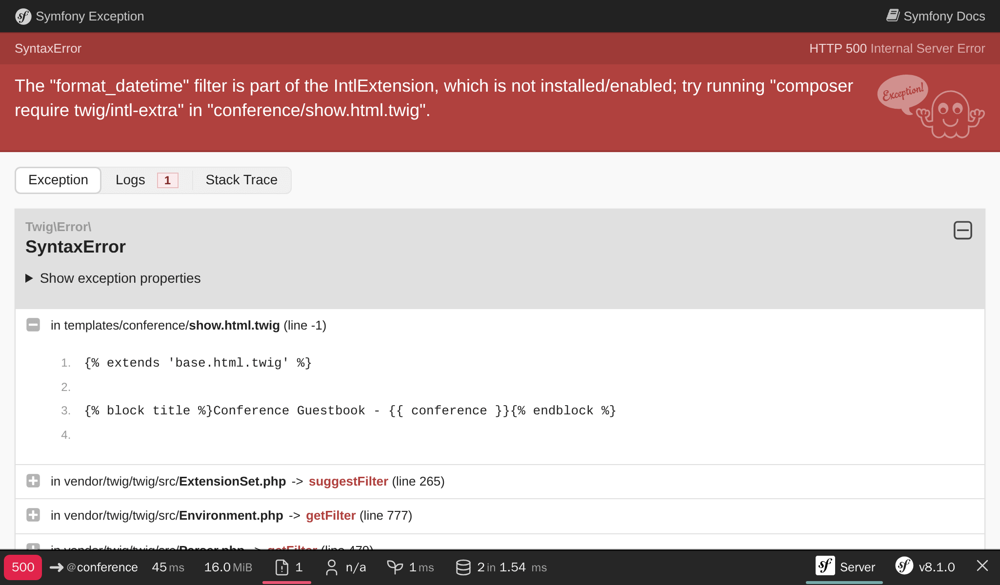
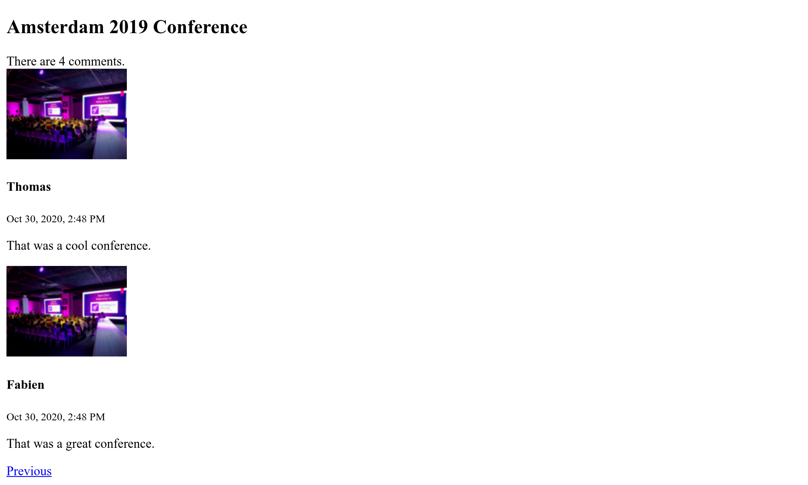

ساخت رابط کاربری
==============================

.. index::
    single: Twig
    single: Templates

اکنون همه چیز برای ساخت اولین نسخه از رابط کاربری وبسایت آماده شده است. ما نمی‌خواهیم ظاهر زیبایی برای آن بسازیم. درحال حاضر کاربردی بودن برایمان کفایت می‌کند.

آیا به خاطر می‌آورید که برای جلوگیری از مشکلات امنیتی، در کنترلر مربوط به تخم‌مرغ عید پاک، مجبور بودیم که داده‌ها را escape کنیم؟ به این علت است که برای قالب‌هایمان (templates) از PHP استفاده نمی‌کنیم. به جای آن از Twig استفاده می‌کنیم. علاوه بر رسیدگی به escape کردن خروجی‌ها، `Twig`_ ویژگی‌های بسیار زیادی دیگری همچون وراثت قالب‌ها را نیز برایمان به ارمغان می‌آورد.

استفاده از Twig برای قالب‌ها
-------------------------------------------------

.. index::
    single: Twig;Layout
    single: Twig;block

تمام صفحات وبسایت، از *چیدمان (layout)* یکسانی استفاده خواهند کرد. در هنگام نصب Twig، پوشه ``templates/`` به طور خودکار ساخته شده و به یک چیدمان نمونه با نام ``base.html.twig`` نیز ایجاد شده است.

.. code-block:: html+twig
    :caption: templates/base.html.twig
    :class: ignore

    <!DOCTYPE html>
    <html>
        <head>
            <meta charset="UTF-8">
            <title>Welcome!</title>
            <link rel="icon" href="data:image/svg+xml,<svg xmlns=%22http://www.w3.org/2000/svg%22 viewBox=%220 0 128 128%22><text y=%221.2em%22 font-size=%2296%22>⚫️</text><text y=%221.3em%22 x=%220.2em%22 font-size=%2276%22 fill=%22%23fff%22>sf</text></svg>">
            
            

            
                {{ importmap('app') }}
            
        </head>
        <body>
            
        </body>
    </html>

یک چیدمان می‌تواند المان‌هایی با عنوان ``block`` تعریف کند. بلاک‌ها مکان‌هایی هستند که *چیدمان‌های فرزند (child templates)* که چیدمان والد را *بسط می‌دهند (extend)*، محتوایشان را در آن قرار می‌دهند.

.. index::
    single: Twig;extends
    single: Twig;for

بیاید یک قالب برای صفحه اصلی پروژه در فایل ``templates/conference/index.html.twig`` ایجاد نماییم:

.. code-block:: html+twig
    :caption: templates/conference/index.html.twig

    

    Conference Guestbook

    
        <h2>Give your feedback!</h2>

        
            <h4>{{ conference }}</h4>
        
    

این قالب، چیدمان ``base.html.twig`` را *بسط می‌دهد* و بلاک‌های ``title`` و ``body`` را بازتعریف می‌کند.

.. index::
    single: Twig;Syntax

نشانه‌گذاری ```` در قالب، *اعمال (actions)* و *ساختار‌ (structure)* را نشان می‌دهد.

نشانه‌گذاری ``{{ }}`` برای *نمایش (display)* چیزی استفاده می‌شود. مثلاً ``{{ conference }}`` نمایش کنفرانس را نشان می‌دهد (نتیجه‌ی فراخوانی ``__toString`` بر روی شیء ``Conference``).

استفاده از Twig در کنترلر
------------------------------------------

کنترلر را جهت renderکردن قالب Twig به‌روز نمایید:

.. code-block:: diff
    :caption: patch_file

    --- i/src/Controller/ConferenceController.php
    +++ w/src/Controller/ConferenceController.php
    @@ -2,22 +2,19 @@

     namespace App\Controller;

    +use App\Repository\ConferenceRepository;
     use Symfony\Bundle\FrameworkBundle\Controller\AbstractController;
     use Symfony\Component\HttpFoundation\Response;
     use Symfony\Component\Routing\Attribute\Route;
    +use Twig\Environment;

     final class ConferenceController extends AbstractController
     {
         #[Route('/', name: 'homepage')]
    -    public function index(): Response
    +    public function index(Environment $twig, ConferenceRepository $conferenceRepository): Response
         {
    -        return new Response(<<<EOF
    -            <html>
    -                <body>
    -                    
    -                </body>
    -            </html>
    -            EOF
    -        );
    +        return new Response($twig->render('conference/index.html.twig', [
    +            'conferences' => $conferenceRepository->findAll(),
    +        ]));
         }
     }

در اینجا اتفاقات زیادی رخ می‌دهد.

برای اینکه قادر به renderکردن قالب باشیم، به شیء محیطِ (``Environment``) Twig نیاز داریم (نقطه‌ی ورودی اصلی Twig). توجه کنید که ما نمونه‌ای از Twig را با type-hintکردن در متد کنترلر، درخواست کردیم. سیمفونی به اندازه کافی هوشمند است که بداند چگونه شیء صحیح را تزریق کند.

همچنین به مخزن کنفرانس برای گرفتن تمامی کنفرانس‌ها از پایگاه‌داده نیاز داریم.

در داخل کنترلر، متد ``render()``، قالب را render کرده و آرایه‌ای از متغیر‌ها را به قالب می‌دهد. در اینجا ما لیستی از اشیاء ``Conference`` را در قالب یک متغیر ``conferences`` به قالب می‌دهیم.

کنترلر یک کلاس استاندار PHP است. اگر بخواهیم در رابطه با وابستگی‌ها صریح باشیم، حتی نیازی به بسط کلاس ``AbstractController`` هم نداریم و می‌توانید آن را حذف کنید (اما این کار را نکنید، چرا که می‌خواهیم از میانبرهای دلچسبی که فراهم می‌آورد، در گام‌های آتی بهره ببریم).

ایجاد یک صفحه برای کنفرانس
------------------------------------------------

هر کنفرانس باید دارای یک صفحه‌ی اختصاصی باشد تا کامنت‌هایش را در آن لیست کند. اضافه کردن یک صفحه به معنی اضافه کردن یک کنترلر، تعریف یک راه (route) برای آن و ایجاد قالب‌های مربوطه است.

متد ``show()`` را در فایل ``src/Controller/ConferenceController.php`` اضافه نمایید:

.. code-block:: diff
    :caption: patch_file

    --- i/src/Controller/ConferenceController.php
    +++ w/src/Controller/ConferenceController.php
    @@ -2,6 +2,9 @@

     namespace App\Controller;

    +use App\Entity\Conference;
    +use App\Repository\CommentRepository;
     use App\Repository\ConferenceRepository;
    +use Symfony\Bridge\Doctrine\Attribute\MapEntity;
     use Symfony\Bundle\FrameworkBundle\Controller\AbstractController;
     use Symfony\Component\HttpFoundation\Response;
    @@ -17,4 +20,13 @@ final class ConferenceController extends AbstractController
                 'conferences' => $conferenceRepository->findAll(),
             ]));
         }
    +
    +    #[Route('/conference/{id}', name: 'conference')]
    +    public function show(Environment $twig, #[MapEntity] Conference $conference, CommentRepository $commentRepository): Response
    +    {
    +        return new Response($twig->render('conference/show.html.twig', [
    +            'conference' => $conference,
    +            'comments' => $commentRepository->findBy(['conference' => $conference], ['createdAt' => 'DESC']),
    +        ]));
    +    }
     }

این متد یک رفتار مخصوص دارد که هنوز آن را ندیده‌ایم. درخواست می‌کنیم تا یک نمونه ``Conference`` به این متد تزریق شود. اما ممکن است تعداد زیادی از این شیء در پایگاه‌داده موجود باشد. attribute‌ی ``#[MapEntity]`` به سیمفونی می‌گوید که به کمک ``{id}`` که در مسیر درخواست داده شده است (``id`` همان کلید اصلی جدول ``conference`` در پایگاه‌داده است)، نمونه‌ی درست را واکشی کند.

دریافت کامنت‌های مربوط به یک کنفرانس می‌تواند از طریق متد ``findBy()`` صورت پذیرد که یک شاخص را به عنوان اولین آرگمان می‌پذیرد.

.. index::
    single: Twig;extends
    single: Twig;block
    single: Twig;for
    single: Twig;if
    single: Twig;else
    single: Twig;asset
    single: Twig;format_datetime
    single: Twig;length

آخرین گام ایجاد فایل ``templates/conference/show.html.twig`` است:

.. code-block:: html+twig
    :caption: templates/conference/show.html.twig

    

    Conference Guestbook - {{ conference }}

    
        <h2>{{ conference }} Conference</h2>

        
            
                
                    
                

                <h4>{{ comment.author }}</h4>
                <small>
                    {{ comment.createdAt|format_datetime('medium', 'short') }}
                </small>

                
{{ comment.text }}

            
        
            
No comments have been posted yet for this conference.

        
    

در این قالب، ما از علامت ``|`` برای فراخوانی *فیلترهای* Twig استفاده می‌کنیم. یک فیلتر، یک مقدار را دگرگون می‌کند. ``comments|length`` تعداد کامنت‌ها را بازمی‌گرداند و ``comment.createdAt|format_datetime('medium', 'short')`` تاریخ را به یک فرمت قابل‌خوانش برای انسان تبدیل می‌کند.

سعی کنید تا از طریق ``/conference/1`` به «اولین» کنفرانس دست یابید و به خطای زیر توجه کنید:

خطا از فیلتر ``format_datetime`` نشأت می‌گیرد، چرا که این فیلتر بخشی از هسته‌ی Twig نیست. پیغام خطا درباره‌ی اینکه برای رفع این مشکل چه بسته‌ای باید نصب شود، به شما یک راهنمایی ارائه می‌کند:

.. code-block:: terminal

    $ symfony composer req "twig/intl-extra:^3"

اکنون صفحه به‌درستی کار می‌کند.

پیوند صفحات به یکدیگر
---------------------------------------

.. index::
    single: Twig;Link
    single: Link

آخرین مرحله برای به پایان رساندن اولین نسخه‌ی رابط کاربری ما، ایجاد یک پیوند به صفحات کنفرانس از صفحه اصلی است:

.. code-block:: diff
    :caption: patch_file

    --- i/templates/conference/index.html.twig
    +++ w/templates/conference/index.html.twig
    @@ -7,5 +7,8 @@

         
             <h4>{{ conference }}</h4>
    +        

    +            <a href="/conference/{{ conference.id }}">View</a>
    +        

         
     

اما هاردکد کردن مسیر به چند دلیل ایده‌ی بدی است. مهمترین دلیل این است که اگر مسیر را تغییر دهید (مثلاً تغییر مسیر از ``/conference/{id}`` به ``/conferences/{id}``)، باید تمام پیوند‌ها را به صورت دستی به‌روزرسانی کنید.

.. index::
    single: Twig;path

به جای آن، از *تابعِ* ``path()`` (یک از توابع Twig) و *نامِ راه (route name)* استفاده کنید:

.. code-block:: diff
    :caption: patch_file

    --- i/templates/conference/index.html.twig
    +++ w/templates/conference/index.html.twig
    @@ -8,7 +8,7 @@
         
             <h4>{{ conference }}</h4>
             

    -            <a href="/conference/{{ conference.id }}">View</a>
    +            <a href="{{ path('conference', { id: conference.id }) }}">View</a>
             

         
     

تابع ``path()`` با استفاده از نامِ راه، مسیر را تولید می‌کند. مقادیر پارامترهای راه، به صورت یک Twig map به تابع داده می‌شود.

صفحه‌بندی کامنت‌ها
-------------------------------------

.. index::
    single: Doctrine;Paginator
    single: Paginator

با هزاران شرکت‌کننده، می‌توانیم انتظار تعداد زیادی کامنت داشته باشیم. اگر تمام آن‌ها را در یک صفحه نمایش دهیم، صفحه با سرعت بسیار زیادی رشد می‌کند.

در Comment Repository، یک متد با نام ``getCommentPaginator()`` ایجاد کنید که بر مبنای یک کنفرانس و یک آفست (از کجا شروع شود)، یک Comment *Paginator* را بازگرداند:

.. code-block:: diff
    :caption: patch_file

    --- i/src/Repository/CommentRepository.php
    +++ w/src/Repository/CommentRepository.php
    @@ -3,19 +3,37 @@
     namespace App\Repository;

     use App\Entity\Comment;
    +use App\Entity\Conference;
     use Doctrine\Bundle\DoctrineBundle\Repository\ServiceEntityRepository;
     use Doctrine\Persistence\ManagerRegistry;
    +use Doctrine\ORM\Tools\Pagination\Paginator;

     /**
      * @extends ServiceEntityRepository<Comment>
      */
     class CommentRepository extends ServiceEntityRepository
     {
    +    public const COMMENTS_PER_PAGE = 2;
    +
         public function __construct(ManagerRegistry $registry)
         {
             parent::__construct($registry, Comment::class);
         }

    +    public function getCommentPaginator(Conference $conference, int $offset): Paginator
    +    {
    +        $query = $this->createQueryBuilder('c')
    +            ->andWhere('c.conference = :conference')
    +            ->setParameter('conference', $conference)
    +            ->orderBy('c.createdAt', 'DESC')
    +            ->setMaxResults(self::COMMENTS_PER_PAGE)
    +            ->setFirstResult($offset)
    +            ->getQuery()
    +        ;
    +
    +        return new Paginator($query);
    +    }
    +
         //    /**
         //     * @return Comment[] Returns an array of Comment objects
         //     */

برای سهولت در آزمایش، حداکثر تعداد کامنت‌ها در هر صفحه را برابر با ۲ قرار داده‌ایم.

برای مدیریت صفحه‌بندی در قالب، Doctrine Paginator را به جای Doctrine Collection، به Twig بدهید:

.. code-block:: diff
    :caption: patch_file

    --- i/src/Controller/ConferenceController.php
    +++ w/src/Controller/ConferenceController.php
    @@ -8,6 +8,7 @@ use App\Repository\ConferenceRepository;
     use Symfony\Bridge\Doctrine\Attribute\MapEntity;
     use Symfony\Bundle\FrameworkBundle\Controller\AbstractController;
     use Symfony\Component\HttpFoundation\Response;
    +use Symfony\Component\HttpKernel\Attribute\MapQueryParameter;
     use Symfony\Component\Routing\Attribute\Route;
     use Twig\Environment;

    @@ -22,11 +23,15 @@ final class ConferenceController extends AbstractController
         }

         #[Route('/conference/{id}', name: 'conference')]
    -    public function show(Environment $twig, #[MapEntity] Conference $conference, CommentRepository $commentRepository): Response
    +    public function show(Environment $twig, #[MapEntity] Conference $conference, CommentRepository $commentRepository, #[MapQueryParameter(options: ['min_range' => 0])] int $offset = 0): Response
         {
    +        $paginator = $commentRepository->getCommentPaginator($conference, $offset);
    +
             return new Response($twig->render('conference/show.html.twig', [
                 'conference' => $conference,
    -            'comments' => $commentRepository->findBy(['conference' => $conference], ['createdAt' => 'DESC']),
    +            'comments' => $paginator,
    +            'previous' => $offset - CommentRepository::COMMENTS_PER_PAGE,
    +            'next' => min(count($paginator), $offset + CommentRepository::COMMENTS_PER_PAGE),
             ]));
         }
     }

attribute‌ی ``#[MapQueryParameter]`` پارامتر رشته‌ی پرس‌وجوی ``offset`` را به آرگمان ``$offset`` کنترلر می‌نگارد و در صورت تنظیم‌نشدن، مقدار پیش‌فرض را برابر با ``0`` قرار می‌دهد. از آنجایی که offset از سمت کلاینت می‌آید، گزینه‌ی ``min_range`` اعتبارسنجی می‌کند که منفی نباشد؛ سیمفونی در صورت نامعتبر بودن مقدار، یک پاسخ ۴۰۴ بازمی‌گرداند.

آفست صفحات قبلی (``previous``) و بعدی (``next``)، برمبنای تمام اطلاعاتی که از صفحه‌بند (paginator) در اختیار داریم، محاسبه می‌شود.

.. index::
    single: Twig;if

در نهایت، قالب را با افزودن پیوندهایی به صفحات بعدی و قبلی، به‌روز نمایید:

.. code-block:: diff
    :caption: patch_file

    --- i/templates/conference/show.html.twig
    +++ w/templates/conference/show.html.twig
    @@ -6,6 +6,8 @@
         <h2>{{ conference }} Conference</h2>

         
    +        
There are {{ comments|length }} comments.

    +
             
                 
                     
    @@ -18,6 +20,13 @@

                 
{{ comment.text }}

             
    +
    +        
    +            <a href="{{ path('conference', { id: conference.id, offset: previous }) }}">Previous</a>
    +        
    +        
    +            <a href="{{ path('conference', { id: conference.id, offset: next }) }}">Next</a>
    +        
         
             
No comments have been posted yet for this conference.

         

اکنون باید با استفاده از پیوندهای «قبلی» و «بعدی»، قادر به پیمایش در میان کامنت‌ها باشید:

.. figure:: screenshots/pagination-next.png
    :alt: /conference/1
    :align: center
    :figclass: with-browser

Refactorکردن کنترلر
-----------------------------

شاید توجه کرده باشید که هر دو متدِ درون ``ConferenceController`` یک متغیر محیط Twig را به عنوان آرگومان می‌گیرند. بیایید به جای تزریق آن به هر متد، از متد کمکی ``render()`` که توسط کلاس والد فراهم می‌شود، بهره ببریم:

.. code-block:: diff
    :caption: patch_file

    --- i/src/Controller/ConferenceController.php
    +++ w/src/Controller/ConferenceController.php
    @@ -9,28 +9,27 @@ use Symfony\Bundle\FrameworkBundle\Controller\AbstractController;
     use Symfony\Component\HttpFoundation\Response;
     use Symfony\Component\HttpKernel\Attribute\MapQueryParameter;
     use Symfony\Component\Routing\Attribute\Route;
    -use Twig\Environment;

     final class ConferenceController extends AbstractController
     {
         #[Route('/', name: 'homepage')]
    -    public function index(Environment $twig, ConferenceRepository $conferenceRepository): Response
    +    public function index(ConferenceRepository $conferenceRepository): Response
         {
    -        return new Response($twig->render('conference/index.html.twig', [
    +        return $this->render('conference/index.html.twig', [
                 'conferences' => $conferenceRepository->findAll(),
    -        ]));
    +        ]);
         }

         #[Route('/conference/{id}', name: 'conference')]
    -    public function show(Environment $twig, #[MapEntity] Conference $conference, CommentRepository $commentRepository, #[MapQueryParameter(options: ['min_range' => 0])] int $offset = 0): Response
    +    public function show(#[MapEntity] Conference $conference, CommentRepository $commentRepository, #[MapQueryParameter(options: ['min_range' => 0])] int $offset = 0): Response
         {
             $paginator = $commentRepository->getCommentPaginator($conference, $offset);

    -        return new Response($twig->render('conference/show.html.twig', [
    +        return $this->render('conference/show.html.twig', [
                 'conference' => $conference,
                 'comments' => $paginator,
                 'previous' => $offset - CommentRepository::COMMENTS_PER_PAGE,
                 'next' => min(count($paginator), $offset + CommentRepository::COMMENTS_PER_PAGE),
    -        ]));
    +        ]);
         }
     }

.. sidebar:: بیشتر بدانید

    * `مستندات Twig`_؛

    * `نحوه‌ی ایجاد و استفاده از قالب‌ها`_ در اپلیکیشن‌های سیمفونی؛

    * `آموزش تصویری Twig در SymfonyCasts`_؛

    * `توابع و فیلترهای Twig که تنها در سیمفونی در دسترس هستند`_؛

    * `کنترلر پایه‌ی AbstractController`_.

.. _`Twig`: https://twig.symfony.com/
.. _`مستندات Twig`: https://twig.symfony.com/doc/3.x/
.. _`نحوه‌ی ایجاد و استفاده از قالب‌ها`: https://symfony.com/doc/current/templates.html
.. _`آموزش تصویری Twig در SymfonyCasts`: https://symfonycasts.com/screencast/symfony/twig-recipe
.. _`توابع و فیلترهای Twig که تنها در سیمفونی در دسترس هستند`: https://symfony.com/doc/current/reference/twig_reference.html
.. _`کنترلر پایه‌ی AbstractController`: https://symfony.com/doc/current/controller.html#the-base-controller-classes-services
