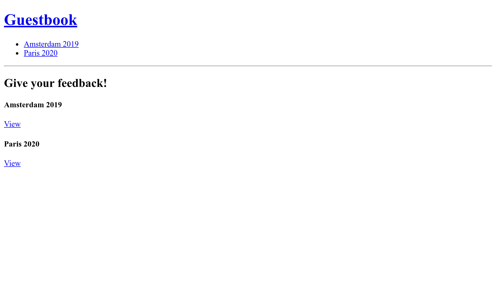

گوش‌دادن به رویدادها
=======================================

چیدمان فعلی، فاقد یک سربرگ پیمایش (navigation header)، جهت بازگشت به صفحه‌ی اصلی یا رفتن از یک کنفرانس به کنفرانس دیگر است.

افزودن یک سربرگ به وب‌سایت
-------------------------------------------------

.. index::
    single: Twig;for
    single: Twig;path

هر چیزی که بخواهد در تمام صفحات وب‌سایت نمایش داده شود، مانند یک سربرگ، باید بخشی از چیدمان پایه‌ی اصلی وب‌سایت باشد:

.. code-block:: diff
    :caption: patch_file

    --- i/templates/base.html.twig
    +++ w/templates/base.html.twig
    @@ -12,6 +12,15 @@
             
         </head>
         <body>
    +        <header>
    +            <h1><a href="{{ path('homepage') }}">Guestbook</a></h1>
    +            <ul>
    +            
    +                <li><a href="{{ path('conference', { id: conference.id }) }}">{{ conference }}</a></li>
    +            
    +            </ul>
    +            

    +        </header>
             
         </body>
     </html>

افزودن این کد به چیدمان به معنی آن است که تمام قالب‌هایی که آن را بسط می‌دهند، باید یک متغیر ``conferences`` تعریف کنند که در کنترلرشان ایجاد شده و به قالب داده می‌شود.

از آنجایی که تنها دو کنترلر داریم، *ممکن است* کار زیر را انجام دهید (این تغییر را در کد خود اعمال نکنید، زیرا به‌زودی روش بهتری را خواهیم آموخت):

.. code-block:: diff
    :class: ignore

    --- i/src/Controller/ConferenceController.php
    +++ w/src/Controller/ConferenceController.php
    @@ -21,11 +21,12 @@ final class ConferenceController extends AbstractController
         }

         #[Route('/conference/{id}', name: 'conference')]
    -    public function show(#[MapEntity] Conference $conference, CommentRepository $commentRepository, #[MapQueryParameter(options: ['min_range' => 0])] int $offset = 0): Response
    +    public function show(#[MapEntity] Conference $conference, CommentRepository $commentRepository, ConferenceRepository $conferenceRepository, #[MapQueryParameter(options: ['min_range' => 0])] int $offset = 0): Response
         {
             $paginator = $commentRepository->getCommentPaginator($conference, $offset);

             return $this->render('conference/show.html.twig', [
    +            'conferences' => $conferenceRepository->findAll(),
                 'conference' => $conference,
                 'comments' => $paginator,
                 'previous' => $offset - CommentRepository::COMMENTS_PER_PAGE,

تصور کنید تعداد زیادی کنترلر دارید و می‌خواهید همین کار را در تک تک آن‌ها تکرار کنید. این کار زیاد عملی نیست و باید راه بهتری وجود داشته باشد.

Twig از مفهوم متغیر‌های جهانی برخوردار است. یک *متغیر جهانی (global variable)* در تمام قالب‌های renderشده در دسترس است. شما می‌توانید این نوع متغیرها را در فایل پیکربندی تعریف کنید، اما این روش تنها برای مقادیر ایستا کارا است. ما برای افزودن تمام کنفرانس‌ها به عنوان متغیر جهانی Twig، یک شنونده (listener) ایجاد خواهیم کرد.

کشف رویدادهای سیمفونی
----------------------------------------

.. index::
    single: Components;Event Dispatcher
    single: Event

سیمفونی به صورت توکار، دارای یک کامپوننت اعزام‌کننده‌ی رویداد (Event Dispatcher) است. یک اعزام‌کننده، *رویداد‌های* معینی را در زمانی مشخص *اعزام می‌کند* که شنونده‌ها می‌توانند به آن گوش دهند. شنونده‌ها قلاب‌هایی (hooks) به بخش درونی چارچوب هستند.

برای نمونه، برخی از رویداد‌ها به شما اجازه می‌دهند تا با چرخه‌حیات درخواست‌های HTTP، تعامل داشته باشید. در طول رسیدگی به درخواست، اعزام‌کننده زمانی که درخواست ایجاد می‌شود، زمانی که کنترلر می‌خواهد اجرا شود، زمانی که پاسخ برای ارسال آماده است و یا زمانی که یک استثناء پرتاب شده  است،  یک رویداد اعزام می‌کند. یک *شنونده* می‌تواند به یک یا چند رویداد گوش کرده و بر اساس رویداد زمینه، منطقی را اجرا کند.

رویداد‌ها افزونه‌هایی خوش‌تعریف هستند که چارچوب را عمومی‌تر و بسط‌پذیرتر می‌کنند. بسیاری از کامپوننت‌های سیمفونی مثل Security، Messenger، Workflow یا Mailer به صورت گسترده از آن‌ها استفاده می‌کنند.

یکی دیگر از مثال‌های توکار رویدادها و شنونده‌ها در عمل، چرخه‌حیات فرمان (command) است: شما می‌توانید یک شنونده ایجاد کنید که قبل از اجرای هر فرمان، کدی را به اجرا درآورد.

هر بسته یا باندل نیز می‌تواند رویدادهای خود را اعزام کند تا کدش را بسط‌پذیر نماید.

برای جلوگیری از داشتن یک فایل که توصیف‌کننده‌ی این باشد که یک شنونده می‌خواهد به چه رویداد‌هایی گوش کند، attribute‌ی ``#[AsEventListener]`` را روی کلاس یا متد شنونده اضافه کنید. این باعث می‌شود تا شنونده‌ها بتوانند به صورت خودکار در اعزام‌کننده‌ی سیمفونی ثبت شوند.

پیاده‌سازی یک شنونده (Listener)
------------------------------------------------

.. index::
    single: Event;Listener
    single: Listener
    single: Command;make:listener

حالا دیگر روش کار را با تمام وجود درک کرده‌اید، از باندل maker استفاده کنید تا یک شنونده تولید کنید:

.. code-block:: terminal
    :class: answers(Symfony\\Component\\HttpKernel\\Event\\ControllerEvent)

    $ symfony console make:listener TwigEventListener

فرمان از شما می‌پرسد که می‌خواهید به چه رویدادهایی را گوش کنید. رویداد ``Symfony\Component\HttpKernel\Event\ControllerEvent`` را انتخاب کنید که دقیقاً قبل از اجرای کنترلر فراخوانی می‌شود. این بهترین زمان برای تزریق متغیر جهانی ``conferences`` است تا هنگامی که کنترلر قالب را render می‌کند، Twig به آن دسترسی داشته باشد. شنونده خود را به صورت زیر به‌روزرسانی کنید:

.. code-block:: diff
    :caption: patch_file

    --- i/src/EventListener/TwigEventListener.php
    +++ w/src/EventListener/TwigEventListener.php
    @@ -2,14 +2,22 @@

     namespace App\EventListener;

    +use App\Repository\ConferenceRepository;
     use Symfony\Component\EventDispatcher\Attribute\AsEventListener;
     use Symfony\Component\HttpKernel\Event\ControllerEvent;
    +use Twig\Environment;

     final class TwigEventListener
     {
    +    public function __construct(
    +        private Environment $twig,
    +        private ConferenceRepository $conferenceRepository,
    +    ) {
    +    }
    +
         #[AsEventListener]
         public function onControllerEvent(ControllerEvent $event): void
         {
    -        // ...
    +        $this->twig->addGlobal('conferences', $this->conferenceRepository->findAll());
         }
     }

حالا می‌توانید به هر تعداد که می‌خواهید کنترلر اضافه کنید: متغیر ``conferences`` همواره برای Twig در دسترس خواهد بود.

.. note::

    در گام بعدی در مورد یک روش جایگزین با کارایی بسیار بهتر صحبت خواهیم کرد.

مرتب‌سازی کنفرانس‌ها بر اساس سال و شهر
------------------------------------------------------------------------

مرتب‌کردن کنفرانس‌ها بر اساس سال می‌تواند مرورکردن را تسهیل کند. ما می‌توانیم یک متد سفارشی برای دریافت و مرتب‌سازی تمام کنفرانس‌ها ایجاد کنیم، اما به جای آن می‌خواهیم پیاده‌سازی پیشفرض متد ``findAll()`` را تغییر دهیم تا ماطمینان یابیم که مرتب‌سازی به همه‌جا اعمال می‌گردد:

.. code-block:: diff
    :caption: patch_file

    --- i/src/Repository/ConferenceRepository.php
    +++ w/src/Repository/ConferenceRepository.php
    @@ -16,6 +16,11 @@ class ConferenceRepository extends ServiceEntityRepository
             parent::__construct($registry, Conference::class);
         }

    +    public function findAll(): array
    +    {
    +        return $this->findBy([], ['year' => 'ASC', 'city' => 'ASC']);
    +    }
    +
         //    /**
         //     * @return Conference[] Returns an array of Conference objects
         //     */

در انتهای این گام، وب‌سایت باید مشابه شکل زیر باشد:

.. sidebar:: بیشتر بدانید

    * `جریان درخواست-پاسخ`_ در اپلیکیشن‌های سیمفونی؛

    * `رویداد‌های توکار HTTP در سیمفونی`_؛

    * `رویداد‌های توکار کنسول سیمفونی`_.

.. _`جریان درخواست-پاسخ`: https://symfony.com/doc/current/components/http_kernel.html#the-workflow-of-a-request
.. _`رویداد‌های توکار HTTP در سیمفونی`: https://symfony.com/doc/current/reference/events.html
.. _`رویداد‌های توکار کنسول سیمفونی`: https://symfony.com/doc/current/components/console/events.html
