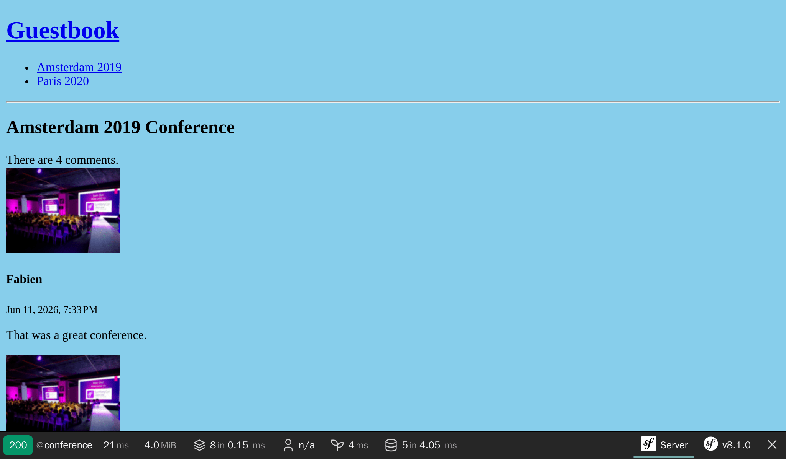

مدیریت چرخه‌حیات اشیاء Doctrine
====================================================

زمانی که یک نظر جدید ایجاد می‌شود، اگر مقدار  ``createdAt`` به صورت خودکار به زمان و تاریخ فعلی تنظیم گردد، عالی می‌شود.

Doctrine راه‌های متفاوتی برای دستکاری اشیاء و ویژگی‌هایشان در طول چرخه‌حیات اشیاء ارائه می‌دهد (قبل از اینکه ردیف در پایگاه‌داده ایجاد شود، بعد از به‌روزرسانی ردیف و غیره).

تعریف فراخوانی‌های چرخه‌حیات
--------------------------------------------------------

.. index::
    single: Doctrine;Lifecycle
    single: Attributes;ORM\\Entity
    single: Attributes;ORM\\HasLifecycleCallbacks
    single: Attributes;ORM\\PrePersist

زمانی که رفتار مورد نظر، به هیچ سرویسی احتیاج ندارد و باید تنها به یک نوع موجودیت (entity) اعمال شود، یک فراخوانی در کلاس موجودیت تعریف کنید:

.. code-block:: diff
    :caption: patch_file

    --- i/src/Controller/Admin/CommentCrudController.php
    +++ w/src/Controller/Admin/CommentCrudController.php
    @@ -57,8 +57,6 @@ class CommentCrudController extends AbstractCrudController
             ]);
             if (Crud::PAGE_EDIT === $pageName) {
                 yield $createdAt->setFormTypeOption('disabled', true);
    -        } else {
    -            yield $createdAt;
             }
         }
     }
    --- i/src/Entity/Comment.php
    +++ w/src/Entity/Comment.php
    @@ -7,6 +7,7 @@ use Doctrine\DBAL\Types\Types;
     use Doctrine\ORM\Mapping as ORM;

     #[ORM\Entity(repositoryClass: CommentRepository::class)]
    +#[ORM\HasLifecycleCallbacks]
     class Comment
     {
         #[ORM\Id]
    @@ -86,6 +87,12 @@ class Comment
             return $this;
         }

    +    #[ORM\PrePersist]
    +    public function setCreatedAtValue(): void
    +    {
    +        $this->createdAt = new \DateTimeImmutable();
    +    }
    +
         public function getConference(): ?Conference
         {
             return $this->conference;

*رویدادِ* ``ORM\PrePersist``، زمانی که شیء در پایگاه‌داده برای اولین بار ذخیره می‌شود، به وقوع می‌پیوندد. وقتی این اتفاق بیافتد، متد ``setCreatedAtValue()`` فراخوانی شده و تاریخ و زمان فعلی، برای مقداردهی به ویژگی ``createdAt`` استفاده می‌شود.

افزودن Slug به کنفرانس‌ها
--------------------------------------------

URLهایِ کنفرانس‌ها معنادار نیستند: ``/conference/1``. مهمتر از آن، به جزئیات پیاده‌سازی وابسته‌اند (کلید اصلی پایگاه‌داده لو می‌رود).

به عنوان جایگزین، URLهایی همچون ``/conference/paris-2020`` چطور هستند؟ این بسیار بهتر به نظر می‌رسد. ``paris-2020`` چیزی است که ما به آن *slug* کنفرانس می‌گوییم.

.. index::
    single: Command;make:entity

یک ویژگی جدید با نام *slug* به کنفرانس‌ها اضافه کنید (یک رشته‌ی ناتهی از ۲۵۵ حرف):

.. code-block:: terminal
    :class: answers(slug||string||255||no)

    $ symfony console make:entity Conference

.. index::
    single: Command;make:migration

یک فایل جدید migration برای افزودن ستون جدید ایجاد کنید:

.. code-block:: terminal

    $ symfony console make:migration

.. index::
    single: Command;doctrine:migrations:migrate

و این migration جدید را اجرا کنید:

.. code-block:: terminal
    :class: ignore

    $ symfony console doctrine:migrations:migrate

خطا دریافت کردید؟ همین هم انتظار می‌رفت. چرا؟ چون ما خواستیم که slug ``null`` نباشد اما مدخل‌های موجود در پایگاه‌داده‌ی کنفرانس‌ها، وقتی migration   اجرا می‌شود، مقدار ``null`` می‌گیرد. بیایید با اصلاح migration این مسئله را حل کنیم:

.. code-block:: diff
    :caption: patch_file

    --- i/migrations/Version00000000000000.php
    +++ w/migrations/Version00000000000000.php
    @@ -20,7 +20,9 @@ final class Version00000000000000 extends AbstractMigration
         public function up(Schema $schema): void
         {
             // this up() migration is auto-generated, please modify it to your needs
    -        $this->addSql('ALTER TABLE conference ADD slug VARCHAR(255) NOT NULL');
    +        $this->addSql('ALTER TABLE conference ADD slug VARCHAR(255)');
    +        $this->addSql("UPDATE conference SET slug=CONCAT(LOWER(city), '-', year)");
    +        $this->addSql('ALTER TABLE conference ALTER COLUMN slug SET NOT NULL');
         }

         public function down(Schema $schema): void

فوت‌وفن کار اینگونه است که ستون را اضافه کرده و اجازه می‌دهیم که ``null`` باشد، سپس slug را بر روی یک مقدار غیر ``null`` تنظیم می‌کنیم، و در نهایت ستون slug را تغییر می‌دهیم تا نتواند مقدار ``null`` بگیرد.

.. note::

    برای یک پروژه‌ی واقعی، استفاده از ``CONCAT(LOWER(city), '-', year)`` ممکن است کافی نباشد. در این صورت نیاز داریم که از یک Slugger «واقعی» استفاده کنیم.

.. index::
    single: Command;doctrine:migrations:migrate

حالا migration باید به درستی اجرا شود:

.. code-block:: terminal
    :class: answers(y)

    $ symfony console doctrine:migrations:migrate

.. index::
    single: Attributes;ORM\\UniqueEntity
    single: Attributes;ORM\\Column
    single: Components;Validator

چون اپلیکیشن به زودی از slugها برای پیداکردن هر کنفرانس استفاده می‌کند، بیایید موجودیت Conference را اصلاح کنیم تا اطمینان یابیم که مقادیر slug در پایگاه‌داده منحصربه‌فرد است:

.. code-block:: diff
    :caption: patch_file

    --- i/src/Entity/Conference.php
    +++ w/src/Entity/Conference.php
    @@ -6,8 +6,10 @@ use App\Repository\ConferenceRepository;
     use Doctrine\Common\Collections\ArrayCollection;
     use Doctrine\Common\Collections\Collection;
     use Doctrine\ORM\Mapping as ORM;
    +use Symfony\Bridge\Doctrine\Validator\Constraints\UniqueEntity;

     #[ORM\Entity(repositoryClass: ConferenceRepository::class)]
    +#[UniqueEntity('slug')]
     class Conference
     {
         #[ORM\Id]
    @@ -30,7 +32,7 @@ class Conference
         #[ORM\OneToMany(targetEntity: Comment::class, mappedBy: 'conference', orphanRemoval: true)]
         private Collection $comments;

    -    #[ORM\Column(length: 255)]
    +    #[ORM\Column(length: 255, unique: true)]
         private ?string $slug = null;

         public function __construct()

.. index::
    single: Command;make:migration

احتمالاً حدس زده‌اید که نیاز داریم تا رقص migration را به اجرا بگذاریم:

.. code-block:: terminal

    $ symfony console make:migration

.. index::
    single: Command;doctrine:migrations:migrate

.. code-block:: terminal
    :class: answers(y)

    $ symfony console doctrine:migrations:migrate

تولید Slug‌ها
----------------------

.. index::
    single: Components;String
    single: Slug

تولید یک slug که به خوبی در URL خوانده شود (هر چیزی به جز حروف ASCII باید انکود شود)، به خصوص برای زبان‌های غیر انگلیسی، وظیفه‌ی چالش‌برانگیزی است. برای نمونه چگونه ``é`` را به ``e`` تبدیل کنیم؟

به جای اختراع مجدد چرخ، بیایید از کامپوننت ``String`` سیمفونی استفاده کنیم که دستکاری رشته‌ها را آسان کرده و یک *slugger* فراهم می‌کند.

یک متد ``computeSlug()`` به کلاس ``Conference`` اضافه کنید که بر اساس داده‌های کنفرانس، slug را محاسبه می‌کند:

.. code-block:: diff
    :caption: patch_file

    --- i/src/Entity/Conference.php
    +++ w/src/Entity/Conference.php
    @@ -7,6 +7,7 @@ use Doctrine\Common\Collections\ArrayCollection;
     use Doctrine\Common\Collections\Collection;
     use Doctrine\ORM\Mapping as ORM;
     use Symfony\Bridge\Doctrine\Validator\Constraints\UniqueEntity;
    +use Symfony\Component\String\Slugger\SluggerInterface;

     #[ORM\Entity(repositoryClass: ConferenceRepository::class)]
     #[UniqueEntity('slug')]
    @@ -50,6 +51,13 @@ class Conference
             return $this->id;
         }

    +    public function computeSlug(SluggerInterface $slugger): void
    +    {
    +        if (!$this->slug || '-' === $this->slug) {
    +            $this->slug = (string) $slugger->slug((string) $this)->lower();
    +        }
    +    }
    +
         public function getCity(): ?string
         {
             return $this->city;

متد ``computeSlug()``، تنها زمانی slug را محاسبه می‌کند که مقدار فعلی آن خالی یا دارای مقدار ویژه‌ی ``-`` باشد. چرا به مقدار ویژه‌ی ``-`` نیاز داریم؟ زیرا زمانی که کنفرانس را در پشت صحنه اضافه می‌کنیم، مقدار slug الزامی است. بنابراین به یک مقدار ناخالی احتیاج داریم تا به اپلیکیشن بگوید که ما می‌خواهیم slug به صورت خودکار ایجاد شود.

تعریف یک فراخوانی چرخه‌حیات پیچیده
-----------------------------------------------------------------

.. index::
    single: Doctrine;Entity Listener

همچون ویژگی ``createdAt``، ``slug`` نیز باید هر زمان که کنفرانس به‌روزرسانی می‌شود، به صورت خودکار با فراخوانی متد ``computeSlug()`` تنظیم شود.

اما از آنجایی که این متد به پیاده‌سازی ``SluggerInterface`` وابسته است، ما نمی‌توانیم مثل قبل یک رویداد ``prePersist`` اضافه کنیم (راهی برای تزریق slugger نداریم).

به جای آن، یک شنونده‌ی موجودیت Doctrine ایجاد کنید:

.. code-block:: php
    :caption: src/EntityListener/ConferenceEntityListener.php

    namespace App\EntityListener;

    use App\Entity\Conference;
    use Doctrine\ORM\Event\PrePersistEventArgs;
    use Doctrine\ORM\Event\PreUpdateEventArgs;
    use Symfony\Component\String\Slugger\SluggerInterface;

    class ConferenceEntityListener
    {
        public function __construct(
            private SluggerInterface $slugger,
        ) {
        }

        public function prePersist(Conference $conference, PrePersistEventArgs $event): void
        {
            $conference->computeSlug($this->slugger);
        }

        public function preUpdate(Conference $conference, PreUpdateEventArgs $event): void
        {
            $conference->computeSlug($this->slugger);
        }
    }

توجه کنید که هر زمانی که یک کنفرانس جدید ایجاد می‌شود (``prePersist()``) و هر زمانی که کنفرانس به‌روزرسانی می‌شود (``preUpdate()``)، slug به‌روز می‌شود.

پیکربندی یک سرویس درون کانتینر
--------------------------------------------------------

.. index::
    single: Components;Dependency Injection
    single: Dependency Injection

تا اینجا هنوز در مورد یک کامپوننت کلیدی سیمفونی که *کانتینر تزریق وابستگی‌ها (dependency injection container)* است، صحبت نکرده‌ایم. این کانتینر مسئول مدیریت *سرویس‌ها (services)* است: ایجاد سرویس‌ها و تزریق آن‌ها در هر زمان که مورد نیاز هستند.

*سرویس (service)* یک شیء «جهانی» است (مثل یک mailer، یک logger، یک slugger و ...) که بر خلاف *اشیاء داده‌ای (data objects)* (مثلاً نمونه‌های موجودیت Doctrine)، یک قابلیت را فراهم می‌آورد.

شما به ندرت به صورت مستقیم با یک کانتینر تعامل می‌کنید، زیرا کانتینر، اشیاء سرویس را هر زمان که به آن‌ها احتیج داشته باشید، به صورت خودکار ازریق می‌کند: مثلاً زمانی که آرگمان کنترلر را type-hint می‌کنید، کانتینر آن شیءِ مورد تعیین‌شده را تزریق می‌کند.

اگر از اینکه چگونه در گام قبلی شنونده ثبت شد متعجب هستید، حالا پاسخ آن را دارید: کانتینر. زمانی که یک کلاس، رابط‌های (interfaces) خاصی را پیاده (implement) می‌کند، کانتینر می‌فهمد که این کلاس نیاز دارد تا به نحوه معینی ثبت گردد.

در اینجا، از آنجایی که کلاس ما هیچ interfaceای را پیاده‌سازی نمی‌کند و هیچ کلاس پایه‌ای را بسط نمی‌دهد، سیمفونی نمی‌داند که چگونه آن را به‌صورت خودکار پیکربندی کند. به جای آن، می‌توانیم از یک attribute استفاده کنیم تا به کانتینر سیمفونی بگوییم که چگونه آن را سیم‌کشی کند:

.. code-block:: diff
    :caption: patch_file

    --- i/src/EntityListener/ConferenceEntityListener.php
    +++ w/src/EntityListener/ConferenceEntityListener.php
    @@ -3,10 +3,14 @@
     namespace App\EntityListener;

     use App\Entity\Conference;
    +use Doctrine\Bundle\DoctrineBundle\Attribute\AsEntityListener;
     use Doctrine\ORM\Event\PrePersistEventArgs;
     use Doctrine\ORM\Event\PreUpdateEventArgs;
    +use Doctrine\ORM\Events;
     use Symfony\Component\String\Slugger\SluggerInterface;

    +#[AsEntityListener(event: Events::prePersist, entity: Conference::class)]
    +#[AsEntityListener(event: Events::preUpdate, entity: Conference::class)]
     class ConferenceEntityListener
     {
         public function __construct(

.. note::

    شنونده‌های رویداد Doctrine را با شنونده‌های رویداد سیمفونی اشتباه نگیرید. هر چند که بسیار شبیه هم هستند، در بخش‌های درونی خود، از زیرساخت یکسان استفاده نمی‌کنند.

استفاده از Slugها در اپلیکیشن
--------------------------------------------------

کنفرانس‌های بیشتری را به پشت صحنه اضافه کنید و شهر و سال کنفرانس‌های فعلی را تغییر دهید؛ slug به‌روز نمی‌شود مگر اینکه از مقدار ویژه‌ی ``-`` استفاده کنید.

.. index::
    single: Twig;for
    single: Twig;if
    single: Twig;path
    single: Attributes;Route

آخرین تغییر، به‌روزرسانی کنترلرها و قالب‌ها است تا برای راه‌ها (routes)، به جای ``id`` کنفرانس، از ``slug`` کنفرانس استفاده کنند. از آنجایی که پارامتر راه دیگر کلید اصلی موجودیت نیست، از نحو ``{slug:conference}`` استفاده کنید تا به سیمفونی بگویید ``$conference`` را با تطبیق ویژگی ``slug`` آن واکشی کند؛ دیگر به attribute‌ی ``#[MapEntity]`` نیازی نیست:

.. code-block:: diff
    :caption: patch_file

    --- i/src/Controller/ConferenceController.php
    +++ w/src/Controller/ConferenceController.php
    @@ -5,7 +5,6 @@
     use App\Entity\Conference;
     use App\Repository\CommentRepository;
     use App\Repository\ConferenceRepository;
    -use Symfony\Bridge\Doctrine\Attribute\MapEntity;
     use Symfony\Bundle\FrameworkBundle\Controller\AbstractController;
     use Symfony\Component\HttpFoundation\Response;
     use Symfony\Component\HttpKernel\Attribute\MapQueryParameter;
    @@ -20,6 +20,6 @@ final class ConferenceController extends AbstractController
             ]);
         }

    -    #[Route('/conference/{id}', name: 'conference')]
    -    public function show(#[MapEntity] Conference $conference, CommentRepository $commentRepository, #[MapQueryParameter(options: ['min_range' => 0])] int $offset = 0): Response
    +    #[Route('/conference/{slug:conference}', name: 'conference')]
    +    public function show(Conference $conference, CommentRepository $commentRepository, #[MapQueryParameter(options: ['min_range' => 0])] int $offset = 0): Response
         {
    --- i/templates/base.html.twig
    +++ w/templates/base.html.twig
    @@ -16,7 +16,7 @@
                 <h1><a href="{{ path('homepage') }}">Guestbook</a></h1>
                 <ul>
                 
    -                <li><a href="{{ path('conference', { id: conference.id }) }}">{{ conference }}</a></li>
    +                <li><a href="{{ path('conference', { slug: conference.slug }) }}">{{ conference }}</a></li>
                 
                 </ul>
                 

    --- i/templates/conference/index.html.twig
    +++ w/templates/conference/index.html.twig
    @@ -8,7 +8,7 @@
         
             <h4>{{ conference }}</h4>
             

    -            <a href="{{ path('conference', { id: conference.id }) }}">View</a>
    +            <a href="{{ path('conference', { slug: conference.slug }) }}">View</a>
             

         
     
    --- i/templates/conference/show.html.twig
    +++ w/templates/conference/show.html.twig
    @@ -22,10 +22,10 @@
             

             
    -            <a href="{{ path('conference', { id: conference.id, offset: previous }) }}">Previous</a>
    +            <a href="{{ path('conference', { slug: conference.slug, offset: previous }) }}">Previous</a>
             
             
    -            <a href="{{ path('conference', { id: conference.id, offset: next }) }}">Next</a>
    +            <a href="{{ path('conference', { slug: conference.slug, offset: next }) }}">Next</a>
             
         
             
No comments have been posted yet for this conference.

حالا دسترسی به صفحه‌ی کنفرانس، از طریق slug کنفرانس انجام می‌شود:

.. sidebar:: بیشتر بدانید

    * `سیستم رویداد در Doctrine`_ (lifecycle callbacks and listeners, entity listeners and lifecycle subscribers)؛

    * `مستندات کامپوننت String`_؛

    * `کانتینر سرویس`_؛

    * `برگه تقلبِ سرویس‌های سیمفونی`_.

.. _`سیستم رویداد در Doctrine`: https://symfony.com/doc/current/doctrine/events.html
.. _`مستندات کامپوننت String`: https://symfony.com/doc/current/components/string.html
.. _`کانتینر سرویس`: https://symfony.com/doc/current/service_container.html
.. _`برگه تقلبِ سرویس‌های سیمفونی`: https://github.com/andreia/symfony-cheat-sheets/blob/master/Symfony4/services_en_42.pdf
