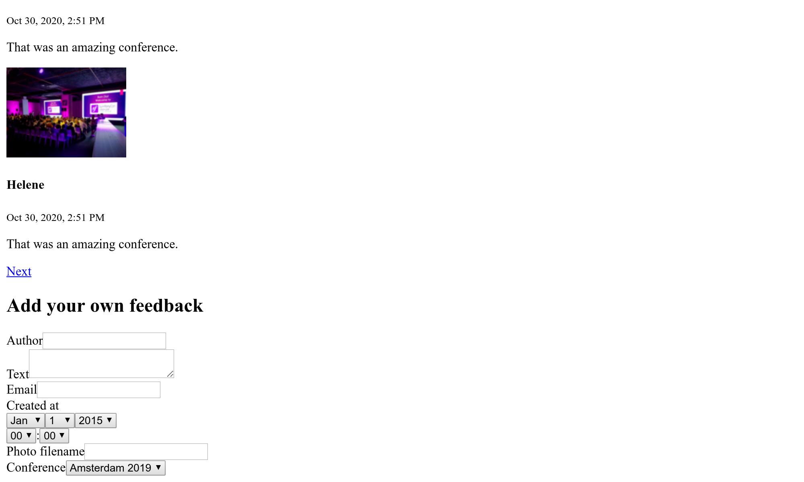
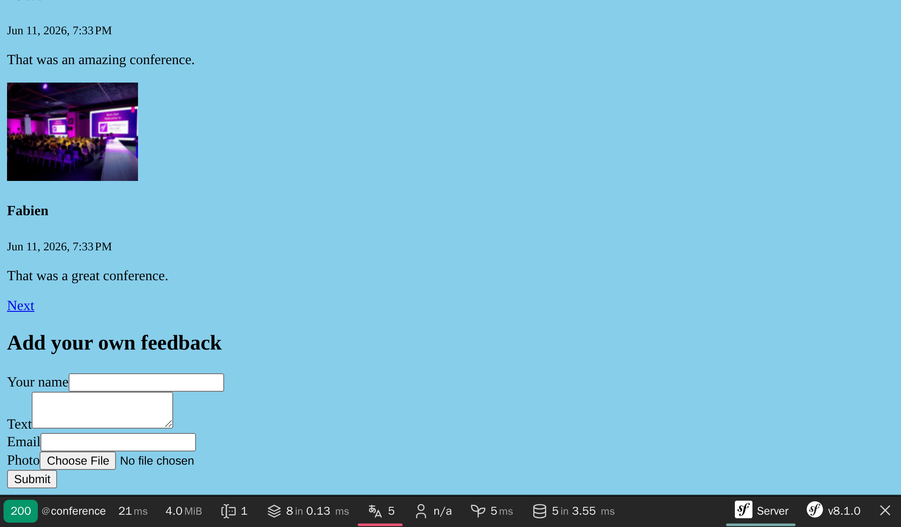

پذیرش بازخوردها از طریق فرم
==================================================

.. index::
    single: Components;Form
    single: Form

زمان آن رسیده که به شرکت‌کننده‌های کنفرانس اجازه بازخورد دادن بدهیم. آن‌ها کامنت‌هایشان را از طریق یک *فرم HTML* ارائه می‌کنند.

تولید یک نوع فرم
-----------------------------

.. index::
    single: Command;make:form

برای ساخت کلاسِ فرم از باندل Maker استفاده کنید:

.. code-block:: terminal

    $ symfony console make:form CommentType Comment

.. code-block:: text
    :class: ignore
    :emphasize-lines: 1

     created: src/Form/CommentType.php

      Success!

     Next: Add fields to your form and start using it.
     Find the documentation at https://symfony.com/doc/current/forms.html

کلاس ``App\Form\CommentType`` یک فرم برای موجودیت ``App\Entity\Comment`` تعریف می‌کند.

.. code-block:: php
    :caption: src/Form/CommentType.php
    :class: ignore

    namespace App\Form;

    use App\Entity\Comment;
    use Symfony\Component\Form\AbstractType;
    use Symfony\Component\Form\FormBuilderInterface;
    use Symfony\Component\OptionsResolver\OptionsResolver;

    class CommentType extends AbstractType
    {
        public function buildForm(FormBuilderInterface $builder, array $options): void
        {
            $builder
                ->add('author')
                ->add('text')
                ->add('email')
                ->add('createdAt')
                ->add('photoFilename')
                ->add('conference')
            ;
        }

        public function configureOptions(OptionsResolver $resolver): void
        {
            $resolver->setDefaults([
                'data_class' => Comment::class,
            ]);
        }
    }

یک `form type`_، *فیلدهای فرم* مرتبط با یک مدل را توصیف می‌کند و کار تبدیل داده بین اطلاعات وارد شده و ویژگی‌های کلاس مدل را انجام می‌دهد. به صورت پیشفرض،‌ سیمفونی از فراداده‌های موجودیت ``Comment`` - همچون فراداده‌های Doctrine - استفاده می‌کند، تا بتواند پیکربندی هر فیلد را حدس بزند. مثلاً، یک فیلد متنی (``text``) به شکل ``textarea``، render می‌شود، چون در پایگاه‌داده، ستون مربط به آن، فضای بیشتری را اشغال می‌کند.

نمایش یک فرم
----------------------

برای نمایش فرم به کاربر، فرم را در کنترلر ایجاد کرده و به قالب بدهید:

.. code-block:: diff
    :caption: patch_file
    :emphasize-lines: 19,29

    --- i/src/Controller/ConferenceController.php
    +++ w/src/Controller/ConferenceController.php
    @@ -2,7 +2,9 @@

     namespace App\Controller;

    +use App\Entity\Comment;
     use App\Entity\Conference;
    +use App\Form\CommentType;
     use App\Repository\CommentRepository;
     use App\Repository\ConferenceRepository;
     use Symfony\Bundle\FrameworkBundle\Controller\AbstractController;
    @@ -23,5 +25,8 @@ final class ConferenceController extends AbstractController
         #[Route('/conference/{slug:conference}', name: 'conference')]
         public function show(Conference $conference, CommentRepository $commentRepository, #[MapQueryParameter(options: ['min_range' => 0])] int $offset = 0): Response
         {
    +        $comment = new Comment();
    +        $form = $this->createForm(CommentType::class, $comment);
    +
             $paginator = $commentRepository->getCommentPaginator($conference, $offset);

    @@ -30,6 +35,7 @@ final class ConferenceController extends AbstractController
                 'comments' => $paginator,
                 'previous' => $offset - CommentRepository::COMMENTS_PER_PAGE,
                 'next' => min(count($paginator), $offset + CommentRepository::COMMENTS_PER_PAGE),
    +            'comment_form' => $form,
             ]);
         }
     }

هرگز نباید فرم را مستقیماً ایجاد کنید. به جای این کار، از متد ``()createForm`` استفاده کنید. این متد بخشی از ``AbstractController`` است و ساخت فرم‌ها را ساده می‌کند.

.. index::
    single: Twig;form

نمایش فرم در قالب، می‌تواند از طریق تابع ``form`` در Twig انجام شود:

.. code-block:: diff
    :caption: patch_file
    :emphasize-lines: 10

    --- i/templates/conference/show.html.twig
    +++ w/templates/conference/show.html.twig
    @@ -30,4 +30,8 @@
         
             
No comments have been posted yet for this conference.

         
    +
    +    <h2>Add your own feedback</h2>
    +
    +    {{ form(comment_form) }}
     

هنگام تازه‌سازی صفحه‌ی کنفرانس در مرورگر، توجه داشته باشید که هر فیلد ویجت HTML صحیح خود را نشان می‌دهد (نوع داده از مدل گرفته شده است):

تابع  ``()form`` بر اساس اطلاعات تعریف‌شده در نوع فرم (Form type)، یک فرم HTML تولید می‌کند. همچنین به همان شکلی که در فیلد بارگذاری فایل لازم است، روی تگ ``<form>``،  یک ``enctype=multipart/form-data`` اضافه می‌کند. علاوه بر این، نمایش پیغام‌های خطا در صورت بروز خطا هنگام ثبت فرم را نیز به عهده می‌گیرد. همه چیز می‌تواند با بازنویسی قالب پیش‌فرض شخصی‌سازی شود، ولی ما برای این پروژه به آن نیاز نخواهیم داشت.

سفارشی‌سازی یک فرم
-----------------------------------

حتی اگر فیلدهای فرم با مدل معادلش تطبیق داشته باشد، می‌توانید تنظیمات پیش‌فرض را در کلاس فرم مستقیماً شخصی‌سازی کنید:

.. code-block:: diff
    :caption: patch_file

    --- i/src/Form/CommentType.php
    +++ w/src/Form/CommentType.php
    @@ -6,26 +6,32 @@ use App\Entity\Comment;
     use App\Entity\Conference;
     use Symfony\Bridge\Doctrine\Form\Type\EntityType;
     use Symfony\Component\Form\AbstractType;
    +use Symfony\Component\Form\Extension\Core\Type\EmailType;
    +use Symfony\Component\Form\Extension\Core\Type\FileType;
    +use Symfony\Component\Form\Extension\Core\Type\SubmitType;
     use Symfony\Component\Form\FormBuilderInterface;
     use Symfony\Component\OptionsResolver\OptionsResolver;
    +use Symfony\Component\Validator\Constraints\Image;

     class CommentType extends AbstractType
     {
         public function buildForm(FormBuilderInterface $builder, array $options): void
         {
             $builder
    -            ->add('author')
    +            ->add('author', null, [
    +                'label' => 'Your name',
    +            ])
                 ->add('text')
    -            ->add('email')
    -            ->add('createdAt', null, [
    -                'widget' => 'single_text',
    +            ->add('email', EmailType::class)
    +            ->add('photo', FileType::class, [
    +                'required' => false,
    +                'mapped' => false,
    +                'constraints' => [
    +                    new Image(maxSize: '1024k')
    +                ],
                 ])
    -            ->add('photoFilename')
    -            ->add('conference', EntityType::class, [
    -                'class' => Conference::class,
    -                'choice_label' => 'id',
    -            ])
    -        ;
    +            ->add('submit', SubmitType::class)
    +       ;
         }

         public function configureOptions(OptionsResolver $resolver): void

توجه داشته باشید که ما یک دکمه سابمیت هم اضافه کردیم (این به ما امکان استفاده ساده از عبارت ``{{ form(comment_form) }}`` را در تمپلیت می‌دهد).

برخی فیلدها مانند ``photoFilename``، امکان پیکربندی خودکار را ندارند. موجودیت ``Comment`` تنها نیاز به ذخیره نام عکس دارد، ولی فرم باید بارگذاری فایل را نیز به عهده بگیرد. به منظور رسیدگی به این مسئله، ما یک فیلد به نام ``photo`` و به صورت تصویر نشده (un-``mapped``) اضافه کرده‌ایم: این ویژگی به هیچ یک از ویژگی‌های ``Comment`` تصویر نخواهد شد. ما جهت پیاده‌سازی برخی اعمال و منطق‌های ویژه، این قسمت را به صورت دستی مدیریت می‌کنیم (مثل ذخیره‌سازی فایل بارگذاری شده روی دیسک).

به عنوان مثالی از سفارشی‌سازی، ما برخی برچسب‌های (label) پیش‌فرض فیلدها را نیز تغییر داده و اصلاح می‌کنیم.

اعتبارسنجی مدل‌ها
----------------------------------

نوع فرم (Form Type)، نحوه‌ی renderشدن فرم در جلوی صحنه را پیکربندی می‌کند. (به کمک برخی ویژگی‌های اعتبارسنجی HTML5). فرم HTML تولید شده به این شکل است:

.. code-block:: html
    :class: ignore

    <form name="comment_form" method="post" enctype="multipart/form-data">
        

            

                <label for="comment_form_author" class="required">Your name</label>
                <input type="text" id="comment_form_author" name="comment_form[author]" required="required" maxlength="255" />
            

            

                <label for="comment_form_text" class="required">Text</label>
                <textarea id="comment_form_text" name="comment_form[text]" required="required"></textarea>
            

            

                <label for="comment_form_email" class="required">Email</label>
                <input type="email" id="comment_form_email" name="comment_form[email]" required="required" />
            

            

                <label for="comment_form_photo">Photo</label>
                <input type="file" id="comment_form_photo" name="comment_form[photo]" />
            

            

                <button type="submit" id="comment_form_submit" name="comment_form[submit]">Submit</button>
            

            <input type="hidden" id="comment_form__token" name="comment_form[_token]" value="DwqsEanxc48jofxsqbGBVLQBqlVJ_Tg4u9-BL1Hjgac" />
        

    </form>

فرم از ورودی ``email`` برای رایانامه‌ی کامنت‌ها استفاده کرده و بیشتر فیلدها را الزامی (``required``) می‌کند. توجه داشته باشید که فرم شامل یک  ``_token`` مخفی است تا فرم را از `حمله‌های CSRF`_ محافظت نماید.

اما اگر تحویل و ثبت فرم، اعتبارسنجی HTML را دور بزند (با استفاده از یک ابزار مانند cURL که اعتبارسنجی‌های HTML را تحمیل نمی‌کند)، آنگاه داده‌های نامعتبر می‌توانند به سرور برسند.

ما علاوه بر این نیاز داریم که برخی محدودیت‌های اعتبارسنجی را روی مدل ``Comment`` اضافه کنیم:

.. code-block:: diff
    :caption: patch_file

    --- i/src/Entity/Comment.php
    +++ w/src/Entity/Comment.php
    @@ -5,6 +5,7 @@ namespace App\Entity;
     use App\Repository\CommentRepository;
     use Doctrine\DBAL\Types\Types;
     use Doctrine\ORM\Mapping as ORM;
    +use Symfony\Component\Validator\Constraints as Assert;

     #[ORM\Entity(repositoryClass: CommentRepository::class)]
     #[ORM\HasLifecycleCallbacks]
    @@ -16,12 +17,16 @@ class Comment
         private ?int $id = null;

         #[ORM\Column(length: 255)]
    +    #[Assert\NotBlank]
         private ?string $author = null;

         #[ORM\Column(type: Types::TEXT)]
    +    #[Assert\NotBlank]
         private ?string $text = null;

         #[ORM\Column(length: 255)]
    +    #[Assert\NotBlank]
    +    #[Assert\Email]
         private ?string $email = null;

         #[ORM\Column]

رسیدگی به یک فرم
-----------------------------

کدی که تا به اینجا نوشته‌ایم برای نمایش فرم کافیست.

حالا باید در درون کنترلر، به دریافت فرم و ثبت اطلاعات آن در پایگاه‌داده را رسیدگی کنیم:

.. code-block:: diff
    :caption: patch_file

    --- i/src/Controller/ConferenceController.php
    +++ w/src/Controller/ConferenceController.php
    @@ -7,7 +7,9 @@ use App\Entity\Conference;
     use App\Form\CommentType;
     use App\Repository\CommentRepository;
     use App\Repository\ConferenceRepository;
    +use Doctrine\ORM\EntityManagerInterface;
     use Symfony\Bundle\FrameworkBundle\Controller\AbstractController;
    +use Symfony\Component\HttpFoundation\Request;
     use Symfony\Component\HttpFoundation\Response;
     use Symfony\Component\HttpKernel\Attribute\MapQueryParameter;
     use Symfony\Component\Routing\Attribute\Route;
    @@ -14,6 +15,11 @@ use Symfony\Component\Routing\Attribute\Route;

     final class ConferenceController extends AbstractController
     {
    +    public function __construct(
    +        private EntityManagerInterface $entityManager,
    +    ) {
    +    }
    +
         #[Route('/', name: 'homepage')]
         public function index(ConferenceRepository $conferenceRepository): Response
         {
    @@ -24,9 +30,18 @@ final class ConferenceController extends AbstractController
         }

         #[Route('/conference/{slug:conference}', name: 'conference')]
    -    public function show(Conference $conference, CommentRepository $commentRepository, #[MapQueryParameter(options: ['min_range' => 0])] int $offset = 0): Response
    +    public function show(Request $request, Conference $conference, CommentRepository $commentRepository, #[MapQueryParameter(options: ['min_range' => 0])] int $offset = 0): Response
         {
             $comment = new Comment();
             $form = $this->createForm(CommentType::class, $comment);
    +        $form->handleRequest($request);
    +        if ($form->isSubmitted() && $form->isValid()) {
    +            $comment->setConference($conference);
    +
    +            $this->entityManager->persist($comment);
    +            $this->entityManager->flush();
    +
    +            return $this->redirectToRoute('conference', ['slug' => $conference->getSlug()]);
    +        }

             $paginator = $commentRepository->getCommentPaginator($conference, $offset);

توجه کنید که شیء ``Request`` اکنون در کنترلر تزریق شده است، زیرا فرم برای بازرسی داده‌های ارسال‌شده از طریق ``handleRequest()`` به آن نیاز دارد.

وقتی فرم (از طرف کاربر) ثبت می‌گردد، شیء``Comment`` با توجه به اطلاعات ارسال شده به روزرسانی می‌شود.

کنفرانس باید منطبق با همان کنفرانس اشاره‌شده در URL باشد. (آن را از فرم حذف کردیم).

اگر فرم معتبر نباشد، صفحه را نمایش می‌دهیم، ولی اکنون فرم حاوی اطلاعات ارسال‌شده‌ و خطاهاست تا بتوان آن‌ها را به  کاربر نمایش داد.

فرم را امتحان کنید. فرم باید درست کار کند و اطلاعات می‌بایست در پایگاه‌داده ذخیره شود (این موضوع را از طریق پشت صحنه‌ی مدیریت بررسی کنید). ولی همچنان یک مشکل وجود دارد: تصاویر. آن‌ها درست کار نمی‌کنند چون هنوز در کنترلر به آن‌ها رسیدگی نکرده‌ایم.

بارگذاری فایل‌ها
--------------------------------

تصاویر بارگذاری‌شده باید بر روی دیسک محلی و جایی در دسترس جلو صحنه (frontend) ذخیره شوند تا بتوان آن‌ها را در صفحه‌ی کنفرانس نمایش داد. ما تصاویر را در پوشه‌ی ``public/uploads/photos`` ذخیره خواهیم کرد.

.. index::
    single: Attribute;Autowire
    single: Autowire

از آنجایی که نمی‌خواهیم مسیر پوشه را در کد هاردکد کنیم، به راهی نیاز داریم تا آن را به صورت سراسری در پیکربندی ذخیره کنیم. کانتینر سیمفونی می‌تواند علاوه بر سرویس‌ها، *پارامترها* را نیز ذخیره کند که مقادیر اسکالری‌اند و به پیکربندی سرویس‌ها کمک می‌کنند:

.. code-block:: diff
    :caption: patch_file

    --- i/config/services.yaml
    +++ w/config/services.yaml
    @@ -4,6 +4,7 @@
     # Put parameters here that don't need to change on each machine where the app is deployed
     # https://symfony.com/doc/current/best_practices.html#use-parameters-for-application-configuration
     parameters:
    +    photo_dir: "%kernel.project_dir%/public/uploads/photos"

     services:
         # default configuration for services in *this* file

پیش از این دیدیم که چگونه سرویس‌ها به صورت خودکار در آرگمان‌های سازنده تزریق می‌شوند. برای پارامترهای کانتینر، می‌توانیم آن‌ها را صریحاً از طریق attribute‌ی ``Autowire`` تزریق کنیم.

اکنون هر آنچه برای پیاده‌سازی منطق لازم جهت ذخیره‌ی فایل بارگذاری‌شده در مقصد نهایی‌اش نیاز داریم را می‌دانیم:

.. code-block:: diff
    :caption: patch_file

    --- i/src/Controller/ConferenceController.php
    +++ w/src/Controller/ConferenceController.php
    @@ -9,6 +9,7 @@ use App\Repository\CommentRepository;
     use App\Repository\ConferenceRepository;
     use Doctrine\ORM\EntityManagerInterface;
     use Symfony\Bundle\FrameworkBundle\Controller\AbstractController;
    +use Symfony\Component\DependencyInjection\Attribute\Autowire;
     use Symfony\Component\HttpFoundation\Request;
     use Symfony\Component\HttpFoundation\Response;
     use Symfony\Component\Routing\Attribute\Route;
    @@ -29,13 +30,23 @@ final class ConferenceController extends AbstractController
         }

         #[Route('/conference/{slug:conference}', name: 'conference')]
    -    public function show(Request $request, Conference $conference, CommentRepository $commentRepository, #[MapQueryParameter(options: ['min_range' => 0])] int $offset = 0): Response
    -    {
    +    public function show(
    +        Request $request,
    +        Conference $conference,
    +        CommentRepository $commentRepository,
    +        #[Autowire('%photo_dir%')] string $photoDir,
    +        #[MapQueryParameter(options: ['min_range' => 0])] int $offset = 0,
    +    ): Response {
             $comment = new Comment();
             $form = $this->createForm(CommentType::class, $comment);
             $form->handleRequest($request);
             if ($form->isSubmitted() && $form->isValid()) {
                 $comment->setConference($conference);
    +            if ($photo = $form['photo']->getData()) {
    +                $filename = bin2hex(random_bytes(6)).'.'.$photo->guessExtension();
    +                $photo->move($photoDir, $filename);
    +                $comment->setPhotoFilename($filename);
    +            }

                 $this->entityManager->persist($comment);
                 $this->entityManager->flush();

برای مدیریت تصاویر بارگذاری‌شده، برای فایل‌ یک نام تصادفی ایجاد می‌کنیم. پس از آن، تصویر را به محل نهایی آن (پوشه‌ی تصاویر) انتقال می‌دهیم. در نهایت، نام فایل را در شیء Comment ذخیره می‌کنیم.

سعی کنید که یک فایل PDF به جای تصویر بارگذاری کنید. باید پیغام‌های خطا ببینید. در حال حاظر طراحی‌کاملاً زشت است، اما نگران نباشید، همه چیز در چند گام دیگر هنگامی که بر روی طراحی وب‌سایت کار کنیم، زیبا خواهد شد. برای فرم‌ها، ما یک خط از پیکربندی را تغییر خواهیم داد تا به تمام المان‌های فرم یک سبک ببخشیم.

عیب‌یابی فرم‌ها
-------------------------------

زمانی که فرمی ارسال شده است و یک چیزی درست کار نمی‌کند، از پنل «Form» در نمایه‌ساز سیمفونی استفاده کنید. این بخش به شما در رابطه با فرم اطلاعات می‌دهد، تمام گزینه‌ها، داده‌های ارسالی و اینکه داده‌ها به صورت داخلی چگونه تبدیل شده‌اند. اگر فرم حاوی هر گونه خطایی باشد، آن‌ها نیز لیست خواهند شد.

یک جریان‌کار معمول فرم، به صورت زیر است:

* فرم در یک صفحه، نمایش داده شده است؛

* کاربر فرم را از طریق یک درخواست POST ارسال می‌کند؛

* سرور کاربر را به یک صفحه‌ی دیگر یا همان صفحه هدایت می‌کند.

اما برای یک درخواست موفقیت‌آمیز، چگونه به نمایه‌ساز دسترسی پیدا کنیم؟ به دلیل اینکه صفحه بلافاصله بازهدایت (redirect) می‌شود، ما هرگز برای درخواست POST، نوارابزار اشکا‌ل‌زدایی وب را نمی‌بینیم. مشکلی نیست: در صفحه‌ی بازهدایت‌شده، نشانگر موس را بر روی قسمت سبز رنگ «200» در سمت چپ نوارابزار قرار دهید (کلیک نکنید). باید یک بازهدایت «302» به همراه پیوندی به نمایه‌ساز را مشاهده کنید (در داخل پرانتز).

.. figure:: screenshots/form-wdt.png
    :alt: /conference/amsterdam-2019
    :align: center
    :figclass: with-browser

بر روی آن کلیک کنید تا به پروفایل درخواست POST دسترسی پیدا کنید و سپس به پنل «Form» بروید:

.. code-block:: terminal
    :class: hide

    $ rm -rf var/cache

.. figure:: screenshots/form-profiler.png
    :alt: /_profiler/450aa5
    :align: center
    :figclass: with-browser

نمایش تصاویر بارگذاری‌شده در پشت صحنه‌ی مدیریتی
------------------------------------------------------------------------------------------

در حال حاضر پشت صحنه‌ی مدیریتی نام فایل را نمایش می‌دهد، اما ما می‌خواهیم که تصویر واقعی را ببینیم:

.. code-block:: diff
    :caption: patch_file

    --- i/src/Controller/Admin/CommentCrudController.php
    +++ w/src/Controller/Admin/CommentCrudController.php
    @@ -10,6 +10,7 @@ use EasyCorp\Bundle\EasyAdminBundle\Field\AssociationField;
     use EasyCorp\Bundle\EasyAdminBundle\Field\DateTimeField;
     use EasyCorp\Bundle\EasyAdminBundle\Field\EmailField;
     use EasyCorp\Bundle\EasyAdminBundle\Field\IdField;
    +use EasyCorp\Bundle\EasyAdminBundle\Field\ImageField;
     use EasyCorp\Bundle\EasyAdminBundle\Field\TextareaField;
     use EasyCorp\Bundle\EasyAdminBundle\Field\TextEditorField;
     use EasyCorp\Bundle\EasyAdminBundle\Field\TextField;
    @@ -47,7 +48,9 @@ class CommentCrudController extends AbstractCrudController
             yield TextareaField::new('text')
                 ->hideOnIndex()
             ;
    -        yield TextField::new('photoFilename')
    +        yield ImageField::new('photoFilename')
    +            ->setBasePath('/uploads/photos')
    +            ->setLabel('Photo')
                 ->onlyOnIndex()
             ;

مستثنی کردن تصاویر بارگذاری‌شده از Git
---------------------------------------------------------------------

الان commit نکنید! ما نمی‌خواهیم که تصاویر بارگذاری‌شده در مخزن ‌Git ذخیره شوند. پوشه‌ی ``/public/uploads`` را به فایل ``.gitignore`` اضافه کنید:

.. code-block:: diff
    :caption: patch_file

    --- i/.gitignore
    +++ w/.gitignore
    @@ -1,3 +1,4 @@
    +/public/uploads

     ###> symfony/framework-bundle ###
     /.env.local

ذخیره‌ی فایل‌های بارگذاری‌شده در سرورهای عمل‌آوری
-------------------------------------------------------------------------------------------------

آخرین گام، ذخیره‌ی فایل‌های بارگذاری‌شده در سرورهای عمل‌آوری است. چرا مجبوریم یک سری کار خاص انجام دهیم؟ زیرا اکثر سکوهای ابری مدرن به دلایل مختلف از کانتینرهای فقط‌خواندنی استفاده می‌کنند. Upsun نیز از این موضوع مستثنی نیست.

تمام بخش‌ها در پروژه‌ی سیمفونی فقط‌خواندنی نیستند. ما به سختی تلاش می‌کنیم تا جایی که ممکن است در هنگام تولید کانتینر، cache تولید کنیم (در طول فاز cache warmup). اما سیمفونی هنوز هم به جایی برای نوشتن cache‌های کاربر، لاگ‌ها، نشست‌ها (اگر در filesystem ذخیره می‌شوند) و ... نیاز دارد.

نگاهی به فایل ``.upsun/config.yaml`` بیاندازید، یک *mount* قابل نوشتن برای پوشه‌ی ``var/`` وجود دارد. پوشه‌ی ``var/`` تنها پوشه‌ای است که سیمفونی در آن می‌نویسد (cacheها، لاگ‌ها و غیره).

بیایید یک mount جدید برای تصاویر بارگذاری‌شده ایجاد کنیم:

.. code-block:: diff
    :caption: patch_file

    --- i/.upsun/config.yaml
    +++ w/.upsun/config.yaml
    @@ -41,6 +41,7 @@ applications:
             mounts:
                 "/var/cache": { source: instance, source_path: var/cache }
                 "/var/share": { source: storage, source_path: var/share }
    +            "/public/uploads": { source: storage, source_path: uploads }

             relationships:

حالا می‌توانید کد را مستقر کنید و تصاویر همچون نسخه‌ی محلی، در پوشه‌ی ``public/uploads/`` ذخیره خواهند شد.

.. sidebar:: بیشتر بدانید

    * `آموزش تصویری فرم‌ها در SymfonyCasts`_؛

    * چگونگی `شخصی‌سازی renderشدن فرم‌های سیمفونی به HTML`_؛

    * `اعتبارسنجی فرم‌های سیمفونی`_؛

    * `مرجع نوع‌های فرم (Form Types) در سیمفونی`_؛

    * `مستندات FlysystemBundle`_، که ادغام با فراهم‌کنندگان انبارهای ابری همچون AWS S3، Azure و  Google Cloud Storage را فراهم می‌آورد؛

    * `پارمترهای پیکربندی سیمفونی`_.

    * `قیود اعتبارسنجی در سیمفونی`_؛

    * `برگه‌تقلب فرم سیمفونی`_.

.. _`form type`: https://symfony.com/doc/current/forms.html#form-types
.. _`حمله‌های CSRF`: https://owasp.org/www-community/attacks/csrf
.. _`آموزش تصویری فرم‌ها در SymfonyCasts`: https://symfonycasts.com/screencast/symfony-forms
.. _`شخصی‌سازی renderشدن فرم‌های سیمفونی به HTML`: https://symfony.com/doc/current/form/form_customization.html
.. _`اعتبارسنجی فرم‌های سیمفونی`: https://symfony.com/doc/current/forms.html#validating-forms
.. _`مرجع نوع‌های فرم (Form Types) در سیمفونی`: https://symfony.com/doc/current/reference/forms/types.html
.. _`مستندات FlysystemBundle`: https://github.com/thephpleague/flysystem-bundle/blob/master/docs/1-getting-started.md
.. _`پارمترهای پیکربندی سیمفونی`: https://symfony.com/doc/current/configuration.html#configuration-parameters
.. _`قیود اعتبارسنجی در سیمفونی`: https://symfony.com/doc/current/validation.html#basic-constraints
.. _`برگه‌تقلب فرم سیمفونی`: https://github.com/andreia/symfony-cheat-sheets/blob/master/Symfony2/how_symfony2_forms_works_en.pdf
