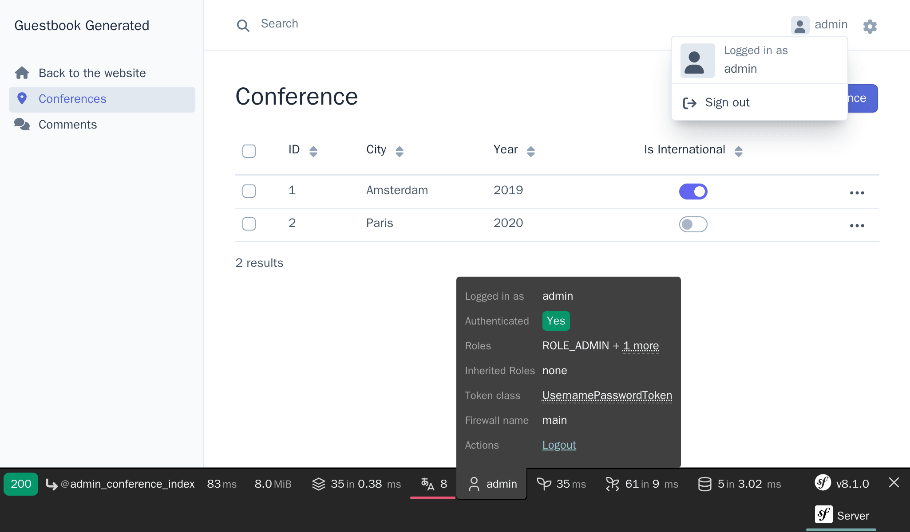

امن‌سازی پشت صحنه‌ی مدیریتی
=====================================================

.. index::
    single: Components;Security
    single: Security

رابط پشت صحنه‌ی مدیریتی، تنها باید توسط افراد مورد اعتماد قابل دستیابی باشد. امن‌سازی این قسمت از وبسایت، می‌تواند توسط کامپوننت امنیت سیمفونی تأمین گردد.

تعریف موجودیت کاربر
------------------------------------

با وجود اینکه شرکت‌کنندگان نمی‌توانند در وب‌سایت برای خود حساب ایجاد کنند، می‌خواهیم یک سیستم احراز هویت کامل را برای مدیریت ایجاد کنیم. بنابراین تنها یک کاربر خواهیم داشت و آن مدیر وب‌سایت است.

اولین گام، تعریف یک موجودیت``User`` است. برای آنکه گیج نشوید، بیاید آن را ``Admin`` بنامیم.

برای ادغام موجودیت ``Admin`` با سیستم احراز هویت امنیت سیمفونی،  این موجودیت باید الزامات خاصی را رعایت کند. برای مثال یک ویژگی ``password`` نیاز دارد.

.. index::
    single: Command;make:user

برای ایجاد موجودیت ``Admin``، به جای فرمان مرسوم ``make:entity`` از فرمان اختصاصی ``make:user`` استفاده کنید:

.. code-block:: terminal
    :class: answers(yes||username||yes)

    $ symfony console make:user Admin

به سوالات تعاملی پاسخ دهید: ما می‌خواهیم که موجودیت‌های مدیر توسط Doctrine ذخیره شوند (``yes``)، از ``username`` به عنوان نام نمایشی و منحصربه‌فرد مدیران استفاده می‌شود و هر کاربر یک رمزعبور خواهد داشت (``yes``).

کلاس تولیدشده، حاوی متدهایی مانند ``getRoles()``، ``eraseCredentials()`` و تعدادی متد دیگر که برای سیستم احراز هویت سیمفونی لازم هستند، می‌باشد.

اگر می‌خواهید ویژگی‌های بیشتری را به کاربر ``Admin`` اضافه کنید، از فرمان ``make:entity`` استفاده کنید.

علاوه بر تولید موجودیت ``Admin``، فرمان استفاده‌شده، پیکربندی امنیتی را نیز به‌روزرسانی کرده تا موجودیت به سیستم احراز هویت متصل و سیم‌کشی شود:

.. code-block:: diff
    :class: ignore
    :emphasize-lines: 11,12,20

    --- i/config/packages/security.yaml
    +++ w/config/packages/security.yaml
    @@ -5,14 +5,18 @@ security:
             Symfony\Component\Security\Core\User\PasswordAuthenticatedUserInterface: 'auto'
         # https://symfony.com/doc/current/security.html#loading-the-user-the-user-provider
         providers:
    -        users_in_memory: { memory: null }
    +        # used to reload user from session & other features (e.g. switch_user)
    +        app_user_provider:
    +            entity:
    +                class: App\Entity\Admin
    +                property: username
         firewalls:
             dev:
                 pattern: ^/(_(profiler|wdt)|css|images|js)/
                 security: false
             main:
                 lazy: true
    -            provider: users_in_memory
    +            provider: app_user_provider

                 # activate different ways to authenticate
                 # https://symfony.com/doc/current/security.html#the-firewall

ما اجازه می‌دهیم تا سیمفونی بهترین الگوریتم ممکن برای هش کردن رمزعبور را انتخاب کند (که در طول زمان تکامل می‌یابد).

زمان تولید یک migration و سپس migrateکردن پایگاه‌داده است:

.. code-block:: terminal

    $ symfony console make:migration
    $ symfony console doctrine:migrations:migrate -n

تولید رمزعبور برای کاربر مدیر
------------------------------------------------------

.. index::
    single: Security;Password Hashes

ما یک سیستم اختصاصی برای ایجاد حساب‌های مدیریتی توسعه نمی‌دهیم. دوباره یادآوری می‌کنیم که ما تنها یک مدیر خواهیم داشت. کاربری که وارد می‌شود، ``admin`` خواهد بود و نیاز داریم که هش رمزعبور را تولید کنیم.

.. index::
    single: Command;security:hash-password

هر چیزی که دوست دارید را به عنوان رمزعبور انتخاب کنید و فرمان زیر را برای تولید هش رمزعبور اجرا کنید:

.. code-block:: terminal
    :class: answers(admin)

    $ symfony console security:hash-password

.. code-block:: text
    :class: ignore
    :emphasize-lines: 11

    Symfony Password Hash Utility
    =============================

     Type in your password to be hashed:
     >

     ------------------ ---------------------------------------------------------------------------------------------------
      Key                Value
     ------------------ ---------------------------------------------------------------------------------------------------
      Hasher used        Symfony\Component\PasswordHasher\Hasher\MigratingPasswordHasher
      Password hash      $argon2id$v=19$m=65536,t=4,p=1$BQG+jovPcunctc30xG5PxQ$TiGbx451NKdo+g9vLtfkMy4KjASKSOcnNxjij4gTX1s
     ------------------ ---------------------------------------------------------------------------------------------------

     ! [NOTE] Self-salting hasher used: the hasher generated its own built-in salt.

     [OK] Password hashing succeeded

ایجاد یک مدیر
------------------------

.. index::
    single: Command;dbal:run-sql

درج کاربر مدیر از طریق یک بیانیه‌ی SQL:

.. code-block:: terminal

    $ symfony console dbal:run-sql "INSERT INTO admin (id, username, roles, password) \
      VALUES (nextval('admin_id_seq'), 'admin', '[\"ROLE_ADMIN\"]', \
      '\$argon2id\$v=19\$m=65536,t=4,p=1\$BQG+jovPcunctc30xG5PxQ\$TiGbx451NKdo+g9vLtfkMy4KjASKSOcnNxjij4gTX1s')"

به escape کردن علامت ``$`` در ستون رمزعبور توجه کنید؛ تمام آن‌ها را escape کنید!

پیکربندی احراز هویت امنیتی
-------------------------------------------------

.. index::
    single: Command;make:security:form-login
    single: Security;Authenticator
    single: Security;Form Login
    single: Login
    single: Logout

حالا که کاربر مدیر داریم، می‌توانیم پشت صحنه‌ی مدیریتی را امن کنیم. سیمفونی از استراتژی‌های احراز هویت مختلفی پشتیبانی می‌کند. بیایید از روش کلاسیک و محبوب *سیستم احراز هویت فرمی* استفاده کنیم.

فرمان ``make:security:form-login`` را اجرا کنید تا پیکربندی امنیت به‌روزرسانی و قالب ورود به سیستم تولید شده و همچنین یک *احرازکننده‌ی هویت (authenticator)* ایجاد شود:

.. code-block:: terminal
    :class: answers(SecurityController||yes)

    $ symfony console make:security:form-login

کنترلر را ``SecurityController`` بنامید و یک URL به شکل ``/logout`` تولید کنید (``yes``).

این فرمان پیکربندی امنیت را به‌روزرسانی می‌کند تا کلاس‌های تولیدشده سیم‌کشی شوند:

.. code-block:: diff
    :class: ignore
    :emphasize-lines: 9

    --- i/config/packages/security.yaml
    +++ w/config/packages/security.yaml
    @@ -15,7 +15,15 @@ security:
                 security: false
             main:
                 lazy: true
    -            provider: users_in_memory
    +            provider: app_user_provider
    +            form_login:
    +                login_path: app_login
    +                check_path: app_login
    +                enable_csrf: true
    +            logout:
    +                path: app_logout
    +                # where to redirect after logout
    +                # target: app_any_route

                 # activate different ways to authenticate
                 # https://symfony.com/doc/current/security.html#the-firewall

.. index::
    single: Command;debug:router
    single: Routing;Debug
    single: Debug;Routing

.. tip::

    از کجا به یاد می‌آورم که مسیر مربوط به EasyAdmin، ``admin`` است (همان‌طور که در ``App\Controller\Admin\DashboardController`` پیکربندی شده)؟ نمی‌دانم. می‌توانید به آن فایل نگاهی بیندازید، اما می‌توانید فرمان زیر را نیز که وابستگی و ارتباط میان نامِ راه‌ها (route names) و مسیرها (paths) را نشان می‌دهد، اجرا کنید:

    .. code-block:: terminal

        $ symfony console debug:router

افزودن قوانین کنترل مجوز‌‌های دسترسی
----------------------------------------------------------------------

.. index::
    single: Security;Authorization
    single: Security;Access Control

یک سیستم امنیتی از دو بخش تشکیل شده است: *احراز هویت (authentication)* و *احراز مجوز (authorization)*. زمانی که کاربر مدیر را ایجاد می‌کردیم، به او نقش ``ROLE_ADMIN`` دادیم. بیایید بخش ``/admin`` را از طریق افزودن قانون به ``access_control``، تنها به کاربرانی که این نقش را دارند محدود کنیم:

.. code-block:: diff
    :emphasize-lines: 8

    --- i/config/packages/security.yaml
    +++ w/config/packages/security.yaml
    @@ -34,7 +34,7 @@ security:
         # Easy way to control access for large sections of your site
         # Note: Only the *first* access control that matches will be used
         access_control:
    -        # - { path: ^/admin, roles: ROLE_ADMIN }
    +        - { path: ^/admin, roles: ROLE_ADMIN }
             # - { path: ^/profile, roles: ROLE_USER }

     when@test:

قوانین ``access_control``، به کمک regular expression‌ها دسترسی را محدود می‌کنند. زمانی که تلاشی برای دسترسی به URLای که با ``/admin`` شروع می‌شود، صورت می‌گیرد، سیستم امنیتی بررسی می‌کند که آیا کاربر واردشده دارای نقش ``ROLE_ADMIN`` هست یا نه.

احراز هویت از طریق فرم ورود به سایت
---------------------------------------------------------------

اگر تلاش کنید که به پشت صحنه‌ی مدیریتی دست پیدا کنید، باید به صفحه‌ی ورود به سایت بازهدایت شوید که در این صفحه از شما خواسته شده است که نام کاربری و رمزعبور را وارد نمایید:

.. figure:: screenshots/easy-admin-login.png
    :alt: /login/
    :align: center
    :figclass: with-browser

به کمک ``admin`` و هر رمزعبوری که قبلاً انتخاب کرده‌اید، وارد شوید. اگر دقیقاً فرمان SQL من را کپی کرده باشید، رمزعبور ``admin`` است.

توجه کنید که باندل EasyAdmin، به صورت خودکار سیستم احراز هویت سیمفونی را تشخیص می‌دهد:

سعی کنید بر روی پیوند «Sign out» کلیک کنید. شما موفق شدید! یک پشت صحنه‌ی مدیریتی کاملاً امن.

.. index::
    single: Command;make:registration-form

.. note::

    اگر به یک سیستم احراز هویت با قابلیت‌های کامل نیاز دارید، به فرمان ``make:registration-form`` نگاهی بیندازید.

.. sidebar:: بیشتر بدانید

    * `مستندات امنیت سیمفونی`_؛

    * `آموزش تصویری امنیت در SymfonyCasts`_؛

    * `چگونه یک فرم ورود به سایت بسازیم`_ در اپلیکیشن‌های سیمفونی؛

    * `برگه‌تقلب امنیت سیمفونی`_.

.. _`مستندات امنیت سیمفونی`: https://symfony.com/doc/current/security.html
.. _`آموزش تصویری امنیت در SymfonyCasts`: https://symfonycasts.com/screencast/symfony-security
.. _`چگونه یک فرم ورود به سایت بسازیم`: https://symfony.com/doc/current/security/form_login_setup.html
.. _`برگه‌تقلب امنیت سیمفونی`: https://github.com/andreia/symfony-cheat-sheets/blob/master/Symfony4/security_en_44.pdf
