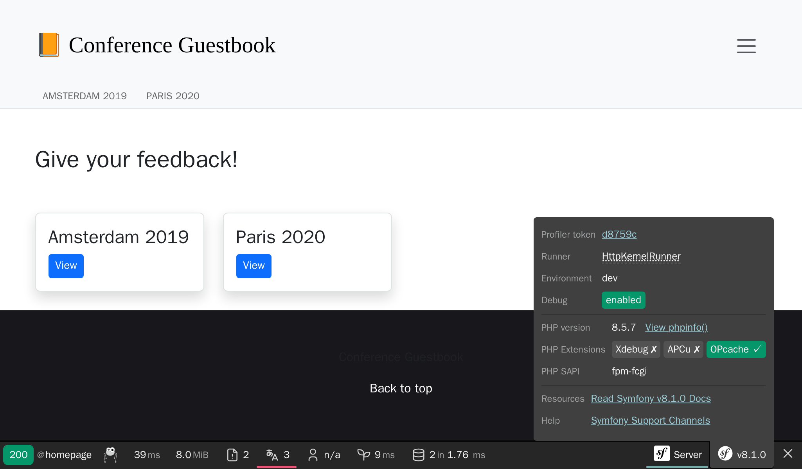

کشف اندرونی سیمفونی
====================================

.. index::
    single: Blackfire
    single: Debugging
    single: Internals

مدت مدیدی است که از سیمفونی برای توسعه‌ی اپلیکیشن‌های قدرتمند استفاده می‌کنیم اما اکثر کدی که در اپلیکیشن اجرا می‌شود، متعلق به خود سیمفونی است. چند صد خط کد در برابر هزاران خط کد.

من دوست دارم که بدانم چیزها در پشت پرده چطور کار می‌کنند و همیشه مسحور ابزارهایی می‌شده‌ام که به من در فهم چگونگی کارکرد چیزها کمک می‌کرده‌اند. اولین باری که به صورت گام‌به‌گام از یک اشکال‌زدا استفاده کردم یا اولین باری که ``ptrace`` را کشف کردم، خاطرات سحرآمیزی هستند.

آیا می‌خواهید که چگونگی کارکرد سیمفونی را بهتر بفهمید؟ زمان آن رسیده است که ببینیم سیمفونی چگونه اپلیکیشن شما را به راه می‌اندازد. به جای توصیف نظری چگونگی رسیدگی به درخواست HTTP در سیمفونی که می‌تواند کاملاً خسته‌کننده باشد، می‌خواهیم از Blackfire استفاده کنیم تا تعدادی نمایش بصری بدست آوریم و از آن برای کشف موضوعات پیچیده‌تر بهره بگیریم.

فهم اندرونی سیمفونی به کمک Blackfire
----------------------------------------------------------

شما در حال حاضر می‌دانید که تمام درخواست‌های HTTP توسط یک مدخل خدمت‌رسانی می‌شوند: فایل ``public/index.php``. اما بعد از آن چه می‌شود؟ چگونه کنترلرها فراخوانی می‌شوند؟

بیایید با Blackfire و از طریق افزونه‌ مرورگر Blackfire، صفحه‌ی اصلی انگلیسی را در محیط عمل‌آوری، نمایه‌سازی کنیم:

.. code-block:: terminal
    :class: ignore

    $ symfony remote:open

یا مستقیماً از طریق خط فرمان:

.. code-block:: terminal
    :class: ignore

    $ blackfire curl `symfony cloud:env:url --pipe --primary`en/

به بخش «Timeline» در نمایه بروید، شما باید چیزی مشابه این ببینید:

.. figure:: images/blackfire-homepage-prod.png
    :alt: /
    :align: center
    :figclass: with-browser

در timeline به روی نوار رنگی بروید تا اطلاعات بیشتری در مورد هر فراخوانی ببینید؛ شما چیزهای زیادی در مورد چگونگی کارکرد سیمفونی خواهید آموخت:

* مدخل اصلی ``public/index.php`` است؛

* متد ``Kernel::handle()`` به درخواست رسیدگی می‌کند؛

* این متد، ``HttpKernel`` را فراخوانی می‌کند که تعدادی رویداد را اعزام  می‌نماید.

* اولین رویداد، ``RequestEvent`` است؛

* متد ``ControllerResolver::getController()`` فراخوانی می‌شود تا تعیین کند که کدام کنترلر باید برای این URL فراخوانی شود؛

* متد ``ControllerResolver::getArguments()`` فراخوانی می‌شود تا تعیین کند که چه آرگمان‌هایی باید به کنترلر داده شود (مبدل پارامتر -param converter- فراخوانی می‌شود)؛

* متد ``ConferenceController::index()`` فراخوانی می‌شود و اکثر کد ما توسط این فراخوانی اجرا می‌شود؛

* متد ``ConferenceRepository::findAll()`` تمام کنفرانس‌ها را از پایگاه‌داده می‌گیرد (به اتصال به پایگاه‌داده از طریق ``PDO::__construct()`` توجه کنید)؛

* متد ``Twig\Environment::render()`` قالب را render می‌کند؛

* رویداد‌های ``ResponseEvent`` و ``FinishRequestEvent`` اعزام می‌شوند، اما به نظر می‌رسد که هیچ شنونده‌ای واقعاً ثبت نشده است زیرا که آن‌ها خیلی سریع اجرا می‌شوند.

timeline راهی عالی برای درک چگونگی کارکرد یک کد است؛ که وقتی پروژه توسط شخص دیگری توسعه یافته باشد، بسیار سودمند است.

حالا همان صفحه را در رایانه‌ی محلی و در محیط توسعه، نمایه‌سازی کنید:

.. code-block:: terminal
    :class: ignore

    $ blackfire curl `symfony var:export SYMFONY_PROJECT_DEFAULT_ROUTE_URL`en/

نمایه را باز کنید. شما باید به بخش call graph بازهدایت شوید زیرا درخواست خیلی سریع بوده و timeline کاملاً خالی خواهد بود:

.. figure:: images/blackfire-homepage-cached-dev.png
    :alt: /
    :align: center
    :figclass: with-browser

متوجه شدید چه اتفاقی افتاد؟ نهان‌سازی HTTP فعال است و بنابراین ما در حال نمایه‌سازی از لایه‌ی نهان‌ساز HTTP در سیمفونی هستیم. از آنجایی که صفحه در نهانگاه قرار دارد، ``HttpCache\Store::restoreResponse()`` پاسخ HTTP را از نهانگاهش می‌گیرد و کنترلر هرگز فراخوانی نخواهد شد.

همانطور که در گام قبلی انجام دادیم، لایه‌ی نهان‌سازی را در ``public/index.php`` غیرفعال کرده و مجدداً تلاش کنید. می‌توانید به سرعت ببینید که نمایه بسیار متفاوت به نظر می‌رسد:

.. figure:: images/blackfire-homepage-dev.png
    :alt: /
    :align: center
    :figclass: with-browser

این‌ها تفاوت‌های اصلی هستند:

* ``TerminateEvent``، که در محیط عمل‌آوری قابل مشاهده نبود، درصد زیادی از زمان اجرا را به خود اختصاص داده است؛ دقیق‌تر نگاه کنید، می‌توانید ببینید که این رویداد، وظیفه‌ی ذخیره‌ی داده‌های نمایه‌ساز سیمفونی را در طول درخواست بر عهده دارد؛

* در فراخوانی ``ConferenceController::index()``، به متد ``SubRequestHandler::handle()`` که ESI را render می‌کند، توجه کنید (به همین خاطر است که ما دو فراخوانی به ``Profiler::saveProfile()`` داریم، یکی برای درخواست اصلی و یکی برای ESI).

در timeline بیشتر اکتشاف کنید؛ به بخش call graph بروید تا نمایش دیگری از همان داده‌ها را ببینید.

همانطور که همین الان کشف کردیم، اجرای کد در محیط توسعه و در محیط عمل‌آوری کاملاً متفاوت است. محیط توسعه کندتر است زیراکه نمایه‌ساز سیمفونی تلاش می‌کند تا داده‌های زیادی را برای تسهیل اشکال‌زدایی مشکلات، جمع‌آوری نماید. به این خاطر است که همواره باید در محیط عمل‌آوری نمایه‌سازی کنید، حتی در رایانه‌ی محلی.

چند آزمایش جذاب: یک صفحه‌ی خطا را نمایه‌سازی کنید،  آدرس ``/`` را نمایه‌سازی کنید (که یک صفحه‌ی بازهدایت‌شونده است) یا یک منبع API. هر نمایه به شما چیز بیشتری در مورد نحوه‌ی کارکرد سیمفونی می‌گوید، چه کلاس‌ها/متدهایی فراخوانی می‌شوند، اجرای چه چیزی کم‌هزینه و اجرای چه چیزی پرهزینه است.

استفاده از افزونه‌ی اشکال‌زدایی Blackfire
-----------------------------------------------------------------------

.. index::
    single: Blackfire;Debug Addon

به صورت پیشفرض، Blackfire تمام متد‌های فراخوانی‌شده‌ای را که به اندازه‌ی کافی قابل‌توجه نیستند، برای جلوگیری از بار زیاد و گراف‌های بزرگ حذف می‌کند. وقتی که از Blackfire به عنوان ابزار اشکال‌زدایی استفاده می‌کنید، بهتر است که تمام فراخوانی‌ها را نگه دارید. این موضوع توسط افزونه‌ی اشکال‌زدایی فراهم می‌شود.

در خط فرمان از پرچم ``--debug`` استفاده کنید:

.. code-block:: terminal
    :class: ignore

    $ blackfire --debug curl `symfony var:export SYMFONY_PROJECT_DEFAULT_ROUTE_URL`en/
    $ blackfire --debug curl `symfony cloud:env:url --pipe --primary`en/

.. index::
    single: .env.local.prod

در محیط عمل‌آوری، برای مثال، بارگرفتن یک فایل با نام ``.env.local.php`` را خواهید دید:

.. figure:: images/blackfire-env-local-prod.png
    :alt: /
    :align: center
    :figclass: with-browser

.. index::
    single: Composer;Optimizations
    single: Composer;Autoloader
    single: Autoloader

این از کجا می‌آید؟ Upsun به هنگام استقرار یک اپلیکیشن سیمفونی، بهینه‌سازی‌هایی همچون بهینه‌سازی Composer autoloader را انجام می‌دهد (``--optimize-autoloader --apcu-autoloader --classmap-authoritative``). همچنین متغیر‌های محیط تعریف‌شده در فایل ``.env`` را نیز با تولید فایل ``.env.local.php`` بهینه می‌کند (برای جلوگیری از خواندن فایل به ازای هر درخواست):

.. code-block:: terminal
    :class: ignore

    $ symfony run composer dump-env prod

Blackfire ابزاری بسیار قدرتمند است که کمک می‌کند تا نحوه‌ی اجرای کد توسط PHP را درک کنیم. بهبود و افزایش کارایی، تنها یکی از راه‌های استفاده از یک نمایه‌ساز است.

استفاده از اشکال‌زدای گام‌به‌گام با Xdebug
------------------------------------------------------------

.. index::
    single: Xdebug
    single: Debugger

timelineها و call graphهای Blackfire به توسعه‌دهندگان اجازه می‌دهند تا ببینند کدام فایل‌ها/توابع/متدها توسط موتور PHP اجرا می‌شوند تا درک بهتری از پایه‌ی کد پروژه پیدا کنند.

راه دیگر برای دنبال‌کردن اجرای کد، استفاده از یک **اشکال‌زدای گام‌به‌گام** مانند `Xdebug`_ است. یک اشکال‌زدای گام‌به‌گام به توسعه‌دهندگان اجازه می‌دهد تا به‌صورت تعاملی در کد یک پروژه‌ی PHP قدم بزنند تا جریان کنترل را اشکال‌زدایی کرده و ساختارهای داده را بررسی کنند. این ابزار برای اشکال‌زدایی رفتارهای غیرمنتظره بسیار سودمند است و جایگزین تکنیک رایج اشکال‌زدایی «var_dump()/exit()» می‌شود.

ابتدا، افزونه‌ی PHP با نام ``xdebug`` را نصب کنید. با اجرای فرمان زیر بررسی کنید که نصب شده باشد:

.. code-block:: terminal

    $ symfony php -v

شما باید Xdebug را در خروجی ببینید:

.. code-block:: text
    :emphasize-lines: 5
    :class: ignore

    PHP 8.0.1 (cli) (built: Jan 13 2021 08:22:35) ( NTS )
    Copyright (c) The PHP Group
    Zend Engine v4.0.1, Copyright (c) Zend Technologies
        with Zend OPcache v8.0.1, Copyright (c), by Zend Technologies
        with Xdebug v3.0.2, Copyright (c) 2002-2021, by Derick Rethans
        with blackfire v1.49.0~linux-x64-non_zts80, https://blackfire.io, by Blackfire

همچنین می‌توانید بررسی کنید که Xdebug برای PHP-FPM فعال است، با رفتن به مرورگر و کلیک روی پیوند «View phpinfo()» هنگام نگه‌داشتن نشانگر روی لوگوی سیمفونی در نوار ابزار اشکال‌زدایی وب:

حالا، حالت ``debug`` در Xdebug را فعال کنید:

.. code-block:: ini
    :caption: php.ini
    :class: ignore

    [xdebug]
    xdebug.mode=debug
    xdebug.start_with_request=yes

به‌صورت پیش‌فرض، Xdebug داده‌ها را به درگاه 9003 میزبان محلی می‌فرستد.

فعال‌کردن Xdebug را می‌توان به روش‌های زیادی انجام داد، اما ساده‌ترین راه استفاده از Xdebug از داخل IDE شماست. در این فصل، از Visual Studio Code برای نشان‌دادن نحوه‌ی کارکرد آن استفاده خواهیم کرد. افزونه‌ی `PHP Debug`_ را با اجرای ویژگی «Quick Open» (``Ctrl+P``)، چسباندن فرمان زیر و فشردن enter نصب کنید:

.. code-block:: text
    :class: ignore

    ext install felixfbecker.php-debug

فایل پیکربندی زیر را ایجاد کنید:

.. code-block:: json
    :caption: .vscode/launch.json
    :emphasize-lines: 8,16
    :class: ignore

    {
        "version": "0.2.0",
        "configurations": [
            {
                "name": "Listen for XDebug",
                "type": "php",
                "request": "launch",
                "port": 9003
            },
            {
                "name": "Launch currently open script",
                "type": "php",
                "request": "launch",
                "program": "${file}",
                "cwd": "${fileDirname}",
                "port": 9003
            }
        ]
    }

از داخل Visual Studio Code و هنگامی که در پوشه‌ی پروژه‌ی خود هستید، به اشکال‌زدا بروید و روی دکمه‌ی سبز play با برچسب «Listen for Xdebug» کلیک کنید:

.. figure:: images/vs-xdebug-run.png
    :align: center

اگر به مرورگر بروید و صفحه را تازه‌سازی کنید، IDE باید به‌صورت خودکار فوکوس را بگیرد، به این معنا که نشست اشکال‌زدایی آماده است. به‌صورت پیش‌فرض، همه‌چیز یک نقطه‌توقف (breakpoint) است، بنابراین اجرا در نخستین دستور متوقف می‌شود. سپس این به عهده‌ی شماست که متغیرهای جاری را بررسی کنید، از روی کد رد شوید، به درون کد بروید و ...

هنگام اشکال‌زدایی، می‌توانید نقطه‌توقف «Everything» را غیرفعال کرده و به‌صراحت نقطه‌توقف‌هایی را در کد خود تعیین کنید.

اگر با اشکال‌زداهای گام‌به‌گام تازه‌کار هستید، `آموزش عالی برای Visual Studio Code`_ را بخوانید که همه‌چیز را به‌صورت بصری توضیح می‌دهد.

.. sidebar:: بیشتر بدانید

    * `مستندات اشکال‌زدایی گام‌به‌گام Xdebug`_؛

    * `اشکال‌زدایی با Visual Studio Code`_.

.. _`Xdebug`: https://xdebug.org
.. _`PHP Debug`: https://marketplace.visualstudio.com/items?itemName=felixfbecker.php-debug
.. _`مستندات اشکال‌زدایی گام‌به‌گام Xdebug`: https://xdebug.org/docs/step_debug
.. _`آموزش عالی برای Visual Studio Code`: https://code.visualstudio.com/Docs/editor/debugging
.. _`اشکال‌زدایی با Visual Studio Code`: https://code.visualstudio.com/Docs/editor/debugging
