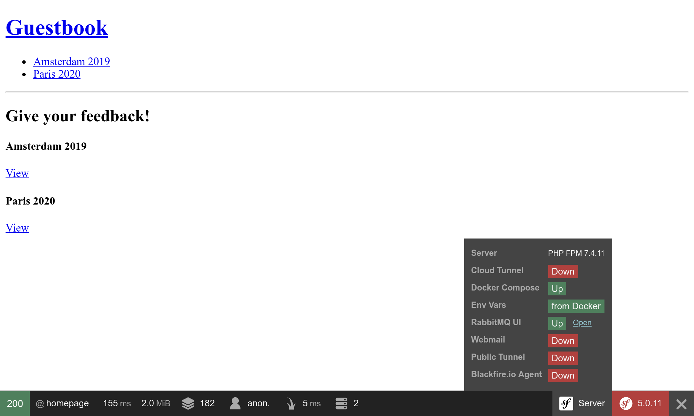

استفاده از RabbitMQ به عنوان دلال پیغام
=================================================================

.. index::
    single: RabbitMQ

RabbitMQ یک دلال پیغام (message broker) بسیار محبوب است که می‌توانید از آن به عنوان جایگزینی برای PostgreSQL استفاده کنید.

تعویض از PostgreSQL به RabbitMQ
------------------------------------------------------

برای استفاده از RabbitMQ به جای PostgreSQL به عنوان دلال پیغام:

.. code-block:: diff
    :caption: patch_file

    --- i/config/packages/messenger.yaml
    +++ w/config/packages/messenger.yaml
    @@ -5,7 +5,7 @@ framework:
             transports:
                 # https://symfony.com/doc/current/messenger.html#transport-configuration
                 async:
    -                dsn: '%env(MESSENGER_TRANSPORT_DSN)%'
    +                dsn: '%env(RABBITMQ_URL)%'
                     retry_strategy:
                         max_retries: 3
                         multiplier: 2

همچنین نیاز داریم تا پشتیبانی RabbitMQ را برای پیغام‌رسان اضافه کنیم:

.. code-block:: terminal

    $ symfony composer req amqp-messenger

افزودن RabbitMQ به پشته‌ی Docker
----------------------------------------------------

.. index::
    single: Docker;RabbitMQ

همان‌طور که احتمالاً حدس زده‌اید، باید RabbitMQ را نیز به پشته‌ی Docker Compose اضافه کنیم:

.. code-block:: diff
    :caption: patch_file

    --- i/compose.yaml
    +++ w/compose.yaml
    @@ -18,6 +18,10 @@ services:
         image: redis:8.0-alpine
         ports: [6379]

    +  rabbitmq:
    +    image: rabbitmq:4.2-management
    +    ports: [5672, 15672]
    +
     volumes:
     ###> doctrine/doctrine-bundle ###
       database_data:

بازراه‌اندازی سرویس‌های Docker
--------------------------------------------------

برای واداشتن Docker Compose به در نظر گرفتن کانتینر RabbitMQ، کانتینرها را متوقف کرده و دوباره راه‌اندازی کنید:

.. code-block:: terminal

    $ docker compose stop
    $ docker compose up -d --remove-orphans

.. code-block:: terminal
    :class: hide

    $ sleep 10

کاوش در واسط وب مدیریت RabbitMQ
------------------------------------------------------------

.. index::
    single: Symfony CLI;open:local:rabbitmq

اگر می‌خواهید صف‌ها و پیغام‌هایی که از RabbitMQ عبور می‌کنند را ببینید، واسط وب مدیریت آن را باز کنید:

.. code-block:: terminal
    :class: ignore

    $ symfony open:local:rabbitmq

یا از طریق نوار ابزار اشکال‌زدایی وب:

برای ورود به واسط مدیریت RabbitMQ از ``guest``/``guest`` استفاده کنید:

.. figure:: screenshots/rabbitmq-management.png
    :alt: /
    :align: center
    :figclass: with-browser

استقرار RabbitMQ
------------------------------

.. index::
    single: Upsun;RabbitMQ
    single: RabbitMQ

افزودن RabbitMQ به سرورهای عمل‌آوری می‌تواند با افزودن آن به فهرست سرویس‌ها انجام شود:

.. code-block:: diff
    :caption: patch_file

    --- i/.upsun/config.yaml
    +++ w/.upsun/config.yaml
    @@ -25,4 +25,8 @@ services:
             rediscache:
                 type: redis:8.0

    +    queue:
    +        type: rabbitmq:4.2
    +        size: S
    +
     applications:

آن را در پیکربندی کانتینر وب نیز ارجاع داده و افزونه‌ی PHP با نام ``amqp`` را فعال کنید:

.. code-block:: diff
    :caption: patch_file

    --- i/.upsun/config.yaml
    +++ w/.upsun/config.yaml
    @@ -39,6 +39,7 @@ applications:

             runtime:
                 extensions:
    +                - amqp
                     - apcu
                     - blackfire
                     - ctype
    @@ -72,5 +73,6 @@ applications:
             relationships:
                 database: "database:postgresql"
                 redis: "rediscache:redis"
    +            rabbitmq: "queue:rabbitmq"

             hooks:
                 build: |

.. index::
    single: Upsun;Tunnel
    single: Symfony CLI;cloud:tunnel:open
    single: Symfony CLI;cloud:tunnel:close
    single: Symfony CLI;open:remote:rabbitmq

زمانی که سرویس RabbitMQ روی یک پروژه نصب شده باشد، می‌توانید با بازکردن تونل، به واسط وب مدیریت آن دسترسی پیدا کنید:

.. code-block:: terminal
    :class: ignore

    $ symfony cloud:tunnel:open
    $ symfony open:remote:rabbitmq

    # when done
    $ symfony cloud:tunnel:close

.. sidebar:: بیشتر بدانید

    * `مستندات RabbitMQ`_.

.. _`مستندات RabbitMQ`: https://www.rabbitmq.com/documentation.html
