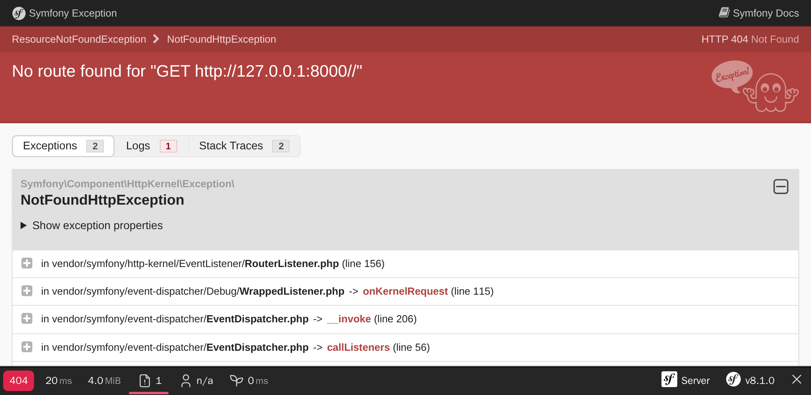

عیب‌یابی مشکلات
==============================

راه‌اندازی پروژه، همچنین شامل داشتن ابزارهای مناسب برای اشکال‌زدایی مشکلات است. خوشبختانه، بسیاری از یاوران خوب از پیش به‌عنوان بخشی از بسته‌ی ``webapp`` گنجانده شده‌اند.

کشف ابزارهای اشکال‌زدایی سیمفونی
--------------------------------------------------------------

.. index::
    single: Components;Profiler
    single: Profiler
    single: Web Profiler
    single: Web Debug Toolbar

برای شروع، نمایه‌ساز سیمفونی (Symfony Profiler) ابزاری است که در هنگام نیاز به یافتن ریشه‌ی یک مشکل، در زمان شما صرفه‌جویی می‌کند.

اگر نگاهی به صفحه‌ی اصلی بیندازید، باید یک نوارابزار (toolbar) در پایین صفحه مشاهده کنید:

.. figure:: screenshots/wdt.png
    :alt: /
    :align: center
    :figclass: with-browser

اولین چیزی که احتمالاً متوجه آن خواهید شد، یک **404** قرمز رنگ است. به خاطر داشته باشید که چون هنوز صفحه‌ی اصلی را طراحی نکرده‌ایم، این صفحه تنها یک جانشین موقت و پیش‌فرض برای آن می‌باشد. این صفحه که به شما خو‌ش‌آمد می‌گوید، با وجود اینکه زیبا است، اما هنوز هم یک صفحه‌ی خطا است. بنابراین کد وضعیت HTTP درست برای آن، ۲۰۰ نیست بلکه ۴۰۴ است. به لطف ابزار اشکال‌زدایی، شما بلافاصله اطلاعات را در اختیار دارید.

اگر بر روی علامت تعجب کوچک کلیک کنید، پیغامِ استثناءِ (Exception) «واقعی» را به عنوان بخشی از لاگ‌های درون نمایه‌ساز سیمفونی دریافت می‌کنید. اگر می‌خواهید ردپای پشته (stack trace) را ببینید، بر روی لینک «Exception» در منوی سمت چپ کلیک کنید.

هر زمان که مشکلی در کد وجود داشته باشد، شما صفحه استثنایی همچون صفحه‌ی زیر مشاهده خواهید کرد که تمام چیزهای مورد نیاز برای فهمیدن مشکل و اینکه از کجا ناشی می‌شود را در اختیارتان می‌گذارد:

با کلیک بر روی بخش‌های مختلف، زمانی را به کاوش در میان اطلاعات درون نمایه‌ساز سیمفونی اختصاص دهید.

.. index::
    single: Symfony CLI;server:log

لاگ‌ها در جلسات اشکال‌زدایی بسیار کمک‌کننده هستند. سیمفونی یک فرمان مناسب برای دنبال کردن تمام لاگ‌ها دارد (از وب سرور، PHP و اپلیکیشن شما):

.. code-block:: terminal
    :class: ignore

    $ symfony server:log

بیایید یک آزمایش کوچک انجام دهیم. فایل ``public/index.php`` را باز کنید و کد PHP درون آن را خراب کنید (مثلاً کلمه foobar را جایی در میان کدها اضافه کنید). در درون مرورگر، صفحه را تازه‌سازی و جریان لاگ‌ها را مشاهده کنید:

.. code-block:: text
    :class: ignore

    Dec 21 10:04:59 |DEBUG| PHP    PHP Parse error:  syntax error, unexpected 'use' (T_USE) in public/index.php on line 5 path="/usr/bin/php7.42" php="7.42.0"
    Dec 21 10:04:59 |ERROR| SERVER GET  (500) / ip="127.0.0.1"

خروجی به صورت زیبایی رنگ‌آمیزی شده است تا توجه شما را به خطا‌ها جلب کند.

درک و فهم محیط‌های سیمفونی
-------------------------------------------------

.. index::
    single: Symfony Environments

از آنجایی که نمایه‌ساز سیمفونی تنها در روند توسعه‌ی اپلیکیشن مفید است، می‌خواهیم از نصب آن در محیط عمل‌آوری جلوگیری کنیم. به‌صورت پیش‌فرض، سیمفونی آن را به‌طور خودکار تنها برای محیط‌های ``dev`` و ``test`` نصب کرده است.

سیمفونی از ایده‌ی *محیط‌ها (environments)* پشتیبانی می‌کند. سیمفونی به صورت پیش‌فرض و توکار (built-in) از ۳ محیط پشتیبانی می‌کند، اما شما می‌توانید به هر تعداد که می‌خواهید محیط اضافه کنید. این محیط‌های توکار عبارتند از: ``dev``، ``prod`` و ``test``. تمام محیط‌ها از کدهای یکسانی بهره می‌برند، اما دارای *پیکربندی (configurations)* متفاوت هستند.

برای نمونه، تمام ابزارهای اشکال‌زدایی در محیط ``dev`` فعال هستند. در محیط ``prod``، اپلیکیشن برای کارایی و سرعت هرچه بیشتر بهینه می‌شود.

تعویض از یک محیط به محیط دیگر، می‌تواند با تغییرِ متغیر محیط ``APP_ENV`` انجام شود.

هنگامی که بر روی Upsun استقرار را انجام دادید، محیط (ذخیره‌شده در  ``APP_ENV``) به صورت خودکار به ``prod`` تعویض گردید.

مدیریت پیکربندی‌های محیط
-----------------------------------------------

.. index::
    single: Environment Variables
    single: .env
    single: .env.local

``APP_ENV`` می‌تواند با استفاده از متغیر‌های محیط «واقعی» و از طریق ترمینال تنظیم گردد:

.. code-block:: terminal
    :class: ignore

    $ export APP_ENV=dev

استفاده از متغیر‌های محیط واقعی، روش ترجیحی برای تنظیم مقادیری همچون ``APP_ENV`` در محیط عمل‌آوری است. اما در محیط توسعه، تعریف تعداد زیادی متغیر محیط بر روی رایانه‌ی محلی، زحمت زیادی دارد. به جای اینکار، مقادیر مورد نظر را از طریق فایل ``.env`` تعریف کنید.

هنگامی پروژه ایجاد گردید، یک فایل ``.env`` معقول، به صورت خودکار تولید شد.

.. code-block:: text
    :caption: .env
    :class: ignore

    ###> symfony/framework-bundle ###
    APP_ENV=dev
    APP_SECRET=c2927f273163f7225a358e3a1bbbed8a
    #TRUSTED_PROXIES=127.0.0.1,127.0.0.2
    #TRUSTED_HOSTS='^localhost|example\.com$'
    ###< symfony/framework-bundle ###

.. tip::

    به لطف recipe‌های سیمفونی Flex، هر بسته‌ای می‌تواند متغیر‌های محیط بیشتری را به این فایل اضافه کند.

فایل ``.env``، در مخزن Git مربوطه، commit شده است و مقادیر *پیش‌فرض* در محیط عمل‌آوری را تعیین می‌کند. شما می‌توانید این مقادیر را با ایجاد فایل ``.env.local`` باطل کرده و مقادیر جدیدتان را جایگزین کنید. این فایل نباید commit شود و به همین علت به کمک فایل ``.gitignore`` نادیده گرفته شده است.

هرگز رمز‌ها و اطلاعات حساس را در این فایل‌ها ذخیره نکنید. نحوه‌ی مدیریت رمز‌ها در گامی دیگر بررسی خواهد شد.

پیکربندی IDE شما
---------------------------

در محیط توسعه، هنگامی که یک استثناء (exception) پرتاب (throw) می‌شود، سیمفونی یک صفحه حاوی پیغام استثناء و ردپای پشته را نمایش می‌دهد. هنگامی که یک مسیر فایل نمایش داده می‌شود، سیمفونی یک لینک اضافه می‌کند که کلیک بر روی آن، فایل مورد نظر را در IDE مورد علاقه‌تان و در خط صحیح، باز می‌کند. برای سودبردن از این ویژگی، باید IDE تان را پیکربندی کنید. سیمفونی به صورت آماده از IDEهای زیادی پشتیبانی می‌کند؛ من برای این پروژه از ویژوال استودیو کد استفاده می‌کنم:

.. code-block:: diff
    :caption: patch_file

    --- i/php.ini
    +++ w/php.ini
    @@ -6,3 +6,4 @@ session.gc_probability=0
     session.use_strict_mode=On
     realpath_cache_ttl=3600
     zend.detect_unicode=Off
    +xdebug.file_link_format=vscode://file/%f:%l

فایل‌ها لینک‌شده تنها به استثناءها محدود نیستند. برای نمونه پس از پیکربندی IDE، کنترلر در نوارابزار اشکال‌زدایی وب، کلیک‌پذیر می‌شود.

اشکال‌زدایی محصول
----------------------------------

.. index::
    single: Upsun;Remote Logs
    single: Upsun;SSH
    single: Symfony CLI;cloud:logs
    single: Symfony CLI;cloud:ssh

همیشه اشکال‌زدایی سرورهای عمل‌آوری، سخت‌تر است. مثلاً شما به نمایه‌ساز سیمفونی دسترسی ندارید. لاگ‌ها کمتر شامل درازگویی هستند، اما دنبال‌کردن لاگ‌ها امکان پذیر است:

.. code-block:: terminal
    :class: ignore

    $ symfony cloud:logs --tail

حتی می‌توانید از طریق SSH، به کانتینر وب متصل شوید:

.. code-block:: terminal
    :class: ignore

    $ symfony cloud:ssh

نگران نباشید، نمی‌توانید چیزی را به آسانی خراب کنید. اکثر فایل‌سیستم، در حالت تنها-خواندنی (read-only) قرار دارند. شما نمی‌توانید در محیط عمل‌آوری یک هات‌فیکس انجام دهید. اما بعداً در کتاب، راهی بسیار بهتر خواهید آموخت.

.. sidebar:: بیشتر بدانید

    * `آموزش تصویری محیط‌ها و فایل‌های پیکربندی در SymfonyCasts`_؛

    * `آموزش تصویری متغیر‌های محیط در SymfonyCasts`_؛

    * `آموزش تصویری نوارابزار اشکال‌زدایی وب و نمایه‌ساز در SymfonyCasts`_؛

    * `مدیریت چندین فایل .env`_ در اپلیکیشن‌های سیمفونی.

.. _`آموزش تصویری محیط‌ها و فایل‌های پیکربندی در SymfonyCasts`: https://symfonycasts.com/screencast/symfony-fundamentals/environment-config-files
.. _`آموزش تصویری متغیر‌های محیط در SymfonyCasts`: https://symfonycasts.com/screencast/symfony-fundamentals/environment-variables
.. _`آموزش تصویری نوارابزار اشکال‌زدایی وب و نمایه‌ساز در SymfonyCasts`: https://symfonycasts.com/screencast/symfony/debug-toolbar-profiler
.. _`مدیریت چندین فایل .env`: https://symfony.com/doc/current/configuration.html#managing-multiple-env-files
